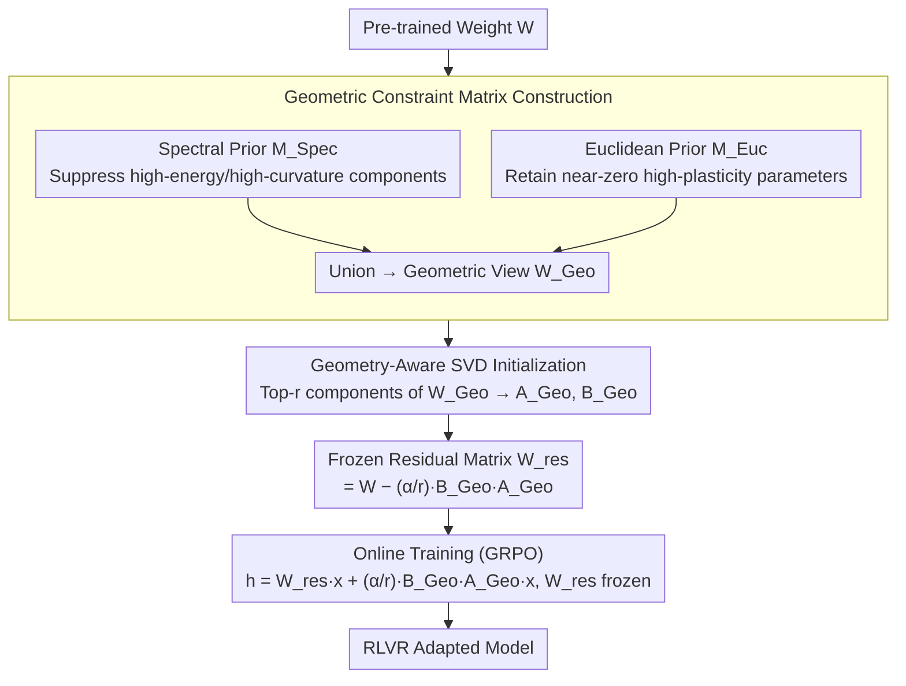

# GeoRA: Geometry-Aware Low-Rank Adaptation for RLVR

**Conference**: ACL 2026  
**arXiv**: [2601.09361](https://arxiv.org/abs/2601.09361)  
**Code**: None  
**Area**: Parameter-Efficient Fine-Tuning / RL Reasoning  
**Keywords**: Low-Rank Adaptation, RLVR, Geometry-Aware, SVD Initialization, PEFT

## TL;DR

This paper proposes GeoRA, a low-rank adaptation method specifically designed for Reinforcement Learning from Verifiable Rewards (RLVR). By constructing a geometric constraint matrix (fusing spectral and Euclidean priors) to extract the principal directions of the RL update subspace for SVD initialization and freezing the residual matrix as a structural anchor, GeoRA consistently outperforms baselines like LoRA, PiSSA, and MiLoRA on 1.5B-32B Qwen/Llama models across mathematical, medical, and code RLVR tasks, demonstrating stronger out-of-distribution generalization and reduced catastrophic forgetting.

## Background & Motivation

**Background**: RLVR has become a core paradigm for enhancing the reasoning capabilities of large language models (e.g., OpenAI-o1, DeepSeek-R1). Unlike SFT, RLVR is essentially a constrained optimization process that amplifies latent reasoning behaviors through reward-induced sampling bias rather than injecting new knowledge. Consequently, RLVR is extremely sensitive to update stability and the preservation of pre-trained representation geometry.

**Limitations of Prior Work**: (1) **Geometric mismatch between SFT-oriented low-rank methods and RLVR**: PiSSA allocates trainable parameters to the principal components of the weight matrix, which is effective in SFT but conflicts with the preferred update subspace of RLVR—RLVR updates bias toward low-energy directions (orthogonal to pre-trained principal features), whereas PiSSA forces updates on principal directions, leading to instability. (2) **Efficiency bottlenecks of sparse fine-tuning**: Although some sparse methods (e.g., SparseFT) better align with RLVR update patterns, modern hardware support for unstructured sparsity is limited, preventing theoretical parameter efficiency from translating into actual speed increases and even introducing extra overhead (10.8% slower than FullFT).

**Key Challenge**: The effective update subspace of RLVR is anisotropic and compressible (concentrated in a few principal directions) but does not align with the principal component directions of pre-trained weights. Existing low-rank methods either target the wrong subspace (PiSSA) or are computationally inefficient despite correct orientation (SparseFT).

**Goal**: Design a PEFT method that simultaneously satisfies three conditions: (1) alignment with RLVR-specific update geometry, (2) maintenance of hardware efficiency through dense matrix computation, and (3) prevention of pre-trained representation destruction via structural anchors.

**Key Insight**: Analysis of actual RLVR update patterns reveals that the effective update subspace, while sparse, possesses a compressible low-rank structure. This subspace can be extracted via a geometric constraint mask and then compressed into a low-rank adapter initialization using SVD.

**Core Idea**: Instead of performing low-rank decomposition on the original weight $W$ (as in LoRA/PiSSA), SVD is performed on a geometric constraint view $W_{Geo} = W \odot (M_{Spec} \cup M_{Euc})$. This view retains only parameters with low curvature (spectral prior) and high plasticity (Euclidean prior), which precisely correspond to the preferred update regions of RLVR.

## Method

### Overall Architecture

GeoRA consists of two steps: (1) **Offline Preprocessing**—Construct the geometric constraint matrix $W_{Geo}$, perform SVD to extract top-$r$ components for initializing adapters $A_{Geo}, B_{Geo}$, and calculate the frozen residual matrix $W_{res}$. (2) **Online Training**—During forward propagation, $h = W_{res} x + \frac{\alpha}{r} B_{Geo} A_{Geo} x$, where $W_{res}$ is frozen and only $A_{Geo}, B_{Geo}$ are trained. The initialization ensures function invariance: $W_{res} + \frac{\alpha}{r} B_{Geo} A_{Geo} = W$.

### Key Designs

**1. Geometric Constraint Matrix Construction: Filtering the parameter subspace truly suitable for RLVR updates**

LoRA/PiSSA perform low-rank decomposition directly on the original weights, but RLVR's preferred update directions do not reside in the weight's principal components. GeoRA extracts the "appropriate region" using two complementary geometric priors: The **Spectral Prior** $M_{Spec}$ identifies the $\rho$-quantile of the smallest absolute values in the rank-$r$ approximation $\hat{W}_r$, $(M_{Spec})_{i,j} = \mathbb{I}(|(\hat{W}_r)_{i,j}| \leq \tau_{Spec}(\rho))$, to suppress high-energy/high-curvature components for spectral stability. The **Euclidean Prior** $M_{Euc}$ selects the $\rho$-quantile of the smallest absolute values in the original weights $(M_{Euc})_{i,j} = \mathbb{I}(|W_{i,j}| \leq \tau_{Euc}(\rho))$ to capture near-zero, highly plastic parameters. The union $W_{Geo} = W \odot (M_{Spec} \cup M_{Euc})$ is then formed. Experiments show only a 4.55% intersection (Jaccard 0.128) between the masks, indicating that spectral stability and parameter plasticity are complementary dimensions that together define a "stable yet expressive" RLVR update manifold.

**2. Geometry-Aware SVD Initialization: Compressing the geometric subspace into an efficient low-rank adapter**

After extracting $W_{Geo}$, SVD is applied to it (rather than the original $W$): $W_{Geo} = U_{Geo} \Sigma_{Geo} V_{Geo}^\top$. The top-$r$ components are used to initialize adapters $A_{Geo} = \Sigma_{Geo[:r,:r]}^{1/2} V_{Geo[:,:r]}^\top$ and $B_{Geo} = U_{Geo[:,:r]} \Sigma_{Geo[:r,:r]}^{1/2}$, such that the initial $B_{Geo} A_{Geo}$ is the optimal rank-$r$ approximation of $W_{Geo}$. The residual is $W_{res} = W - \frac{\alpha}{r} B_{Geo} A_{Geo}$. The fundamental difference from PiSSA is the target of the principal component analysis: PiSSA targets pre-trained knowledge encoding, while GeoRA targets the actual RLVR update subspace.

**3. Frozen Residual Matrix: Using a structural anchor to prevent destruction of pre-trained capabilities**

Aggressive updates in RLVR can lead to behavioral collapse or capability degradation ("Reasoning Boundary Paradox"). GeoRA completely freezes the residual $W_{res}$ during training. Forward propagation follows $h = W_{res} x + \frac{\alpha}{r} B_{Geo} A_{Geo} x$, forcing the optimizer to move only within the geometry-aligned manifold parameterized by $A_{Geo}, B_{Geo}$. Since $W_{res}$ retains the core knowledge encoding minus the geometric subspace, freezing it acts as a rigid structural constraint for policy updates, equivalent to updating within a geometry-aligned trust region. This elevates LoRA's "additive residual" to a "structural anchor."

### Loss & Training

The GRPO algorithm is used for RLVR training. The rank is fixed at $r=16$ with a sparsity rate $\rho=0.2$. Main experiments are conducted on the DeepMath-103K dataset. SVD initialization is a one-time preprocessing cost, negligible compared to RLVR training.

## Key Experimental Results

### Main Results — Mathematical RLVR (Qwen3-8B)

| Method | AIME24 | AIME25 | MATH500 | OlymMATH | HumanEval(OOD) | MMLU(OOD) | IFEval(OOD) |
|------|--------|--------|---------|----------|---------------|-----------|-------------|
| Base | 13.33 | 11.67 | 71.20 | 9.75 | 76.83 | 71.94 | 54.32 |
| FullFT | 23.33 | 22.08 | 78.40 | 11.25 | 76.83 | 71.94 | 50.45 |
| LoRA | 19.58 | 19.58 | 75.60 | 10.75 | 81.10 | 75.65 | 52.13 |
| PiSSA | 22.50 | 20.42 | 74.40 | 11.75 | 71.95 | 73.89 | 48.74 |
| MiLoRA | 20.42 | 19.58 | 76.20 | 11.50 | 78.66 | 74.51 | 51.85 |
| **Ours** | **23.75** | **21.67** | **78.00** | **12.75** | **82.93** | **75.96** | **53.73** |

### Ablation Study (Qwen3-4B)

| Configuration | Reward | AIME24 | AIME25 | MATH500 | OlymMATH | Avg |
|------|--------|--------|--------|---------|----------|-----|
| GeoRA (Full) | 0.88 | 13.33 | 9.17 | 73.40 | 5.75 | 25.41 |
| Random-r Init | 0.85 | 12.50 | 8.50 | 72.10 | 5.25 | 24.60 |
| Tail-r Init | 0.82 | 11.67 | 7.50 | 70.80 | 4.50 | 23.40 |
| w/o $M_{Spec}$ | 0.86 | 12.50 | 8.33 | 72.00 | 4.75 | 24.40 |
| w/o $M_{Euc}$ | 0.83 | 13.33 | 8.75 | 72.80 | 5.50 | 25.10 |

### Key Findings

- GeoRA matches or exceeds FullFT on ID tasks while leading significantly on OOD tasks—HumanEval 82.93 (FullFT 76.83), MMLU 75.96 (FullFT 71.94), suggesting geometry-aligned updates minimize interference with pre-trained capabilities.
- PiSSA performs worst on OOD tasks (IFEval 48.74), validating that SFT-oriented principal component initialization is harmful to RLVR.
- Spectral analysis confirms GeoRA's updates barely touch the principal component subspace ($\mathcal{S}_{Head} \leq 0.02$), whereas PiSSA overlaps significantly ($\approx 0.98$).
- Efficiency gains are notable: Only 0.04B trainable parameters (0.5% of FullFT), 19.9% faster training than FullFT, and 28.5% VRAM savings.
- Robust to hyperparameters: GeoRA maintains high rewards across a wide range of learning rates, while PiSSA/MiLoRA performance drops sharply at high learning rates.

## Highlights & Insights

- Deep Core Insight: The effective RLVR update subspace is not isotropic random noise but possesses a compressible heavy-tailed spectral structure. This provides the theoretical foundation for applying low-rank methods to RLVR.
- Complementarity of Geometric Priors: The small overlap (Jaccard 0.128) confirms that spectral stability and parameter plasticity capture distinct informational dimensions.
- The "Structural Anchor" Paradigm: Freezing the residual matrix ensures that optimization occurs within a geometry-aligned manifold, which is critical for policy stability in RLVR.

## Limitations & Future Work

- SVD initialization adds a one-time preprocessing step, which may be inconvenient for rapid iterations.
- Experiments focus primarily on reasoning-based RLVR (math, medicine, code); effectiveness in open-ended RL scenarios (e.g., dialogue preference optimization) is unverified.
- Optimal configuration for sparsity rate $\rho$ and rank $r$ has not been extensively searched.
- Dependence on pre-trained weight statistics: It remains to be seen if these geometric properties hold for models that have undergone extensive post-training.

## Related Work & Insights

- **vs PiSSA**: PiSSA initializes adapters on principal components, aiding SFT but harming RLVR (NSS of 0.395, $\mathcal{S}_{Head} \approx 0.98$). GeoRA maintains an NSS of 0.092 and $\mathcal{S}_{Head} \leq 0.02$, precisely targeting the tail subspace.
- **vs MiLoRA**: MiLoRA uses minor components for initialization but lacks explicit geometric priors. GeoRA consistently outperforms MiLoRA by precisely defining the manifold via dual masks.
- **vs SparseFT**: SparseFT aligns update patterns with RLVR but is computationally inefficient (10.8% slower than FullFT). GeoRA compresses the sparse subspace into dense low-rank operations, achieving a 19.9% speedup over FullFT.

## Rating

- Novelty: ⭐⭐⭐⭐⭐ First geometry-aware low-rank adaptation method specifically for RLVR, tightly integrating theoretical analysis and design.
- Experimental Thoroughness: ⭐⭐⭐⭐⭐ 1.5B-32B models × 3 domains × comprehensive mechanism analysis.
- Writing Quality: ⭐⭐⭐⭐ Clear motivation and convincing spectral analysis, though notation density might be high for some.
- Value: ⭐⭐⭐⭐⭐ Establishes a new paradigm for parameter-efficient training in the RLVR era; geometric insights are generalizable to other RL settings.

<!-- RELATED:START -->

## Related Papers

- [\[ICLR 2026\] Online Minimization of Polarization and Disagreement via Low-Rank Matrix Bandits](../../ICLR2026/reinforcement_learning/online_minimization_of_polarization_and_disagreement_via_low-rank_matrix_bandits.md)
- [\[ACL 2026\] HEALing Entropy Collapse: Enhancing Exploration in Few-Shot RLVR via Hybrid-Domain Entropy Dynamics Alignment](healing_entropy_collapse_enhancing_exploration_in_few-shot_rlvr_via_hybrid-domai.md)
- [\[NeurIPS 2025\] Shift Before You Learn: Enabling Low-Rank Representations in Reinforcement Learning](../../NeurIPS2025/reinforcement_learning/shift_before_you_learn_enabling_low-rank_representations_in_reinforcement_learni.md)
- [\[ACL 2026\] Semantic-Space Exploration and Exploitation in RLVR for LLM Reasoning](semantic-space_exploration_and_exploitation_in_rlvr_for_llm_reasoning.md)
- [\[NeurIPS 2025\] The Path Not Taken: RLVR Provably Learns Off the Principals](../../NeurIPS2025/reinforcement_learning/the_path_not_taken_rlvr_provably_learns_off_the_principals.md)

<!-- RELATED:END -->
