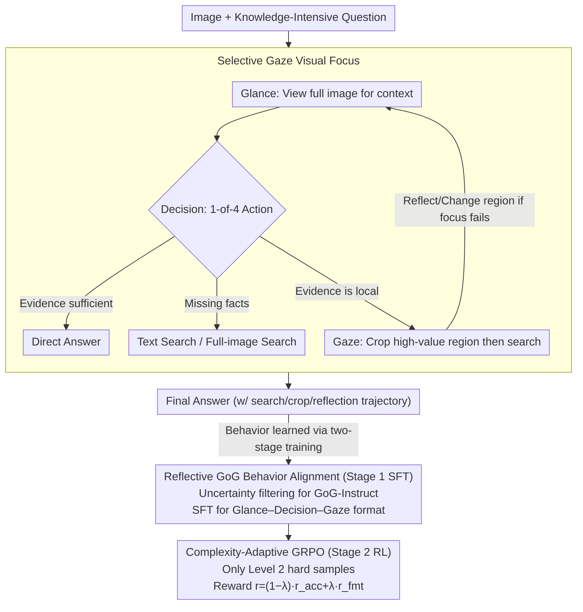

# Glance-or-Gaze: Incentivizing LMMs to Adaptively Focus Search via Reinforcement Learning

**Conference**: ACL2026 Findings  
**arXiv**: [2601.13942](https://arxiv.org/abs/2601.13942)  
**Code**: https://github.com/TOM-ZHOUch/Glance-or-Gaze  
**Area**: Reinforcement Learning / Multimodal Retrieval-Augmentation / Visual Question Answering  
**Keywords**: Multimodal Large Language Models, Visual Search, Selective Gaze, GRPO, Complexity-Adaptive RL  

## TL;DR
This paper proposes Glance-or-Gaze (GoG), which enables Multimodal Large Language Models (LMMs) to first scan the full image and then adaptively select high-value regions for intensive gaze when answering knowledge-intensive visual questions. Through SFT and complexity-adaptive GRPO, GoG significantly outperforms baselines such as direct answering, full-image search, and MMSearch-R1 across six visual Q&A and search benchmarks.

## Background & Motivation
**Background**: Multimodal large models are capable of various general visual understanding tasks. however, when questions involve long-tail entities, recent facts, or fine-grained areas within an image, the parametric knowledge of the models is often outdated or absent. Search-augmented LMMs have emerged as a natural solution, allowing models to invoke text search, image search, or web-reading tools to incorporate external information into the response process.

**Limitations of Prior Work**: Existing methods often send the entire image or all candidate regions for retrieval, which is equivalent to "search-on-sight." This leads to two issues: first, high visual redundancy and noise, where retrieval systems may be misled by irrelevant regions; second, many methods only perform single-turn tool calls, lacking the ability to reflect, switch regions, and re-verify when visual evidence is insufficient.

**Key Challenge**: Knowledge-intensive VQA requires external search without turning the search into an indiscriminate and expensive process. Models must plan between "whether to search," "search globally or locally," and "what to do if the first focus was wrong," rather than passively following a fixed workflow.

**Goal**: The authors aim to transform LMMs from passive perceivers into active visual planners: first using the full image for context, then deciding whether to invoke text search, full-image search, or local crop search, and performing multi-step reflection to correct focus areas for complex samples.

**Key Insight**: The paper observes that humans do not look at an entire image uniformly when solving visual search problems; instead, they "glance" for context then "gaze" at high-value regions. The authors abstract this behavior as Selective Gaze and treat "where to look" as a trainable strategy.

**Core Idea**: Use Selective Gaze to filter irrelevant visual regions, employ SFT to teach fundamental behaviors, and use GRPO on complex samples to reinforce multi-step search planning, converting external retrieval into an on-demand, reflective visual evidence acquisition process.

## Method
The GoG method consists of two layers: the first is the behavior format and tool-use paradigm (defining "glance global, then gaze local, then search"); the second is the reinforcement learning strategy, teaching the model how to combine multiple search actions and correct erroneous focus in complex problems.

### Overall Architecture

The input is an image and a knowledge-intensive question, and the output is a final answer with search/crop/reflection trajectories. The process is divided into two training stages.

Stage 1 is Reflective GoG Behavior Alignment. The authors construct GoG-Instruct data from FVQA and InfoSeek, using uncertainty filtering to remove simple samples the model can answer directly, then synthesizing tool trajectories containing Glance, Decision, and Gaze. Finally, human verification ensures answer correctness and crop region rationality. This stage uses supervised fine-tuning to master the GoG behavior format.

Stage 2 is Complexity-Adaptive Reinforcement Learning. The authors evaluate original queries using the SFT model to categorize samples by pass rate, with final RL utilizing the more difficult Level 2 samples. GRPO is employed, allowing the model to learn multi-step tool invocation strategies under rewards for answer correctness and format compliance.

### Key Designs

**1. Selective Gaze Mechanism: Explicitly modeling "where to look" as an action rather than blindly retrieving the whole image.**

Key evidence in visual knowledge questions often hides in small areas. Full-image retrieval feeds background, irrelevant objects, and incorrect OCR to the system, leading to noise. Selective Gaze allows the model to understand the global context through a Glance, propose candidate regions, and then decide among four actions: answering directly, text search, full-image search, or Gaze search on a selected crop. This adds a physical anchor to the reasoning process—external tool calls are bound to model-selected evidence regions rather than indiscriminate processing, suppressing visual redundancy at the source.

**2. Reflective GoG Behavior Alignment: Using SFT to instill the "global-local-search" format, providing a strong starting point for RL.**

If RL is applied directly, the model struggles with legal tool formats and effective trajectories, leading to high exploration costs. The first stage uses SFT to establish behavioral priors. The authors generate responses $N=4$ times for each query using Qwen3-VL-235B-Instruct; if all 4 are correct, the sample is filtered as too simple. Only samples requiring external verification are kept, for which multi-turn trajectories of "global observation–decision–local search" are synthesized and human-verified. GoG-Instruct contains 5,750 samples, where 43.5% require no search and 56.5% require various search forms, teaching the model when to search and when to answer directly.

**3. Complexity-Adaptive GRPO: Strengthening the model only on truly difficult samples to force multi-step hybrid search and error reflection.**

Simple samples do not provide sufficient planning signals, as the model may "guess" correctly without learning a strategy. Therefore, the RL stage performs difficulty filtering: samples with an SFT pass rate of ~50% are Level 1, while samples where the SFT model frequently fails are expanded into Level 2 for training. GRPO is used to sample a group of trajectories for each input, normalizing advantages using group mean and variance. The reward consists of answer accuracy $r_{acc}$ and format score $r_{fmt}$, formulated as $r_i=(1-\lambda)r_{acc}+\lambda r_{fmt}$. Only difficult samples force the model to combine text, image, and crop searches and actively switch regions after a Gaze focus error.

### Loss & Training

The SFT stage uses standard causal language modeling objectives, maximizing $\pi_\theta(y_t^*|x,I,y_{<t}^*)$ on multi-turn trajectories $y^*$. Implementation uses Qwen2.5-VL-7B-Instruct and Qwen3-VL-8B-Think as backbones, adding LoRA to all transformer blocks with rank 8.

The RL stage utilizes GRPO in veRL. Key training settings: SFT for 3 epochs, learning rate $1e^{-4}$, global batch size 8; RL actor learning rate $2e^{-6}$, KL coefficient $\beta=0.001$, rollout number $N=4$, max response length 8,192 tokens, RL training for 15 epochs on 8 NVIDIA H800 GPUs.

## Key Experimental Results

### Main Results

| Model / Paradigm | Avg. | FVQA | InfoSeek | SimpleVQA | MMSearch | LiveVQA | DynVQA |
|--------|------|------|----------|-----------|----------|---------|--------|
| GPT-4o Direct Answer | 30.68 | 42.00 | 30.60 | 43.44 | 21.64 | 14.80 | 31.59 |
| Qwen3-VL-8B-Thinking Direct Answer | 23.84 | 24.56 | 16.05 | 41.76 | 15.20 | 15.15 | 30.31 |
| Qwen3-VL-8B-Think Prompt-based GoG | 41.70 | 51.33 | 32.00 | 62.69 | 36.84 | 25.95 | 41.36 |
| Qwen3-VL-8B-Thinking Full-Search | 46.99 | 57.33 | 32.25 | 61.90 | 63.84 | 23.55 | 39.09 |
| MMSearch-R1* | 36.91 | 42.39 | 24.65 | 54.79 | 40.94 | 23.85 | 34.84 |
| **GoG-3-8B-Think-SFT** | 50.17 | 62.17 | 40.55 | 65.65 | 53.80 | 32.40 | 46.46 |
| **GoG-3-8B-Think-RL** | 56.88 | 68.44 | 49.05 | 66.44 | 65.50 | 43.85 | 48.02 |

GoG-3-8B-Think-RL outperforms the strongest Full-Search Workflow by 9.89 points and the reproduced MMSearch-R1 by 19.97 points in average score. This suggests that gains come from learning when to search, where to search, and how to reflect, rather than simply "searching all the time."

### Ablation Study

| Configuration | Avg. | FVQA | Info | Simple | MM | Live | Dyn | Note |
|------|------|------|------|--------|----|------|-----|------|
| Qwen2.5 SFT w/o SG | 41.76 | 53.39 | 40.10 | 59.53 | 40.94 | 22.30 | 34.28 | Remove Selective Gaze |
| **Qwen2.5 Full SFT** | 43.28 | 53.72 | 41.90 | 60.61 | 40.35 | 24.55 | 38.53 | Avg +1.52, DynVQA +4.25 |
| Qwen3 SFT w/o SG | 48.34 | 60.17 | 40.55 | 64.86 | 46.20 | 32.80 | 45.47 | Remove Selective Gaze |
| **Qwen3 Full SFT** | 50.17 | 62.17 | 40.55 | 65.65 | 53.80 | 32.40 | 46.46 | Avg +1.83, MMSearch +7.60 |

| RL Data Construction | Avg. | FVQA | Info | Simple | MM | Live | Dyn | Note |
|------|------|------|------|--------|----|------|-----|------|
| Qwen2.5 RL w/ Level 1 Data | 47.28 | 64.00 | 50.35 | 64.66 | 50.88 | 32.95 | 39.94 | Easier samples |
| **Qwen2.5 RL w/ Level 2 Data** | 53.22 | 66.78 | 51.05 | 64.86 | 56.73 | 37.70 | 42.21 | Avg +5.94 |
| Qwen3 RL w/ Level 1 Data | 48.89 | 66.39 | 44.95 | 64.86 | 61.99 | 39.55 | 45.61 | Easier samples |
| **Qwen3 RL w/ Level 2 Data** | 52.38 | 68.44 | 49.05 | 66.44 | 65.50 | 43.85 | 48.02 | Avg +3.49 |

### Key Findings

- SFT establishes basic tool usage: After SFT, 62.3% of Qwen3-VL-Think samples use only one type of search, while 28.7% use hybrid search. After RL, hybrid search increases to 76.7%, and the no-search ratio drops below 3%.
- Selective Gaze improves focus quality: Qwen3-VL-Think's crop selection accuracy increased from 42.1% to 48.9%, and Qwen2.5-VL from 46.7% to 51.3%.
- Reward for reflection: In a human review of 100 Gaze samples from GoG-3-8B-Think, RL improved Gaze correctness from 59% to 75% and increased the reflection rate after incorrect selection from 30% to 70%.

## Highlights & Insights
- **Modeling Visual Search as Active Planning**: Retrieval-augmentation is not treated as a static plugin; instead, the model learns "when to look, where to look, and what to do after a mistake." This is closer to real human VQA processes and better handles long-tail entities.
- **Clear Division between SFT and RL**: SFT establishes legal behaviors and tool formats, while RL optimizes strategies on difficult samples. This avoids cold-start issues in RL and explains the increase in hybrid search and reflection post-RL.
- **Hard Samples exceed Borderline Samples in Training Value**: Level 2 data outperforms Level 1, indicating that in tool-based reasoning, strategy is strengthened not by "almost correct" samples, but by those that expose erroneous focus and flawed reflection chains.
- **Transferable Heuristics**: The Selective Gaze philosophy can be transferred to web agents or medical image Q&A: learn local evidence selection first, then bind external tools to that region rather than the entire input.

## Limitations & Future Work

- **Unstable Search Infrastructure**: Casual failures in Jina Reader/search pipelines (1-5%) occur due to network instability or API timeouts. These lead directly to missing evidence.
- **Limited Linguistic Coverage**: Experiments focused on English benchmarks. The generalization of GoG in multilingual or cross-lingual VQA is not yet verified, especially for culture-specific entities and non-English web content.
- **External Judge Dependency**: Answer accuracy in RL rewards depends on gpt-oss-120b, which might introduce judge bias. Future work could explore verifiable task rewards or multi-judge consistency.
- **Tool Cost**: The hybrid search ratio increases significantly after RL, indicating a preference for multi-step verification. While this improves accuracy, it increases API costs and latency. Budget-aware rewards should be investigated.

## Related Work & Insights
- **vs. RAG-style Multimodal Retrieval**: Traditional RAG treats retrieval as a fixed pre-processing step; GoG makes it an adaptive, compositional, and reflective action.
- **vs. Prompt-based GoG Agent**: Prompt-based agents rely on instructions to induce search; GoG bakes behaviors into model policy via SFT/RL. Qwen3 prompt GoG (41.70) is significantly outperformed by GoG-3-8B-Think-RL (56.88).
- **vs. Full-Search Workflow**: Full-search forces retrieval for every question, providing knowledge but introducing noise. GoG learns to filter irrelevant regions, outperforming full-search by 9.89 points.
- **vs. MMSearch-R1**: While MMSearch-R1 integrates search into training, it lacks Selective Gaze and multi-step reflection. GoG's 19.97 average gain over MMSearch-R1 highlights visual focus strategies as the core performance driver.

## Rating
- Novelty: ⭐⭐⭐⭐⭐ Combines active visual focus (glance/gaze) with complexity-adaptive RL.
- Experimental Thoroughness: ⭐⭐⭐⭐⭐ Covers 6 benchmarks, multiple search paradigms, and extensive ablations on SG and RL data difficulty.
- Writing Quality: ⭐⭐⭐⭐ Clear structure and explanations, though some minor typos exist in Level descriptions in Table 5.
- Value: ⭐⭐⭐⭐⭐ Directly inspiring for search-augmented LMMs and multimodal agents, especially in open-world VQA requiring fine-grained evidence.

<!-- RELATED:START -->

## Related Papers

- [\[ICLR 2026\] J1: Incentivizing Thinking in LLM-as-a-Judge via Reinforcement Learning](../../ICLR2026/reinforcement_learning/j1_incentivizing_thinking_in_llm-as-a-judge_via_reinforcement_learning.md)
- [\[ICLR 2026\] RL for Reasoning by Adaptively Revealing Rationales](../../ICLR2026/reinforcement_learning/rl_for_reasoning_by_adaptively_revealing_rationales.md)
- [\[ICLR 2026\] A$^2$Search: Ambiguity-Aware Question Answering with Reinforcement Learning](../../ICLR2026/reinforcement_learning/a2search_ambiguity-aware_question_answering_with_reinforcement_learning.md)
- [\[CVPR 2026\] Incentivizing Generative Zero-Shot Learning via Outcome-Reward Reinforcement Learning with Visual Cues](../../CVPR2026/reinforcement_learning/incentivizing_generative_zero-shot_learning_via_outcome-reward_reinforcement_lea.md)
- [\[ICML 2026\] The Surprising Difficulty of Search in Model-Based Reinforcement Learning](../../ICML2026/reinforcement_learning/the_surprising_difficulty_of_search_in_model-based_reinforcement_learning.md)

<!-- RELATED:END -->
