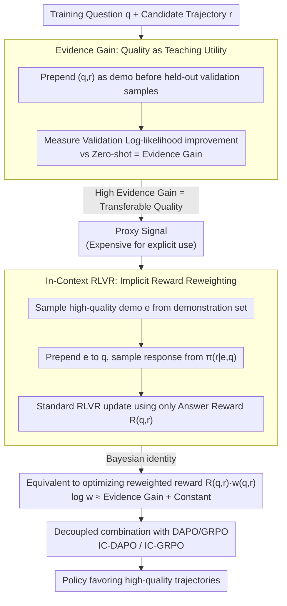

# Good Reasoning Makes Good Demonstrations: Implicit Reasoning Quality Supervision via In-Context Reinforcement Learning

**Conference**: ACL2026  
**arXiv**: [2603.09803](https://arxiv.org/abs/2603.09803)  
**Code**: https://github.com/Mithas-114/IC-DAPO  
**Area**: Reinforcement Learning / LLM Reasoning / RLVR  
**Keywords**: RLVR, Evidence Gain, in-context learning, DAPO, Mathematical Reasoning  

## TL;DR
This paper points out that RLVR cannot distinguish between "high-quality reasoning for a correct answer" and "low-quality reasoning that happens to be correct." It proposes using the utility of a demonstration as an in-context teaching signal, termed Evidence Gain, to improve mathematical reasoning accuracy and quality via In-Context RLVR without training a PRM.

## Background & Motivation
**Background**: Reinforcement Learning with Verifiable Rewards (RLVR) has become a key paradigm for enhancing the mathematical reasoning capabilities of LLMs. It relies on verifiable answers and assigns positive rewards to correct results, avoiding expensive step-by-step human process labeling.

**Limitations of Prior Work**: Outcome-based rewards in RLVR are too coarse-grained. As long as the final answer is correct, the model receives the same reward regardless of whether the reasoning process is rigorous, redundant, skip-stepping, or a lucky guess. This reinforces low-quality reasoning trajectories, which may damage the model's internal problem-solving strategies over the long term.

**Key Challenge**: Process Reward Models (PRMs) can distinguish reasoning quality but require additional labeling or training an evaluator. Using only answer-based rewards fails to differentiate between good and bad trajectories within the set of correct answers. The authors address whether it is possible to make RLVR automatically favor high-quality reasoning trajectories without introducing a PRM.

**Goal**: Define a global signal that reflects reasoning quality and integrate it into RLVR at low cost, enabling the training process to assign higher weight to high-quality correct trajectories and lower weight to low-quality ones.

**Key Insight**: The authors interpret "good reasoning" as a "good demonstration." If a reasoning trajectory is clear, relevant, and transferable, placing it as an in-context demonstration before another problem should help the current policy generate high-quality reference solutions more easily.

**Core Idea**: Use the model's own ICL capability to measure the log-likelihood improvement brought by a reasoning trajectory when used as a demonstration, termed Evidence Gain. Instead of explicitly calculating it during training, high-quality demonstrations are added before rollouts, allowing the objective function to implicitly reweight rewards according to Evidence Gain.

## Method
The methodology consists of two parts. The first proves that Evidence Gain acts as a proxy for reasoning quality; the second applies this idea in reverse to training, forming In-Context RLVR.

### Overall Architecture

Given a training problem $q$ and a model-generated reasoning trajectory $r$, the authors prepare a held-out validation set where each sample contains a question and a high-quality reference reasoning. Evidence Gain measures how much the log-likelihood of the model generating the validation reference reasoning increases when $(q,r)$ is used as a demonstration before the validation sample, compared to a zero-shot setting.

Directly using Evidence Gain as a reward is computationally expensive. Estimates suggest that explicitly calculating Evidence Gain for ~12K samples with 100 demonstrations would take approximately 80 H800 hours. Therefore, instead of calculating rewards after rollout, the authors sample a demonstration from a demonstration set before rollout, prepend it to the current question, and then perform standard RLVR updates. This simple input-side modification constitutes In-Context RLVR.

### Key Designs

**1. Evidence Gain: Redefining "Reasoning Quality" as "Demonstration Utility"**

RLVR only looks at answer correctness and cannot judge if a correct trajectory is truly rigorous or just a lucky guess. Surface signals like length, logprob, or majority vote correlate only weakly with quality. The authors bypass asking "does this reasoning look like good reasoning" and instead ask: "If this candidate trajectory $(q,r)$ is used as an in-context demonstration for a set of held-out validation samples, how much does it increase the log-likelihood of the model generating high-quality reference reasoning compared to zero-shot?" This improvement, averaged over validation samples, is Evidence Gain. It directly tests if the reasoning can teach the model to perform similar reasoning. Truly clear and transferable trajectories significantly raise the generation probability of reference solutions. Ablations show that the Spearman $\rho$ of Evidence Gain with reasoning quality is 0.405/0.444 for 1.5B/7B models, far exceeding length (negative correlation) and logprob (~0.13).

**2. In-Context RLVR: Implicit Reward Reweighting via Input-Side Demonstrations**

Expressed as a reward, Evidence Gain is too expensive to compute. The authors instead randomly sample a high-quality question-answer/reasoning pair from a demonstration set before the rollout and prepend it to the current problem. Standard RLVR updates are then run using only answer correctness as the reward. Crucially, adding a demonstration in the input shifts the sampling distribution: trajectories with high Evidence Gain are naturally more likely to be generated under demonstration guidance, thereby amplifying their gradient weights. Using a Bayesian identity, the authors prove that this demonstration-conditioned objective is equivalent to optimizing a reweighted reward $R(q,r)\cdot w(q,r)$ on a zero-shot base distribution, where $\log w(q,r)$ is approximately Evidence Gain plus a model-dependent constant. Thus, a simple input change achieves reward reweighting for high-quality trajectories.

**3. Decoupled Combination with DAPO/GRPO: A Universal Enhancement Module**

To show that the signal captures reasoning quality rather than specific optimizer side effects, the authors treat In-Context RLVR as an input-side wrapper. They apply it to DAPO (resulting in IC-DAPO, the main experiment) and GRPO at 1.5B (IC-GRPO). In both optimizers, stable gains are achieved, demonstrating that Evidence Gain reweighting is a general training signal that can be integrated into existing RLVR pipelines without modifying the core RL kernel.

### Loss & Training

Standard RLVR optimizes the answer reward $R(q,r)$ on question $q$. In-Context RLVR samples a demonstration $e$ first, then samples an answer from $\pi_\theta(r|e,q)$. Through a Bayesian identity, this is derived to be equivalent to optimizing $R(q,r) \cdot w(q,r)$ on the base distribution $\pi_\theta(r|q)$, where $w(q,r)$ is the expectation of the demonstration likelihood ratio, and $\log w(q,r)$ is approximately Evidence Gain plus a constant.

The training data is sourced from KlearReasoner-MathSub-30K, divided into a policy optimization training set, a demonstration set of 1,082 pairs, and a held-out set of 100 samples. Evaluation covers AIME24, AIME25, HMMT25, MATH500, AMC23, and OlympiadBench. MATH500/OlympiadBench report avg@4, while others report avg@32.

## Key Experimental Results

### Main Results

| Model / Method | AIME24 | AIME25 | HMMT25 | MATH500 | AMC23 | Olympiad | Average | Time/Step |
|:---:|:---:|:---:|:---:|:---:|:---:|:---:|:---:|:---:|
| DS-R1-Distill-Qwen-1.5B | 29.2 | 24.1 | 13.1 | 86.0 | 73.7 | 51.8 | 46.3 | N/A |
| + GRPO | 33.4 | 28.1 | 16.6 | 88.3 | 79.3 | 56.2 | 50.3 | 457.4s |
| + IC-GRPO | 38.3 | 30.6 | 17.7 | 89.5 | 82.5 | 56.9 | 52.6 | 461.8s |
| + DAPO | 40.0 | 28.4 | 19.2 | 90.0 | 84.4 | 61.6 | 53.9 | 459.6s |
| + CE-GPPO | 42.8 | 32.5 | 20.5 | 91.0 | 85.8 | 61.8 | 55.7 | 464.0s |
| + IC-DAPO | 45.6 | 34.2 | 19.7 | 90.6 | 86.2 | 62.1 | 56.4 | 477.2s |

| Model / Method | AIME24 | AIME25 | HMMT25 | MATH500 | AMC23 | Olympiad | Average | Time/Step |
|:---:|:---:|:---:|:---:|:---:|:---:|:---:|:---:|:---:|
| DS-R1-Distill-Qwen-7B | 54.5 | 39.1 | 26.2 | 93.6 | 90.6 | 67.0 | 61.8 | N/A |
| + GRPO | 55.3 | 40.3 | 24.5 | 93.7 | 88.8 | 65.6 | 61.4 | 305.6s |
| + DAPO | 62.0 | 45.9 | 27.4 | 94.1 | 92.3 | 69.9 | 65.3 | 303.1s |
| + CE-GPPO | 64.2 | 50.3 | 28.9 | 95.3 | 93.3 | 71.6 | 67.3 | 292.5s |
| + IC-DAPO | 66.5 | 49.8 | 29.4 | 95.6 | 93.7 | 71.7 | 67.8 | 315.6s |

IC-DAPO improves upon DAPO by an average of 2.5 points for both 1.5B and 7B; IC-GRPO improves upon GRPO by 2.3 points at 1.5B. Training overhead increases slightly, but the authors emphasize it is less than 5% for IC-DAPO.

### Ablation Study

| Proxy Signal | 1.5B Spearman rho | 7B Spearman rho | Description |
|:---|:---:|:---:|:---|
| Length | -0.147 | -0.161 | Longer reasoning is not necessarily better |
| LogProb | 0.129 | 0.178 | Confidence is only weakly correlated |
| MajorVote | 0.079 | 0.109 | Majority answer consistency has weak discriminative power |
| Evidence Gain | 0.405 | 0.444 | Strongest correlation with reasoning quality |

| Difficulty | DAPO 1.5B | IC-DAPO 1.5B | DAPO 7B | IC-DAPO 7B | Main Conclusion |
|:---|:---:|:---:|:---:|:---:|:---|
| Easy | 98.3 | 98.8 (+0.5%) | 98.6 | 99.3 (+0.7%) | Little room for improvement |
| Medium | 90.1 | 93.5 (+3.8%) | 97.8 | 98.2 (+0.4%) | Stable gains on medium tasks |
| Hard | 23.1 | 26.0 (+12.6%) | 39.2 | 43.2 (+10.2%) | Gains concentrated on hard tasks |

| Demo Source | 1.5B Average | 7B Average | Description |
|:---|:---:|:---:|:---|
| DAPO | 53.9 | 65.3 | No in-context demonstrations used |
| IC-DAPO (V3.1) | 55.7 | 66.4 | Demos generated by non-reasoning DeepSeek-V3.1 |
| IC-DAPO (R1) | 56.4 | 67.8 | Best results with refined DeepSeek-R1 traces |

### Key Findings

- Evidence Gain predicts reasoning quality better than length, logprob, or majority vote, indicating it captures transferable problem-solving patterns rather than surface statistics.
- During training, IC-DAPO shows faster growth in mean Evidence Gain and higher reasoning quality scores; its correlation with quality remains stable at ~0.4.
- Gains primarily come from hard problems: 1.5B hard split improved by 12.6% over DAPO, and 7B by 10.2%, supporting the interpretation that quality reweighting is most effective for deep reasoning tasks.

## Highlights & Insights
- **Reasoning quality as teaching utility**: Instead of asking if a trajectory "looks" good, the paper asks if it "helps the model solve other problems." This definition naturally emphasizes transferable structures.
- **Input-side changes for reward-side reweighting**: The theoretical derivation showing that prepending demos implicitly amplifies high Evidence Gain gradient signals is highly valuable. The implementation is simple, but the explanation is rigorous.
- **Process quality supervision without PRM**: By bypassing the need for process labels and evaluator models, this is especially practical for math/code tasks with verifiable answers.
- **Signal stability**: While 7B models have higher absolute Evidence Gain, the relative ranking of high-quality trajectories remains stable, making the signal suitable for intra-model ranking.

## Limitations & Future Work

- **Task scope**: The focus is primarily on mathematical reasoning. Generalization to other reasoning-intensive areas like STEM, code, or open QA remains unverified.
- **Dependence on strong demo models**: High-quality reference trajectories are currently generated by strong teachers like DeepSeek-R1. Without a strong teacher, performance might degrade.
- **Focus on correct trajectories**: RLVR only filters based on answer correctness; potentially insightful but incorrect trajectories are not utilized.
- **Training costs**: Although the overhead is <5%, prepending demonstrations increases context length, which could become a bottleneck for larger models or longer problems.

## Related Work & Insights
- **Vs Standard RLVR/GRPO/DAPO**: Standard methods ignore quality within correct answers. In-Context RLVR shifts the sampling distribution to favor high Evidence Gain trajectories.
- **Vs PRM**: PRMs evaluate intermediate steps but require labels; Evidence Gain uses the policy's own ICL capacity for implicit evaluation without training a separate rewarder.
- **Vs Proxy Signals**: Evidence Gain correlates much better with quality than length or logprob.
- **Future Implication**: Demonstration-conditioned rollouts can serve as a universal wrapper for verifiable tasks (code, theorems, etc.) to mitigate the "correct-but-bad-reasoning" issue.

## Rating
- Novelty: ⭐⭐⭐⭐⭐ The definition of quality via teaching utility and the implicit reweighting derivation are highly original.
- Experimental Thoroughness: ⭐⭐⭐⭐ Coverage of multiple benchmarks, model scales, and optimizers is strong, though domain focused.
- Writing Quality: ⭐⭐⭐⭐⭐ Clear progression from motivation to theory and evidence.
- Value: ⭐⭐⭐⭐⭐ Highly practical for RLVR training, particularly for those wanting to improve reasoning quality without PRM costs.

<!-- RELATED:START -->

<!-- RELATED:END -->

## Related Papers

- [\[ACL 2026\] AttnPO: Attention-Guided Process Supervision for Efficient Reasoning](attnpo_attention-guided_process_supervision_for_efficient_reasoning.md)
- [\[AAAI 2026\] Good-for-MDP State Reduction for Stochastic LTL Planning](../../AAAI2026/reinforcement_learning/good-for-mdp_state_reduction_for_stochastic_ltl_planning.md)
- [\[ICLR 2026\] Reasoning as Representation: Rethinking Visual Reinforcement Learning in Image Quality Assessment](../../ICLR2026/reinforcement_learning/reasoning_as_representation_rethinking_visual_reinforcement_learning_in_image_qu.md)
- [\[ACL 2026\] ImpRIF: Stronger Implicit Reasoning Leads to Better Complex Instruction Following](imprif_stronger_implicit_reasoning_leads_to_better_complex_instruction_following.md)
- [\[ICLR 2026\] LongRLVR: Long-Context Reinforcement Learning Requires Verifiable Context Rewards](../../ICLR2026/reinforcement_learning/longrlvr_long-context_reinforcement_learning_requires_verifiable_context_rewards.md)

<!-- RELATED:END -->
