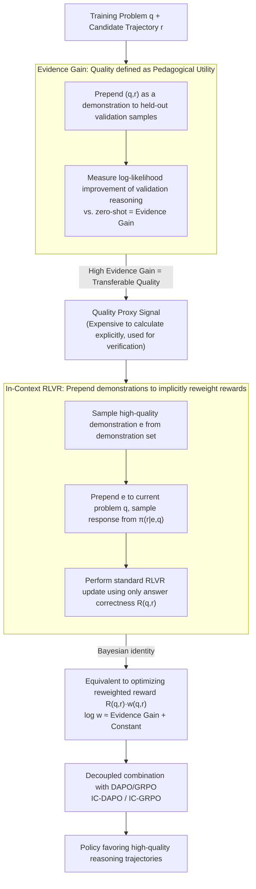

# Good Reasoning Makes Good Demonstrations: Implicit Reasoning Quality Supervision via In-Context Reinforcement Learning

**Conference**: ACL2026  
**arXiv**: [2603.09803](https://arxiv.org/abs/2603.09803)  
**Code**: https://github.com/Mithas-114/IC-DAPO  
**Area**: Reinforcement Learning / LLM Reasoning / RLVR  
**Keywords**: RLVR, Evidence Gain, in-context learning, DAPO, mathematical reasoning  

## TL;DR
This paper points out that RLVR cannot distinguish between "high-quality reasoning for a correct answer" and "low-quality reasoning that happens to get the answer right." It proposes using the pedagogical utility of a demonstration, termed Evidence Gain, as an implicit quality signal. By employing In-Context RLVR, the model improves mathematical reasoning accuracy and quality without training a PRM.

## Background & Motivation
**Background**: Reinforcement Learning with Verifiable Rewards (RLVR) has become an important paradigm for enhancing the mathematical reasoning capabilities of large language models. It relies on verifiable answers, assigning positive rewards to correct results, thereby avoiding expensive step-by-step manual process labeling.

**Limitations of Prior Work**: The outcome rewards in RLVR are too coarse-grained. As long as the final answer is correct, the same reward is given regardless of whether the reasoning process is rigorous, redundant, skip-stepping, or a lucky guess. This reinforces low-quality reasoning trajectories into the model, which may undermine the model's internal problem-solving strategies in the long run.

**Key Challenge**: Process Reward Models (PRMs) can distinguish reasoning quality but require additional labeling or training an evaluator; using only answer rewards fails to distinguish quality within correct trajectories. The authors aim to address: whether RLVR can automatically favor high-quality reasoning trajectories without introducing a PRM.

**Goal**: Define a global signal that reflects reasoning quality and integrate it into RLVR at low cost, ensuring that the training process assigns higher weight to high-quality correct trajectories and lower weight to low-quality correct trajectories.

**Key Insight**: The authors interpret "good reasoning" as a "good demonstration." If a reasoning trajectory is truly clear, relevant, and transferable, then using it as an in-context demonstration for other problems should help the current policy generate high-quality reference solutions more easily.

**Core Idea**: Use the model's own ICL capability to measure the log-likelihood improvement brought by a reasoning trajectory as a demonstration, defined as Evidence Gain. Instead of explicitly calculating it during training, high-quality demonstrations are added before the rollout, allowing the objective function to implicitly reweight rewards according to Evidence Gain.

## Method
The method consists of two parts. The first demonstrates that Evidence Gain serves as a proxy for reasoning quality; the second applies this concept back to training, resulting in In-Context RLVR.

### Overall Architecture

Given a training problem $q$ and a model-generated reasoning trajectory $r$, the authors prepare a held-out validation set where each sample contains a problem and high-quality reference reasoning. Evidence Gain measures how much the log-likelihood of generating the validation reference reasoning increases when $(q,r)$ is used as a demonstration compared to the zero-shot setting.

Directly using Evidence Gain as a reward would be extremely expensive. Estimates suggest that explicitly calculating Evidence Gain for approximately 12K samples with 100 demonstrations takes about 80 hours on H800 GPUs. Consequently, instead of calculating rewards after rollout, the authors sample a high-quality demonstration from a demonstration set before the rollout, prepend it to the current problem, and then perform standard RLVR updates. This simple input-side modification constitutes In-Context RLVR.

### Key Designs

**1. Evidence Gain: Redefining "Reasoning Quality" as "Demonstration Pedagogical Utility"**

RLVR looks only at answer correctness and has no way to judge if a correct trajectory is truly rigorous or a lucky guess, while surface signals like length, logprob, or majority vote are only weakly correlated with quality. The authors bypass "judging if the reasoning itself looks good" and instead ask a measurable question: when the candidate trajectory $(q,r)$ is used as an in-context demonstration for a batch of held-out validation samples, how much does the log-likelihood of the model generating those high-quality reference reasonings increase compared to zero-shot? This average increase across validation samples is the Evidence Gain. It directly tests whether "this reasoning can teach the model to perform similar reasoning"—truly clear, relevant, and transferable trajectories significantly raise the probability of generating reference solutions, whereas redundant, skip-stepping, or guessed trajectories do not. Ablation studies show that the Spearman $\rho$ between Evidence Gain and reasoning quality is 0.405/0.444 for 1.5B/7B models, much higher than the negative correlation of length or the ~0.13 of logprob.

**2. In-Context RLVR: Implicit Reward Reweighting via Input-Side Demonstrations**

Explicitly calculating Evidence Gain as a reward is too costly. The authors solve this by not calculating the reward after rollout, but rather randomly sampling a high-quality QA/reasoning pair from a demonstration set before rollout, prepending it to the current problem, and running standard RLVR updates where the reward remains tied only to answer correctness. The key is that adding demonstrations to the input changes the sampling distribution: trajectories with high Evidence Gain are naturally more likely to be generated under the guidance of demonstrations, and thus their gradient weights are naturally amplified. Using a Bayesian identity, the authors prove that this demonstration-conditioned objective is equivalent to optimizing the reweighted reward $R(q,r)\cdot w(q,r)$ on the zero-shot base distribution, where $\log w(q,r)$ is approximately equal to Evidence Gain plus a model-dependent constant. This pure input-side change achieves reward reweighting for high-quality trajectories with minimal implementation and solid theoretical justification.

**3. Decoupled Combination with DAPO/GRPO: Proving it as a General Enhancement Module**

If a signal is only effective on a specific objective, it is difficult to prove that it captures reasoning quality rather than being an optimizer artifact. Therefore, the authors treat In-Context RLVR as an input-side wrapper applied to DAPO (resulting in IC-DAPO for main experiments) and GRPO (resulting in IC-GRPO on 1.5B). The training objectives remain unchanged; only the input conditions and implicit weights are modified. Stable gains across both optimizers suggest that Evidence Gain reweighting is a more general training signal that can be integrated into existing RLVR pipelines without modifying the RL core.

### Loss & Training

Standard RLVR optimizes the answer reward $R(q,r)$ on question $q$. In-Context RLVR changes this by first sampling a demonstration $e$, and then sampling the response from $\pi_\theta(r|e,q)$. Using a Bayesian identity, the authors derive that this is equivalent to optimizing $R(q,r) * w(q,r)$ on the base distribution $\pi_\theta(r|q)$, where $w(q,r)$ is the expectation of the demonstration likelihood ratio, and $\log w(q,r)$ is approximately Evidence Gain plus a model-dependent constant.

The training data comes from KlearReasoner-MathSub-30K, divided into a policy optimization training set, a demonstration set containing 1,082 QA/reasoning pairs, and a held-out set of 100 extra samples. Evaluation covers AIME24, AIME25, HMMT25, MATH500, AMC23, and OlympiadBench. MATH500/OlympiadBench report avg@4, while others report avg@32.

## Key Experimental Results

### Main Results

| Model/Method | AIME24 | AIME25 | HMMT25 | MATH500 | AMC23 | Olympiad | Average | Time/Step |
|--------|--------|--------|--------|---------|-------|----------|---------|-----------|
| DS-R1-Distill-Qwen-1.5B | 29.2 | 24.1 | 13.1 | 86.0 | 73.7 | 51.8 | 46.3 | N/A |
| + GRPO | 33.4 | 28.1 | 16.6 | 88.3 | 79.3 | 56.2 | 50.3 | 457.4s |
| + IC-GRPO | 38.3 | 30.6 | 17.7 | 89.5 | 82.5 | 56.9 | 52.6 | 461.8s |
| + DAPO | 40.0 | 28.4 | 19.2 | 90.0 | 84.4 | 61.6 | 53.9 | 459.6s |
| + CE-GPPO | 42.8 | 32.5 | 20.5 | 91.0 | 85.8 | 61.8 | 55.7 | 464.0s |
| + IC-DAPO | 45.6 | 34.2 | 19.7 | 90.6 | 86.2 | 62.1 | 56.4 | 477.2s |

| Model/Method | AIME24 | AIME25 | HMMT25 | MATH500 | AMC23 | Olympiad | Average | Time/Step |
|--------|--------|--------|--------|---------|-------|----------|---------|-----------|
| DS-R1-Distill-Qwen-7B | 54.5 | 39.1 | 26.2 | 93.6 | 90.6 | 67.0 | 61.8 | N/A |
| + GRPO | 55.3 | 40.3 | 24.5 | 93.7 | 88.8 | 65.6 | 61.4 | 305.6s |
| + DAPO | 62.0 | 45.9 | 27.4 | 94.1 | 92.3 | 69.9 | 65.3 | 303.1s |
| + CE-GPPO | 64.2 | 50.3 | 28.9 | 95.3 | 93.3 | 71.6 | 67.3 | 292.5s |
| + IC-DAPO | 66.5 | 49.8 | 29.4 | 95.6 | 93.7 | 71.7 | 67.8 | 315.6s |

IC-DAPO improves by an average of 2.5 points over DAPO on both 1.5B and 7B models; IC-GRPO improves by an average of 2.3 points over GRPO on the 1.5B model. Training overhead increases slightly, but the authors emphasize that the additional overhead for IC-DAPO is less than 5%.

### Ablation Study

| Proxy Signal | 1.5B Spearman rho | 7B Spearman rho | Description |
|------|-------------------|-----------------|------|
| Length | -0.147 | -0.161 | Longer reasoning does not mean better |
| LogProb | 0.129 | 0.178 | Confidence is only weakly correlated |
| MajorVote | 0.079 | 0.109 | Majority answer consistency has weak discrimination |
| Evidence Gain | 0.405 | 0.444 | Strongest correlation with reasoning quality |

| Difficulty | DAPO 1.5B | IC-DAPO 1.5B | DAPO 7B | IC-DAPO 7B | Key Conclusion |
|------|-----------|--------------|---------|------------|----------|
| Easy | 98.3 | 98.8 (+0.5%) | 98.6 | 99.3 (+0.7%) | Little room for easy problems |
| Medium | 90.1 | 93.5 (+3.8%) | 97.8 | 98.2 (+0.4%) | Stable gains on medium problems |
| Hard | 23.1 | 26.0 (+12.6%) | 39.2 | 43.2 (+10.2%) | Gains concentrated on hard problems |

| Demo Source | 1.5B Average | 7B Average | Description |
|------|-------------|------------|------|
| DAPO | 53.9 | 65.3 | Without in-context demonstration |
| IC-DAPO (V3.1) | 55.7 | 66.4 | Using demos from non-reasoning model DeepSeek-V3.1 |
| IC-DAPO (R1) | 56.4 | 67.8 | Using DeepSeek-R1 refined reasoning traces (Best) |

### Key Findings

- Evidence Gain predicts reasoning quality better than length, logprob, or majority vote on both 1.5B and 7B models, indicating it captures transferable problem-solving patterns rather than surface length or answer consistency.
- In training dynamics, IC-DAPO shows faster growth in average Evidence Gain and higher reasoning quality scores; the Spearman correlation between Evidence Gain and quality remains stable at ~0.4.
- Gains primarily come from hard problems: the 1.5B hard split improved by 12.6% over DAPO, and the 7B hard split improved by 10.2%, supporting the interpretation that quality reweighting is most beneficial for tasks requiring deep reasoning.

## Highlights & Insights
- **Reasoning Quality as Pedagogical Utility**: Instead of asking "Does this reasoning look good?", the paper asks "Does it help the model solve other problems as a demonstration?" This definition naturally emphasizes transferable structures.
- **Input Changes for Reward Reweighting**: The theoretical insight is highly valuable: prepending demonstrations during rollout implicitly amplifies the gradient signals of high Evidence Gain trajectories. Simple implementation with robust explanation.
- **Process Quality Support without PRM**: The method avoids the costs of process labeling and training evaluators, proving especially useful for mathematical/code tasks with verifiable answers.
- **Signal Robustness**: Although the absolute Evidence Gain values are higher in 7B models, the relative ranking of high-quality trajectories remains stable, meaning the signal is well-suited for internal ranking within the same model.

## Limitations & Future Work

- **Task Scope**: The paper primarily focuses on mathematical reasoning. Generalization to other reasoning-intensive fields like STEM, code reasoning, or open QA remains unverified. Mathematical tasks have formal rewards; transferring to non-strictly verifiable tasks may be harder.
- **Demonstration Set Dependency**: Current high-quality reference trajectories are generated by strong models like DeepSeek-R1. Without a strong teacher or if the teacher's style is biased, the effectiveness of Evidence Gain and IC-RLVR might decrease.
- **Internal Quality Reweighting for Correct Answers Only**: The first filter of RLVR remains answer correctness. Incorrect but heuristic-rich reasoning trajectories are not directly utilized. Future work could include partially correct steps or fixable errors in training.
- **Context Length and Training Cost**: Although the overhead is reported as <5%, prepending demonstrations increases context length; for longer problems or more demonstrations, the cost might become a bottleneck.

## Related Work & Insights
- **vs. Standard RLVR/GRPO/DAPO**: While standard methods only consider final answers, this work uses in-context demonstrations to alter the sampling distribution, equivalent to weighting high-quality correct trajectories. IC-GRPO and IC-DAPO consistently outperformed their respective baselines.
- **vs. PRM**: PRMs explicitly evaluate intermediate steps but require labels or extra models; Evidence Gain uses the policy’s own ICL capability for implicit evaluation without training a new process rewarder.
- **vs. Surface Proxies**: Signals like length, logprob, or majority vote rely on surface statistics or consistency, showing significantly lower correlation than Evidence Gain. The insight is that quality should be measured by pedagogical transferability.
- **Inspiration for Subsequent RLHF/RLVR**: Demonstration-conditioned rollouts can serve as a universal wrapper for verifiable tasks (code, theorem proving, science QA) to mitigate the "correct-but-bad-reasoning" issue.

## Rating
- Novelty: ⭐⭐⭐⭐⭐ The definition of "pedagogical utility" for Evidence Gain and its implicit reweighting derivation are highly innovative.
- Experimental Thoroughness: ⭐⭐⭐⭐ Covers multiple math benchmarks, two model scales, two optimizers (DAPO/GRPO), and demo quality ablations; however, remains domain-limited to math.
- Writing Quality: ⭐⭐⭐⭐⭐ Motivation, theory, and experiments are clearly linked, with claims well-supported by evidence.
- Value: ⭐⭐⭐⭐⭐ Highly practical for RLVR training, especially when high reasoning quality is desired without the overhead of training a PRM.

<!-- RELATED:START -->

## Related Papers

- [\[ACL 2026\] AttnPO: Attention-Guided Process Supervision for Efficient Reasoning](attnpo_attention-guided_process_supervision_for_efficient_reasoning.md)
- [\[ICLR 2026\] Reasoning as Representation: Rethinking Visual Reinforcement Learning in Image Quality Assessment](../../ICLR2026/reinforcement_learning/reasoning_as_representation_rethinking_visual_reinforcement_learning_in_image_qu.md)
- [\[ACL 2026\] ImpRIF: Stronger Implicit Reasoning Leads to Better Complex Instruction Following](imprif_stronger_implicit_reasoning_leads_to_better_complex_instruction_following.md)
- [\[AAAI 2026\] Good-for-MDP State Reduction for Stochastic LTL Planning](../../AAAI2026/reinforcement_learning/good-for-mdp_state_reduction_for_stochastic_ltl_planning.md)
- [\[ICLR 2026\] Enough is as good as a feast: A Comprehensive Analysis of How Reinforcement Learning Mitigates Task Conflicts in LLMs](../../ICLR2026/reinforcement_learning/enough_is_as_good_as_a_feast_a_comprehensive_analysis_of_how_reinforcement_learn.md)

<!-- RELATED:END -->
