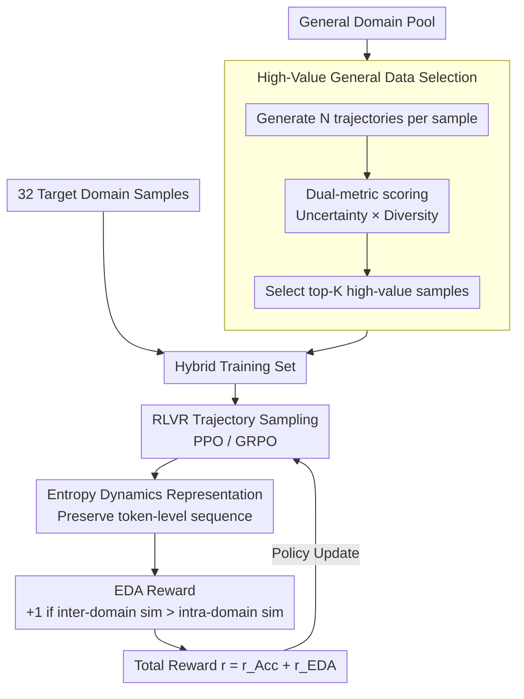

# HEALing Entropy Collapse: Enhancing Exploration in Few-Shot RLVR via Hybrid-Domain Entropy Dynamics Alignment

**Conference**: ACL 2026  
**arXiv**: [2604.17928](https://arxiv.org/abs/2604.17928)  
**Code**: [https://github.com/XMUDeepLIT/HEAL](https://github.com/XMUDeepLIT/HEAL)  
**Area**: Reinforcement Learning / LLM Reasoning  
**Keywords**: RLVR, Entropy Collapse, Few-Shot Reinforcement Learning, Cross-Domain Alignment, Exploration Diversity

## TL;DR

The HEAL framework is proposed to address severe entropy collapse in few-shot RLVR by mixing general-domain data and employing an Entropy Dynamics Alignment (EDA) reward mechanism. It achieves performance matching or exceeding full-set RLVR (1K samples) using only 32 target-domain samples.

## Background & Motivation

**Background**: RLVR (Reinforcement Learning with Verifiable Rewards) has become a key technique for training reasoning-oriented LLMs, using binary accuracy rewards to guide the learning of reasoning chains. However, existing research primarily focuses on data-rich scenarios.

**Limitations of Prior Work**: Training data for RLVR is scarce in low-resource domains such as medical reasoning or specialized expertise. Few-shot RLVR tends to overfit rapidly to a small number of generated trajectories, leading to premature convergence of exploration and severe entropy collapse. Existing entropy regularization methods do not consider the impact of data scale and yield sub-optimal results in low-resource settings.

**Key Challenge**: The entropy of policies in few-shot RLVR is significantly lower than in full-set training, resulting in a serious lack of exploration diversity. Naive entropy enhancement methods (e.g., adding entropy regularization terms) lack constraints, which may limit exploitation or even undermine training stability.

**Goal**: Design a framework specifically for few-shot RLVR to alleviate entropy collapse and enhance exploration diversity while maintaining training stability.

**Key Insight**: Analogous to human learning, when facing a new domain, individuals utilize general skills to compensate for a lack of domain-specific knowledge. Mixing general-domain data provides fundamental reasoning patterns and prevents the policy from narrowing its search space too early.

**Core Idea**: (1) Selectively introduce high-value general-domain data to mitigate entropy collapse in the target domain; (2) Use EDA rewards to guide the policy to align the trajectory-level entropy dynamics (magnitude and fine-grained variations) of the target domain with those of the general domain, achieving controllable entropy enhancement.

## Method

### Overall Architecture

HEAL consists of two core components: (1) Hybrid training, where high-value samples are selected from the general domain based on reasoning uncertainty and exploration diversity to be mixed with limited target-domain data; (2) EDA reward, which adds an Entropy Dynamics Alignment (EDA) reward to the standard accuracy reward to guide the policy in learning exploratory behavior patterns from the general domain. The "trajectory-level entropy dynamics representation" serves as the bridge: the token-level entropy sequence of each trajectory is fully preserved, allowing the EDA reward to measure the similarity of exploration patterns between target and general domains. The data flow involves: selecting high-value samples from the general pool → mixing with few-shot target data → sampling trajectories via RLVR → extracting entropy dynamics representations → calculating EDA rewards and adding them to accuracy rewards → updating the policy via PPO/GRPO.

### Key Designs

**1. High-Value General Domain Selection: Maximizing Exploration Supply with Minimal Mixing**

Indiscriminately mixing large amounts of general data incurs high computational costs and low-quality samples may introduce noise. HEAL generates $N$ trajectories for each general-domain sample and scores them using two complementary metrics: Reasoning Uncertainty $\text{Uncertainty}(x) = 1 - 2|\text{Acc}(x) - 0.5|$ (preferring hard samples with accuracy near 50%) and Exploration Diversity (the average entropy of the top 20% highest-entropy tokens in a trajectory). The product yields a composite score $c(x)$ for top-K selection. This ensures that the selected samples are rich in exploratory behavior while controlling scale—only 384 general-domain samples are needed to significantly improve target-domain entropy.

**2. Trajectory-level Entropy Dynamics Representation: Preserving Fine-grained Sequences**

Averaging entropy loses fine-grained information during generation; two trajectories with the same mean entropy might have entirely different patterns (e.g., one with an entropy peak in the middle vs. one that remains stable). HEAL preserves the token-level entropy sequence of each trajectory as its "entropy dynamics" representation: $\tau_y = (\mathcal{H}_1, \mathcal{H}_2, ..., \mathcal{H}_{|y|})$. After alignment via interpolation for varying lengths, similarity is calculated. This representation allows the EDA reward to distinguish both the "magnitude" and "variation pattern" of exploration.

**3. Entropy Dynamics Alignment (EDA) Reward: Controllable Entropy Boosting via General Domain Reference**

Even after mixing data, target-domain entropy remains significantly lower than the general domain. Naive regularization lacks constraints. EDA calculates two values for each target trajectory based on the entropy dynamics representation: the maximum similarity with other target trajectories (intra-domain $\mathcal{S}_{\text{intra}}$) and with general trajectories (inter-domain $\mathcal{S}_{\text{inter}}$). If the inter-domain similarity is higher—indicating the trajectory's exploration pattern resembles the general domain rather than being confined to narrow target patterns—an extra reward $r_{\text{EDA}} = 1$ is given. The final reward is $r = r_{\text{Acc}} + r_{\text{EDA}}$. It encourages a move toward "natural" exploration patterns rather than just boosting absolute entropy.

### Loss & Training

Optimization is performed using standard RLVR (PPO/GRPO) with a total reward composed of accuracy and EDA components. Experiments were conducted using Qwen3 and LLaMA-3.2 series models, with 32 target-domain samples and 384 high-value general-domain samples.

## Key Experimental Results

### Main Results

| Model / Method | Target Samples | General Samples | Medicine Avg | Physics Avg | Code Avg |
| :--- | :---: | :---: | :---: | :---: | :---: |
| Qwen3-1.7B Few-shot | 32 | 0 | 41.70 | - | - |
| Qwen3-1.7B Full-shot | 1K | 0 | 44.73 | 36.24 | 39.18 |
| Qwen3-1.7B HEAL | 32 | 384 | **44.67** | **37.20** | **41.28** |
| Qwen3-4B Few-shot | 32 | 0 | 49.22 | 42.57 | 47.35 |
| Qwen3-4B Full-shot | 1K | 0 | 56.70 | 44.57 | 51.00 |
| Qwen3-4B HEAL | 32 | 384 | 50.82 | **46.99** | **53.42** |

### Ablation Study

| Configuration | Description | Effect |
| :--- | :--- | :--- |
| Few-shot (32) | Target only | Baseline, severe entropy collapse |
| Only-General (10K) | General only | Does not provide target-domain knowledge |
| Hybrid (32+384) | Mixed w/o EDA | Alleviates entropy collapse but insufficiently |
| HEAL (32+384+EDA) | Full framework | Optimal, matches Full-shot |

### Key Findings

- With only 32 target domain samples and 384 general domain samples, HEAL matches or exceeds 1K-sample Full-shot RLVR in multiple settings.
- Hybrid training itself significantly alleviates entropy collapse, but target-domain entropy still lags; EDA further bridges this gap.
- The data selection strategy outperforms random sampling of general-domain data.
- Consistent improvements were observed across Medicine, Physics, Code, and Math.
- HEAL also outperforms existing entropy regularization methods (e.g., DAPO-style entropy rewards) in low-resource scenarios.

## Highlights & Insights

- **Systematic revelation of entropy collapse in few-shot RLVR**: Previous works reported training collapse without finding the root cause; this study attributes it to entropy collapse and provides a solution.
- **Trajectory-level entropy dynamics as superior features**: Preserving fine-grained exploration patterns during generation is a representation method that can be generalized to other behavioral analysis scenarios.
- **General domain as an "exploration teacher"**: The general domain is not expected to provide domain knowledge, but rather a behavioral reference for "how to explore."

## Limitations & Future Work

- General-domain data selection relies on pre-generating multiple trajectories, incurring initial overhead.
- The binary reward design of EDA could be refined; continuous rewards may be more effective.
- Validated only on small-to-mid scale models (1.7B-4B); few-shot RLVR behavior on larger models may differ.
- The choice of similarity functions (e.g., DTW vs. Cosine) has not been fully explored.

## Related Work & Insights

- **vs. Standard Entropy Regularization**: These methods boost entropy naively without constraints, potentially undermining stability. HEAL uses natural general-domain patterns as a reference for controllable enhancement.
- **vs. Data Augmentation Few-shot RLVR**: Augmentation relies on the model's internal knowledge and is limited by its boundaries. HEAL introduces external general data as an exploration guide.

## Rating

- Novelty: ⭐⭐⭐⭐ Clearly defined entropy collapse in few-shot RLVR; clever EDA reward design.
- Experimental Thoroughness: ⭐⭐⭐⭐⭐ Exhaustive tests across four domains and two model series.
- Writing Quality: ⭐⭐⭐⭐ Convincing problem introduction and clear methodological descriptions.

<!-- RELATED:START -->

## Related Papers

- [\[AAAI 2026\] Reasoning with Exploration: An Entropy Perspective](../../AAAI2026/reinforcement_learning/reasoning_with_exploration_an_entropy_perspective.md)
- [\[ICLR 2026\] Controllable Exploration in Hybrid-Policy RLVR for Multi-Modal Reasoning](../../ICLR2026/reinforcement_learning/controllable_exploration_in_hybrid-policy_rlvr_for_multi-modal_reasoning.md)
- [\[ICLR 2026\] Exploration vs Exploitation: Rethinking RLVR through Clipping, Entropy, and Spurious Reward](../../ICLR2026/reinforcement_learning/exploration_vs_exploitation_rethinking_rlvr_through_clipping_entropy_and_spuriou.md)
- [\[ACL 2026\] RL-PLUS: Countering Capability Boundary Collapse of LLMs in Reinforcement Learning with Hybrid-policy Optimization](rl-plus_countering_capability_boundary_collapse_of_llms_in_reinforcement_learnin.md)
- [\[ACL 2026\] Targeted Exploration via Unified Entropy Control for Reinforcement Learning](targeted_exploration_via_unified_entropy_control_for_reinforcement_learning.md)

<!-- RELATED:END -->
