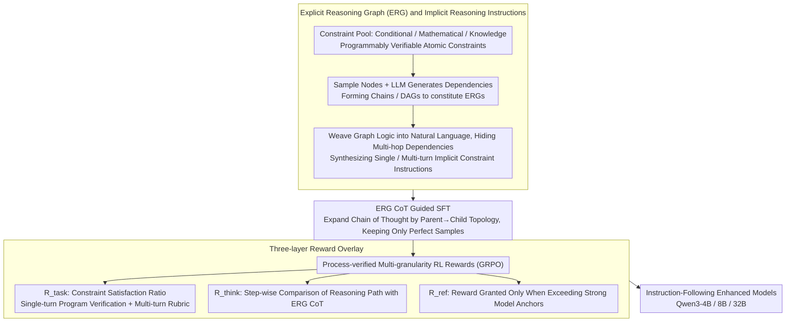

# ImpRIF: Stronger Implicit Reasoning Leads to Better Complex Instruction Following

**Conference**: ACL 2026  
**arXiv**: [2602.21228](https://arxiv.org/abs/2602.21228)  
**Code**: None  
**Area**: Instruction Following / LLM Reasoning  
**Keywords**: Complex Instruction Following, Implicit Reasoning, Reasoning Graph, Process Verification, Reinforcement Learning

## TL;DR

ImpRIF formalizes implicit reasoning structures in complex instructions as verifiable Explicit Reasoning Graphs (ERG). Based on this, it constructs large-scale single/multi-turn data and performs training via SFT and process-verified RL. This approach enables 4B-32B models to significantly outperform base models across five instruction-following benchmarks, with the 32B model even surpassing some larger commercial models.

## Background & Motivation

**Background**: The instruction-following capability of LLMs is crucial for complex applications. Existing research primarily focuses on explicit, structured multi-constraint combinations, enhancing followability through data engineering and template expansion.

**Limitations of Prior Work**: Real-world user instructions are not flat, single, or entirely explicit—they often contain multi-step reasoning, conditional statements, nested logic, and implicit premises. Existing methods do not systematically address cases involving implicit reasoning and complex logical dependencies; models tend to overlook critical conditions or misunderstand implicit constraints when they need to infer "intent between the lines."

**Key Challenge**: Reliable instruction following fundamentally depends on a deep understanding of the instruction itself, particularly accurate modeling of implicit reasoning requirements and complex constraint structures. However, prior work has not yet approached this from an implicit reasoning perspective.

**Goal**: (1) Formalize the structure of implicit reasoning instructions; (2) Construct controllable large-scale training data; (3) Train models to reason along reasoning graphs via SFT and RL.

**Key Insight**: Abstract implicit reasoning structures into Directed Acyclic Graphs (DAG), where nodes represent programmatically verifiable atomic operations (conditional checks/mathematical calculations/knowledge reasoning) and edges encode dependencies. During data generation, graph logic is woven into natural language while hiding intermediate reasoning to form implicit constraint instructions.

**Core Idea**: Explicitly model the implicit reasoning structure (ERG) and utilize it across the entire pipeline for data synthesis (controllable generation), SFT (graph-guided CoT), and RL (process-verified rewards) to enhance implicit reasoning capabilities.

## Method

### Overall Architecture

The ImpRIF pipeline: (1) Construct a constraint pool (three types of verifiable atomic constraints: conditional/math/knowledge) → (2) Generate ERGs and synthesize implicit reasoning instructions (single/multi-turn) → (3) SFT with ERG CoT → (4) GRPO RL training with process-verified multi-granularity rewards. The first two steps turn "implicit reasoning" into controllable, verifiable training data, while the latter two steps teach the model to reason along the graph during initialization (SFT) and reinforcement (RL) stages. The entire pipeline shares the same ERG backbone.

### Key Designs

**1. ERG & Implicit Instructions: Formalizing "Reading Between the Lines" into Verifiable Structures**

Real-world instructions often contain multi-step reasoning and implicit premises, but existing methods only handle flat explicit constraint combinations. ImpRIF abstracts implicit reasoning structures into DAGs with three node types: Conditional (boolean checks/branching), Mathematical (arithmetic/comparisons), and Knowledge (factual reasoning/disambiguation). Each node is paired with executable verification code. By weaving graph logic into natural language while hiding dependencies, the model receives instructions that appear simple but require reasoning along the graph. Multi-turn data covers both system instructions and cumulative user dialogues, with some incorporating adversarial queries like conflicts or injection attacks.

**2. ERG CoT Guided SFT: Mapping Graph Topology to Thought Processes**

To teach the model to "follow the graph," the authors expand ERG nodes and dependencies into natural language CoT, traversing dependencies strictly in "parent→child" order. This ensures each step builds on the previous result via five steps: (a) describing node reasoning; (b) traversing dependencies from root to leaf; (c) expanding derivation; (d) checking coordination between constraints; (e) generating answers with self-checks. Only samples with perfect scores and correct answers are used for SFT, explicitly mapping ERG topology into the model's thought process.

**3. Multi-granularity RL Rewards: Rewarding Both Results and Reasoning Paths**

Evaluating only the final constraint satisfaction might allow the model to get the right answer through wrong reasoning. ImpRIF overlays three reward layers in GRPO: $R_{\text{task}}$ measures the constraint satisfaction ratio; $R_{\text{think}}$ uses an LLM judge to compare the model's reasoning step-by-step with the reference ERG CoT to evaluate logic; and $R_{\text{ref}}$ introduces a strong model as a quality anchor, granting extra rewards only when the student outperforms the anchor. The total reward is $R_{\text{total}} = R_{\text{task}} + R_{\text{ref}} + R_{\text{think}}$.

### Loss & Training

Standard language modeling loss is used for SFT. GRPO with multi-granularity rewards is used for RL. Training is performed on Qwen3-4B/8B/32B.

## Key Experimental Results

### Main Results

**Five Instruction-following Benchmarks (ImpRIF-8B_SFT+RL vs Qwen3-8B)**

| Benchmark | Qwen3-8B | ImpRIF-8B | Gain |
|------|---------|-----------|------|
| ImpRIF-Test ISR | 19.87 | **51.85** | +32.0 |
| SysBench ISR | 66.52 | **79.08** | +12.6 |
| MultiChallenge | 42.00 | **59.60** | +17.6 |
| MedMT ISR | 34.39 | **48.07** | +13.7 |
| ComplexBench ISR | 81.37 | **83.29** | +1.9 |

### Ablation Study

| Configuration | ImpRIF-Test CSR | Description |
|------|----------------|------|
| ImpRIF-8B_SFT+RL | **78.33** | Full Method |
| ImpRIF-8B_SFT | 68.63 | SFT Only |
| ImpRIF-8B_RL | 66.33 | RL Only |
| Qwen3-8B (Base) | 55.64 | No Training |

### Key Findings

- The combination of SFT+RL significantly outperforms using either alone—SFT provides a good initialization, and RL further strengthens reasoning.
- ImpRIF-32B_SFT+RL surpasses Qwen3-235B-A22B and Qwen2.5-72B on multiple benchmarks, achieving performance comparable to larger models with only 32B parameters.
- The 4B model also sees significant gains (ImpRIF-Test ISR: 17.70→49.11, +31.4), proving effectiveness for small models.
- Process supervision rewards are crucial for reasoning quality; removing them results in a marked decrease in logical scores.

## Highlights & Insights

- The ERG formalization is the cornerstone—a unified graph structure serves data generation, CoT construction, and reward design, achieving end-to-end consistency.
- Redefines "instruction following" as an "implicit reasoning" problem, providing a new theoretical perspective.
- The combination of process-supervised RL and relative rewards provides a transferable paradigm for RL training on complex tasks.

## Limitations & Future Work

- ERG construction relies on LLMs and human-designed constraint pools; extending to new domains may require additional engineering.
- Process supervision uses an LLM judge, which introduces evaluation noise.
- Validated only on the Qwen3 series; generalization across other model families is unknown.
- The definition of implicit reasoning is limited to conditional/math/knowledge types, excluding complex linguistic phenomena like rhetoric or irony.

## Related Work & Insights

- **vs RwG/RAIF**: RwG uses graphs for reasoning, and RAIF rewards reasoning processes; ImpRIF unifies both within the ERG framework.
- **vs Traditional Instruction Following Data Scaling**: Traditional methods focus on explicit constraint combinations, while ImpRIF focuses on implicit reasoning dependencies.

## Rating

- Novelty: ⭐⭐⭐⭐⭐ The ERG formalization and shift to an "implicit reasoning" perspective are highly enlightening.
- Experimental Thoroughness: ⭐⭐⭐⭐⭐ Five benchmarks, three model scales, full ablations, and single/multi-turn coverage.
- Writing Quality: ⭐⭐⭐⭐ Detailed methodology, though the paper is long and could be more concise.
- Value: ⭐⭐⭐⭐⭐ Provides a systematic solution for complex instruction-following problems.

<!-- RELATED:START -->

## Related Papers

- [\[NeurIPS 2025\] Generalizing Verifiable Instruction Following](../../NeurIPS2025/reinforcement_learning/generalizing_verifiable_instruction_following.md)
- [\[NeurIPS 2025\] Incentivizing Reasoning for Advanced Instruction-Following of Large Language Models](../../NeurIPS2025/reinforcement_learning/incentivizing_reasoning_for_advanced_instruction-following_of_large_language_mod.md)
- [\[ACL 2026\] LENS: Less Noise, More Voice — Reinforcement Learning for Reasoning via Instruction Purification](less_noise_more_voice_reinforcement_learning_for_reasoning_via_instruction_purif.md)
- [\[NeurIPS 2025\] Financial Instruction Following Evaluation (FIFE)](../../NeurIPS2025/reinforcement_learning/financial_instruction_following_evaluation_fife.md)
- [\[ACL 2026\] Adaptive Instruction Composition for Automated LLM Red-Teaming](adaptive_instruction_composition_for_automated_llm_red-teaming.md)

<!-- RELATED:END -->
