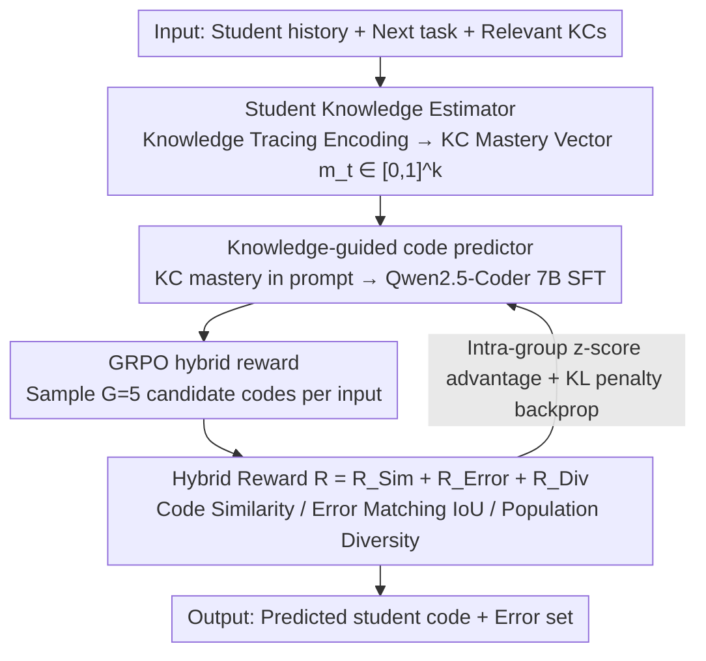

# KASER: Knowledge-Aligned Student Error Simulator for Open-Ended Coding Tasks

**Conference**: ACL2026  
**arXiv**: [2601.06633](https://arxiv.org/abs/2601.06633)  
**Code**: https://github.com/umass-ml4ed/code_personalization  
**Area**: Reinforcement Learning / Education AI / Code Generation  
**Keywords**: Student Modeling, Programming Education, Error Simulation, GRPO, Knowledge Tracing  

## TL;DR
KASER first estimates student mastery of knowledge components, then trains a code generator using GRPO with a hybrid reward of "code similarity + error matching + diversity" to simulate programming errors consistent with the student's knowledge state.

## Background & Motivation
**Background**: Open-ended programming tasks reveal specific student knowledge deficiencies, such as errors in conditional logic, string indexing, or return statements. If educational AI can predict what code a student will write and what mistakes they will make, it can assist teachers in diagnosing difficulties early and generating personalized feedback.

**Limitations of Prior Work**: Existing student code simulation methods either rely on student historical submissions as context or only pursue surface-level similarity between generated and real code. After extensive pre-training on high-quality code, LLMs naturally tend to generate correct and standardized code. SFT on student code also prone to mode collapse, resulting in outputs that lack the diversity of real student errors.

**Key Challenge**: Educational scenarios require models to "make mistakes like a student," whereas standard code models are trained to "be correct like an expert." Relying solely on code similarity forces models to learn surface styles, making it difficult to align with student knowledge gaps and specific error types.

**Goal**: Given student history and the next programming task, predict the student's next code submission, focusing on errors that align with the student's mastery of relevant Knowledge Components (KCs).

**Key Insight**: Explicitly estimate the student's knowledge state as an interpretable KC mastery vector and include it in the LLM prompt. Use RL rewards to simultaneously constrain code similarity, error overlap, and population diversity.

**Core Idea**: Instead of merely imitating student code, the model should learn "which knowledge deficiencies correspond to which errors" under the condition of an interpretable knowledge profile through hybrid rewards.

## Method

### Overall Architecture
KASER consists of three components. The first is the Student Knowledge Estimator, which utilizes a knowledge tracing model to estimate the mastery of each KC based on past submissions. The second is the Student Code Predictor, which takes task text and relevant KC mastery as a prompt for Qwen2.5-Coder 7B Instruct, initialized with SFT to predict student code. The third is GRPO-based RL training, which optimizes the code predictor using a hybrid reward to produce code that more closely resembles real student work, matches errors accurately, and maintains output diversity.

Inputs include student history, the next task description, relevant KCs, and mastery levels; outputs are predicted student code and a potential set of errors. Evaluation occurs both at the student-problem pair level (comparing predicted code with real submissions) and the problem level (evaluating error coverage and diversity).

### Key Designs

**1. Student Knowledge Estimator: Compressing history into an interpretable knowledge profile**

The most difficult aspect of student simulation is explaining "why this mistake happened"—directly feeding student IDs or historical code leads to black-box associations. KASER first encodes past submissions into a hidden state $h_t$ via knowledge tracing, then passes it through a linear layer with sigmoid to obtain a mastery vector $m_t \in [0,1]^k$, where each dimension represents the mastery of a specific Knowledge Component (KC). For a new problem, only relevant KCs are selected, averaged via a compensation model to estimate accuracy, and aligned with the next submission’s correctness using BCE loss. This links errors to specific knowledge gaps rather than vague imitation.

**2. Knowledge-guided code predictor: Explicitly showing knowledge gaps to the LLM**

Pre-trained code models naturally favor correct code; SFT alone often pulls student code toward "average correct" solutions. KASER incorporates KC mastery into the prompt—appending numerical values for relevant KCs (e.g., "Conditional logic mastery = 0.21") alongside the task description. This allows Qwen2.5-Coder 7B Instruct to observe the profile during token generation. The SFT phase uses standard cross-entropy for basic adaptation, while the true value of knowledge conditions lies in providing an **alignable control variable** for subsequent RL: the appearance and location of errors can be modulated by mastery levels.

**3. GRPO hybrid reward: Balancing code similarity, error matching, and diversity**

Focusing only on code similarity results in learning surface styles while losing the real error distribution and suffering from mode collapse. KASER samples $G=5$ candidate codes for each input and scores them using a triple-objective hybrid reward $R = R_{Sim} + R_{Error} + R_{Div}$: $R_{Sim}$ measures overall similarity to the real submission via CodeBLEU; $R_{Error}$ is the Intersection over Union (IoU) between predicted and real error sets (assigned 1 if both are correct), forcing model attention toward actual mistakes; $R_{Div} = 1 - \max \text{CodeBLEU}(\hat{c}, \hat{c_i})$ penalizes candidates that are too similar within a group to ensure population diversity. GRPO uses z-score normalization within the group to calculate advantage and applies a KL penalty to prevent the policy from drifting too far from the reference model.

### Loss & Training
The knowledge estimator is trained with BCE on next-submission correctness. The code predictor undergoes SFT with token-level cross-entropy. In the RL phase, GRPO is employed with an objective consisting of a clipped surrogate loss and a KL penalty against the reference policy. For each problem-student pair, 5 candidates are sampled with equally weighted reward components.

Experiments utilize two real-world datasets: CodeWorkout (246 students, 50 Java problems, 50 KCs, 10,834 submissions) and FalconCode (447 students, 84 Python problems, 60 KCs, 11,194 submissions). Analysts focus on the first submission of each problem to capture initial knowledge gaps rather than the debugging process.

## Key Experimental Results

### Main Results

| Dataset | Method | CodeBLEU@1 | CodeBLEU@5 | IoU@1 | IoU@5 |
|--------|------|------------|------------|-------|-------|
| CodeWorkout | Student SFT | 0.501 | 0.565 | 0.115 | 0.244 |
| CodeWorkout | KASER | 0.524 | 0.599 | 0.157 | 0.276 |
| FalconCode | Student SFT | 0.642 | 0.670 | 0.153 | 0.270 |
| FalconCode | KASER | 0.668 | 0.692 | 0.178 | 0.303 |

### Ablation Study

| Dataset | Method | Cosine Distance ↑ | 1 - CodeBLEU ↑ | Error IoU ↑ | $\chi^2$ Distance ↓ |
|--------|------|-------------------|----------------|-------------|----------------------|
| CodeWorkout | Student SFT | 0.082 | 0.480 | 0.700 | 109.85 |
| CodeWorkout | KASER | 0.088 | 0.520 | 0.750 | 104.97 |
| FalconCode | Student SFT | 0.279 | 0.600 | 0.755 | 51.89 |
| FalconCode | KASER | 0.298 | 0.643 | 0.817 | 45.77 |

### Key Findings
- At the per-student-problem-pair level, KASER significantly outperforms all baselines in code similarity and error matching across both datasets ($p < 0.05$).
- At the per-problem level, KASER improves error coverage and code diversity, indicating it better simulates the variety of errors different students might commit on the same task.
- By error type, KASER achieves a precision of 1.00 for logical, runtime, and syntax errors, with higher recall than Student SFT; however, syntax recall remains low, indicating difficulty in forcing pre-trained models to generate syntax errors.
- Reward ablation is clear: removing $R_{Sim}$ drops CodeBLEU@5 by ~16% on CodeWorkout; removing $R_{Error}$ drops IoU@1 by ~36% and increases problem-level $\chi^2$ distance by ~11%; removing $R_{Div}$ drops cosine diversity on FalconCode by ~12%.

## Highlights & Insights
- The paper captures the unique nature of educational code generation: the goal is not "writing the correct answer," but "simulating how a student with specific knowledge gaps writes incorrectly."
- The hybrid reward design aligns well with the task: CodeBLEU, Error IoU, and Diversity correspond to code surface, error semantics, and population variance.
- KC mastery prompts provide educational interpretability. Qualitative cases show that low mastery in comparison logic lead to operator errors, while low return statement mastery leads to missing returns.
- Insights for LLM applications in education: Student simulation should not rely solely on personas or history but should explicitly model knowledge states and include "error plausibility" in training objectives.

## Limitations & Future Work
- Error labeling and evaluation rely on LLM-as-a-judge without access to test case execution. Incorporating compilation results and unit test failure modes could provide finer-grained labels.
- IoU metrics are strict, and absolute error matching scores remain low, indicating student error prediction is far from solved.
- The study only analyzes first submissions, not the debugging process; real feedback often requires understanding how errors evolve.
- Forcing pre-trained models to generate syntax errors remains a weakness.
- Fairness issues: if the training data under-represents minority groups, the generated profiles may exhibit calibration bias.

## Related Work & Insights
- **vs Open-ended KT**: Traditional KT estimates knowledge transitions but rarely simulates open-ended code; KASER integrates KT profiles into generation.
- **vs ParaStudent**: ParaStudent uses history to predict code but lacks explicit knowledge states; KASER emphasizes interpretable alignment with KC mastery.
- **vs Student SFT**: SFT improves similarity but yields "averaged" correct code; KASER mitigates mode collapse through error and diversity rewards.
- **Insights for future research**: KASER can be extended to mathematical derivations, open-ended Q&A, or debugging trajectory simulation using knowledge states to control "reasonable error" generation.

## Rating
- Novelty: ⭐⭐⭐⭐☆ Using GRPO hybrid rewards for knowledge-aligned error simulation is innovative and well-defined.
- Experimental Thoroughness: ⭐⭐⭐⭐☆ Solid evaluation across two real datasets with reward ablation, though it lacks large-scale human labeling.
- Writing Quality: ⭐⭐⭐⭐☆ Clear methodology and experimental presentation with strong educational motivation.
- Value: ⭐⭐⭐⭐☆ High potential for application in programming education and personalized feedback systems.

<!-- RELATED:START -->

## Related Papers

- [\[ICLR 2026\] Helix: Evolutionary Reinforcement Learning for Open-Ended Scientific Problem Solving](../../ICLR2026/reinforcement_learning/helix_evolutionary_reinforcement_learning_for_open-ended_scientific_problem_solv.md)
- [\[ICLR 2026\] From Verifiable Dot to Reward Chain: Harnessing Verifiable Reference-based Rewards for RL of Open-ended Generation](../../ICLR2026/reinforcement_learning/from_verifiable_dot_to_reward_chain_harnessing_verifiable_reference-based_reward.md)
- [\[ACL 2026\] NaviMaster: Learning a Unified Policy for GUI and Embodied Navigation Tasks](navimaster_learning_a_unified_policy_for_gui_and_embodied_navigation_tasks.md)
- [\[ACL 2026\] A Goal Without a Plan Is Just a Wish: Efficient and Effective Global Planner Training for Long-Horizon Agent Tasks (EAGLET)](a_goal_without_a_plan_is_just_a_wish_efficient_and_effective_global_planner_trai.md)
- [\[ICLR 2026\] LadderSym: A Multimodal Interleaved Transformer for Music Practice Error Detection](../../ICLR2026/reinforcement_learning/laddersym_a_multimodal_interleaved_transformer_for_music_practice_error_detectio.md)

<!-- RELATED:END -->
