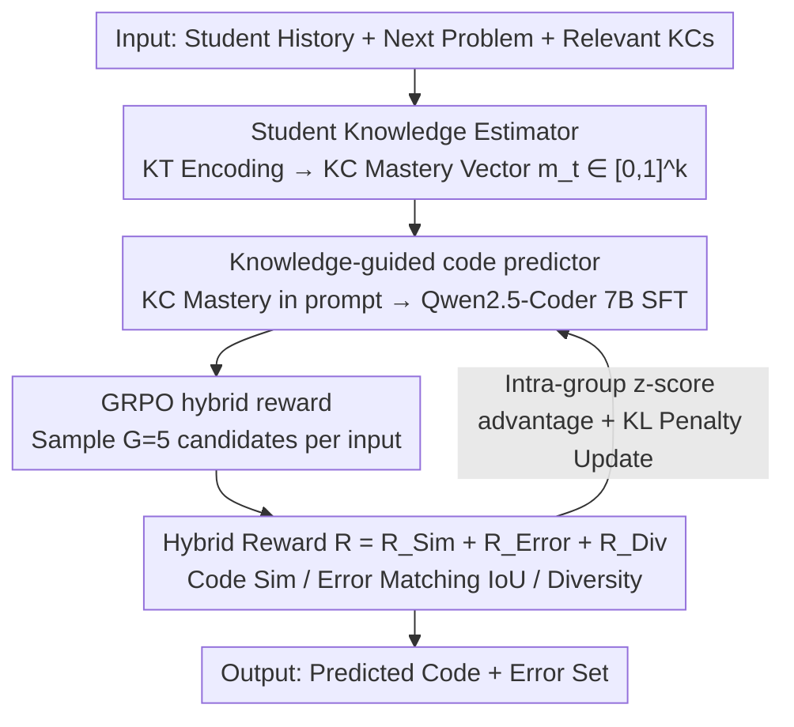

# KASER: Knowledge-Aligned Student Error Simulator for Open-Ended Coding Tasks

**Conference**: ACL2026  
**arXiv**: [2601.06633](https://arxiv.org/abs/2601.06633)  
**Code**: https://github.com/umass-ml4ed/code_personalization  
**Area**: Reinforcement Learning / AI in Education / Code Generation  
**Keywords**: Student Modeling, Programming Education, Error Simulation, GRPO, Knowledge Tracing  

## TL;DR
KASER first estimates student mastery of knowledge points, then utilizes GRPO with a hybrid reward of "code similarity + error matching + diversity" to train a code generator capable of simulating programming errors consistent with the student's knowledge state.

## Background & Motivation
**Background**: Open-ended programming tasks reveal specific knowledge deficits in students, such as errors in conditional logic, string indexing, or return statement usage. If educational AI can predict the code a student will write and the errors they will commit, it can assist teachers in diagnosing difficulties early and generating personalized feedback.

**Limitations of Prior Work**: Existing student code simulation methods either rely on historical submissions as context or focus solely on surface-level similarity between generated and ground-truth code. LLMs, pre-trained on vast high-quality codebases, naturally tend to generate correct and standard code; applying SFT on student data often leads to mode collapse, failing to produce the diversity of real student errors.

**Key Challenge**: Educational scenarios require models to "make mistakes like a student," whereas standard code models are trained to "write correctly like an expert." Relying only on code similarity captures surface styles but fails to align student knowledge deficits with specific error types.

**Goal**: Given a student's history and the next programming problem, predict the student's next code submission—especially the errors—while ensuring the errors align with the student's mastery of relevant Knowledge Components (KCs).

**Key Insight**: The authors explicitly estimate the student's knowledge state as an interpretable KC mastery vector and incorporate it into the LLM prompt. They then utilize RL rewards to simultaneously constrain code similarity, error overlap, and population diversity.

**Core Idea**: Instead of merely imitating student code, the model learns "which knowledge deficits correspond to which errors" through a hybrid reward system conditioned on an interpretable knowledge profile.

## Method

### Overall Architecture
KASER consists of three components. The first is the Student Knowledge Estimator, which utilizes a knowledge tracing model to estimate the mastery of each KC based on past submissions. The second is the Student Code Predictor, which inputs the problem description and relevant KC mastery as a prompt into Qwen2.5-Coder 7B Instruct, using SFT to predict student code. The third is GRPO-based RL training, which optimizes the predictor with a hybrid reward to generate code that is more student-like, shows better error matching, and maintains higher diversity.

Inputs include student history, the next problem description, relevant KCs, and mastery levels; outputs are predicted student code and the set of likely errors. Evaluation occurs at the student-problem pair level (comparing predicted code to real submissions) and the problem level (assessing error coverage and diversity).

### Key Designs

**1. Student Knowledge Estimator: Compressing History into Interpretable Knowledge Profiles**

Explaining "why an error occurs" is the primary challenge in student simulation. Simply feeding student IDs or raw code leads to black-box associations. KASER encodes a student's past submissions into a hidden state $h_t$, followed by a linear layer and sigmoid to obtain a mastery vector $m_t \in [0,1]^k$, where each dimension represents the mastery of a specific KC. For a target problem, the model extracts relevant KCs, averages them using a compensatory model for a correctness estimate, and aligns it with the next submission outcome using BCE loss. This ensures errors are linked to specific KC deficits rather than general imitation.

**2. Knowledge-guided code predictor: Explicitly Showing Deficits to the LLM**

Pre-trained code models naturally favor correct and standard solutions. KASER incorporates KC mastery values into the prompt, such as "Conditional logic mastery = 0.21", alongside the problem description. This allows Qwen2.5-Coder 7B Instruct to observe the profile while generating every token. While the SFT stage provides basic task adaptation, the true value of the knowledge condition lies in providing a **controllable aligned variable** for RL: the occurrence and location of errors are modulated by mastery levels.

**3. GRPO hybrid reward: Balancing Similarity, Error Matching, and Diversity**

Focusing only on code similarity causes the model to lose the true distribution of student errors and suffer from mode collapse. KASER samples $G=5$ candidates per input and uses a weighted hybrid reward $R=R_{Sim}+R_{Error}+R_{Div}$: $R_{Sim}$ uses CodeBLEU to measure overall similarity; $R_{Error}$ is the IoU of the predicted and ground-truth error sets (set to 1 if both are correct), forcing the model to focus on real mistakes; $R_{Div}=1-\max \text{CodeBLEU}(\hat{c},\hat{c_i})$ penalizes candidate redundancy to preserve diversity. GRPO normalizes these rewards within the group via z-score and employs a KL penalty to prevent the policy from deviating too far from the reference.

### Loss & Training
The knowledge estimator is trained with BCE on the correctness of the next submission. The code predictor undergoes basic SFT with token-level cross-entropy. In the RL phase, GRPO is employed with a clipped surrogate loss and a KL penalty against the reference policy. The hybrid reward components are equally weighted. Experiments utilize two real programming education datasets: CodeWorkout (Java) and FalconCode (Python).

## Key Experimental Results

### Main Results
| Dataset | Method | CodeBLEU@1 | CodeBLEU@5 | IoU@1 | IoU@5 |
|--------|------|------------|------------|-------|-------|
| CodeWorkout | Student SFT | 0.501 | 0.565 | 0.115 | 0.244 |
| CodeWorkout | KASER | 0.524 | 0.599 | 0.157 | 0.276 |
| FalconCode | Student SFT | 0.642 | 0.670 | 0.153 | 0.270 |
| FalconCode | KASER | 0.668 | 0.692 | 0.178 | 0.303 |

### Ablation Study
| Dataset | Method | Cosine Distance ↑ | CodeBLEU Complement ↑ | Error IoU ↑ | $\chi^2$ Distance ↓ |
|--------|------|-------------------|----------------|-------------|----------------------|
| CodeWorkout | Student SFT | 0.082 | 0.480 | 0.700 | 109.85 |
| CodeWorkout | KASER | 0.088 | 0.520 | 0.750 | 104.97 |
| FalconCode | Student SFT | 0.279 | 0.600 | 0.755 | 51.89 |
| FalconCode | KASER | 0.298 | 0.643 | 0.817 | 45.77 |

### Key Findings
- At the per-student-problem-pair level, KASER significantly outperforms all baselines in code similarity and error matching ($p < 0.05$).
- At the per-problem level, KASER improves error coverage and code diversity, indicating it better captures the range of potential student mistakes for a given task.
- By error type, KASER achieves a precision of 1.00 for logical, runtime, and syntax errors with higher recall than Student SFT; however, syntax recall remains low, reflecting the difficulty of forcing pre-trained models to generate syntax errors.
- Reward ablation confirms that removing $R_{Error}$ leads to a ~36% decrease in IoU@1 for CodeWorkout.

## Highlights & Insights
- The paper addresses the unique nature of educational code generation: the goal is to "simulate how a student with specific knowledge deficits writes code incorrectly."
- The hybrid reward design aligns well with the task objectives. CodeBLEU, Error IoU, and Diversity correspond to surface code, error semantics, and population differences, respectively.
- KC mastery prompts provide educational interpretability. Qualitative cases show that low mastery values for specific KCs correlate with relevant errors, such as incorrect comparison operators or missing return statements.
- For AI in education, student simulation should not rely solely on personas; it should explicitly model knowledge states and include "error reasonableness" as a training objective.

## Limitations & Future Work
- Error labeling and evaluation rely on LLM-as-a-judge. Incorporating compiler results, unit test failure modes, and execution traces could provide finer-grained error labels.
- The IoU metric is strict, resulting in low absolute values across all methods, which indicates that student error prediction is far from solved.
- The study only analyzes the first submission per problem and does not model the debugging process or the evolution of errors following feedback.
- Pre-trained code LLMs struggle to "intentionally" generate syntax errors; syntax simulation remains a weakness.

## Related Work & Insights
- **vs Open-ended KT**: While traditional KT models estimate knowledge shifts, they rarely simulate open-ended code; KASER integrates KT profiles into generative code tasks.
- **vs ParaStudent**: KASER goes beyond using historical submissions by emphasizing interpretable alignment with KC mastery.
- **vs Student SFT**: SFT often yields "average" correct code; KASER mitigates mode collapse through error-specific and diversity-focused rewards.

## Rating
- Novelty: ⭐⭐⭐⭐☆
- Experimental Thoroughness: ⭐⭐⭐⭐☆
- Writing Quality: ⭐⭐⭐⭐☆
- Value: ⭐⭐⭐⭐☆

<!-- RELATED:START -->

## Related Papers

- [\[ICLR 2026\] Helix: Evolutionary Reinforcement Learning for Open-Ended Scientific Problem Solving](../../ICLR2026/reinforcement_learning/helix_evolutionary_reinforcement_learning_for_open-ended_scientific_problem_solv.md)
- [\[ICLR 2026\] From Verifiable Dot to Reward Chain: Harnessing Verifiable Reference-based Rewards for RL of Open-ended Generation](../../ICLR2026/reinforcement_learning/from_verifiable_dot_to_reward_chain_harnessing_verifiable_reference-based_reward.md)
- [\[ACL 2026\] NaviMaster: Learning a Unified Policy for GUI and Embodied Navigation Tasks](navimaster_learning_a_unified_policy_for_gui_and_embodied_navigation_tasks.md)
- [\[ACL 2026\] A Goal Without a Plan Is Just a Wish: Efficient and Effective Global Planner Training for Long-Horizon Agent Tasks (EAGLET)](a_goal_without_a_plan_is_just_a_wish_efficient_and_effective_global_planner_trai.md)
- [\[ICLR 2026\] LadderSym: A Multimodal Interleaved Transformer for Music Practice Error Detection](../../ICLR2026/reinforcement_learning/laddersym_a_multimodal_interleaved_transformer_for_music_practice_error_detectio.md)

<!-- RELATED:END -->
