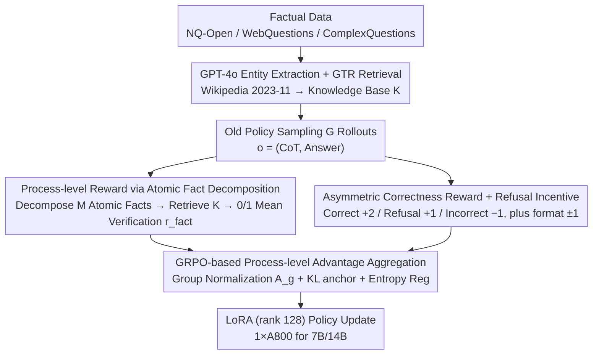

# KnowRL: Exploring Knowledgeable Reinforcement Learning for Factuality

**Conference**: ACL 2026  
**arXiv**: [2506.19807](https://arxiv.org/abs/2506.19807)  
**Code**: https://github.com/zjunlp/KnowRL  
**Area**: Reinforcement Learning / Slow-thinking LLM / Factuality / Hallucination Mitigation  
**Keywords**: Process-level reward, Atomic fact verification, GRPO, Knowledge boundary, Refusal incentive  

## TL;DR
KnowRL integrates "atomic fact verification" as a process-level reward directly into the GRPO training loop, performing factual assessment on each step of the slow-thinking model's Chain-of-Thought (CoT). Simultaneously, it employs a "positive reward for refusal" strategy to teach the model to identify its own knowledge boundaries. This approach reduces the SimpleQA Incorrect Rate by 20.3% without compromising (and even slightly improving) reasoning capabilities like GPQA/AIME, while demonstrating cross-lingual transfer from English knowledge to Chinese QA.

## Background & Motivation

**Background**: Slow-thinking models such as DeepSeek-R1 have achieved significant breakthroughs on strong reasoning benchmarks like GPQA/AIME by encouraging long CoT through RL. However, they exhibit inverse scaling on factuality benchmarks like SimpleQA—DeepSeek-R1-Distill-Qwen-32B achieves only a 6.64% accuracy on SimpleQA, where hallucinations increase rather than decrease with model scale.

**Limitations of Prior Work**: Existing RL training is almost exclusively outcome-only (rewarding only the final answer), treating the reasoning process as a black box. This leads to two critical issues: (i) models can "guess the answer correctly through fabricated reasoning," where reward signals reinforce hallucinated reasoning paths; (ii) models lack "self-knowledge" of their ignorance, resorting to guessing to obtain rewards—missing the concept of knowledge boundaries.

**Key Challenge**: To enable slow-thinking models to both reason and speak truthfully, it is essential to simultaneously address "factual supervision of the reasoning process" and "teaching the model to proactively refuse." However, RAG retrieval costs explode in long CoT, SFT leads to forgetting and rote memorization, and preference optimization like DPO only adjusts at the outcome level, none of which directly resolve process-level hallucinations.

**Goal**: (1) Embed fact verification into the RL training loop for step-level supervision; (2) Preserve existing complex reasoning capabilities; (3) Teach the model to say "I don't know" when information is missing, ensuring this "boundary awareness" can transfer across tasks and languages.

**Key Insight**: Borrowing the FactScore paradigm—which decomposes long generation into atomic facts for individual verification against a knowledge base—the authors utilize "atomic fact pass rate" as a dense RL reward signal. Furthermore, an asymmetric correctness reward structure (+2 for correct / +1 for refusal / -1 for incorrect) is designed to explicitly incentivize refusal.

**Core Idea**: Utilizing GRPO with a three-component composite reward (format + correctness with refusal bonus + atomic-fact factuality) to open the reasoning "black box," shifting probability mass from hallucinated chains to knowledge-supported ones.

## Method

### Overall Architecture
KnowRL performs reward engineering on top of GRPO: (1) **Data Construction**—Examines factual questions from NQ-Open / WebQuestions / ComplexQuestions, extracts entities via GPT-4o, and retrieves corresponding passages from a Wikipedia 2023-11-01 dump as the external knowledge base $K$; (2) **Rollout & Composite Reward**—For each prompt $x$, the old policy $\pi_{\theta_{\text{old}}}$ samples $G$ rollouts, where each $o=(o_{\text{think}},o_{\text{answer}})$ is evaluated as $R_{\text{total}}=r_{\text{format}}+r_{\text{correct}}+r_{\text{fact}}$; (3) **GRPO Advantage Normalization**—Calculates $A_g=(R_g-\mu_x)/(\sigma_x+\varepsilon)$ within each prompt group; (4) **Surrogate Objective** + KL anchor + entropy regularization for PPO-style updates; (5) Fine-tuning via LoRA (rank 128), allowing 7B/14B models to be trained on 1×A800.

### Key Designs

**1. Process-level Reward via Atomic Fact Decomposition + GTR Retrieval ($r_{\text{fact}}$): Decomposing the Reasoning "Black Box" into Dense Scores**

A fatal flaw of outcome-only rewards is treating the reasoning process as a black box, where a model might "hallucinate the logic while hitting the target answer." KnowRL adapts the FactScore verification pipeline from evaluation to training: it uses GPT-4o-mini to decompose $o_{\text{think}}$ into $M$ atomic facts $\Phi(o_{\text{think}})=\{f_1,\dots,f_M\}$. Each $f_j$ is used to retrieve top-relevant passages $K_x$ from knowledge base $K$ using `gtr-t5-large`. GPT-4o-mini then provides a 0/1 verification $v(f_j,K_x)$, resulting in a mean score $r_{\text{fact}}(o)=\frac{1}{M}\sum_j v(f_j,K_x)$ (recorded as 0 if $M=0$). This converts "factuality" from a black-box scalar into a dense, sentence-by-sentence verifiable score.

**2. Asymmetric Correctness Reward + Refusal Incentive: Teaching Knowledge Boundaries with +2/+1/−1**

Traditional RL punishes all "non-correct" outputs equally, forcing models to "gamble" when uncertain—preventing them from learning their own ignorance. KnowRL explicitly distinguishes three outcomes in the correctness reward: $r_{\text{correct}}=+2$ (Correct via GPT-4o-mini) / $+1$ (Explicit Refusal) / $-1$ (Incorrect), supplemented by a $\pm 1$ format reward to enforce the `<think>...</think><answer>...</answer>` structure. This design informs the model that "refusing is not as profitable as being right, but far better than being wrong," shifting probability mass from guessing to honest abstention. Its importance is evident in ablation studies: changing the refusal bonus from +1 to −1 causes the Incorrect Rate to rebound from 57.67% to 78.67%.

**3. GRPO-based Process-level Advantage Aggregation: Rewarding Fact-Dense and Properly Refused Trajectories**

To translate composite rewards into gradient signals efficiently, KnowRL uses GRPO to eliminate the critic. For $G$ rollouts of the same prompt, $R_{\text{total}}=r_{\text{format}}+r_{\text{correct}}+r_{\text{fact}}$ is computed and normalized into a signed advantage $A_g=(R_g-\mu_x)/(\sigma_x+\varepsilon)$. This ensures that hallucination-heavy trajectories receive negative credit, while factually dense and appropriately refused trajectories receive positive credit. The trajectory-level importance ratio $\varrho_g=\pi_\theta(o^{(g)}|x)/\pi_{\theta_{\text{old}}}(o^{(g)}|x)$ is clipped to compute the surrogate $\hat{\mathcal{J}}(\theta)=\frac{1}{G}\sum_g \min(\varrho_g A_g, \text{clip}(\varrho_g,1{-}\epsilon,1{+}\epsilon)A_g)$, combined with entropy and KL anchors:

$$\mathcal{L}_{\text{KnowRL}}=-\hat{\mathcal{J}}+\beta_{\mathcal{H}}\mathcal{E}_{\mathcal{H}}+\beta_{\text{KL}}\mathcal{E}_{\text{KL}}.$$

Group normalization stabilizes reward magnitudes across different prompt difficulties, while the KL anchor prevents the model from sacrificing reasoning performance for factuality—preserving GPQA/AIME scores.

### Loss & Training
LoRA rank 128 / alpha 256, bf16, lr=1e-5, batch=20, grad accum=4, KL coefficient $\beta_{\text{KL}}\approx 1\text{e-3}$, cosine LR schedule, warmup 0.03, AdamW-8bit, vLLM GPU mem util 0.5. Training for the 7B model is feasible on 1×A800. Convergence occurs between 100-300 steps; exceeding 300 steps leads to slight over-optimization.

## Key Experimental Results

### Main Results
Two 7B slow-thinking models (distilled DeepSeek-R1-Distill-Qwen-7B and RL-based Skywork-OR1-7B-Preview) were tested. SimpleQA Incorrect Rate and GPQA Diamond results are reported:

| Model | Method | SimpleQA Incorrect ↓ | ChineseSimpleQA Incorrect ↓ | GPQA Diamond ↑ | AIME 2025 ↑ |
|------|------|----------------------|------------------------------|----------------|-------------|
| DeepSeek-7B | Zero-shot | 78.00 | 68.33 | 40.91 | 30.00 |
| DeepSeek-7B | SFT | 83.33 (+5.33) | 76.67 (+8.34) | 36.36 | 26.67 |
| DeepSeek-7B | DPO | 88.00 (+10.0) | 79.33 (+11.0) | 37.37 | 30.00 |
| DeepSeek-7B | FactTune-FS | 59.67 (−18.3) | 76.00 (+7.67) | 38.89 | 30.00 |
| DeepSeek-7B | TruthRL | 61.00 (−17.0) | 60.00 (−8.33) | 39.39 | 26.67 |
| DeepSeek-7B | **KnowRL** | **57.67 (−20.3)** | **58.33 (−10.0)** | 36.87 | **33.33** |
| Skywork-7B | Zero-shot | 76.33 | 67.00 | 37.37 | 26.67 |
| Skywork-7B | **KnowRL** | **60.33 (−16.0)** | **52.33 (−14.7)** | **42.42** | **36.67** |

Across multiple runs (Avg@5, T=0.6), KnowRL reduced the DeepSeek-7B SimpleQA Incorrect rate from 62.47 to 48.27, while AIME improved from 29.33 to 34.00. On the 14B model, SimpleQA Incorrect fell from 83 to 68, and GPQA rose from 47 to 51.

### Ablation Study
On DeepSeek-7B with different reward combinations (SimpleQA Incorrect / GPQA):

| Reward Config | SimpleQA Incorrect ↓ | Refusal | GPQA ↑ | AIME ↑ |
|----------|----------------------|---------|--------|--------|
| $r_{\text{format}}$ only | 74.00 | 24.00 | 39.39 | 30.00 |
| $r_{\text{format}}+r_{\text{fact}}$ | 80.67 (+6.67) | 17.33 | **47.47** | **40.00** |
| $r_{\text{format}}+r_{\text{correct}}$ | 60.67 (−13.3) | 37.33 | 38.89 | 40.00 |
| **Full $R_{\text{total}}$ (KnowRL)** | **57.67 (−16.3)** | 40.67 | 36.87 | 33.33 |
| KnowRL with $r_{\text{refusal}}=-1$ | 78.67 (+4.67) | 8.67 | 34.85 | 30.00 |

Algorithm Robustness: Replacing GRPO with DAPO / BNPO / Dr.GRPO still shows a 16-19 point drop in SimpleQA Incorrect, proving the effect stems from reward design rather than the specific optimizer.

### Key Findings
- **Positive refusal reward is the "anchor" for knowledge boundaries**: Changing $r_{\text{refusal}}$ from +1 to −1 causes the refusal rate to crash from 40.67 to 8.67, with Incorrect rate bouncing from 57.67 back to 78.67—indicating that correctness signals alone (+2/−1) are insufficient to stabilize boundary behavior.
- **$r_{\text{fact}}$ alone benefits reasoning but does not suppress hallucinations**: The $r_{\text{format}}+r_{\text{fact}}$ configuration improved GPQA to 47.47 and AIME to 40.00, but Incorrect Rate worsened compared to the baseline (80.67 vs 74.00). Models become "confidently wrong" without the correctness signal.
- **Cross-lingual Transfer**: While the training knowledge base was primarily English, ChineseSimpleQA Incorrect also dropped by 10-15 points, suggesting the model learns a "language-agnostic verification behavior" rather than memorization.
- **Drastic reduction in completion length ≠ collapse of reasoning**: The sharp drop in generation length is a byproduct of the model no longer "making up stories" for unknown questions; reasoning benchmarks (GPQA / AIME / OlympiadBench) remained stable or increased.
- **Training sweet spot ≈ 200 steps**: Performance improves rapidly up to 200 steps before stabilizing; 300+ steps may result in slight over-optimization.

## Highlights & Insights
- Reimagining FactScore as a "reward factory" rather than just an "evaluation tool" is a simple but highly effective paradigm shift.
- The asymmetric refusal reward (+2/+1/−1) is elegant: it treats "honesty" as a distinct action type to be rewarded, providing a direct signal for boundary learning.
- The consistency across algorithms (GRPO/DAPO/BNPO/Dr.GRPO) suggests that reward engineering is more critical than swapping RL algorithms.
- The English-to-Chinese transfer suggests that verification behavior may be an inherent language-independent "meta-ability."

## Limitations & Future Work
- The high cost and latency of calling GPT-4o-mini for every rollout; internalizing the verifier into a smaller local model would be more engineering-friendly.
- Narrow knowledge base coverage (NQ/WebQ/Wiki 2023-11); the model might learn to "always refuse these types of questions" rather than truly understanding its boundaries.
- Evaluation samples were limited to 300 per task, and AIME to 30 problems, resulting in higher variance.
- Text only; no coverage of multimodal "atomic facts" like charts, formulas, or physics diagrams.
- Semantic determination of refusal relies on an LLM evaluator, which might misinterpret conservative answers as refusals.

## Related Work & Insights
- **vs TruthRL**: TruthRL also uses honesty/truth rewards but at the outcome level; KnowRL provides finer process-level and atomic signals, outperforming it on DeepSeek-7B (Incorrect 57.67 vs 61.00).
- **vs FactTune-FS**: FactTune-FS uses FactScore to filter SFT data; KnowRL uses it as an RL reward directly, avoiding the catastrophic forgetting of static SFT.
- **vs DPO with R1 chosen data**: DPO actually increased the Incorrect Rate by 10+, suggesting preference alignment might reinforce incorrect styles in factual tasks.
- **vs RAG**: RAG retrieval costs in long CoT are prohibitive; KnowRL places "retrieval + verification" on the reward side rather than the inference side, introducing no latency during deployment.

## Rating
- Novelty: ⭐⭐⭐⭐ Combing FactScore as a reward with positive refusal incentives is a full realization for factuality RL.
- Experimental Thoroughness: ⭐⭐⭐⭐ Coverage of two types of slow-thinking models, 6+ baselines, 4 RL algorithms, 14B scaling, and OlympiadBench bilingual tasks.
- Writing Quality: ⭐⭐⭐⭐ Clear storytelling; the "scale vs hallucination" inverse scaling plot establishes the problem well.
- Value: ⭐⭐⭐⭐⭐ Provides a practical path for slow-thinking models to speak truthfully without retraining knowledge bases or using RAG.

<!-- RELATED:START -->

## Related Papers

- [\[CVPR 2026\] PanoEnv: Exploring 3D Spatial Intelligence in Panoramic Environments with Reinforcement Learning](../../CVPR2026/reinforcement_learning/panoenv_exploring_3d_spatial_intelligence_in_panoramic_environments_with_reinfor.md)
- [\[ICLR 2026\] UME-R1: Exploring Reasoning-Driven Generative Multimodal Embeddings](../../ICLR2026/reinforcement_learning/ume-r1_exploring_reasoning-driven_generative_multimodal_embeddings.md)
- [\[ACL 2026\] LoVeC: Reinforcement Learning for Better Verbalized Confidence in Long-Form Generations](lovec_reinforcement_learning_for_better_verbalized_confidence_in_long-form_gener.md)
- [\[ACL 2026\] Free Energy-Driven Reinforcement Learning with Adaptive Advantage Shaping for Unsupervised Reasoning in LLMs](free_energy-driven_reinforcement_learning_with_adaptive_advantage_shaping_for_un.md)
- [\[ICLR 2026\] Exo-Plore: Exploring Exoskeleton Control Space through Human-Aligned Simulation](../../ICLR2026/reinforcement_learning/exo-plore_exploring_exoskeleton_control_space_through_human-aligned_simulation.md)

<!-- RELATED:END -->
