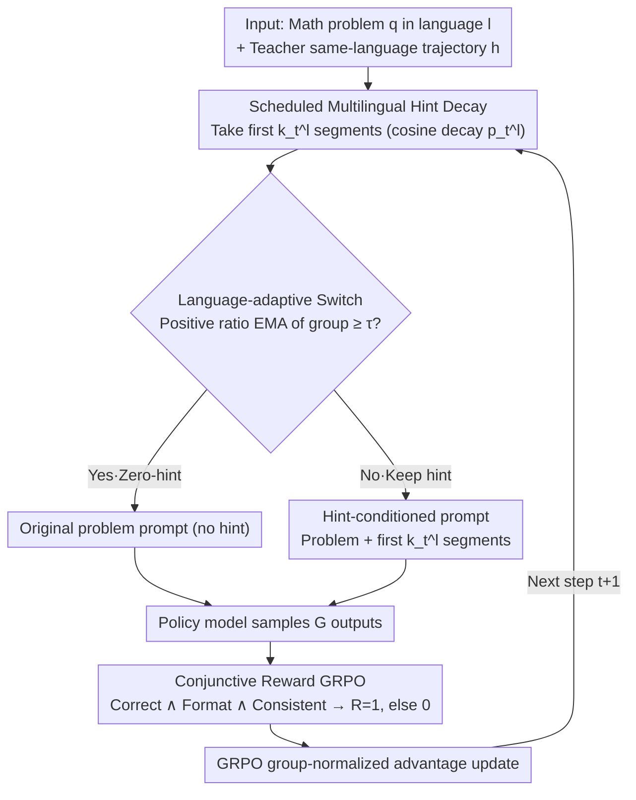

# LANG: Reinforcement Learning for Multilingual Reasoning with Language-Adaptive Hint Guidance

**Conference**: ACL2026  
**arXiv**: [2605.22567](https://arxiv.org/abs/2605.22567)  
**Code**: https://github.com/fmm170/LANG  
**Area**: Reinforcement Learning / Multilingual Reasoning  
**Keywords**: Multilingual Reasoning, GRPO, hint-guided RL, language consistency, reward sparsity  

## TL;DR
LANG bootstraps multilingual mathematical reasoning RL with same-language reasoning hints, then utilizes cosine decay and language-difficulty-based adaptive hint termination to improve non-English reasoning accuracy while maintaining language consistency.

## Background & Motivation
**Background**: RLVR/GRPO has become a common route for enhancing multi-step reasoning in LLMs, with models like DeepSeek-R1 proving that verifiable rewards can push models toward longer and more reliable reasoning chains. However, this route is highly English-centric; in multilingual scenarios, the model must not only answer correctly but also ensure the intermediate reasoning and final answer match the user's input language.

**Limitations of Prior Work**: Directly requesting "think and answer in [language]" in the prompt can improve language consistency but often sacrifices mathematical reasoning accuracy. Optimizing only for answer correctness causes the reasoning chain to drift toward English. The paper illustrates this with a Korean divisor calculation example: language-consistent reasoning might result in errors, while correct reasoning often drifts into English.

**Key Challenge**: The fundamental difficulty of multilingual RL lies in the overlap of reward sparsity and training-inference inconsistency. In low-resource languages, it is difficult for models to sample trajectories that are "answer correct, format correct, and language consistent." If full hints are provided throughout training, models learn to depend on them, while hints are absent during inference.

**Goal**: The authors aim to provide sufficient scaffolding in early training to help the model find correct non-English reasoning trajectories, while gradually removing the scaffolding so the final policy can perform multilingual reasoning independently.

**Key Insight**: Drawing from hint-guided RL and scheduled sampling, the paper treats hints as exploration aids for early training rather than long-term input conditions. It further observes that different languages have varying learning difficulties; low-resource languages require longer hint retention, while high-resource languages should detach from hints earlier.

**Core Idea**: Replace fixed hints or pure language-consistency rewards with "language-conditioned hints + progressive hint decay + language-group adaptive switching" to mitigate the sparse reward and language drift problems in multilingual RL.

## Method

### Overall Architecture
LANG is a curriculum learning framework for multilingual reasoning. Its core mechanism involves using same-language reasoning hints as "scaffolding" in early training and gradually removing them. Given a math problem $q$ in language $l$ and a same-language reasoning trajectory $h=(h_1,\ldots,h_L)$ generated by a teacher, at training step $t$, LANG takes the first $k_t^l=\lfloor p_t^lL\rfloor$ segments according to the hint ratio $p_t^l$ to form a hint-conditioned prompt. The policy model samples a group of outputs based on this, updated via GRPO using a conjunctive reward for answer correctness, format, and language consistency. Early training relies on long hints to solve the sampling issue for low-resource languages; as training progresses, hints are shortened until removal, and the model transitions from "following a trajectory" to "generating its own." When a language group can stably sample positive instances, it enters the zero-hint regime early.

### Key Designs

**1. Scheduled Multilingual Hint Decay: Providing scaffolding early and removing it smoothly to prevent hint dependence**

In low-resource languages, sampling "correct + formatted + consistent" trajectories is difficult, requiring same-language hints to start exploration. However, continuous full hints lead to a "hint-conditioned shortcut" non-existent at inference. LANG uses a cosine decay $p_t^l=\frac{1}{2}(1+\cos(\pi t/T))$ to smoothly reduce the hint ratio from 1 to 0. Pilot studies found that QUESTA-style fixed hints result in higher training reward but worse testing performance and increased repetition (typical shortcut symptoms). Cosine decay is more stable than linear or exponential decay by maintaining exploration early without forming late-stage dependence.

**2. Language-adaptive Switch: Deciding detachment timing based on language resource difficulty**

Learning difficulties vary across languages. A global schedule inevitably fails some groups—high-resource languages could sample positive trajectories independently early on, and excessive hints induce dependence, while low-resource languages might fall back into reward sparsity if hints are removed too soon. LANG categorizes languages into high/mid/low resource groups. For each group, it tracks the ratio $u_R(t)$ of batches containing at least one positive advantage rollout, smoothed via EMA $\bar{u}_R(t)=\alpha\bar{u}_R(t-1)+(1-\alpha)u_R(t)$. When $\bar{u}_R(t)\geq\tau$, the group switches to the zero-hint regime.

**3. Conjunctive Reward GRPO: Closing the "think in English, translate to target" loophole**

If only final answers are evaluated, models might "cheat" by thinking in English and translating. If only language consistency is checked, reasoning accuracy suffers. LANG combines answer correctness, format compliance, and language consistency into a strict conjunctive reward: given reasoning trace $o_t$ and final answer $o_a$, the total reward $R(o)=1$ only if $R_{lc}=1$, $R_{format}=1$, and $R_{acc}=1$ simultaneously; otherwise, $R(o)=0$. After sampling $G$ outputs, the policy is updated via group-normalized advantages.

### Loss & Training
Training involves cold-start and RL phases. Multi-lingual data is constructed from DeepMath-103K, with 0.3K samples per language for cold-start and 3K for GRPO. RL uses 8 rollouts, temperature 1.0, learning rate $1\times10^{-6}$, batch size 128, PPO mini-batch 64, max sequence length 16,384, and KL coefficient 0.

Language groups: High-resource (English, German, French, Spanish, Portuguese, Italian); Mid-resource (Japanese, Chinese, Russian, Korean, Vietnamese); Low-resource (Arabic, Bengali, Thai, Swahili, Telugu, Indonesian).

## Key Experimental Results

### Main Results
The primary metric is LC&Acc (Correct answer with reasoning/answer language consistent with input). Overall averages for Qwen2.5-7B-Instruct:

| Dataset | Metric | Ours (LANG) | Prev. SOTA | Gain |
|--------|------|-----------|------------|------|
| MMATH, Qwen2.5-7B | ALL-Avg. LC&Acc | 28.6 | mGRPO 26.0 / LC-GRPO 26.3 | +2.3 vs LC-GRPO |
| PolyMath, Qwen2.5-7B | ALL-Avg. LC&Acc | 15.6 | mGRPO 13.0 / LC-GRPO 13.9 | +1.7 vs LC-GRPO |
| MMATH, Qwen2.5-3B | ALL-Avg. LC&Acc | 17.7 | LC-GRPO 16.8 / mGRPO 15.7 | +0.9 vs LC-GRPO |
| PolyMath, Qwen2.5-3B | ALL-Avg. LC&Acc | 10.1 | LC-GRPO 9.5 / Vanilla GRPO 8.6 | +0.6 vs LC-GRPO |

Across four models, LANG improved MMATH by an average of 24.1% and PolyMath by 18.7% compared to LC-GRPO. Gains are particularly significant in low-resource languages (e.g., Thai MMATH LC&Acc increased by 39.0% over mGRPO).

### Ablation Study

| Configuration | MMATH LC&Acc | PolyMath LC&Acc | Description |
|------|--------------|-----------------|------|
| LANG, cosine decay | 28.6 | 15.6 | Full method, best performance |
| Linear decay | 27.1 | 14.6 | Uniform linear removal, slightly weaker |
| Exponential decay | 24.1 | 14.3 | Quick early removal, insufficient exploration |
| LANG w/o cold-start | 27.5 | 15.0 | Lower initial format/language following |
| LANG w/o $R_{lc}$ | 3.1 | 9.1 | Significant drift without language reward |
| LANG w/o $p_t^l$ | 10.1 | 3.2 | Severe training-inference inconsistency |

### Key Findings
- LANG's gains do not stem from simply making answers longer. While QUESTA increased length and repetition (leading to lower performance), LANG increases effective reasoning length without inducing repetition.
- Cosine decay outperforms exponential and linear decay, indicating that the rhythm of hint removal is critical.
- Transfer gains are observed in non-math multilingual tasks: Average 10.9% improvement across MMLU-ProX, XWinograd, XStoryCloze, and XCOPA.
- Layer-wise logit lens analysis shows LANG maintains high language consistency in intermediate layers, not just in the final output.

## Highlights & Insights
- A key insight is the decomposition of multilingual reasoning failure into two parts: failure to sample positive trajectories and over-dependence on hints.
- The language-adaptive switch is practical as it acknowledges the varying learning difficulties across languages.
- The conjunctive reward cleanly defines the optimization target, reducing the space for "mental translation" shortcuts.
- Layer-wise analysis validates that multilingual reasoning should be consistent throughout the representation space, not just treated as a translation task at the end.

## Limitations & Future Work
- Multilingual hints are primarily distilled from DeepSeek-R1; teacher diversity could be further explored.
- Performance trade-offs between languages persist, likely due to pre-training data imbalances that RL can only partially remedy.
- The method depends on verifiable answers and language detectors, which is straightforward for math but challenging for open-ended or subjective tasks.
- Hint segmentation and semantic continuity impact training; random dropping of hint segments degrades performance, suggesting a need for more granular, semantic-preserving hint curricula.

## Related Work & Insights
- **vs Language-Constraint Prompting / DIT / QRT**: These control language via prompts at inference, which is lightweight but often sacrifices accuracy.
- **vs LC-GRPO / M-Thinker**: These introduce language rewards or cross-lingual alignment but still struggle with low-resource reward sparsity.
- **vs QUESTA / StepHint**: These use hints for sparse rewards but suffer from training-inference inconsistency due to fixed hints.
- **Insights for future work**: Multilingual agent or RAG tasks could adopt similar strategies—providing same-language reasoning/retrieval hints and progressively removing them based on language-group curriculum speeds.

## Rating
- Novelty: ⭐⭐⭐⭐☆ Combines hint-guided RL, scheduled decay, and adaptive switching for multilingual reasoning; clear definition and effective mechanism.
- Experimental Thoroughness: ⭐⭐⭐⭐☆ Covers multiple datasets, non-math tasks, and ablation studies, though teacher quality analysis could be deeper.
- Writing Quality: ⭐⭐⭐⭐☆ Strong logic; pilot studies are convincing. Tables are dense but informative.
- Value: ⭐⭐⭐⭐⭐ Highly relevant for multilingual RL and low-resource reasoning systems needing both accuracy and target-language interpretability.

<!-- RELATED:START -->

## Related Papers

- [\[AAAI 2026\] MARS: Multi-Agent Adaptive Reasoning with Socratic Guidance for Automated Prompt Optimization](../../AAAI2026/reinforcement_learning/mars_multi-agent_adaptive_reasoning_with_socratic_guidance_f.md)
- [\[NeurIPS 2025\] When Less Language is More: Language-Reasoning Disentanglement Makes LLMs Better Multilingual Reasoners](../../NeurIPS2025/reinforcement_learning/when_less_language_is_more_language-reasoning_disentanglement_makes_llms_better_.md)
- [\[ACL 2026\] Free Energy-Driven Reinforcement Learning with Adaptive Advantage Shaping for Unsupervised Reasoning in LLMs](free_energy-driven_reinforcement_learning_with_adaptive_advantage_shaping_for_un.md)
- [\[AAAI 2026\] Vision-Language Reasoning for Geolocalization: A Reinforcement Learning Approach](../../AAAI2026/reinforcement_learning/vision-language_reasoning_for_geolocalization_a_reinforcement_learning_approach.md)
- [\[ICML 2026\] Learning to Route Languages for Multilingual Policy Optimization](../../ICML2026/reinforcement_learning/learning_to_route_languages_for_multilingual_policy_optimization.md)

<!-- RELATED:END -->
