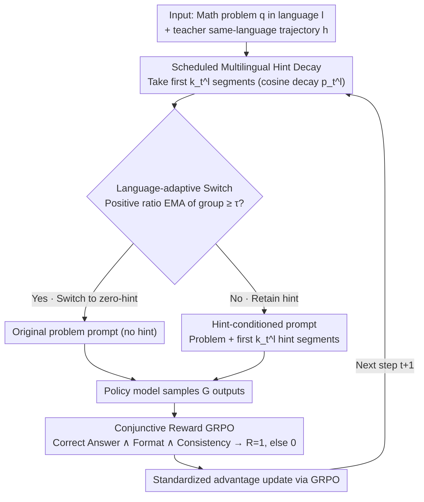

# LANG: Reinforcement Learning for Multilingual Reasoning with Language-Adaptive Hint Guidance

**Conference**: ACL2026  
**arXiv**: [2605.22567](https://arxiv.org/abs/2605.22567)  
**Code**: https://github.com/fmm170/LANG  
**Area**: Reinforcement Learning / Multilingual Reasoning  
**Keywords**: Multilingual Reasoning, GRPO, hint-guided RL, language consistency, reward sparsity  

## TL;DR
LANG initiates multilingual mathematical reasoning RL with same-language reasoning hints, then utilizes cosine decay and language-adaptive deactivation based on resource difficulty to improve non-English reasoning accuracy while maintaining language consistency.

## Background & Motivation
**Background**: RLVR/GRPO has become a common path for enhancing the multi-step reasoning capabilities of LLMs. Models like DeepSeek-R1 have demonstrated that verifiable rewards can push models toward longer and more reliable reasoning chains. However, this path is highly English-centric; in multilingual scenarios, models must not only answer correctly but also maintain the user's input language throughout the intermediate reasoning and final answer.

**Limitations of Prior Work**: Directly requesting the model to "think and answer in a specific language" in prompts can improve language consistency but often at the cost of mathematical reasoning accuracy. Optimizing only for answer correctness often results in the model drifting to English during the reasoning chain. The paper illustrates this contradiction with an example of counting divisors in Korean: language-consistent reasoning might result in a calculation error, while correct calculations often revert to English.

**Key Challenge**: The fundamental difficulty of multilingual RL lies in the combination of reward sparsity and train-inference inconsistency. In low-resource languages, it is inherently difficult for the model to sample trajectories that are "answer correct, format correct, and language consistent." If full hints are provided throughout training, the model learns to depend on them, which are absent during inference.

**Goal**: The authors aim to provide sufficient scaffolding in early training to help the model find correct non-English reasoning trajectories while gradually removing the scaffolding so the final policy can complete multilingual reasoning independently.

**Key Insight**: Borrowing from hint-guided RL and scheduled sampling, this paper treats hints as an exploration aid in early training rather than a long-term input condition. It further observes that different languages have different learning difficulties; low-resource languages require longer hint retention, while high-resource languages should detach from hints earlier.

**Core Idea**: Replace fixed hints or pure language consistency rewards with "language-conditioned hints + progressive hint decay + language-group adaptive switching" to mitigate the sparse reward and language drift problems in multilingual RL.

## Method

### Overall Architecture
LANG is a curriculum learning framework for multilingual reasoning. Its core mechanism is treating same-language reasoning hints as early training "scaffolding" and progressively withdrawing them. Given a math problem $q$ in language $l$ and a same-language reasoning trajectory $h=(h_1,\ldots,h_L)$ generated by a teacher, LANG takes the first $k_t^l=\lfloor p_t^lL\rfloor$ segments at training step $t$ based on the hint ratio $p_t^l$ to construct a hint-conditioned prompt. The policy model samples outputs based on this prompt, which are then updated using GRPO with a joint reward for answer correctness, format, and language consistency. Long hints in early training solve the sampling issue for low-resource languages. As training progresses, hints are shortened until removal, transitioning the model from "following same-language trajectories" to "generating same-language reasoning." When a language group can stably sample positive instances, it enters the zero-hint regime early.

### Key Designs

**1. Scheduled Multilingual Hint Decay: Providing early scaffolding then smoothing withdrawal to prevent hint dependency**

In low-resource languages, it is difficult for models to sample "correct + formatted + consistent" trajectories. Thus, same-language hints are needed to start exploration. However, continuous full hints lead to shortcut learning. LANG uses a cosine decay $p_t^l=\frac{1}{2}(1+\cos(\pi t/T))$ to smoothly reduce the hint ratio from 1 to 0. A pilot study found that fixed hints (like QUESTA) result in higher training rewards but worse test performance and repetitive responses—typical shortcut symptoms. Cosine decay is more stable than linear or exponential decay by maintaining exploration early without late-stage dependency.

**2. Language-adaptive Switch: Deciding hint detachment based on language resource difficulty**

Learning difficulty varies across languages. A global schedule inevitably fails some groups—high-resource languages can sample correct trajectories early, where long hints induce dependency, while low-resource languages may revert to reward sparsity if hints are removed too soon. LANG categorizes languages into high/mid/low resource groups. For each group, it calculates the ratio $u_R(t)$ of batches where at least one rollout yields a positive advantage and applies EMA smoothing: $\bar{u}_R(t)=\alpha\bar{u}_R(t-1)+(1-\alpha)u_R(t)$. When $\bar{u}_R(t)\geq\tau$, the group switches to the zero-hint regime.

**3. Conjunctive Reward GRPO: Closing exploitation loopholes with strict rewards**

In multilingual reasoning, checking only the final answer allows models to "think in English and translate." Checking only consistency sacrifices accuracy. LANG combines answer correctness, format, and language consistency into a strict conjunctive reward. Given reasoning trace $o_t$ and final answer $o_a$, the total reward $R(o)=1$ only if $R_{lc}=1$, $R_{format}=1$, and $R_{acc}=1$ are all true; otherwise, $0$. In ablations, removing $R_{lc}$ caused MMATH LC&Acc to drop from 28.6 to 3.1, highlighting its importance.

### Loss & Training
Training involves a cold-start phase followed by RL. Multilingual data was constructed from DeepMath-103K, using 0.3K samples per in-domain language for cold-start and 3K for GRPO. RL parameters include 8 rollouts, temperature 1.0, learning rate $1\times10^{-6}$, batch size 128, PPO mini-batch 64, max sequence length 16,384, and a KL coefficient of 0.

Language groups:
- High-resource: English, German, French, Spanish, Portuguese, Italian.
- Mid-resource: Japanese, Chinese, Russian, Korean, Vietnamese.
- Low-resource: Arabic, Bengali, Thai, Swahili, Telugu, Indonesian.

## Key Experimental Results

### Main Results
The paper reports LC&Acc on MMATH and PolyMath (success requires correct answer and consistent language). Average values for Qwen2.5-7B/3B show gains over strong baselines.

| Dataset | Metric | Ours (LANG) | Prev. SOTA | Gain |
|--------|------|-----------|------------|------|
| MMATH, Qwen2.5-7B | ALL-Avg. LC&Acc | 28.6 | mGRPO 26.0 / LC-GRPO 26.3 | +2.3 vs LC-GRPO |
| PolyMath, Qwen2.5-7B | ALL-Avg. LC&Acc | 15.6 | mGRPO 13.0 / LC-GRPO 13.9 | +1.7 vs LC-GRPO |
| MMATH, Qwen2.5-3B | ALL-Avg. LC&Acc | 17.7 | LC-GRPO 16.8 / mGRPO 15.7 | +0.9 vs LC-GRPO |
| PolyMath, Qwen2.5-3B | ALL-Avg. LC&Acc | 10.1 | LC-GRPO 9.5 / Vanilla GRPO 8.6 | +0.6 vs LC-GRPO |

Overall, LANG improved by an average of 24.1% on MMATH and 18.7% on PolyMath across four models. Gains are notable in low-resource languages; for Thai on Qwen2.5-7B, MMATH LC&Acc improved by 39.0% vs mGRPO.

### Ablation Study
| Configuration | MMATH LC&Acc | PolyMath LC&Acc | Description |
|------|--------------|-----------------|------|
| LANG, cosine decay | 28.6 | 15.6 | Full method |
| Linear decay | 27.1 | 14.6 | Uniform removal, slightly weaker than cosine |
| Exponential decay | 24.1 | 14.3 | Rapid early removal, insufficient exploration |
| LANG w/o cold-start | 27.5 | 15.0 | Lack of initial format/language following |
| LANG w/o $R_{lc}$ | 3.1 | 9.1 | Significant language drift |
| LANG w/o $p_t^l$ | 10.1 | 3.2 | Severe train-inference inconsistency |

### Key Findings
- LANG's gains do not come from "longer answers." While QUESTA increased length and repetition, LANG increased effective reasoning length without inducing repetition.
- Cosine decay outperformed exponential and linear decay, indicating that hint removal rhythm is critical.
- Non-math multilingual tasks also benefited: LANG improved by an average of 10.9% on MMLU-ProX, XWinograd, XStoryCloze, and XCOPA.
- Layer-wise logit lens analysis showed that LANG maintains high language consistency in intermediate layers, not just during final output translation.

## Highlights & Insights
- A valuable observation is splitting multilingual reasoning failure into two issues: sampling failure and hint dependency. LANG explicitly incorporates "removing scaffolding" into the training objective.
- The language-adaptive switch is practical as it acknowledges varying learning difficulties. Allowing high-resource languages to exit hints early and low-resource languages later fits multilingual training reality.
- The conjunctive reward design is clean and effective, reducing the space for "thinking in English" shortcuts.
- The layer-wise analysis suggests that multilingual reasoning should be checked for consistent target-language paths in hidden representations, not just final strings.

## Limitations & Future Work
- Multilingual hints were primarily distilled from DeepSeek-R1. While substituting with GPT-4o-mini still yielded gains, teacher diversity could be improved.
- Performance trade-offs between languages persist, likely due to pre-training data imbalances that RL can only partially mitigate.
- Reliance on verifiable answers and language detectors is natural for math but harder to scale to open-ended reasoning or subjective tasks.
- Hint granularity and semantic continuity matter; random dropping of hint segments breaks semantics, suggesting a need for more fine-grained, semantic-preserving hint curricula.

## Related Work & Insights
- **vs Language-Constraint Prompting / DIT / QRT**: These control language at inference via prompts—lightweight but often sacrificing accuracy. LANG makes consistency a training objective.
- **vs LC-GRPO / M-Thinker**: These introduce rewards or cross-lingual thinking alignment but still face reward sparsity in low resources. LANG uses hints to bridge the exploration gap.
- **vs QUESTA / StepHint**: These use hints for sparse rewards but suffer from train-test inconsistency due to fixed hints. LANG's key differentiator is progressive removal and difficulty-aware scheduling.

## Rating
- Novelty: ⭐⭐⭐⭐☆ Combines hint-guided RL, scheduled decay, and adaptive switching for multilingual reasoning. Clear problem definition.
- Experimental Thoroughness: ⭐⭐⭐⭐☆ Covers multiple datasets, non-math tasks, and models. Could use more systematic analysis of hint quality.
- Writing Quality: ⭐⭐⭐⭐☆ Strong motivation and convincing pilot studies. Results tables are dense.
- Value: ⭐⭐⭐⭐⭐ Highly relevant for multilingual RL and low-resource reasoning systems needing both accuracy and consistency.

<!-- RELATED:START -->

## Related Papers

- [\[AAAI 2026\] MARS: Multi-Agent Adaptive Reasoning with Socratic Guidance for Automated Prompt Optimization](../../AAAI2026/reinforcement_learning/mars_multi-agent_adaptive_reasoning_with_socratic_guidance_f.md)
- [\[NeurIPS 2025\] When Less Language is More: Language-Reasoning Disentanglement Makes LLMs Better Multilingual Reasoners](../../NeurIPS2025/reinforcement_learning/when_less_language_is_more_language-reasoning_disentanglement_makes_llms_better_.md)
- [\[ACL 2026\] Free Energy-Driven Reinforcement Learning with Adaptive Advantage Shaping for Unsupervised Reasoning in LLMs](free_energy-driven_reinforcement_learning_with_adaptive_advantage_shaping_for_un.md)
- [\[AAAI 2026\] Vision-Language Reasoning for Geolocalization: A Reinforcement Learning Approach](../../AAAI2026/reinforcement_learning/vision-language_reasoning_for_geolocalization_a_reinforcement_learning_approach.md)
- [\[ICML 2026\] Learning to Route Languages for Multilingual Policy Optimization](../../ICML2026/reinforcement_learning/learning_to_route_languages_for_multilingual_policy_optimization.md)

<!-- RELATED:END -->
