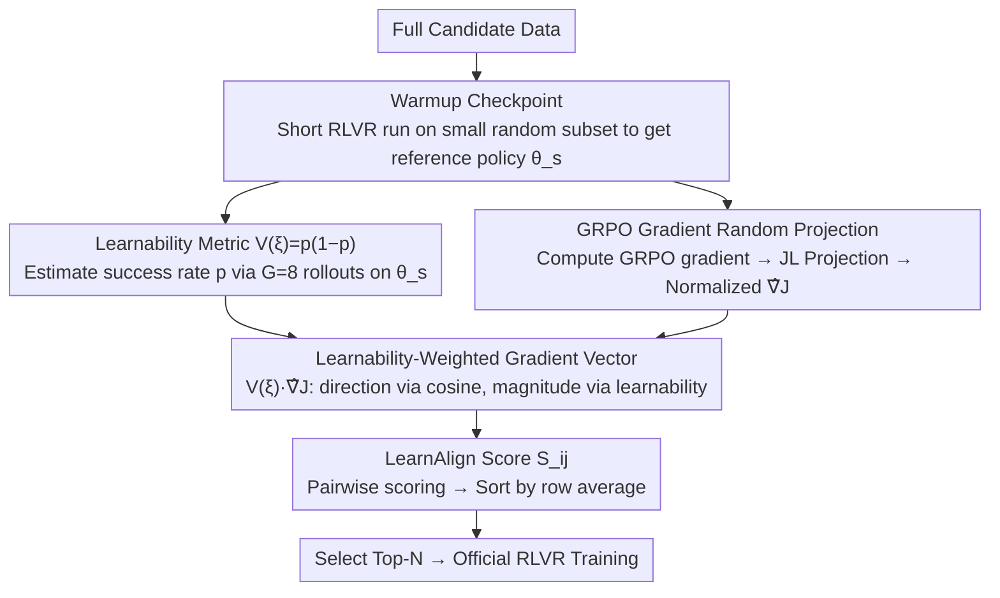

# LearnAlign: Data Selection for LLM Reinforcement Learning with Improved Gradient Alignment

**Conference**: ACL 2026 Findings  
**arXiv**: [2506.11480](https://arxiv.org/abs/2506.11480)  
**Code**: TBD  
**Area**: Reinforcement Learning / Data Selection / LLM Reasoning  
**Keywords**: RLVR, GRPO, Data Selection, Gradient Alignment, Data Learnability, Zone of Proximal Development

## TL;DR
To address data selection for RLVR post-training, LearnAlign is proposed—utilizing "gradient alignment" as a representativeness metric and "success rate $V(\xi)=p(1-p)$" as a learnability weight to eliminate response length bias. With only 1,000 samples (~6%), it achieves performance close to full-set training across 5 reasoning benchmarks (42.4% vs 44.9%), and on GSM8K, using 13.4% of the data (77.5%) exceeds full-set performance (77.0%).

## Background & Motivation

**Background**: RLVR (Reinforcement Learning with Verifiable Rewards) has become the standard post-training solution for reasoning LLMs like OpenAI o1, DeepSeek-R1, and Kimi k1.5—using rule-verifiable rewards (e.g., math answer correctness, code passing) as supervision signals with GRPO/PPO. However, RLVR is data-inefficient and computationally expensive.

**Limitations of Prior Work**: Most existing data selection methods are designed for SFT (e.g., INSTAG, ALPAGASUS, IFD, LESS, SelectIT, Nuggets), prioritizing "high quality" as high difficulty or low perplexity. While two RLVR-related works (LIMR, 1-shot RLVR) prove that a few samples are sufficient, their selection phase requires full training for several epochs on the entire dataset, making the **cost of evaluation extremely high, failing the purpose of "selection."**

**Key Challenge**: The goal of SFT is to maximize target likelihood, making "the harder, the better" a viable heuristic. In contrast, the RLVR objective is reward maximization; **only samples whose difficulty matches the current policy's capability generate learning signals**. Samples that are too easy ($p\approx 1$) are already mastered, and those too hard ($p\approx 0$) provide no learnable signal—**samples at both extremes are useless for RLVR**. Directly applying SFT selection to RLVR often performs worse than random sampling.

**Goal**: (1) Establish an efficient (no full-set training required), interpretable, and quantifiable data selection criterion for RLVR; (2) Address two long-standing issues of gradient methods—the "short response bias" of gradient magnitude and the loss of magnitude information in cosine similarity; (3) Verify on GSM8K + DAPO-MATH-17K if a small subset can rival full training.

**Key Insight**: The authors draw inspiration from LESS (gradient alignment) in the SFT era and the "Zone of Proximal Development" (ZPD, Vygotsky) in education—ensuring samples both align with the training distribution (gradient direction similarity) and lie at the policy's capability boundary (maximum learning potential when $p\approx 0.5$).

**Core Idea**: Construct a **learnability-weighted gradient vector** $\mathbf{V}(\xi_i) = \frac{\nabla \mathcal{J}}{\|\nabla \mathcal{J}\|} \cdot V(\xi_i)$, where $V(\xi_i) = p(1-p)$ quantifies "learning potential" via success rate. Multiplying this by the unit gradient eliminates length bias while preserving directional alignment. The LearnAlign Score $S_{ij}$ then calculates pairwise learnability and representativeness, with selection based on top-N row averages.

## Method

### Overall Architecture

LearnAlign aims to solve the problem of "which data to select" for RLVR post-training. Its core is to evaluate each sample for both "representativeness" (gradient alignment with the training set) and "learnability" (potential for improvement by the current policy), synthesizing these into a score to select the top-N samples. The pipeline consists of 4 lightweight steps: first, run a short RLVR warmup on a small random subset to obtain a reference policy $\bm{\theta}_s$; second, estimate success rates and compute GRPO gradients for each data point using $\bm{\theta}_s$; third, multiply success rates as weights onto normalized gradients to compute pairwise scores; finally, select the $N$ highest-scoring samples for formal training. Crucially, this **avoids multiple training epochs on the full dataset**, requiring only one warmup and one gradient estimation pass.

### Key Designs

**1. Learnability Metric $V(\xi)=p(1-p)$: Quantifying "Value of Learning" via ZPD Principles**

The fundamental difference between RLVR and SFT is that while SFT benefits from difficulty, RLVR only generates signals when difficulty matches policy capability. LearnAlign samples $G=8$ rollouts for each data point under $\pi_{\bm{\theta}_s}$, calculates the success rate $p_i=\frac{1}{G}\sum_g \mathbb{I}(\mathbf{y}_g=\mathbf{y}^*)$, and uses $V(\xi_i)=p_i(1-p_i)$ as the learnability metric. This value peaks at $p=0.5$ (the capability boundary) and approaches zero at both ends, corresponding to Vygotsky's "Zone of Proximal Development." Appendix B/C provides theoretical support via information gain and policy gradient variance minimization. An additional benefit is that success rate is naturally decoupled from response length, allowing it to replace length-biased gradient magnitudes and introduce a "difficulty-capability matching" mechanism missing in SFT.

**2. Learnability-Weighted Gradient Vector $\mathbf{V}(\xi_i)=\hat{\nabla}\mathcal{J}\cdot V(\xi_i)$: Orthogonally Integrating Representativeness and Learnability**

Gradient-based selection has two traditional flaws: pure cosine similarity discards magnitude (failing to identify "more learnable" samples), and pure inner products suffer from length bias (long responses naturally have smaller gradients and are systematically underestimated). LearnAlign first normalizes the GRPO gradient for each sample $\hat{\nabla}\mathcal{J}_i=\nabla\mathcal{J}_i/\|\nabla\mathcal{J}_i\|$ to eliminate magnitude bias, then re-weights it with $V(\xi_i)$. The resulting LearnAlign Score is cleanly decomposed into:

$$S_{ij}=V(\xi_i)V(\xi_j)\cdot\cos(\hat{\nabla}_i,\hat{\nabla}_j)$$

Direction is handled by the cosine term, while magnitude is handled by learnability. The physical meaning is clear: samples that are both highly learnable and gradient-aligned receive the highest scores. Data is selected by sorting the row average $\text{Avg}_i=\frac{1}{n}\sum_j S_{ij}$ and taking the top $N$.

**3. Warmup Checkpoint + GRPO Gradient Random Projection: Reduced Selection Cost**

LearnAlign avoids two cost traps: the bottleneck of training the full set for several epochs (as in LIMR / 1-shot RLVR) and the memory explosion of storing high-dimensional gradients. It adapts the infrastructure validated by LESS in SFT: using a warmup phase (300 samples for GSM8K, 1000 for DAPO) to obtain a stable reference point $\bm{\theta}_s$ for gradient estimation; performing one forward and backward pass on $\bm{\theta}_s$ per sample to calculate GRPO gradients ($\hat{A}_{i,t}+\beta(\pi_{\text{ref}}/\pi_{\bm{\theta}}-1)$); and employing Johnson-Lindenstrauss random projection $\Gamma$ to compress gradients into lower dimensions $\phi(\bm{\theta};\xi)=\Gamma^\top\nabla\mathcal{J}$. This combination enables one-pass selection results, with total time reduced to levels comparable to SFT data selection (Table 4).

### Loss & Training

Standard GRPO loss is used without modification (KL coefficient $\beta=0.04$, clip $\epsilon=0.2$, lr $1\times 10^{-6}$, $G=8$ rollouts at temperature 1.0, batch=48/64). For DAPO training, only 1 correct rollout is used to calculate gradients (following Lin et al. 2025 for speed).

## Key Experimental Results

### Main Results

**GSM8K Data Selection** (Qwen2.5-1.5B-Instruct, selected from GSM8K training set):

| Method | 100 | 500 | 1,000 | 2,000 |
|------|-----|-----|-------|-------|
| Base (no RLVR) | 55.7 | – | – | – |
| Full data (~7.5K) | 77.0 | – | – | – |
| Random | 73.1 | 75.1 | 75.6 | 75.5 |
| IFD (SFT Selection) | 72.0 | 76.0 | 75.6 | 75.4 |
| Token Length | 72.3 | 74.4 | 76.2 | 75.6 |
| LIMR (RLVR baseline) | 74.2 | 76.2 | 76.1 | 76.7 |
| **LearnAlign** | **74.8** | **76.4** | **77.5** | **78.3** |

1,000 samples already exceed full-set training (77.5% vs 77.0%), while 2,000 samples surpass it by 1.3 percentage points.

**DAPO-MATH-17K → 5 Benchmarks** (1,000 samples selected, Qwen2.5-7B):

| Method | GSM8K | MATH500 | AMC2023 | AIME2024 | CRUX | Avg. |
|------|-------|---------|---------|----------|------|------|
| Base | 26.4 | 67.2 | 18.1 | 16.7 | 25.1 | 30.7 |
| Full 17K | 89.8 | 76.4 | 47.0 | 30.0 | 51.1 | 58.9 |
| Random 1K | 81.1 | 65.0 | 30.1 | 23.3 | 40.8 | 48.1 |
| SelectIT 1K | 85.4 | 67.0 | 32.7 | 26.7 | 41.5 | 50.7 |
| LIMR 1K | 84.2 | 61.6 | 27.1 | 16.7 | 39.9 | 45.9 |
| **LearnAlign 1K** | **88.3** | **70.4** | **35.4** | **30.0** | **44.0** | **54.6** |

With only 5.9% of the data, Ours achieves an average score of 54.6 (Full 58.9), 3.9 points higher than the runner-up SelectIT; AIME2024 performance matches full-set training (30.0).

### Ablation Study

| Configuration | GSM8K (1K, 1.5B) | GSM8K (2K, 1.5B) | GSM8K (1K, 3B) | MATH500 (1K, 3B) | AMC2023 (1K, 3B) |
|------|------------------|------------------|----------------|-------------------|-------------------|
| **Full LearnAlign** | **77.5** | **78.3** | **79.3** | **60.2** | **28.3** |
| w/o warmup | 76.6 | 76.6 | 76.7 | 58.2 | 26.1 |
| w/o data learnability $V$ | 75.6 | 76.7 | 77.5 | 58.4 | 28.3 |
| w/ feature similarity (instead of grad) | 75.7 | 76.6 | 79.1 | 57.6 | 27.5 |

Both components are indispensable: removing $V$ drops performance by 1.4 points (verifying the ZPD hypothesis), and removing warmup also causes degradation (indicating cold-start gradient noise impacts selection quality).

### Key Findings
- **Traditional SFT selection is ineffective or harmful for RLVR**: IFD / PPL-Top / Token Length mostly perform worse than random sampling on the 1.5B model; the theoretical reason is that SFT focuses on "difficulty" while RLVR focuses on "capability matching."
- **Small data can outperform full data**: On GSM8K, 2,000 LearnAlign samples (78.3%) > 7.5K full set (77.0%); this indicates RLVR signals concentrate in a few "ZPD" samples, while most data is redundant or detrimental.
- **Robustness in Out-of-Distribution (OOD) generalization**: Although trained on DAPO-MATH, LearnAlign maintains its advantage on OOD tests like AMC2023/AIME2024 and cross-domain CRUX code tasks—indicating it selects samples with genuine "reasoning learning potential."
- **Response length bias is significant**: Fig 3 shows pure gradient inner products select shorter responses with lower performance; replacing this with $V$ shifts response length to a medium range and improves performance.
- **Warmup is essential**: Experiments show warmup stabilizes gradient estimates enough to reflect true learning potential.
- **Efficiency advantage**: Compared to LIMR/1-shot RLVR, which require full-set epochs before selection, LearnAlign only needs warmup + one gradient pass.

## Highlights & Insights
- **"$V(\xi) = p(1-p)$" is the simplest form to implement ZPD in RLVR**: This single formula simultaneously eliminates length bias, quantifies learning potential, and provides a reasonable magnitude for gradient vectors.
- **Warmup + projected gradients elegantly adapt LESS for RLVR**: By using a warmup checkpoint instead of few-shot anchors and GRPO gradients instead of SFT gradients, the authors migrate the gradient alignment paradigm to RLVR.
- **Negative results of SFT selection are valuable**: The public disproof of applying SFT tools to RL processes saves the community significant trial-and-error costs.
- **Outperforming full data reveals untapped RLVR efficiency**: The 2K LearnAlign > 7.5K full result suggests significant noise/redundancy in RLVR data, pointing to immense future research potential in data quality.
- **Transferable Trick**: The $V(\xi) = p(1-p)$ weight can be directly applied to RLHF reward model filtering, self-play curricula, or rollout reweighting.

## Limitations & Future Work
- **Dependency on warmup model accuracy**: If warmup is insufficient or $G$ is too small, noise in $p$ will bias $V(\xi)$; ideal scenarios would involve dynamic or iterative $V$ updates.
- **Validated only on verifiable rewards**: The method does not directly apply to open-domain tasks (e.g., dialogue quality) where there is no clear definition of $p$.
- **Computational cost of gradients and projection**: While cheaper than LIMR, calculating 17K GRPO gradients is still non-trivial; at 70B+ scales, storage and projection costs remain bottlenecks.
- **Static selection**: $V(\xi)$ is calculated once, but $p$ changes during training (samples at $p=0.5$ will eventually reach $p\to 1$), suggesting a need for online/curriculum-based LearnAlign.
- **Noisy sample analysis**: While some samples lower performance, the paper does not deeply analyze what constitutes a truly "noisy sample" in RLVR.

## Related Work & Insights
- **vs LIMR / 1-shot RLVR**: Similar finding that "small data is enough," but LearnAlign is an order of magnitude more efficient by avoiding full-set training epochs during selection.
- **vs LESS (Xia et al., 2024)**: The benchmark for gradient alignment in SFT. LearnAlign inherits the JL projection + alignment paradigm but adapts it for GRPO and fixes length bias/magnitude loss.
- **vs Curriculum Learning**: The $p(1-p)$ metric materializes the "intermediate difficulty priority" of curriculum learning specifically for the LLM RLVR era.

## Rating
- Novelty: ⭐⭐⭐⭐ The combination of gradient alignment and $p(1-p)$ learnability is a clear innovation, successfully extending SFT-era concepts to RLVR.
- Experimental Thoroughness: ⭐⭐⭐⭐⭐ Comprehensive coverage across 5 benchmarks, 3 models, multiple data scales, 7 baselines, and ablation/efficiency analyses.
- Writing Quality: ⭐⭐⭐⭐ Clear mathematical derivation and thorough ablations, though notations are somewhat dense.
- Value: ⭐⭐⭐⭐⭐ RLVR is a core paradigm for current reasoning LLMs; optimizing data efficiency directly reduces training costs. The findings on GSM8K have strong practical implications.

<!-- RELATED:START -->

## Related Papers

- [\[ICML 2026\] Single-Rollout Hidden-State Dynamics for Training-Free RLVR Data Selection](../../ICML2026/reinforcement_learning/single-rollout_hidden-state_dynamics_for_training-free_rlvr_data_selection.md)
- [\[ICCV 2025\] RL-Selector: Reinforcement Learning-Guided Data Selection via Redundancy Assessment](../../ICCV2025/reinforcement_learning/reinforcement_learning-guided_data_selection_via_redundancy_assessment.md)
- [\[ACL 2026\] Efficient Hyperparameter Optimization for LLM Reinforcement Learning](efficient_hyperparameter_optimization_for_llm_reinforcement_learning.md)
- [\[ICLR 2026\] References Improve LLM Alignment in Non-Verifiable Domains](../../ICLR2026/reinforcement_learning/references_improve_llm_alignment_in_non-verifiable_domains.md)
- [\[ACL 2026\] Semantic-Space Exploration and Exploitation in RLVR for LLM Reasoning](semantic-space_exploration_and_exploitation_in_rlvr_for_llm_reasoning.md)

<!-- RELATED:END -->
