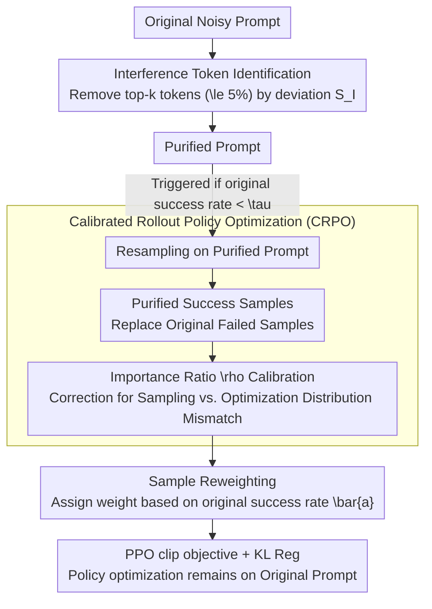

# LENS: Less Noise, More Voice — Reinforcement Learning for Reasoning via Instruction Purification

**Conference**: ACL 2026  
**arXiv**: [2601.21244](https://arxiv.org/abs/2601.21244)  
**Code**: [https://github.com/RUCBM/LENS](https://github.com/RUCBM/LENS)  
**Area**: Reinforcement Learning / LLM Reasoning  
**Keywords**: RLVR, interference tokens, instruction purification, rollout efficiency, reasoning enhancement

## TL;DR

LENS discovers that many exploration failures in RLVR are not due to task difficulty but are caused by a small portion (<5%) of interference tokens in the prompt. By identifying and removing these tokens to improve rollout success rates and transferring learning signals from purified rollouts to policy optimization on the original noisy prompts, LENS achieves an average improvement of 3.88% and a 1.6x acceleration.

## Background & Motivation

**Background**: RLVR (e.g., GRPO) has significantly enhanced LLM reasoning capabilities. However, it faces a core challenge in complex tasks: correct rollouts are extremely rare, leading to a lack of positive samples and resulting in low training efficiency or training collapse.

**Limitations of Prior Work**: Existing strategies generally follow two paths—(1) scaling exploration (increasing the number of rollouts), which incurs high computational costs without improving efficiency; (2) filtering zero-variance prompts (skipping prompts that fail completely), which sacrifices exploration of difficult samples. Neither addresses the root cause of exploration failure.

**Key Challenge**: Low-success-rate prompts contain valuable training signals, but current methods either ignore them (via filtering) or inefficiently brute-force them (via massive rollout expansion).

**Goal**: Identify the root cause of exploration failure and design targeted solutions to improve rollout efficiency without increasing computational overhead.

**Key Insight**: Fine-grained token-level analysis reveals that failures are often caused by a few tokens introducing excessive interference—these tokens push the policy too far from the reference model in the token space. Simply removing these tokens can increase the rollout accuracy of failed prompts by over 20%.

**Core Idea**: A few interference tokens in the prompt are the primary cause of exploration failure. The approach first "purifies" the prompt to obtain successful rollouts, then "transfers" the learning signals back to the original prompt, teaching the model to ignore interference rather than relying on the purified environment.

## Method

### Overall Architecture

The starting point for LENS is a counter-intuitive observation: many rollout failures in RLVR do not stem from the difficulty of the problem, but from a small amount (<5%) of "interference tokens" in the prompt that mislead the policy. LENS operates in two stages: first, it **identifies and removes** these interference tokens to obtain a "purified prompt," enabling prompts that previously failed to sample successful rollouts; second, it uses **Calibrated Rollout Policy Optimization (CRPO)** to transfer the learning signals from these purified rollouts back to the original (noisy) prompt for policy optimization. The core objective is to ensure the model learns to "reason correctly even in the presence of noise" rather than only performing well in clean environments.

### Key Designs

**1. Interference Token Identification: Locating "Troublemaking Tokens" via Deviation from the Reference Model**

To purify a prompt, one must identify which tokens to remove. LENS defines the interference score of each token as the absolute difference between the log-probabilities of the current policy and the reference model at that position:

$$S_I(s,a)=\big|\log\pi_\theta(a|s)-\log\pi_{\text{ref}}(a|s)\big|$$

The reference model represents a stable distribution baseline learned from training data. A high score suggests that the token pushes the policy too far from the reference distribution in terms of KL divergence, often due to reward over-optimization or inherent noise/misleading signals. By deleting the top $k=\lceil\gamma\cdot|x_i|\rceil$ tokens (where $\gamma$ is 1%–5%) in descending order of interference scores, a purified prompt is obtained. This simple act of "deleting <5% of tokens" can improve the rollout accuracy of failed prompts by over 20%.

**2. Calibrated Rollout Policy Optimization (CRPO): Transferring Success Signals from Clean Environments to Noisy Prompts**

Training only on purified prompts amounts to "learning in a clean environment," which fails to generalize to real noisy environments. Therefore, the key is not replacing the training target with the purified prompt, but using it to salvage signals. CRPO acts only on low-success-rate prompts (success rate $<\tau$): it resamples on the purified prompt, and if the success rate indeed improves, it replaces an equivalent number of failed samples in the original rollouts with successful purified ones. Crucially, all policy optimization is still performed on the **original prompt**, using an importance ratio:

$$\rho(y;\theta)=\frac{\pi_\theta(y|x_i)}{\tilde{w}(y)\,\pi_{\text{old}}(y|x^{\text{roll}}(y))}$$

This ratio corrects the distribution mismatch between "sampling from a purified prompt" and "optimizing on the original prompt." Consequently, the model is forced to learn correct reasoning under interference, essentially teaching it to "ignore interference" rather than rely on purification.

**3. Sample Reweighting: Dynamically Allocating Influence Between Original and Purified Signals**

After replacement, the reliability of original successful samples and purified successful samples is not equal. LENS uses the original success rate $\bar{a}_i$ as a scaling factor: original successful samples are weighted by $\bar{a}_i$, while purified successful samples and unreplaced failed samples are weighted by $1-\bar{a}_i$. The intuition is clear—rely more on purified signals when the original success rate is low, and maintain the dominance of original samples when the original success rate is high. Optimization is conducted using a PPO-style clipped objective with KL regularization.

### Loss & Training

The PPO-style clipped objective function is: $\mathcal{L}(\theta) = -\sum_{y} \min(\rho(y;\theta)\hat{A}(y), \text{clip}(\rho, 1-\epsilon, 1+\epsilon)\hat{A}(y)) + \beta D_{\text{KL}}$. Advantages are calculated using a group-relative method on the reconstructed rollout set.

## Key Experimental Results

### Main Results

**Math Reasoning Benchmarks Pass@1 (Llama3.2-3B-Instruct)**

| Method | MATH | Olympiad | AIME24 | Avg (7 benchmarks) |
|------|------|----------|--------|-------------------|
| + GRPO | 51.60 | 44.68 | 6.25 | 23.98 |
| + DAPO | 53.00 | 47.01 | 9.79 | 25.32 |
| + GRPO_extended | 51.20 | 44.68 | 6.25 | 24.33 |
| + **LENS_GRPO** | **55.80** | **48.83** | **10.62** | **27.03** |

### Ablation Study

| Configuration | Key Metric | Description |
|------|---------|------|
| Full LENS | Optimal | Identification + Purification + CRPO |
| Purification Only (No CRPO) | Suboptimal | Model only learns in a clean environment |
| Random Deletion (instead of $S_I$) | Decline | Validates the effectiveness of the interference score |
| ~20% prompts benefit from deletion | — | Indicates the necessity of the CRPO conditional activation |

### Key Findings

- **Significant Reduction in Zero-Reward Prompts**: LENS reduces the proportion of zero-reward prompts on DeepMath from ~80% (GRPO) to ~40%.
- Deleting <5% of tokens can boost rollout accuracy of failed prompts by 20%+, validating the hypothesis that "a few tokens cause most failures."
- LENS reaches the performance of GRPO in only 60% of training steps, achieving a 1.6x acceleration.
- A 1.83% improvement was observed on four out-of-domain general reasoning benchmarks, suggesting that improved robustness is transferable.
- Compared to extending exploration (increasing rollouts) and prompt filtering, LENS achieves better performance with fewer computational resources.

## Highlights & Insights

- The discovery that "a few interference tokens lead to exploration failure" is counter-intuitive and compelling, opening a new perspective for RLVR research.
- The philosophy behind CRPO is elegant: instead of learning in a clean environment and expecting it to transfer to noise, it uses clean signals to calibrate learning in noisy environments, essentially teaching the model to "ignore interference."
- The definition of the interference score (deviation between policy and reference log-probabilities) is simple and efficient, requiring no additional models.

## Limitations & Future Work

- Validated only on 3B-4B scale models; performance on larger models (7B+) remains unknown.
- The interference score depends on the reference model; if the reference model is of low quality, it may lead to misidentification.
- The deletion ratio $\gamma$ requires manual tuning and may vary across datasets.
- Only approximately 20% of prompts show improved rollout accuracy after deletion; the conditional activation of CRPO limits the overall scope of impact.

## Related Work & Insights

- **vs. GRPO/DAPO**: LENS is a plug-and-play improvement that does not change the base RL algorithm but enhances rollout quality.
- **vs. Extended Exploration**: Scaling exploration increases computational cost without improving efficiency, whereas LENS improves efficiency without increasing cost.

## Rating

- Novelty: ⭐⭐⭐⭐⭐ The discovery of "interference tokens" and the "purification + transfer" solution provide entirely new perspectives.
- Experimental Thoroughness: ⭐⭐⭐⭐ Extensive baseline comparisons and ablations, though model scale coverage is limited.
- Writing Quality: ⭐⭐⭐⭐⭐ Clear motivation, precise methodology, and clear algorithmic pseudo-code.
- Value: ⭐⭐⭐⭐⭐ Provides a new approach and practical solution to the exploration efficiency problem in RLVR.

<!-- RELATED:START -->

## Related Papers

- [\[ICLR 2026\] Less is More: Clustered Cross-Covariance Control for Offline RL](../../ICLR2026/reinforcement_learning/less_is_more_clustered_cross-covariance_control_for_offline_rl.md)
- [\[ACL 2026\] ImpRIF: Stronger Implicit Reasoning Leads to Better Complex Instruction Following](imprif_stronger_implicit_reasoning_leads_to_better_complex_instruction_following.md)
- [\[NeurIPS 2025\] When Less Language is More: Language-Reasoning Disentanglement Makes LLMs Better Multilingual Reasoners](../../NeurIPS2025/reinforcement_learning/when_less_language_is_more_language-reasoning_disentanglement_makes_llms_better_.md)
- [\[ACL 2026\] Beyond Majority Voting: Towards Fine-grained and More Reliable Reward Signal for Test-Time Reinforcement Learning](beyond_majority_voting_towards_fine-grained_and_more_reliable_reward_signal_for_.md)
- [\[ACL 2026\] Adaptive Instruction Composition for Automated LLM Red-Teaming](adaptive_instruction_composition_for_automated_llm_red-teaming.md)

<!-- RELATED:END -->
