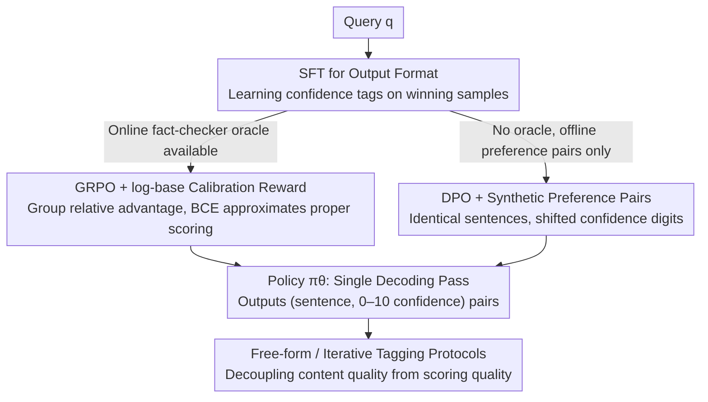

# LoVeC: Reinforcement Learning for Better Verbalized Confidence in Long-Form Generations

**Conference**: ACL 2026  
**arXiv**: [2505.23912](https://arxiv.org/abs/2505.23912)  
**Code**: https://github.com/caiqizh/LoVeC (Available)  
**Area**: LLM Calibration / RLHF / Hallucination Detection  
**Keywords**: Long-form Generation, Verbalized Confidence, GRPO, DPO, Factuality Calibration

## TL;DR
LoVeC trains LLMs to append a numerical `<confidence>` tag (0–10) after each sentence during long-form generation. Using GRPO (online, requiring an oracle fact-checker) or DPO (offline preference pairs), the model aligns these tags with factuality determined by GPT-4o. This enables single-pass decoding to output calibratable, machine-parseable confidence scores, outperforming the Prev. SOTA LUQ across Brier/ECE/Spearman metrics and achieving a 20x inference speedup.

## Background & Motivation

**Background**: Mainstream hallucination detection for long-form QA falls into two categories: sampling-based consistency methods (e.g., LUQ, SelfCheckGPT, requiring multiple samples and similarity comparisons) and GPT-based atomic claim scoring (Fadeeva 2024, Liu 2024). Both are post-processing methods dependent on external models, leading to high single-inference costs.

**Limitations of Prior Work**: 
1. Consistency methods require resampling 5–10 times per query, taking 1500+ seconds to process 792 items in the WildHallu test set on an A100.
2. Atomic-claim deconstruction relies on GPT-4 APIs, incurring high cost and latency.
3. While verbalized confidence is cheap, existing methods (e.g., LoGU, Linguistic Calibration) output natural language phrases like "I believe" or "70% uncertain," which are difficult for machines to parse or use for thresholding.
4. Most existing verbalized confidence work focuses on short-form QA, with a lack of systematic study at the sentence-level in long-form generation.

**Key Challenge**: A paragraph in long-form text contains multiple factual statements, and confidence should vary per sentence. However, SFT only learns token-level likelihood and cannot jointly optimize "sentence content" and "confidence digits" as a unified action. Furthermore, SFT lacks feedback for negative examples, failing to learn asymmetric costs like "preferring to say 'I don't know' over being confidently wrong."

**Goal**: To enable models to generate `<confidence> N </confidence>` numerical tags aligned with factuality while writing sentences in a single decoding pass, ensuring robustness across both in-domain (WildHallu) and out-of-domain (Bios / PopQA) settings.

**Key Insight**: Treat "writing a sentence + labeling confidence" as a sequential decision process. Use RL to perform credit assignment directly on the joint action (sentence, confidence) by rewarding the alignment between confidence and factuality, while using a log-base reward to heavily penalize overconfident errors.

**Core Idea**: Jointly optimize (s_i, c_i) using RL (GRPO + DPO) with a binary-cross-entropy log reward, producing both text and parseable numerical confidence in a single decoding pass.

## Method

### Overall Architecture

Given a query $q$, the policy $\pi_\theta$ outputs sentence-confidence pairs $y=\{(s_1,c_1),\dots,(s_n,c_n)\}$, where $c_i\in\{0,1,\dots,10\}$. Training involves two steps: (1) 1 epoch of SFT on winning samples $y_w$ to teach the `<confidence>N</confidence>` format; (2) 1 epoch of RL using GRPO (with a fact-checker oracle) or DPO (with offline preference pairs). LoRA is used to fine-tune q/k/v/o_proj (< 1% parameters). Two evaluation protocols are established: free-form tagging (simultaneous output of answer and confidence) and iterative tagging (predicting confidence for fixed sentences for fair comparison).

### Key Designs

**1. GRPO + log-base Calibration Reward: Formulating confidence as group relative advantage for proper scoring**

For numerical confidence to reflect factuality, the reward function must be a proper scoring rule; otherwise, the model only learns ranking without calibration. LoVeC normalizes $c_i, f_i$ to $[0,1]$ and defines the confidence reward as:

$$r_{\mathrm{conf}} = \lambda\cdot \frac{1}{n}\mathbf{1}^\top\left(1+\frac{f\odot\log c + (1-f)\odot\log(1-c)}{R_{\max}}\right)$$

This is essentially the negative BCE, combined with informativeness and format sub-rewards. It penalizes "high confidence but factual error" with values approaching $-\infty$, forcing calibration. GRPO is used for optimization: $G$ trajectories $\{y_j\}$ are sampled per query, and group-mean normalized advantages $\hat A_j=\frac{r_j-\mathrm{mean}(r)}{\mathrm{std}(r)}$ are calculated (eliminating the critic and saving memory). The objective is:

$$L_{\mathrm{GRPO}}(\theta) = -\mathbb{E}\Big[\tfrac{1}{G}\textstyle\sum_j\big(\hat A_j(\pi_\theta,\pi_{\mathrm{old}}) - \beta D_{\mathrm{KL}}[\pi_\theta\|\pi_{\mathrm{ref}}]\big)\Big]$$

A reward stretching factor $\gamma=1.5$ ($r\leftarrow\mathrm{sign}(r)|r|^\gamma$) is applied to amplify the difference between samples.

**2. DPO + Synthetic Preference Pairs: Offline preference learning without an online fact-checker**

Since GRPO requires frequent fact-checker calls during training, offline scenarios necessitate moving oracle calls to the data construction phase. For each query $(q,E)$, a base model generates plain text $y_{\mathrm{base}}=\{s_1,\dots,s_n\}$, and fact labels $f_j$ are calculated via GPT-4o + retrieval. Winning sets $y_w=\{(s_j,f_j)\}$ and losing sets $y_l=\{(s_j,c'_j)\}$ are constructed, where $c'_j$ is sampled uniformly from $\{0,\dots,10\}\setminus\{f_j\}$. By keeping sentences identical and only varying confidence, the model is forced to focus on "how to score" rather than "how to write," preventing language ability degradation. The standard DPO loss is used:

$$L_{\mathrm{DPO}}=-\mathbb{E}\log\sigma\Big(\beta\log\tfrac{\pi_\theta(y_w|q)}{\pi_{\mathrm{SFT}}(y_w|q)} - \beta\log\tfrac{\pi_\theta(y_l|q)}{\pi_{\mathrm{SFT}}(y_l|q)}\Big)$$

**3. Free-form vs. Iterative Tagging Protocols: Separating content quality from scoring accuracy**

Existing verbalized methods generate varying content, making BS/ECE comparisons difficult. Free-form tagging allows the model to generate $y_t=\arg\max_{y_t}\pi_\theta(y_t|y_{<t},q)$ along with `<confidence>`, reflecting real-world use. Iterative tagging fixes the sentences $\{s_1,\dots,s_n\}$ from a base model, and the policy only predicts $c_i=\arg\max_c\pi_\theta(\{q,(s_1,c_1),\dots,(s_{i-1},c_{i-1}),s_i\},c)$. Decoupling content variation allows for a pure comparison of scoring accuracy.

### Loss & Training
- SFT is performed on $y_w$ for formatting. GRPO/DPO uses LoRA (default rank, q/k/v/o_proj) with AdamW. Total training time was 1500 GPU hours on 8×A100s. GRPO uses reward stretching ($\gamma=1.5$) and a $0.15\times$ correctness bonus to prevent the model from always saying "I don't know."
- Backbones: Llama-3-8B-Instruct and Gemma-2-9B-It. Metrics include Brier Score (BS), ECE-M (soft label version), and Spearman Correlation (SC) to cover both calibration and ranking.

## Key Experimental Results

### Main Results (Llama-3-8B-Instruct, iterative + free-form)

| Dataset | Method | BS↓ | ECE-M↓ | SC↑ |
|---|---|---|---|---|
| WildHallu | LUQ (Prev. SOTA) | 14.5 | 21.5 | 56.8 |
| WildHallu | LoVeC-GRPO (iter) | **5.7** | **2.5** | 57.0 |
| WildHallu | LoVeC-DPO (iter) | 6.0 | 5.0 | **60.4** |
| Bios | LUQ | 20.0 | 29.5 | 63.8 |
| Bios | LoVeC-GRPO (iter) | **8.5** | **4.2** | 64.7 |
| Bios | LoVeC-DPO (iter) | 9.0 | 7.3 | **65.6** |
| PopQA | LUQ | 16.7 | 23.2 | 62.5 |
| PopQA | LoVeC-DPO (iter) | **9.6** | **1.7** | **63.1** |

BS / ECE-M were halved across all datasets, with SC showing slight gains. Free-form trends were consistent with iterative results. For 792 items in WildHallu, LUQ took 1525s vs. LoVeC-iterative 64s (**~24× speedup**) and LoVeC-freeform 139s (~11× speedup).

### Ablation Study

| Configuration | BS↓ | ECE-M↓ | SC↑ | Note |
|---|---|---|---|---|
| LoVeC-GRPO Full (WildHallu) | 5.7 | 2.5 | 57.0 | Base |
| Log reward | 5.7 | 2.5 | 57.0 | Proper scoring rule |
| Linear/quadratic reward | ↑ | ↑ | ↓ | Calibration significantly worsens |
| DPO with GPT-4o oracle | 6.0 | 5.0 | 60.4 | Default |
| DPO with self-label | Slightly worse | Slightly worse | Slightly worse | Still superior to LUQ |
| SFT with regression loss | ↑ | ↑ | ↓ | All metrics degraded |
| Iterative without score context | ↑ | ↑ | ↓ | Removing local calibration anchors drops performance |

GRPO dynamics: Mean reward improved from 13.86 to 29.83 (5667 steps / 1 epoch), while ECE-M dropped from 15.2 to 2.5, indicating no reward collapse.

### Key Findings
- The advantage of RL over SFT is not just the surface score but the token ranking structure: In GRPO next-token prediction, top-15 tokens are monotonic (e.g., `10,9,8...` for correct facts or `2,3,4...` for errors), while SFT is disordered. This "calibrated probability distribution" is the inductive bias RL injected.
- Removing the GPT-4o oracle (using self-labeled DPO) still beats LUQ, suggesting robustness to oracle strength.
- Complementarity: Simple averaging of LoVeC-DPO and LUQ increases Spearman Correlation by +5 points, indicating verbalized and sampling signals are orthogonal.
- Competitive zero-shot transfer on short-form TriviaQA, suggesting RL learns the general skill of mapping likelihood to digits.

## Highlights & Insights
- Redefining long-form confidence as sentence-level digits optimized via RL avoids expensive atomic-claim extraction and multiple decoding passes, making it highly practical.
- Log reward transforms calibration into proper scoring; combined with reward stretching and correctness bonuses, it provides a "non-symmetric + anti-hacking" reward engineering paradigm.
- The DPO preference pair construction (matching sentences, varying confidence) isolates the scoring task, preventing degradation of language capabilities.
- The dual-protocol evaluation (Free-form vs. Iterative) decouples content and scoring quality, serving as a template for evaluating trustworthy AI in long-form text.

## Limitations & Future Work
- Only applicable to white-box models (requires LoRA + RL); cannot be easily deployed for closed API-only models.
- Only accounts for factuality, not covering consistency, toxicity, or creativity calibration.
- Sentence-level granularity may be too coarse when a sentence contains conflicting facts; future work could explore sub-sentence or atomic-claim levels.
- Reward training relies on GPT-4o fact-checks, potentially inheriting its biases.
- Has not been verified in other long-form tasks like code generation or translation; effectiveness in high-stakes fields (Medical/Legal) is unknown.

## Related Work & Insights
- **vs LUQ (Zhang 2024a)**: LUQ relies on 5–10 samples and consistency aggregation; LoVeC is a single-pass verbalized method. LoVeC shifts the computational burden to the training phase, resulting in zero extra inference overhead.
- **vs LoGU (Yang 2025a) / Linguistic Calibration (Band 2024)**: These use natural language phrases which are hard to parse. LoVeC uses `0–10` tags for direct machine interpretability and thresholding.
- **vs RewardingDoubt / SaySelf**: These use RL but are limited to short-form tasks; LoVeC is the first to scale RL calibration to long-form with both GRPO and DPO solutions.

## Rating
- **Novelty**: ⭐⭐⭐⭐ First systematic RL-based sentence-level verbalized confidence for long-form text; original dual-protocol evaluation.
- **Experimental Thoroughness**: ⭐⭐⭐⭐ 3 datasets, multiple models, multiple RL algorithms, and 6+ ablation studies on reward forms and oracles.
- **Writing Quality**: ⭐⭐⭐⭐ Detailed motivation and vivid analysis of the RL normalization effect via token ranking.
- **Value**: ⭐⭐⭐⭐ 20× speedup with significant calibration gains is highly attractive for production; the reward design and preference construction are reusable paradigms.

<!-- RELATED:START -->

## Related Papers

- [\[ACL 2026\] UniCreative: Unifying Long-form Logic and Short-form Sparkle via Reference-Free Reinforcement Learning](unicreative_unifying_long-form_logic_and_short-form_sparkle_via_reference-free_r.md)
- [\[ACL 2026\] ImpRIF: Stronger Implicit Reasoning Leads to Better Complex Instruction Following](imprif_stronger_implicit_reasoning_leads_to_better_complex_instruction_following.md)
- [\[ICML 2026\] CAMEL: Confidence-Gated Reflection for Reward Modeling](../../ICML2026/reinforcement_learning/camel_confidence-gated_reflection_for_reward_modeling.md)
- [\[ACL 2026\] A Goal Without a Plan Is Just a Wish: Efficient and Effective Global Planner Training for Long-Horizon Agent Tasks (EAGLET)](a_goal_without_a_plan_is_just_a_wish_efficient_and_effective_global_planner_trai.md)
- [\[ICLR 2026\] LoongRL: Reinforcement Learning for Advanced Reasoning over Long Contexts](../../ICLR2026/reinforcement_learning/loongrl_rl_for_reasoning_long_contexts.md)

<!-- RELATED:END -->
