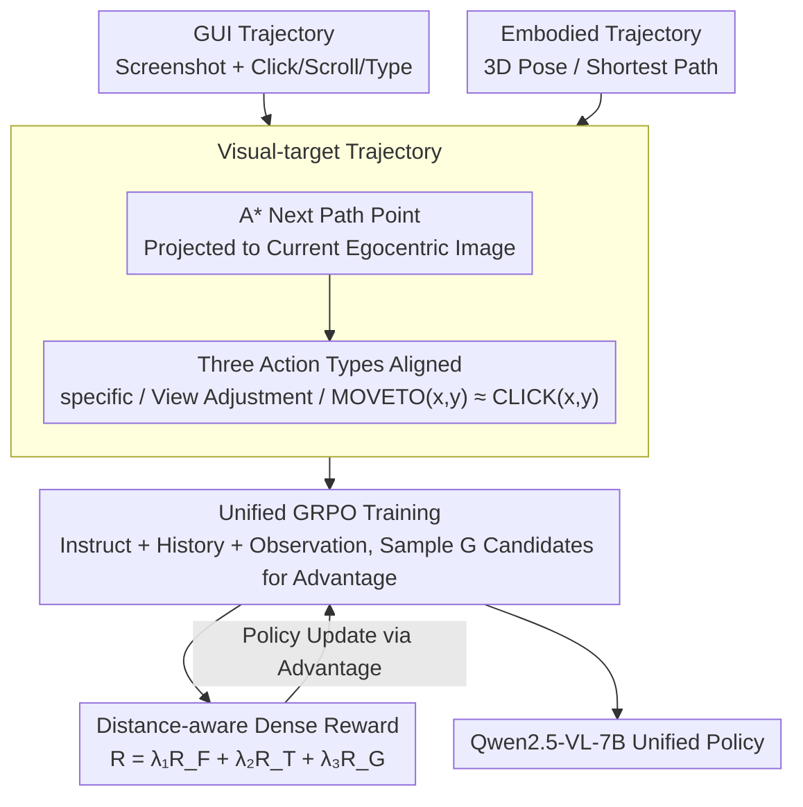

# NaviMaster: Learning a Unified Policy for GUI and Embodied Navigation Tasks

**Conference**: ACL2026  
**arXiv**: [2508.02046](https://arxiv.org/abs/2508.02046)  
**Code**: https://iron-boyy.github.io/navimaster-page/  
**Area**: Reinforcement Learning / Multimodal Agents / GUI Navigation / Embodied Navigation  
**Keywords**: Unified Navigation Policy, GUI Agent, Embodied Navigation, GRPO, Dense Reward

## TL;DR
NaviMaster reformulates both GUI operations and embodied navigation into a unified MDP of "visual target localization + action execution." It trains a Qwen2.5-VL-7B policy using GRPO on mixed trajectories with distance-aware dense rewards, outperforming single-domain training and mainstream baselines in OOD GUI tasks, spatial affordance prediction, and ObjectNav.

## Background & Motivation
**Background**: Both GUI and embodied navigation agents leverage multimodal large models for "image perception, instruction understanding, and next-step planning." GUI agents focus on operations like clicking, scrolling, and typing in mobile, web, and desktop interfaces, while embodied agents focus on actions like turning, moving forward, and stopping for robots or simulators in 3D environments. While these tasks appear distinct, both require the model to decide the next action based on current first-person observations, action history, and natural language instructions.

**Limitations of Prior Work**: Existing training systems are largely decoupled. GUI models are typically trained via SFT or RFT on datasets like GUI-Odyssey, AITW, and OmniAct, while embodied models learn spatial localization and navigation on Matterport, Habitat, or RoboPoint. This leads to two issues: first, maintaining two separate models for training and deployment prevents the reuse of cross-task visuospatial capabilities; second, models easily learn shortcut correlations within single datasets, leading to insufficient generalization on OOD benchmarks.

**Key Challenge**: The primary difference between GUI and embodied navigation is not the "need for navigation" but the representation of the action space. GUI actions center on explicit coordinates, such as clicking a pixel point, while embodied navigation involves implicit movements like moving forward or turning. As long as action spaces are unaligned, mixed training treats the two tasks as a loose collection rather than a unified policy problem.

**Goal**: The authors aim to answer three questions: can GUI and embodied navigation be unified into the same trajectory representation; can both tasks be optimized simultaneously within the same RL framework; and can effective learning signals be provided for rollouts that predict coordinates near the target but fail binary reward criteria?

**Key Insight**: The paper views both tasks through the lens of an MDP: states are current first-person visual observations, actions are interactions with the interface or environment, and the next state is determined by the current state and action. Furthermore, both require accumulating historical information from egocentric observations to form an implicit allocentric spatial understanding. Consequently, the authors focus on "visual targets," rewriting embodied forward movement as point localization within the image.

**Core Idea**: Use explicit visual targets to rewrite the embodied MOVEFORWARD action as $\text{MOVETO}(x, y)$. This allows GUI clicking and embodied movement to share a pixel-level grounding representation, enabling the training of a unified navigation policy using GRPO with distance-aware rewards on mixed data.

## Method
The core of NaviMaster is not merely concatenating GUI and robotic data but transforming both into comparable trajectories for training under a single reinforcement learning objective. The method follows three steps: first, constructing visual-target trajectories by formatting steps as "observe, think, action"; second, treating each trajectory step as a GRPO training sample where the model outputs the next action; third, using a combination of format, action type, and coordinate distance rewards to ensure the model follows output protocols and achieves precise localization.

### Overall Architecture
The input consists of a long-term task trajectory containing user instructions $I$, step-wise observations $o_i$, and actions $a_i$. For GUI trajectories, existing data naturally contains screenshots and click/scroll/type actions, which are converted to the unified format. For embodied navigation, where original data involves 3D poses or shortest paths, the authors use A* to obtain path points and project the next path point onto the current first-person image to generate visual targets similar to GUI click coordinates.

During training, each sample comprises the instruction $I$, history $H_i=\{(t_0,a_0),...,(t_{i-1},a_{i-1})\}$, and current observation $o_i$. The model outputs in a `<think>...</think><answer>...</answer>` format, where the answer is executable JSON. Depth maps for GUI images are set to zero matrices, while embodied images utilize depth maps to constrain spatial grounding, preventing points that are close in 2D but far in depth from being treated as equivalent.

### Key Designs

**1. Visual-target Trajectory: Aligning Action Spaces**

GUI clicking and embodied movement seem distinct—one outputs pixel coordinates, the other "forward/turn" commands. NaviMaster aligns all actions into three categories: semantic-fixed specific actions (BACK for GUI, STOP for embodied), view adjustment actions (SCROLL for GUI, TURN for embodied), and localization actions. The critical reformulation is in the third category: GUI remains $\text{CLICK}(x,y)$, while embodied MOVEFORWARD is rewritten as $\text{MOVETO}(x,y)$, with coordinates derived from the projection of the next 3D path point onto the current camera image.

This transformation allows cross-domain data synergy: while embodied data provides training signals for spatial localization needed by GUI, GUI data trains affordance localization for embodied tasks, creating a stronger unification than simply merging action vocabularies.

**2. Unified GRPO Training with Historical Thought: Learning Cross-task Policies on Mixed MDPs**

Single-domain RL often overfits to task-specific action biases. NaviMaster performs reinforcement learning directly on mixed GUI and embodied samples. At each step, the model observes the current image, instruction, and thought-action history, sampling $G$ candidate responses. GRPO calculates the group relative advantage $Adv=(R(i,j)-mean(R))/std(R)$, where $R(i,j)$ is the quality of the candidate relative to the ground truth.

The process follows an R1-Zero style, bypassing a separate SFT stage for "gold answers" and instead learning directly from sampled responses. Exposing the policy to a diverse set of MDPs forces it to learn generalized visual object permanence, relative spatial relationships, and affordance grounding.

**3. Distance-aware Dense Reward: Mitigating Sparse Binary Grounding**

Methods like UI-R1 often use binary rewards—if a predicted point misses the target region, the reward is 0. In continuous coordinate spaces, this leaves many "close-miss" rollouts without gradient signals. NaviMaster defines the total reward as a weighted sum of format, action type, and grounding: $R=\lambda_1R_F+\lambda_2R_T+\lambda_3R_G$. $R_F$ checks if the output is parseable, $R_T$ checks the action category, and $R_G$ decays based on the distance between predicted and ground-truth points: $R_G=(1-d_j/\theta_d)[d_j<\theta_d,p_j<\theta_h]$, where $d_j$ is pixel distance and $p_j$ is depth difference.

Dense rewards rank failed samples, informing the model that being "near" the target is better than being "far," which makes the GRPO relative advantages more informative and accelerates training. The depth term is crucial for embodied tasks to avoid treating two 2D projections as equivalent if they have significant depth differences.

### Loss & Training
The base model is Qwen2.5-VL-7B, and the training framework uses EasyR1. The main experiment runs for 3 epochs on 8 NVIDIA A800 GPUs, with a global batch size of 128, a learning rate linearly decayed from $1e-6$ to 0, a KL coefficient of 0.01, `num_generations=5`, a maximum prompt length of 7000, and a maximum response length of 1024. Reward weights are set to $\lambda_1=0.1, \lambda_2=1, \lambda_3=1$.

The total training data is 20k, with 10k GUI samples from GUI-Odyssey and 10k embodied samples from Matterport 3D and RoboPoint. GUI sub-sampling maintains the original action distribution of GUI-Odyssey (173k) to preserve proportions of CLICK, SCROLL, and TYPE actions. Trajectories exceeding 7000 tokens are truncated from the earliest history steps.

## Key Experimental Results
Experiments cover three capabilities: GUI navigation, spatial affordance prediction, and embodied navigation. Metrics include grounding rate (GR), step success rate (SR) for GUI, mask-hit rate for affordance, and SR/SPL for ObjectNav.

### Main Results

| Task / Dataset | Metric | NaviMaster | Strong Baseline | Gain / Observation |
|--------|------|------|----------|------|
| GUI AC-Low | SR | 69.46 | UI-Shift 73.38 / GUI-R1 66.52 | Slightly below UI-Shift, but beats GUI-R1 in OOD mixed settings |
| GUI AC-High | SR | 55.89 | UI-Shift 52.16 / GUI-R1 51.56 | Higher than mainstream RL GUI agents in OOD settings |
| GUI AITW | SR | 59.72 | GUI-R1 55.31 / UI-Shift 54.38 | Maintains strong generalization on mobile tasks |
| GUI Llamatouch | SR | 67.39 | UI-AGILE 66.10 / GUI-R1 61.27 | Highest success rate for advanced operations |
| GUI GuiAct-W | SR | 86.17 | UI-Shift 79.43 / GUI-R1 74.54 | Significant advantage in Web grounding and action SR |
| GUI OmniAct-D | SR | 62.47 | UI-AGILE 59.35 / GUI-R1 57.70 | Migratable to desktop tasks |
| Odyssey In-domain | SR | 48.35 | Ours w/o Embodied 46.38 | Embodied data slightly improves GUI source domain performance |

| Task / Dataset | Metric | NaviMaster | Comparison | Conclusion |
|--------|------|------|----------|------|
| RoboReflT | SR | 77.34 | RoboPoint-13B 49.82 | Massive lead in object referring |
| Where2Place | SR | 52.97 | RoboPoint-13B 46.77 | Free-space referring benefits from mixed grounding |
| RoboSpatial | SR | 21.65 | RoboPoint-13B 19.70 | Slight lead in spatial relationship scenarios |
| RefSpatial | SR | 19.49 | Ours w/o GUI 18.19 / RoboPoint-13B 8.40 | GUI data aids generalization of spatial relationships |
| ObjectNav Unseen | SR | 33.20 | Qwen2.5-VL-7B 27.23 | Success rate increases by 5.97 points |
| ObjectNav Unseen | SPL | 12.60 | Qwen2.5-VL-7B 9.68 | Path efficiency scales simultaneously |

### Ablation Study

| Configuration | AC-High SR | AC-Low SR | Where2Place SR | RefSpatial SR | Note |
|------|---------|---------|---------|---------|------|
| NaviMaster | 55.89 | 69.46 | 52.97 | 19.49 | Main setting, 1:1 mix, dense reward |
| hard / sparse reward | 54.07 | 68.39 | 44.01 | 14.28 | Sparse reward significantly hurts embodied grounding |
| 7k samples | 52.66 | 70.41 | 41.07 | 18.19 | Trainable with less data, but spatial affordance drops |
| Affordance only | 52.34 | 68.94 | 52.04 | 19.67 | Strong for spatial localization, slightly weaker for GUI |
| Trajectory only | 52.44 | 69.37 | 47.99 | 16.49 | Good for nav flow, but worse than complete mix |

| Reward / Threshold | AC-High SR | AC-Low SR | Where2Place SR | RefSpatial SR | Note |
|------|---------|---------|---------|---------|------|
| Main (Absolute) | 55.89 | 69.46 | 52.97 | 19.49 | $\theta_d=200$ pixels, overall best |
| Relative | 53.61 | 67.56 | 51.99 | 18.48 | Prone to reward hacking at high res |
| $\theta_d=100$ | 55.06 | 69.85 | 48.88 | 19.48 | Excessive strictness reduces effective reward |

### Key Findings
- Mixed training is the primary source of gain. The complete NaviMaster outperforms "w/o GUI" or "w/o Embodied" overall, suggesting that GUI pixel grounding and embodied spatial affordance provide complementary supervision rather than interference.
- Reward densification is critical for embodied grounding. Hard rewards dropped SR from 52.97 to 44.01 on Where2Place, showing binary hits cannot efficiently train large-coordinate searches.
- 1:1 data ratio is optimal. Comparing ratios from 0:10 to 5:5 showed that the balanced mix yielded the highest average SR.
- Absolute thresholds are more stable. Choosing 200 pixels prevents reward hacking in high-resolution images; at 1280x720, this radius covers ~14% of the area, aligning with GUI community evaluation standards.

## Highlights & Insights
- The most clever aspect is transforming embodied "move forward" into "moving toward a specific point on the current image." This formulation places 3D navigation and 2D GUI clicking into the same grounding problem class.
- The paper goes beyond prompt-level unification to provide a closed-loop system of trajectory construction, action space, RL rewards, and benchmark evaluation.
- Dense rewards prove intuitively valuable: both GUI and embodied tasks feature large continuous coordinate spaces where binary rewards waste "near-miss" samples.
- Mixed training improvements are not just from data volume. The "visual-relation" benchmark shows the model is significantly better at relative localization (e.g., "the second button above X"), suggesting embodied data strengthens spatial reasoning.

## Limitations & Future Work
- Trajectory data still treats GUI and embodied as two distinct task types; it lacks real samples where a single trajectory interleaves GUI operations and physical navigation.
- Embodied actions depend on projection and depth estimation quality. If targets are occluded or camera noise is high, visual targets and training labels become noisy.
- While ObjectNav improved, SR (33.20) and SPL (12.60) still lag behind specialized systems, indicating a gap in long-term map memory and closed-loop motion control for unified VLM policies.
- Safety constraints and execution latency in real-world systems remain unverified. GUI agents on real systems still face privacy and safety risks.

## Related Work & Insights
- **vs UI-TARS**: While specialized GUI agents focus on large-scale UI SFT, NaviMaster focuses on cross-domain spatial generalization via shared RL frameworks.
- **vs UI-R1 / GUI-R1**: These utilize R1-style RL for GUI actions. NaviMaster extends this by replacing binary hits with distance-aware dense rewards and incorporating embodied navigation into the same system.
- **vs RoboPoint**: RoboPoint focuses on spatial affordance or vision-language adaptation. NaviMaster incorporates these into long-range navigation policies.

## Rating
- Novelty: ⭐⭐⭐⭐⭐ Clear formulation of visual-target navigation with integrated reward design.
- Experimental Thoroughness: ⭐⭐⭐⭐ Extensive coverage of GUI, affordance, and ObjectNav, though real-system validation is pending.
- Writing Quality: ⭐⭐⭐⭐ Clear logic; some large tables could use more granular trend analysis in the text.
- Value: ⭐⭐⭐⭐⭐ Highly insightful for general multimodal agents, particularly the route of mapping different interaction paradigms to a unified grounding representation for RL.

<!-- RELATED:START -->

## Related Papers

- [\[ICCV 2025\] Embodied Navigation with Auxiliary Task of Action Description Prediction](../../ICCV2025/reinforcement_learning/embodied_navigation_with_auxiliary_task_of_action_description_prediction.md)
- [\[ACL 2026\] Targeted Exploration via Unified Entropy Control for Reinforcement Learning](targeted_exploration_via_unified_entropy_control_for_reinforcement_learning.md)
- [\[ACL 2026\] KASER: Knowledge-Aligned Student Error Simulator for Open-Ended Coding Tasks](kaser_knowledge-aligned_student_error_simulator_for_open-ended_coding_tasks.md)
- [\[ACL 2026\] Visually-Guided Policy Optimization for Multimodal Reasoning](visually-guided_policy_optimization_for_multimodal_reasoning.md)
- [\[AAAI 2026\] InfiGUI-G1: Advancing GUI Grounding with Adaptive Exploration Policy Optimization](../../AAAI2026/reinforcement_learning/infigui-g1_advancing_gui_grounding_with_adaptive_exploration_policy_optimization.md)

<!-- RELATED:END -->
