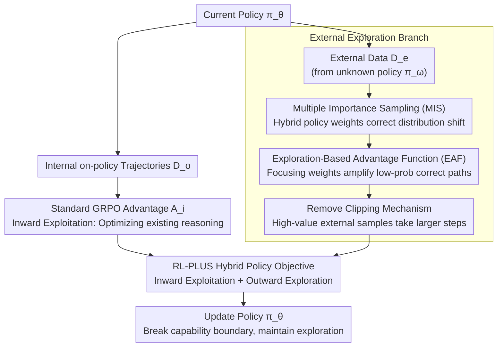

# RL-PLUS: Countering Capability Boundary Collapse of LLMs in Reinforcement Learning with Hybrid-policy Optimization

**Conference**: ACL 2026  
**arXiv**: [2508.00222](https://arxiv.org/abs/2508.00222)  
**Code**: [GitHub](https://github.com/YihongDong/RL-PLUS)  
**Area**: LLM Reasoning / Reinforcement Learning  
**Keywords**: Capability Boundary Collapse, Hybrid-policy Optimization, Multiple Importance Sampling, Exploration Advantage Function, RLVR

## TL;DR

RL-PLUS proposes a hybrid-policy optimization method that addresses external data distribution mismatch through Multiple Importance Sampling (MIS) and guides the model to learn low-probability but correct reasoning paths via the Exploration-based Advantage Function (EAF). It successfully breaks the capability boundary collapse caused by RLVR, achieving SOTA (average 53.4) across six mathematical reasoning benchmarks and consistent improvements across models by up to 69.2%.

## Background & Motivation

**Background**: Reinforcement Learning based on Verifiable Rewards (RLVR, such as GRPO/DAPO) has significantly improved the complex reasoning capabilities of LLMs by rewarding correct answers to optimize long-chain reasoning.

**Limitations of Prior Work**: RLVR is inherently an on-policy strategy—the model can only learn from trajectories it generates itself. This leads to the "capability boundary collapse" problem: while pass@1 improves, pass@128 actually drops below the base model. In other words, RLVR makes the model better at selecting known correct paths (inward exploitation) but narrows the range of problems it can solve (capability boundary). Simultaneously, policy entropy drops sharply (entropy collapse), and the model becomes overly deterministic.

**Key Challenge**: RLVR cannot effectively guide models to explore new reasoning paths (outward exploration) within the massive action space of LLMs and under sparse rewards. SFT can introduce external knowledge but is poor at internalizing reasoning principles. Simple combinations, such as GRPO with SFT Loss, paradoxically result in performance degradation.

**Goal**: Design an effective RLVR method that integrates external data and internal exploration to break the capability upper bound of the base model.

**Key Insight**: Drawing from Confucius's observation "learning without thought is labor lost; thought without learning is perilous"—current RLVR represents "thought without learning" (relying solely on self-reasoning). It is necessary to effectively "learn" external knowledge during the RL process. The critical challenges are: (1) how to handle the distribution mismatch of external data, and (2) how to efficiently extract new knowledge from external data.

**Core Idea**: Use a hybrid policy (internal on-policy trajectories + external data) for reinforcement learning, stabilizing off-policy updates through MIS and amplifying learning signals for low-probability correct paths via EAF.

## Method

### Overall Architecture

The training objective of RL-PLUS fuses two components: $\mathcal{J}_{\text{RL-PLUS}} = \underbrace{\mathbb{E}_{(o_i, A_i) \sim \mathcal{D}_o}[r_{i,t}(\theta) A_i]}_{\text{Inward Exploitation}} + \underbrace{\mathbb{E}_{(e_i, A_{i,t}^c) \sim \mathcal{D}_e}[r_{i,t}^m(\theta) A_{i,t}^c]}_{\text{Outward Exploration}}$. The first term is standard GRPO (optimizing existing reasoning capabilities), while the second term is the core innovation (learning new knowledge from external data), utilizing MIS to correct distribution shifts and EAF to focus on low-probability correct paths. Overall, the current policy simultaneously generates internal on-policy trajectories and samples external data. The former utilizes the standard GRPO channel for exploitation, while the latter injects external knowledge through MIS, EAF, and the removal of clipping mechanisms, merging both into a unified objective for policy updates.

### Key Designs

**1. Multiple Importance Sampling (MIS): Stabilizing external data in off-policy updates**

External data originates from an unknown policy $\pi_\omega$, which does not match the distribution of the current policy $\pi_\theta$. Standard on-policy IS introduces systematic bias (Lemma A.5), while direct off-policy IS suffers from excessive variance (Lemma A.7). MIS addresses this by treating external samples as if they originate from a mixture policy $\pi_\omega+\pi_{\theta_{old}}$. The importance weight is formulated as $r_{i,t}^m(\theta)=\frac{2\pi_\theta(e_{i,t}|q,e_{i,<t})}{\pi_\omega(e_{i,t}|q,e_{i,<t})+\pi_{\theta_{old}}(e_{i,t}|q,e_{i,<t})}$. For the unknown $\pi_\omega$, a Bayesian optimal estimate $\hat{\pi}_\omega^*=\frac{1}{2}\pi_{\theta_{old}}+\frac{1}{2}\mathcal{U}$ is adopted (an equal mixture of the old policy and a uniform distribution), minimizing L2 risk under maximum uncertainty.

This provides a compromise of low bias and low variance: even if $\pi_\omega$ and $\pi_\theta$ differ significantly, the presence of $\pi_{\theta_{old}}$ in the denominator stabilizes the weights and prevents explosion, allowing external data to be injected into the gradient without destabilizing training.

**2. Exploration-Based Advantage Function (EAF): Amplifying correct but low-probability reasoning paths**

New knowledge is often hidden in low-probability tokens that the model avoids, while models naturally lean towards high-probability tokens (existing knowledge). Thus, stabilizing external data is insufficient; the model must be explicitly forced to "see" these neglected paths. EAF multiplies the standard normalized advantage by a focusing weight: $A_{i,t}^c=\frac{R_i-\text{mean}(R)}{\text{std}(R)}\cdot C_{i,t}$, where $C_{i,t}=(1-\text{detach}(\pi_\theta(e_{i,t}|q,e_{i,<t})))^\gamma$.

Inspired by Focal Loss, when the model assigns a low probability to a correct token (indicating a failure to explore that path), $C_{i,t}$ increases to amplify the advantage signal for that path, forcing the model to prioritize learning these new reasoning methods. Conversely, no extra weight is added to already mastered high-probability tokens.

**3. Remove Clipping Mechanism: Allowing larger steps for high-value external data**

Standard GRPO uses $\text{clip}(r_t,1-\epsilon,1+\epsilon)$ to limit update magnitudes, but this directly conflicts with outward exploration. Low-probability events (new knowledge) are precisely what should be optimized with larger steps; clipping suppresses the learning signals from these high-information paths. Consequently, RL-PLUS removes clipping for the external data term, permitting the policy to make bolder updates based on high-value external samples.

### Loss & Training

The model is trained based on Qwen2.5-Math-7B using NuminaMath-1.5 as training data (containing external data). The KL regularization term is omitted (as policies need to deviate significantly from the initial policy in long CoT reasoning scenarios).

## Key Experimental Results

### Main Results

**Six Mathematical Reasoning Benchmarks (Qwen2.5-Math-7B)**

| Method | AIME24 | AIME25 | AMC | MATH-500 | Minerva | Olympiad | Average |
|------|--------|--------|-----|----------|---------|----------|------|
| Base Model | 11.5 | 4.9 | 31.3 | 43.6 | 7.4 | 15.6 | 19.0 |
| GRPO | 25.1 | 15.3 | 62.0 | 84.4 | 39.3 | 46.8 | 45.5 |
| LUFFY | 29.4 | 23.1 | 65.6 | 87.6 | 37.5 | 57.2 | 50.1 |
| SFT+GRPO | 25.8 | 23.1 | 62.7 | 87.2 | 39.7 | 50.4 | 48.2 |
| **RL-PLUS** | **33.4** | **25.9** | **68.1** | **90.2** | **43.8** | **58.8** | **53.4** |

**OOD Tasks (Coding + Science QA)**

| Method | HumanEval | LeetCode | LiveCodeBench | ARC-c | GPQA | MMLU-Pro | Average |
|------|-----------|----------|---------------|-------|------|----------|------|
| GRPO | 63.4 | 21.1 | 15.3 | 81.7 | 40.4 | 47.5 | 44.9 |
| SFT+GRPO | 59.8 | 8.3 | 9.7 | 72.4 | 24.2 | 37.7 | 35.4 |
| **RL-PLUS** | **68.3** | **27.8** | **19.2** | **82.3** | **40.4** | **54.7** | **48.8** |

### Ablation Study

| Method | AIME24 | AIME25 | AMC | MATH-500 | Minerva | Olympiad | Average |
|------|--------|--------|-----|----------|---------|----------|------|
| RL-PLUS (Full) | **33.4** | **25.9** | **68.1** | **90.2** | **43.8** | **58.8** | **53.4** |
| - EAF | 28.3 | 24.1 | 67.8 | 88.8 | 40.4 | 56.0 | 50.9 |
| - MIS | 25.1 | 15.3 | 62.0 | 84.4 | 39.3 | 46.8 | 45.5 |

### Key Findings

- MIS is the more critical component (removing it results in a 7.9-point drop vs. 2.5 points for EAF), indicating that the stable introduction of external data is foundational.
- RL-PLUS achieves an absolute gain of 11.9 points on LLaMA-3.1-8B (where GRPO is nearly ineffective), demonstrating strong generalization.
- Pass@k curves show that RL-PLUS consistently outperforms the base model across all k values, proving a true breakthrough in the capability boundary.
- GRPO with SFT Loss is actually worse than GRPO alone (40.1 vs. 45.5), indicating that simple fusion of external knowledge is difficult.
- Training dynamics demonstrate that RL-PLUS policy entropy does not drop to zero, maintaining exploration capability.

## Highlights & Insights

- The formalization and experimental verification of the "capability boundary collapse" problem are very persuasive—the pass@k curve serves as intuitive and powerful evidence.
- Theoretical analysis is rigorous: the proof of MIS variance boundedness and the Bayesian optimal policy estimation are supported by complete mathematical derivations.
- It solves a practical difficulty: how to effectively use external data in RL training without causing distribution mismatch or training collapse.
- Excellent OOD performance indicates that RL-PLUS learns general reasoning capabilities rather than task-specific tricks.

## Limitations & Future Work

- The quality and coverage of the external data source (NuminaMath-1.5) affect effectiveness; strategies for selecting external data were not explored in depth.
- The equal weight assumption in Bayesian policy estimation (50% each for $\pi_{\theta_{old}}$ and $\mathcal{U}$) may not be optimal.
- Validation was performed only on mathematical reasoning tasks; the effectiveness on other reasoning tasks like code generation needs further verification.
- Sensitivity analysis for the $\gamma$ hyperparameter is insufficient.

## Related Work & Insights

- **vs LUFFY**: LUFFY selectively imitates high-quality external trajectories, but its usage of hybrid policies is relatively crude; RL-PLUS provides a theoretically superior distribution correction via MIS.
- **vs ReLIFT**: ReLIFT alternates between RL and online fine-tuning, whereas RL-PLUS operates simultaneously within a unified framework.
- **vs GRPO w/ SFT Loss**: Directly adding SFT loss is harmful, showing that the method of fusing external data is crucial.
- **Insight**: The application of Focal Loss concepts to RL advantage functions is an interesting cross-domain transfer.

## Rating

- Novelty: ⭐⭐⭐⭐⭐ The problem definition, MIS solution, and EAF design are original and possess theoretical depth.
- Experimental Thoroughness: ⭐⭐⭐⭐⭐ Six benchmarks, six OOD tasks, four base models, pass@k analysis, and complete ablations.
- Writing Quality: ⭐⭐⭐⭐ Solid theoretical derivations, comprehensive experiments, and clear paper structure.
- Value: ⭐⭐⭐⭐⭐ Resolves a core limitation of RLVR with a highly general method, providing significant reference value for LLM reasoning training.

<!-- RELATED:START -->

## Related Papers

- [\[ACL 2026\] HEALing Entropy Collapse: Enhancing Exploration in Few-Shot RLVR via Hybrid-Domain Entropy Dynamics Alignment](healing_entropy_collapse_enhancing_exploration_in_few-shot_rlvr_via_hybrid-domai.md)
- [\[ACL 2026\] EvoCoT: Overcoming the Exploration Bottleneck in Reinforcement Learning for LLMs](evocot_overcoming_the_exploration_bottleneck_in_reinforcement_learning.md)
- [\[ICLR 2026\] Controllable Exploration in Hybrid-Policy RLVR for Multi-Modal Reasoning](../../ICLR2026/reinforcement_learning/controllable_exploration_in_hybrid-policy_rlvr_for_multi-modal_reasoning.md)
- [\[ACL 2026\] Bridging SFT and RL: Dynamic Policy Optimization for Robust Reasoning](bridging_sft_and_rl_dynamic_policy_optimization_for_robust_reasoning.md)
- [\[ICML 2026\] Metis: Learning to Jailbreak LLMs via Self-Evolving Metacognitive Policy Optimization](../../ICML2026/reinforcement_learning/metis_learning_to_jailbreak_llms_via_self-evolving_metacognitive_policy_optimiza.md)

<!-- RELATED:END -->
