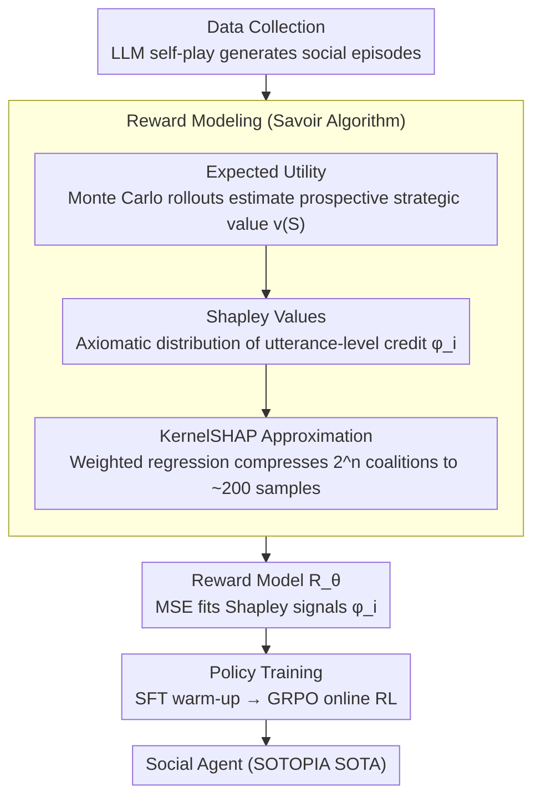

# Savoir: Learning Social Savoir-Faire via Shapley-based Reward Attribution

**Conference**: ACL 2026 Findings  
**arXiv**: [2604.18982](https://arxiv.org/abs/2604.18982)  
**Code**: None  
**Area**: Social Intelligence / Reinforcement Learning  
**Keywords**: Social Intelligence, Shapley Values, Credit Assignment, Cooperative Game Theory, Expected Utility

## TL;DR

This paper proposes Savoir, a social RL framework based on cooperative game theory. It combines Expected Utility (prospective evaluation of the strategic potential of utterances) and Shapley values (axiomatic fair credit assignment) to solve the credit assignment problem in multi-turn dialogues. It achieves SOTA performance on the SOTOPIA benchmark with a 7B model (Goal 7.18 in the Hard setting), matching or exceeding GPT-4o and Claude-3.5-Sonnet, while revealing that large reasoning models (o1, DeepSeek-R1) systematically underperform on social tasks.

## Background & Motivation

**Background**: Social intelligence—the capability to navigate complex interpersonal interactions—is a core requirement for LLMs in negotiation, collaboration, and persuasion scenarios. Recent studies train social agents via RL: SOTOPIA-π combines behavior cloning with self-reinforcement, while Sotopia-RL uses LLMs to heuristically distribute episode-level rewards to the utterance level.

**Limitations of Prior Work**: (1) The credit assignment in Sotopia-RL lacks a theoretical foundation—LLMs assign rewards directly without principled guarantees of fairness or accuracy; (2) More fundamentally, existing reward models perform **retrospective attribution** (how much an utterance contributed to an outcome that has already occurred) rather than **prospective valuation** (how much strategic potential an utterance created for subsequent favorable interactions). Some utterances might appear to have small immediate contributions, but their strategic positioning unlocks key paths for later success.

**Key Challenge**: Social interaction is inherently multi-turn, multi-objective, and competitive. The value of an individual utterance lies not only in its current contribution but also in the possibility space it creates for the future. Retrospective attribution fails to capture this prospective strategic value.

**Goal**: (1) Solve the credit assignment problem in multi-turn dialogues using game-theoretic axioms; (2) Distinguish between the retrospective contribution and prospective strategic value of utterances; (3) Achieve social intelligence in small models that exceeds that of large models.

**Key Insight**: Treat each social dialogue as a cooperative game where each utterance is a player contributing to the final outcome. Replace LLM heuristic assignment with the mathematical guarantees of Shapley values (efficiency, symmetry, and marginal contribution axioms).

**Core Idea**: Expected Utility defines "what to measure" (evaluating the prospective strategic value of utterances via rollouts), and Shapley values define "how to distribute" (fair credit distribution with axiomatic guarantees). The combination transforms credit assignment from heuristics into principled computation.

## Method

### Overall Architecture

The Savoir training pipeline consists of three stages: (1) Data Collection—LLM self-play to generate social interaction episodes; (2) Reward Modeling—attributing episode-level outcomes to the utterance level using the Savoir algorithm to train a reward model; (3) Policy Training—online RL using GRPO after SFT warm-up. The core innovation is in stage (2): given $n$ utterances $N = \{a_1, \ldots, a_n\}$ of an agent in a dialogue $\tau$, compute the Shapley value $\phi_i$ for each utterance as the reward signal. This step is internally decomposed into three layers: measuring value with Expected Utility, fair distribution with Shapley values, and making computation feasible with KernelSHAP.

### Key Designs

**1. Expected Utility: Shifting utterance evaluation from "past contribution" to "future creation"**

Existing reward models perform retrospective attribution—how much an utterance contributed to the outcome that has already happened. However, the immediate contribution of a well-designed proposal in a social context often appears small; its true value lies in the strategic space it unlocks for subsequent favorable trajectories, which a retrospective view fails to see. Savoir adopts a prospective value function $v(S)=\mathbb{E}_{\tau'\sim\mathcal{R}(H(S))}[U(\tau')]$, where $H(S)$ is the dialogue history reconstructed by keeping only a subset of utterances $S$ and their corresponding partner responses, and $\mathcal{R}(H(S))$ is the distribution of future trajectories starting from that state.

Since this expectation cannot be solved analytically, the paper approximates it using Monte Carlo simulation: $v(S)=\frac{1}{J}\sum_{j=1}^J U(\tau_j)$, where the agent policy $\pi_A$ and the partner policy $\pi_B$ alternately complete the dialogue. The utility $U(\tau)=\sum_d w_d\cdot G_d(\tau)$ is then calculated by weighted aggregation across seven SOTOPIA dimensions. Only by rolling out the future can the "hidden potential" of an utterance be quantified into value.

**2. Shapley Value: Replacing LLM heuristic attribution with axiomatic distribution**

Sotopia-RL directly lets an LLM split episode-level rewards into utterance-level rewards without any fairness guarantees—some utterances might be over- or under-attributed. Savoir treats a dialogue as a cooperative game where each utterance is a player and uses the Shapley value to measure its average marginal contribution across all possible permutations: $\phi_i=\sum_{S\subseteq N\setminus\{i\}}\frac{|S|!(n-|S|-1)!}{n!}[v(S\cup\{i\})-v(S)]$.

The strength of this approach is that the Shapley value is the unique distribution scheme that satisfies four axioms: efficiency (the sum of all Shapley values equals the total value), symmetry, dummy player, and additivity. It transforms "how to distribute fairly" from a guess into a mathematically guaranteed calculation, making the resulting utterance-level reward signals more reliable.

**3. KernelSHAP Approximation: Compressing exponential computation into feasible weighted regression**

Precisely calculating Shapley values requires enumerating $2^n$ coalitions, each requiring $J$ rollouts, which is infeasible as the number of utterances increases. Savoir leverages KernelSHAP to reformulate this as a weighted least squares problem $\phi^*=\arg\min_\phi\sum_k w_k(v(S_k)-\sum_i\phi_i\cdot z_{ki})^2$, where the SHAP kernel weights $w_k$ assign higher weights to coalitions of extreme sizes (very small or very large) because they provide the most information about marginal contribution.

Combined with an intelligent sampling strategy that prioritizes extreme-sized coalitions, the computation originally requiring $2^n$ value evaluations is compressed to approximately 200 coalition samples with high-precision approximation, making Shapley attribution practical during training.

### Loss & Training

The reward model is trained using the MSE loss $\mathcal{L}_\text{RM} = \mathbb{E}[(R_\theta(c,a) - \hat{\phi})^2]$. Policy training consists of two stages: SFT warm-up on GPT-4o self-play episodes, followed by online RL using GRPO (Group Relative Policy Optimization). Savoir's rollouts use $J=2$ simulations, with a coalition sampling limit of 200.

## Key Experimental Results

### Main Results

**Major Results on SOTOPIA Benchmark (Goal Metric, 0-10 Scale)**

| Model/Method | Self-Play All | Self-Play Hard | GPT-4o Partner All | GPT-4o Partner Hard |
|---------|-------------|-------------|-------------------|-------------------|
| GPT-4o | 8.19 | 6.97 | 8.19 | 6.97 |
| Claude-3.5-Sonnet | 8.29 | 6.33 | 8.42 | 6.64 |
| OpenAI-o1 | 7.93 | 5.69 | 8.09 | 6.65 |
| DeepSeek-R1 | 7.97 | 5.86 | 7.92 | 6.20 |
| o3-mini | 7.38 | 5.14 | 7.96 | 6.33 |
| Sotopia-RL (7B) | 7.80 | 7.81 | 8.31 | 6.68 |
| **Savoir (7B)** | **8.43** | **7.93** | **8.42** | **7.18** |

### Ablation Study

**Decoupling EU and Shapley Components (SOTOPIA-Hard, GPT-4o Partner)**

| Variant | EU | Shapley | Goal | Avg |
|------|-----|---------|------|-----|
| Baseline (Sotopia-RL) | × | × | 6.68 | 3.29 |
| EU-only | ✓ | × | 6.89 | 3.38 |
| Shapley-only | × | ✓ | 6.96 | 3.42 |
| **Savoir (Full)** | ✓ | ✓ | **7.18** | **3.51** |

### Key Findings

- 7B Savoir outperforms all large models: 8.43 vs. GPT-4o's 8.19 on Self-Play All, and 7.93 vs. 6.97 (+13.8%) on the Hard setting.
- **Large reasoning models systematically underperform**: o3-mini scores only 5.14 on Self-Play Hard vs. Savoir’s 7.93 (a 54.3% gap), suggesting that social intelligence requires intuitive responses rather than deliberate reasoning chains.
- EU and Shapley solve orthogonal problems: EU alone improves performance by 3.1% (better value estimation), while Shapley alone improves it by 4.2% (fairer distribution). The combination yields a 7.5% improvement, indicating they are complementary.
- In human evaluations, the strategic score was 4.06 vs. 3.41 for Sotopia-RL (+19.1%, $p<0.01$), with a reward fairness preference of 67.1% vs. 15.7%.
- Performance improves continuously as training data increases from 2K to 7.5K episodes, with the largest Gain between 3K-5K (Goal +8.6%).

## Highlights & Insights

- Introducing Shapley values to credit assignment in social dialogue is a perfect combination of theoretical elegance and practical effectiveness—the fairness guaranteed by the four axioms directly translates into better reward signals.
- The finding that "reasoning models are not good at social tasks" is insightful—the "overthinking" of models like o1 and R1 might actually harm social interactions that require intuition and flexibility.
- The rollout mechanism of Expected Utility captures the value of "strategic positioning"—certain seemingly insignificant utterances may be the key foundation for subsequent success.

## Limitations & Future Work

- The computational cost of rollouts and coalition sampling is high (approx. 200 coalitions × 2 rollouts per episode), limiting large-scale application.
- The evaluation relies on GPT-4o as an evaluator, which may introduce evaluation bias.
- Performance decreases when facing increasingly stronger dialogue partners: vs. Gemini-3-Pro, the Goal score drops by 17.8%, indicating limited generalization.
- Evaluated only on the SOTOPIA benchmark; real-world social scenarios may have higher complexity.

## Related Work & Insights

- **vs Sotopia-RL**: Sotopia-RL uses LLMs for heuristic reward attribution, mientras que Savoir uses axiomatic Shapley value attribution, the latter showing a 1.3-8.1% improvement across all settings.
- **vs SOTOPIA-π**: SOTOPIA-π uses behavior cloning + filtering with episode-level signal granularity; Savoir provides fine-grained utterance-level rewards.
- **vs DSI**: DSI reaches 7.31 on Self-Play Hard, while Savoir reaches 7.93 (+8.5%), and the advantage is even greater in the GPT-4o Partner setting.

## Rating

- Novelty: ⭐⭐⭐⭐⭐ The application of Shapley values + Expected Utility in social RL has theoretical depth and practical innovation.
- Experimental Thoroughness: ⭐⭐⭐⭐⭐ Extremely comprehensive, including main experiments + component ablation + human evaluation + data scale analysis + opponent strength analysis.
- Writing Quality: ⭐⭐⭐⭐⭐ Clear theoretical derivation, a complete logical chain from motivation to method, and vivid case analysis.
- Value: ⭐⭐⭐⭐⭐ Achieving social intelligence in a 7B model that surpasses GPT-4o is of great practical significance, and the discovery of the underperformance of reasoning models has profound implications.

<!-- RELATED:START -->

## Related Papers

- [\[NeurIPS 2025\] Approximating Shapley Explanations in Reinforcement Learning](../../NeurIPS2025/reinforcement_learning/approximating_shapley_explanations_in_reinforcement_learning.md)
- [\[ICLR 2026\] Efficient Estimation of Kernel Surrogate Models for Task Attribution](../../ICLR2026/reinforcement_learning/efficient_estimation_of_kernel_surrogate_models_for_task_attribution.md)
- [\[ICML 2026\] Shapley Neuron Values for Continual Learning: Which Neurons Matter Most?](../../ICML2026/reinforcement_learning/shapley_neuron_values_for_continual_learning_which_neurons_matter_most.md)
- [\[ACL 2026\] The Stackelberg Speaker: Optimizing Persuasive Communication in Social Deduction Games](the_stackelberg_speaker_optimizing_persuasive_communication_in_social_deduction_.md)
- [\[ACL 2026\] Breaking the Impasse: Dual-Scale Evolutionary Policy Training for Social Language Agents](breaking_the_impasse_dual-scale_evolutionary_policy_training_for_social_language.md)

<!-- RELATED:END -->
