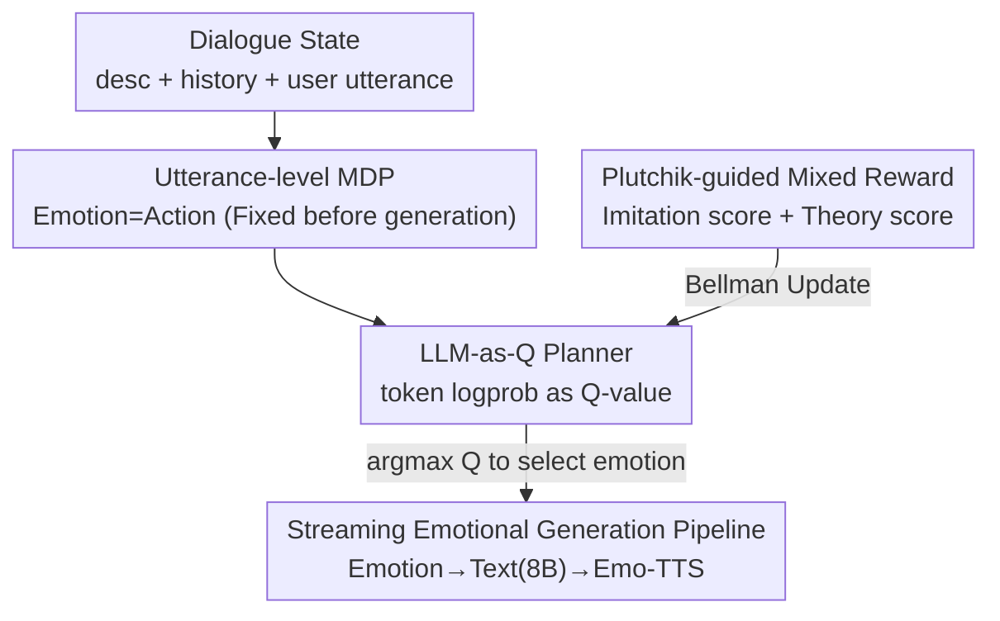

# Self-EmoQ: Plutchik-Guided Value-based Planning to Drive Streaming Emotional TTS

**Conference**: ACL 2026  
**arXiv**: [2606.09837](https://arxiv.org/abs/2606.09837)  
**Code**: https://sixingdeguo.github.io/EmoQ-page/ (including cases and demos)  
**Area**: Reinforcement Learning / Emotional Dialogue / Speech Synthesis  
**Keywords**: Value-based RL, Emotional Planning, Plutchik’s Wheel of Emotions, Streaming TTS, DQN

## TL;DR
Self-EmoQ models "what emotion the system should use to speak" as an utterance-level reinforcement learning decision problem. Before generating text, it utilizes value-based RL (DQN) to plan the emotion for the current turn. This emotion then simultaneously drives both text generation and streaming emotional speech synthesis (Emo-TTS), with rewards designed based on Plutchik's Wheel of Emotions theory to ensure more human-like emotion selection.

## Background & Motivation
**Background**: Industrial-grade real-time dialogue systems generally follow an ASR→LLM→TTS cascaded pipeline. To reduce latency, **streaming** is commonly employed: text is sent to the TTS to synthesize audio segments token-by-token as they are generated. Meanwhile, users increasingly expect dialogue AI to be not only accurate but also emotional and empathetic.

**Limitations of Prior Work**: Integrating "emotion" into streaming TTS faces a critical causal order contradiction (Figure 1). Streaming TTS requires **determining the emotional tone at the very beginning of generation**, whereas traditional Emotion Recognition in Conversation (ERC) can only identify emotion **after the entire utterance is generated**. This sequence mismatch makes it impossible to drive streaming synthesis. Emotion Prediction (EPC) can predict the next turn's emotion, but it purely imitates dataset trajectories, **following labels without planning** future emotions or optimizing overall dialogue quality. Approaches that use prompts to let the LLM decode emotion first do not update parameters, leading to suboptimal planning.

**Key Challenge**: Should emotion be treated as a "target to identify/predict" or as a "decision variable that can be actively planned"? The former's potential is limited by supervision signals, whereas the latter allows for optimizing the overall dialogue experience across multiple turns. To treat emotion as a decision variable, the **reward** becomes the key—it must reflect human behavioral patterns and generalize to various contexts rather than just mimicking dataset labels.

**Goal**: ① To determine the "self-emotion" for the current turn before text generation to drive streaming Emo-TTS; ② To ensure emotion selection is a **planning** process oriented toward long-term rewards rather than reactive labeling; ③ To inject psychological theory into rewards so that emotion decisions align with human emotional evolution.

**Key Insight**: The authors utilize **Plutchik’s Wheel of Emotions**, a psychological theory regarding emotion categories, intensities, adjacent/opposite relationships, and transition rules. It posits that emotion transitions are not arbitrary: transitions between adjacent emotions are natural, while transitions between opposite emotions are irrational. Implementing this "topological structure of emotional transitions" as a reward prior guides the planning process.

**Core Idea**: Emotional dialogue is formulated as an **utterance-level MDP**, where the state is the dialogue context, the action is the system's emotion, and the reward is a mixture of "imitation signals + Plutchik theory scores." A **plug-and-play** emotion planner is trained using value-based RL (DQN). During deployment, it is placed upstream of the LLM generator and Emo-TTS, selecting the emotion via Q-value argmax.

## Method
The essence of Self-EmoQ is the insertion of a DQN-trained "emotion planner" at the start of the standard ASR→LLM→TTS pipeline. It decides the emotion before each turn, conditioning both downstream text generation and speech synthesis, allowing streaming TTS to receive the "fixed emotional tone at the start" it requires.

### Overall Architecture
Multi-turn emotional dialogue is formalized as an utterance-level MDP $\mathcal{M}=(\mathcal{S},\mathcal{A},R,\mathcal{T},\gamma)$: the **state** $s_t=(desc, h_t, x_t^u)$ is a concatenation of the dialogue background, history, and current user utterance; the **action** $a_t=e_t^s$ is the system emotion chosen for the turn; the **reward** mixes imitation signals with Plutchik theory scores. The planner is initialized from a pre-trained LLM (Llama3.1-1B-Instruct) and modified to output the state-action value $Q_\theta(s_t,a_t)$ for selecting action $a_t$ under state $s_t$, trained via the DQN Bellman equation. During deployment, the optimal emotion is chosen via argmax over all candidate emotions. This is injected into the text generation instructions for the LLM (Llama3.1-8B-Instruct) and simultaneously conditions the Emo-TTS. Because the emotion is determined prior to decoding, the TTS can perform streaming synthesis of emotional speech as text is generated.

### Key Designs

**1. Utterance-level MDP with Emotion as Action: Pre-generation emotion decisions for streaming TTS**

This directly addresses the causal contradiction where ERC requires full text generation while streaming TTS requires an early emotion signal. The authors treat emotion not as a descriptive label to be identified, but as a **controllable decision variable**: for each turn $t$, self-emotion $e_t^s$ is selected before producing reply $x_t^s$. Thus, samples are represented as $(x_t^u, e_t^s, x_t^s)$, with history $h_t=(x_i^u,e_i^s,x_i^s)_{i=0:t-1}$. The policy $\pi(e_t^s\mid s_t)$ aims to maximize cumulative discounted rewards:

$$\pi^\star=\arg\max_\pi \mathbb{E}_\pi\Big[\sum_{t=0}^{T}\gamma^t r(s_t,e_t^s,x_t^s)\Big].$$

This step is the foundation of the framework: moving emotion selection before generation provides the necessary conditioning for streaming TTS and allows emotion to be optimized via RL across turns.

**2. LLM-as-Q: Using output token logprobs as Q-values to reuse pre-trained LLMs as value networks**

To enable an LLM to understand semantics and output values for discrete emotions, the authors borrow from StraQ*. The planner is a plug-and-play module using an instruction template $\mathcal{I}(s_t)$ to encode the state. Candidate actions are appended in a Multiple Choice Question (MCQ) format $\mathcal{I}(s_t)\oplus a_t$, and the LLM estimates the value using the **average logprob of output tokens**:

$$Q_\theta(s_t,a_t)\leftarrow \text{LLM}_\theta\big(\mathcal{I}(s_t)\oplus a_t\big).$$

Inference is performed for different emotions as options; the one with the highest logprob represents the highest Q-value. This avoids an extra value head and reuses the language prior of the LLM for scoring.

**3. Plutchik-guided Mixed Reward: Imitation labels + theory scores for human-like behavior**

Relying solely on dataset labels leads to poor generalization, while relying solely on theory ignores the data. The authors use a linear mixture:

$$r_t(s_t,e_t^s,x_t^s)=(1-w)\cdot \mathbf{1}\!\left[e_t^s=\hat{e}_t^s\right]+w\cdot r_{\text{Plu}}(s_t,e_t^s,x_t^s),$$

where $\hat{e}_t^s$ is the ground truth, the first term is an **imitation reward**, and the second is the **Plutchik theory score** $r_{\text{Plu}}$, with $w$ as a weight. $r_{\text{Plu}}$ is scored by GPT-4o based on Plutchik's theory across three dimensions: **Emotion Alignment**, **Transition Plausibility (naturalness of shifts)**, and **Emotion-Function Consistency**. This provides relative rewards beyond labels that align with human emotional evolution.

**4. Streaming Emotional Generation Pipeline: Argmax → Text Generation → Emo-TTS deployment**

After training, the module selects the optimal emotion via $a_t^\star=\arg\max_{a\in\mathcal{A}}Q_\theta(s_t,a)$. This is injected into the prompt for a fixed Llama3.1-8B to produce an emotion-consistent text $x_t^s$. The same $e_t^s$ conditions the Emo-TTS, where emotion embeddings modulate prosody, speed, and acoustic style. Since emotion is determined **prior to decoding**, the TTS can synthesize emotional speech in a streaming manner.

### Loss & Training
The value network is trained using the DQN Bellman residual:

$$\mathcal{L}(\theta)=\big| r(s,a)+Q_\phi(s',a')-Q_\theta(s,a)\big|^2,$$

where $\theta$ and $\phi$ are parameters of the Q-network and target Q-network, respectively. The planner backbone is Llama3.1-1B-Instruct, and the generation backbone is a frozen Llama3.1-8B-Instruct. Hyperparameters: max length $L=1024$, $\epsilon=0.1$, target sync period $C=5$, batch $B=512$, learning rate $1e\text{-}5$, and discount $\gamma=0.8$.

## Key Experimental Results

### Main Results
Emotion decision quality was evaluated on four datasets (DailyDialog, EmoryNLP, MELD, IEMOCAP). Using DailyDialog as an example, candidate emotions were ranked by Q-value and measured by Reward and ranking metrics R@3 / R@5 / NDCG / MRR (higher is better):

| Method | Reward | R@3 | R@5 | NDCG | MRR |
|------|--------|-----|-----|------|-----|
| 0-shot | 0.37 | 0.47 | 0.56 | 0.84 | 0.48 |
| ECoT | 0.10 | 0.51 | 0.51 | 0.65 | 0.79 |
| PS | 0.43 | 0.60 | 0.68 | 0.86 | 0.57 |
| MP | 0.40 | 0.56 | 0.63 | 0.85 | 0.53 |
| SFT | 0.55 | 0.79 | 0.86 | 0.88 | 0.70 |
| FSM | 0.52 | 0.73 | 0.81 | 0.88 | 0.67 |
| EMDP | 0.33 | 0.83 | 0.88 | 0.86 | 0.71 |
| **Self-EmoQ** | **0.57** | 0.82 | **0.92** | **0.92** | **0.72** |

Self-EmoQ achieved the best performance in Reward, R@5, NDCG, and MRR. Compared to pure supervised SFT, it improved Reward from 0.55 to 0.57 and R@5 from 0.86 to 0.92, showing that planning and theoretical rewards outperform simple imitation.

### Ablation Study
Performance of Self-EmoQ across four datasets (higher is better) compared to the strongest supervised baseline (SFT):

| Dataset | Metric | SFT | Ours |
|--------|------|-----|-----------|
| DailyDialog | Reward / R@5 | 0.55 / 0.86 | **0.57 / 0.92** |
| EmoryNLP | Reward / R@5 | 0.68 / 0.74 | **0.71 / 0.84** |
| MELD | Reward / R@5 | 0.83 / 0.83 | **0.86 / 0.89** |
| IEMOCAP | Reward / R@5 | 0.59 / 0.56 | **0.81 / 0.71** |

Self-EmoQ consistently outperformed SFT across all datasets, with the most significant improvement on IEMOCAP (10 emotion categories). Regarding generation quality, Self-EmoQ also performed better than prompting and fine-tuning baselines in BLEU-2, Rouge-L, etc. (refer to Table 4 in the original paper for specific generation values).

### Key Findings
- **Planning > Imitation**: Self-EmoQ outperformed pure supervised SFT and predictive baselines, verifying that treating emotion as a plannable variable is better than following labels.
- **Difficulty Gains**: The largest improvements occurred on IEMOCAP, suggesting value-based planning is more advantageous in complex emotional spaces.
- **Theory-based Rewards Work**: Plutchik theory scores provided critical signals for transition plausibility beyond simple labels.
- **Plug-and-play**: Using a 1B model for planning and an 8B model for generation makes the pipeline industrially viable for streaming Emo-TTS.

## Highlights & Insights
- **Addressing Causal Contradiction**: The engineering pain point between ERC and streaming TTS is elegantly solved by treating emotion as a prior decision variable.
- **LLM-as-Q**: Using token logprobs with MCQ formats to estimate Q-values reuses LLM language priors as evaluators, which is transferable to other discrete-action dialogue tasks.
- **Theory to Computation**: Mapping Plutchik’s topological structure to GPT-4o scoring is a strong example of engineering theoretical priors into RL rewards.
- **Mixed Rewards**: Combining imitation and theory rewards prevents the model from being capped by the labels of a specific dataset.

## Limitations & Future Work
- **Reliance on GPT-4o**: The reliability of $r_{\text{Plu}}$ depends on GPT-4o's judgment, introducing external model bias and cost.
- **Light Evaluation of Synthesis**: Generation and TTS evaluation relied heavily on human assessment and demos, lacking large-scale objective speech quality benchmarks.
- **Discrete Action Space**: Limited to pre-defined categories (7-10 emotions), making it difficult to express fine-grained or mixed emotional intensities.
- **Future Directions**: Explicitly encoding Plutchik's intensity/mixing dimensions; using lightweight or self-consistent rewards to replace GPT-4o; and evaluating latency in real-world deployments.

## Related Work & Insights
- **vs. ERC / EPC**: ERC identifies emotion after the fact; EPC imitates labels. Ours treats emotion as a plannable decision variable.
- **vs. Prompting LLMs to decode emotion**: Prompting doesn't update parameters and planning is suboptimal; Ours uses RL to optimize for long-term rewards.
- **vs. StraQ***: Uses logprobs for value-based planning; Ours transfers this to emotional dialogue with Plutchik rewards.
- **vs. Emo-TTS**: Traditional Emo-TTS requires pre-given labels. Ours provides the upstream planner to determine those labels.

## Rating
- Novelty: ⭐⭐⭐⭐ (Emotional planning for streaming TTS + Plutchik rewards)
- Experimental Thoroughness: ⭐⭐⭐⭐ (Four datasets, multiple baselines, but speech metrics are qualitative)
- Writing Quality: ⭐⭐⭐⭐ (Clear MDP formulation and intuitive diagrams)
- Value: ⭐⭐⭐⭐ (Strong industrial applicability for streaming emotional dialogue)

<!-- RELATED:START -->

## Related Papers

- [\[ICML 2026\] DRIVE: Distributional and Retrieval-Augmented Bidding with Value Evaluation](../../ICML2026/reinforcement_learning/drive_distributional_and_retrieval-augmented_bidding_with_value_evaluation.md)
- [\[ACL 2026\] AttnPO: Attention-Guided Process Supervision for Efficient Reasoning](attnpo_attention-guided_process_supervision_for_efficient_reasoning.md)
- [\[ICLR 2026\] Guided Flow Policy: Learning from High-Value Actions in Offline Reinforcement Learning](../../ICLR2026/reinforcement_learning/guided_flow_policy_learning_from_high-value_actions_in_offline_reinforcement_lea.md)
- [\[ACL 2026\] Beyond Fully Random Masking: Attention-Guided Denoising and Optimization for Diffusion Language Models](beyond_fully_random_masking_attention-guided_denoising_and_optimization_for_diff.md)
- [\[ACL 2026\] Visually-Guided Policy Optimization for Multimodal Reasoning](visually-guided_policy_optimization_for_multimodal_reasoning.md)

<!-- RELATED:END -->
