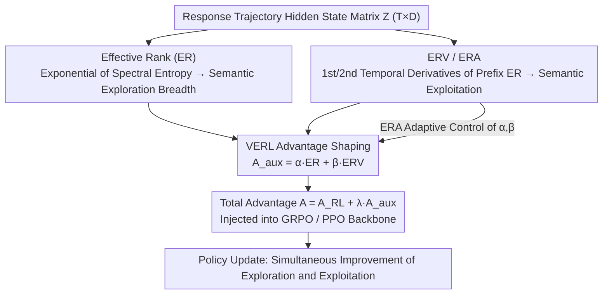

# Semantic-Space Exploration and Exploitation in RLVR for LLM Reasoning

**Conference**: ACL 2026 Findings  
**arXiv**: [2509.23808](https://arxiv.org/abs/2509.23808)  
**Code**: [https://github.com/hf618/VERL](https://github.com/hf618/VERL)  
**Area**: Reinforcement Learning / LLM Reasoning  
**Keywords**: RLVR, Exploration-Exploitation, Latent Semantic Space, Effective Rank, Reasoning Enhancement

## TL;DR

This paper argues that the traditional token-level exploration-exploitation trade-off in RLVR is an artifact of measurement. It proposes decoupling exploration and exploitation in the latent semantic space using Effective Rank (ER) and its temporal derivatives (ERV/ERA). Based on this, the VERL method is designed to achieve simultaneous improvement in both, resulting in gains of up to 21.4% on benchmarks such as Gaokao Math.

## Background & Motivation

**Background**: RLVR (Reinforcement Learning with Verifiable Rewards) has become a mainstream paradigm for enhancing LLM reasoning capabilities. The current mainstream narrative interprets training progress as a balance between exploration (finding diverse reasoning paths) and exploitation (refining known optimal policies).

**Limitations of Prior Work**: Exploration and exploitation are operationalized almost entirely through proxy metrics in the token-level action space—exploration corresponds to high-entropy next-token distributions, and exploitation corresponds to high-confidence distributions. However, token-level statistics measure the uncertainty of the next token rather than how reasoning progresses across multi-token semantic structures. This leads to two failure modes: high entropy may merely amplify lexical diversity without touching new semantic directions, while low entropy may prematurely converge trajectories to familiar semantic regions.

**Key Challenge**: The widely discussed "exploration-exploitation trade-off" may not be an inherent property of reasoning behavior but rather an artifact measured in the token-level action space.

**Goal**: (1) Define and measure exploration and exploitation in the semantic space rather than the action space; (2) prove that the two can be decoupled and improved simultaneously in the semantic space; (3) design a practical training method that leverages this decoupling.

**Key Insight**: Leveraging the prior knowledge that Transformer hidden states naturally encode rich semantic structures, hidden state sequences are treated as semantic trajectories. Effective Rank (ER) and its temporal derivatives are used to characterize exploration and exploitation at the semantic level.

**Core Idea**: The negative correlation between exploration and exploitation at the token level is a limitation of proxy metrics. In the latent semantic space, the two are nearly zero-correlated; therefore, both can be simultaneously enhanced through auxiliary advantage signals.

## Method

### Overall Architecture

VERL is a plug-and-play advantage shaping method that can be integrated into RL algorithms such as GRPO or PPO. The core process involves calculating the ER (exploration metric) and ERV (exploitation metric) of the hidden state matrix for each response trajectory. ERA is used as a meta-control variable to adaptively adjust the incentive intensities of both, injecting auxiliary signals into the standard RL advantage function.

### Key Designs

**1. Effective Rank (ER) — Exploration Metric in Semantic Space**

Token-level entropy measures the uncertainty of the next token and does not reflect how much the reasoning spreads across multi-token semantic structures. This paper instead examines hidden states: given a hidden state matrix $Z \in \mathbb{R}^{T \times D}$ of a response, its singular values $\{\sigma_j\}$ are normalized into a probability distribution $p_j = \sigma_j / \sum_k \sigma_k$. The Effective Rank is defined as the exponential of the spectral entropy: $\text{ER}(Z) = \exp(-\sum_j p_j \log p_j)$. A larger ER indicates that the trajectory spans more directions in the semantic space (broader exploration), while a smaller ER indicates concentration in fewer directions. Compared to the discrete traditional rank, which is insensitive to spectral concentration, ER is a continuous effective dimension—it grows as the singular spectrum flattens, thereby capturing semantic refinements invisible to traditional rank.

**2. ERV and ERA — First and Second-Order Metrics for Semantic Exploitation**

ER alone does not suffice; exploitation is reflected in how semantic complexity is refined along the trajectory. Thus, temporal derivatives of ER are introduced. ERV (first-order) is defined as the temporal average of the prefix ER's deviation from the historical mean: $\Delta^{(1)}_{\text{ER}} = \frac{1}{K-1}\sum_{j=2}^K \delta_{j \cdot s}$, where $\delta_{j \cdot s} = m_{j \cdot s} - \frac{1}{j-1}\sum_{k=1}^{j-1} m_{k \cdot s}$. ERA (second-order) is the rate of change of $\delta$ itself: $\Delta^{(2)}_{\text{ER}} = \frac{1}{K-2}\sum_{j=3}^K [\delta_{j \cdot s} - \delta_{(j-1) \cdot s}]$, characterizing whether refinement is accelerating or saturated. Two key properties support this design: ER and ERV are nearly zero-correlated in the semantic space (the source of the argument that the "trade-off is a measurement artifact"), and ERA is theoretically more stable under short-term fluctuations, not growing linearly with the number of semantic directions $k$. Empirically, the characteristic of correct trajectories is not necessarily higher ER or ERV, but higher ERA—meaning "refinement is continuously accelerating"—making ERA a more reliable reasoning quality signal than zero or first-order quantities.

**3. VERL Advantage Shaping: Injecting Semantic Signals into Standard RL**

With decoupled exploration/exploitation metrics, both can be incentivized simultaneously without modifying the RL backbone. For each response, an auxiliary advantage is constructed: $A_{\text{aux}} = \alpha \cdot \hat{\text{ER}} + \beta \cdot \hat{\text{ERV}}$ (where $\hat{\text{ER}}$ and $\hat{\text{ERV}}$ are normalized values). The weights $\alpha, \beta$ are adaptively controlled by ERA: when ERA is high (acceleration), exploitation incentives are reduced to prevent overfitting; when ERA is low (saturation), exploitation incentives are increased. The final advantage is $A = A_{\text{RL}} + \lambda A_{\text{aux}}$, where $\lambda$ controls the overall intensity of the auxiliary signal. The two signals do not cancel each other out because ER and ERV are near-zero correlated, while the $O(1)$ stability of ERA makes it suitable as a meta-control variable. This module is plug-and-play for GRPO or PPO.

### Loss & Training

Auxiliary advantage signals are added to the standard GRPO or PPO objective, resulting in a total advantage $A_{\text{total}} = A_{\text{RL}} + \lambda A_{\text{aux}}$. The training configuration uses 8K difficult MATH problems (Level 3-5) with verifiable reference answers.

## Key Experimental Results

### Main Results

**Math Reasoning Benchmark Pass@1 (Selected)**

| Model | AIME24 | Gaokao 2024_I | GSM8K | Avg (15 benchmarks) |
|------|--------|--------------|-------|---------------------|
| Llama-3.2-3B-Instruct | 0.0 | 14.3 | 66.6 | 31.0 |
| + GRPO | 3.3 | 21.4 | 80.7 | 41.4 |
| + GRPO w/ VERL (Ours) | **13.3** | **14.3→22.0** | **82.2** | **44.3** |
| Qwen2.5-7B + GRPO | — | — | — | — |
| + GRPO w/ VERL (Ours)| — | — | — | +2.9 avg |

### Ablation Study

| Configuration | Key Metric | Description |
|------|---------|------|
| VERL (ER+ERV+ERA) | Best | Full method |
| ER only (Exploration) | Suboptimal | Lacks exploitation signal |
| ERV only (Exploitation) | Suboptimal | Lacks exploration signal |
| Fixed α,β (No ERA) | Decrease | Lacks adaptive regulation |
| Token-level Alternative | Significant Decrease | Validates advantage of semantic space |

### Key Findings

- The empirical correlation between ER and ERV is near zero, providing strong evidence for the argument that the "exploration-exploitation trade-off is a measurement artifact."
- Incorrect trajectories often have higher ER and ERV, but correct trajectories have higher ERA, suggesting that "continuous refinement" is more important than being "large and fast."
- VERL improves absolute accuracy by 21.4% on Gaokao 2024, demonstrating particular effectiveness on challenging tasks.
- Traditional rank tends to plateau late in training, while ER continues to grow, indicating the model refines existing semantic directions more uniformly rather than discovering new ones.

## Highlights & Insights

- The core contribution is the dual validation—via theory (near-zero correlation proof) and experiment (decoupling visualization of ER/ERV)—of the counter-intuitive argument that the "exploration-exploitation trade-off is an artifact."
- The discovery of ERA as a second-order signal to distinguish correct/incorrect trajectories is profound—the hallmark of correct reasoning is not "broad exploration" or "fast refinement," but "continuously accelerating refinement."
- The plug-and-play design of VERL allows it to be easily integrated into different RL algorithms like GRPO and PPO.

## Limitations & Future Work

- Extracting hidden states and performing SVD increases training overhead.
- Theoretical analysis relies on the assumption that "semantic factors can be linearly decoded from hidden states," which might not hold perfectly for all models.
- Validation is limited to mathematical reasoning benchmarks; other tasks like code generation or natural language inference were not tested.
- Hyperparameters in the ERA meta-control strategy might require adjustment for different models/data.

## Related Work & Insights

- **vs Traditional entropy-based methods**: Traditional methods operate at the token level and face negative coupling of exploration-exploitation; VERL operates in the semantic space, achieving positive decoupling.
- **vs Effective Rank related work**: Prior work used ER to analyze model representation quality; this paper is the first to apply temporal derivatives of ER as RL training signals.

## Rating

- Novelty: ⭐⭐⭐⭐⭐ Rethinks exploration-exploitation in RLVR from a new perspective (semantic space vs. action space) with deep theoretical insight.
- Experimental Thoroughness: ⭐⭐⭐⭐ Validated across multiple models and algorithms, but limited to math reasoning tasks.
- Writing Quality: ⭐⭐⭐⭐⭐ Rigorous theoretical derivation, clear motivation, and intuitive charts.
- Value: ⭐⭐⭐⭐⭐ Challenges the mainstream narrative in the RLVR field and provides a practical solution.

<!-- RELATED:START -->

## Related Papers

- [\[ICLR 2026\] Exploration vs Exploitation: Rethinking RLVR through Clipping, Entropy, and Spurious Reward](../../ICLR2026/reinforcement_learning/exploration_vs_exploitation_rethinking_rlvr_through_clipping_entropy_and_spuriou.md)
- [\[ICLR 2026\] Controllable Exploration in Hybrid-Policy RLVR for Multi-Modal Reasoning](../../ICLR2026/reinforcement_learning/controllable_exploration_in_hybrid-policy_rlvr_for_multi-modal_reasoning.md)
- [\[ACL 2026\] Targeted Exploration via Unified Entropy Control for Reinforcement Learning](targeted_exploration_via_unified_entropy_control_for_reinforcement_learning.md)
- [\[ACL 2026\] HEALing Entropy Collapse: Enhancing Exploration in Few-Shot RLVR via Hybrid-Domain Entropy Dynamics Alignment](healing_entropy_collapse_enhancing_exploration_in_few-shot_rlvr_via_hybrid-domai.md)
- [\[AAAI 2026\] Reasoning with Exploration: An Entropy Perspective](../../AAAI2026/reinforcement_learning/reasoning_with_exploration_an_entropy_perspective.md)

<!-- RELATED:END -->
