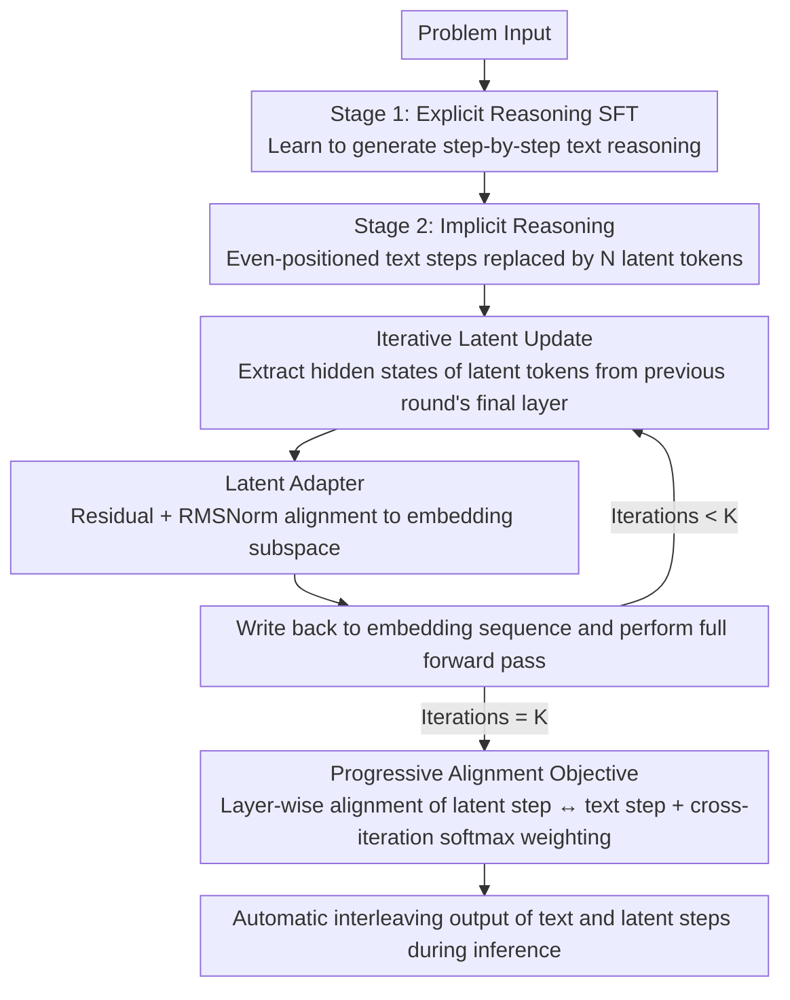

# SpiralThinker: Latent Reasoning through an Iterative Process with Text-Latent Interleaving

**Conference**: ACL 2026 Findings  
**arXiv**: [2511.08983](https://arxiv.org/abs/2511.08983)  
**Code**: [GitHub](https://github.com/shengminp/SpiralThinker)  
**Area**: Reinforcement Learning  
**Keywords**: Latent Reasoning, Iterative Refinement, Text-Latent Interleaving, Progressive Alignment, Implicit Chain-of-Thought

## TL;DR

This paper proposes SpiralThinker, a framework that achieves implicit reasoning through an iterative update process in the latent representation space interleaved with text reasoning steps. It introduces a progressive alignment objective to ensure that latent representations remain consistent with explicit reasoning during the iterative process, outperforming all latent reasoning baselines on mathematical, logical, and commonsense reasoning tasks.

## Background & Motivation

**Background**: Advances in large reasoning models are primarily driven by reinforcement learning and test-time compute scaling. Simultaneously, another research direction explores "latent reasoning"—allowing reasoning to unfold within high-dimensional hidden representations rather than generating explicit text. Existing latent reasoning methods (such as Coconut, iCoT, Pause Token) have demonstrated preliminary feasibility.

**Limitations of Prior Work**: (1) Existing methods lack mechanisms to ensure stable reasoning dynamics in the latent space—most methods treat latent representations as token-level inputs processed in a single forward pass, forcing them to encode all reasoning steps simultaneously; (2) There is a lack of systematic interleaving schemes between implicit and explicit reasoning—pure text reasoning leads to overthinking, while pure latent reasoning sacrifices interpretability and controllability; (3) Existing iterative methods rely solely on standard language modeling objectives, lacking direct supervision of latent reasoning dynamics.

**Key Challenge**: Unconstrained iterative updates in the latent space lead to "drift"; unrestricted iteration can even degrade performance—ablation studies show that adding iteration without alignment constraints drops accuracy on ProsQA from 98.0% to 97.4%.

**Goal**: To design a stable iterative latent reasoning framework where latent representations are progressively enhanced over multiple iterations while maintaining consistency with text reasoning.

**Key Insight**: Iterative processes naturally correspond to multi-step reasoning (theoretically, $T$ iterations can simulate $T$ reasoning steps), but explicit alignment signals are required to constrain the latent representations from deviating from the reasoning trajectory.

**Core Idea**: Latent reasoning is modeled as an iterative refinement process. A progressive alignment objective constrains the latent representation of each iteration to remain consistent with its corresponding text reasoning step, and a structured labeling scheme implements text-latent interleaving.

## Method

### Overall Architecture

SpiralThinker is trained in two stages: (1) **Explicit Reasoning Stage**—standard SFT to learn step-by-step reasoning capabilities; (2) **Implicit Reasoning Stage**—replacing text reasoning steps at even (or odd) positions with $N$ `<latent>` tokens. These latent representations are iteratively updated under progressive alignment constraints. During inference, the model automatically interleaves between text steps and latent steps.

### Key Designs

**1. Iterative Latent Update: Decomposing "Single-Pass Encoding" into Multi-Round Deepening**

Existing latent reasoning methods (like Coconut) treat latent representations as token-level inputs processed in a single forward pass, overloading these tokens to encode the entire reasoning chain. SpiralThinker changes this to an iteration: in the $k$-th iteration, representations $\mathbf{H}^{(L,k-1)}_{\text{<latent>}}$ corresponding to the latent tokens are extracted from the final hidden states of the previous round. They are transformed by a mapping module $g_\phi(\cdot)$ and written back into the corresponding positions of the embedding sequence for another full forward pass, repeated $K$ times. This allows each round to focus on different aspects of reasoning—theoretically, $T$ iterations can simulate $T$ reasoning steps. Qualitative analysis confirms that latent tokens converge to correct intermediate results (e.g., the third token stores intermediate calculated values).

**2. Latent Adapter: Safely Reinserting Final-Layer Hidden States into Embedding Space**

Iteration requires writing "output-end" hidden states back into the "input-end" embedding sequence. Since these exist in different subspaces, direct replacement causes distribution mismatch and instability. The adapter uses a lightweight structure with residuals for alignment: $\tilde{\mathbf{h}} = \text{norm}(\mathbf{h} + W_2 \text{SiLU}(W_1 \mathbf{h})) \cdot \text{target\_rms}$, where $\text{target\_rms}$ is derived from the root mean square statistics of the pre-trained embedding matrix. This ensures the mapped latent representations match the scale and distribution of real embeddings.

**3. Progressive Alignment Objective: Supervision Signal to Prevent Drift**

Relying only on language modeling objectives allows latent representations to drift during iterations. This paper applies two levels of constraints. First, intra-iteration layer-wise alignment: minimizing the distance between the hidden states of the latent step end-token `<eol>` and the text step end-token `<eot>`: $\mathcal{L}_{\text{align}} = \frac{1}{L}\sum_{l=1}^{L}\frac{\|\mathbf{H}^{(l)}_{\texttt{<eol>}} - \mathbf{H}^{(l)}_{\texttt{<eot>}}\|_1}{\sigma^{(l)}}$. Second, cross-iteration softmax weighted aggregation $\mathbf{v} = \text{softmax}(\alpha[1,...,K])$, where later iterations have higher weights—allowing early exploration of diverse paths while enforcing precise late-stage alignment, matching a "diverge-then-converge" reasoning rhythm.

### Loss & Training

The total loss is $\mathcal{L}_{\text{total}} = \mathcal{L}_{\text{CE}} + \lambda \mathcal{L}_{\text{align\_prog}}$. Since `<latent>` tokens have no explicit text form, their positions do not participate in the CE loss. The base model is Llama-3.2-1B, fine-tuned using LoRA on 4×A100 GPUs.

## Key Experimental Results

### Main Results

| Method | GSM8K-Aug (%) | ProsQA (%) | StrategyQA (%) |
|------|-------------|-----------|---------------|
| iCoT-KD | 24.11 | 98.00 | 62.88 |
| Coconut | 49.85 | 97.80 | 60.00 |
| CODI | 51.02 | 80.80 | 60.70 |
| Pause Token | 53.37 | 95.80 | 57.64 |
| **SpiralThinker** | **56.56** | **99.40** | **63.32** |

### Ablation Study

| Alignment | Iteration | GSM8K-Aug | ProsQA | StrategyQA |
|------|------|-----------|--------|------------|
| ✗ | ✗ | 45.49 | 98.00 | 59.39 |
| ✓ | ✗ | 48.67 (+3.18) | 98.60 (+0.60) | 61.14 (+1.75) |
| ✗ | ✓ | 45.72 (+0.23) | 97.40 (-0.60) | 58.08 (-1.31) |
| ✓ | ✓ | **56.56 (+11.07)** | **99.40 (+1.40)** | **63.32 (+3.93)** |

### Key Findings

- The joint effect of iteration and alignment far exceeds the sum of their independent contributions—on GSM8K-Aug, separate gains were 0.23/3.18, while the joint gain was 11.07, indicating strong synergy.
- **Adding iteration without alignment degrades performance** (ProsQA -0.6%, StrategyQA -1.31%), confirming that unconstrained iteration leads to drift.
- Optimal latent token count and iteration count are dataset-specific: GSM8K-Aug performs best at N=5/K=5, while StrategyQA peaks at N=6/K=3.
- Qualitative analysis shows latent tokens progressively converge to correct intermediate results during iteration.

## Highlights & Insights

- The ablation result that "unconstrained iteration is harmful" strongly proves the necessity of the alignment objective—iteration and alignment are complementary, not redundant.
- The progressive alignment design is elegant—allowing exploration early and forcing convergence late, mirroring the "divergence-then-convergence" cognitive process in reasoning.
- The text-latent interleaving scheme provides a viable formalization for "when to reason implicitly vs. explicitly."

## Limitations & Future Work

- Currently uses a fixed number of iterations for all reasoning steps without dynamic adjustment based on difficulty.
- The text-latent interleaving pattern (every other step) is fixed and does not learn when to switch to latent mode.
- Validated only on a 1B parameter model; effectiveness on larger models remains unknown.
- Interpretability of latent reasoning remains limited—though analyzable via embedding similarity, it is less intuitive than text CoT.

## Related Work & Insights

- **vs Coconut**: Coconut reasons in continuous space but in a single forward pass without iterative refinement; SpiralThinker introduces iteration + alignment.
- **vs Pause Token**: Pause Token inserts learnable delay tokens but lacks alignment supervision, resulting in limited performance.
- **vs CODI**: CODI aligns latent and text representations but lacks iteration and performs poorly on ProsQA (80.8% vs 99.4%).
- **vs Universal Transformer**: UT iterates over text tokens, while SpiralThinker iterates on latent representations and interleaves with text reasoning.

## Rating

- Novelty: ⭐⭐⭐⭐ The combination of iterative latent reasoning, progressive alignment, and text interleaving is novel, though individual components are not entirely new.
- Experimental Thoroughness: ⭐⭐⭐⭐ Three reasoning types, detailed ablations, hyperparameter analysis, and qualitative analysis, but limited to a 1B model.
- Writing Quality: ⭐⭐⭐⭐⭐ Clear motivation; ablation design precisely validates the contribution of each component.
- Value: ⭐⭐⭐⭐ Provides a feasible path for the iteration of latent reasoning; ablations reveal the necessity of alignment.

<!-- RELATED:START -->

## Related Papers

- [\[NeurIPS 2025\] Hybrid Latent Reasoning via Reinforcement Learning](../../NeurIPS2025/reinforcement_learning/hybrid_latent_reasoning_via_reinforcement_learning.md)
- [\[ICLR 2026\] Thinking on the Fly: Test-Time Reasoning Enhancement via Latent Thought Policy Optimization](../../ICLR2026/reinforcement_learning/thinking_on_the_fly_test-time_reasoning_enhancement_via_latent_thought_policy_op.md)
- [\[ACL 2026\] Controlling Multimodal Conversational Agents with Coverage-Enhanced Latent Actions](controlling_multimodal_conversational_agents_with_coverage-enhanced_latent_actio.md)
- [\[ACL 2026\] AttnPO: Attention-Guided Process Supervision for Efficient Reasoning](attnpo_attention-guided_process_supervision_for_efficient_reasoning.md)
- [\[CVPR 2026\] Seeing is Improving: Visual Feedback for Iterative Text Layout Refinement](../../CVPR2026/reinforcement_learning/seeing_is_improving_visual_feedback_for_iterative_text_layout_refinement.md)

<!-- RELATED:END -->
