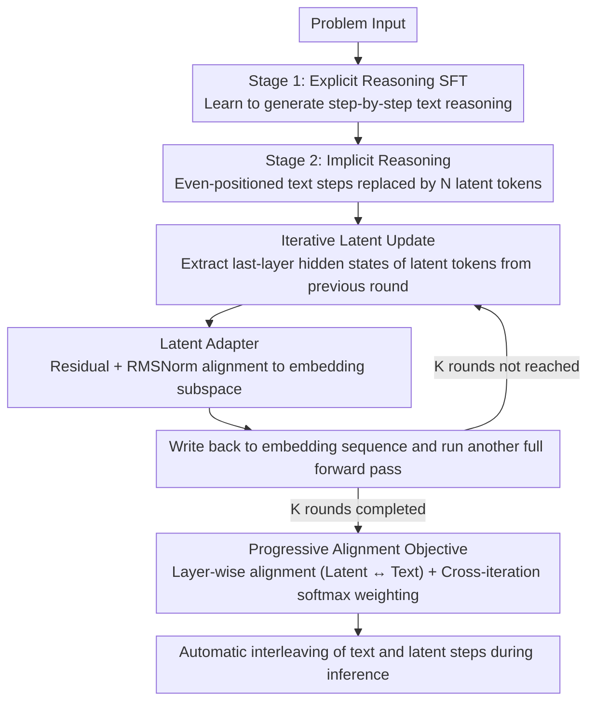

# SpiralThinker: Latent Reasoning through an Iterative Process with Text-Latent Interleaving

**Conference**: ACL 2026 Findings  
**arXiv**: [2511.08983](https://arxiv.org/abs/2511.08983)  
**Code**: [GitHub](https://github.com/shengminp/SpiralThinker)  
**Area**: Reinforcement Learning  
**Keywords**: Latent Reasoning, Iterative Refinement, Text-Latent Interleaving, Progressive Alignment, Implicit Chain-of-Thought

## TL;DR

This paper proposes SpiralThinker, a framework for implicit reasoning that updates latent representations iteratively while interleaving them with text reasoning steps. By introducing a progressive alignment objective, the framework ensures that latent representations remain consistent with explicit reasoning during iterations, outperforming all latent reasoning baselines on math, logic, and commonsense reasoning tasks.

## Background & Motivation

**Background**: Advancements in large reasoning models are primarily driven by reinforcement learning and test-time compute scaling. Simultaneously, another research direction explores "latent reasoning"—allowing reasoning to unfold within high-dimensional hidden representations instead of generating explicit text. Existing latent reasoning methods (e.g., Coconut, iCoT, Pause Token) have demonstrated preliminary feasibility.

**Limitations of Prior Work**: (1) Existing methods lack mechanisms to ensure stable reasoning dynamics in latent space—most treat latent representations as token-level inputs processed in a single forward pass, forcing them to encode all reasoning steps at once; (2) Lack of a systematic scheme for interleaving implicit and explicit reasoning—pure text reasoning leads to overthinking, while pure latent reasoning sacrifices interpretability and controllability; (3) Existing iterative methods rely solely on standard language modeling objectives, lacking direct supervision for latent reasoning dynamics.

**Key Challenge**: Unconstrained iterative updates in latent space lead to "drift," where unrestricted iterations can even degrade performance—ablation studies show that adding iterations without alignment constraints reduces accuracy on ProsQA from 98.0% to 97.4%.

**Goal**: Design a stable iterative latent reasoning framework where latent representations can be progressively enhanced over multiple iterations while maintaining consistency with text reasoning.

**Key Insight**: An iterative process naturally corresponds to multi-step reasoning (theoretically, $T$ iterations can simulate $T$ reasoning steps), but explicit alignment signals are required to prevent latent representations from deviating from the reasoning trajectory.

**Core Idea**: Model latent reasoning as an iterative refinement process, constraining the latent representation of each iteration to align with corresponding text reasoning steps through a progressive alignment objective, and implementing text-latent interleaving via a structured labeling scheme.

## Method

### Overall Architecture

SpiralThinker is trained in two stages: (1) **Explicit Reasoning Stage**—standard SFT to learn step-by-step reasoning; (2) **Implicit Reasoning Stage**—replacing even (or odd) text reasoning steps with $N$ `<latent>` tokens. These latent representations are updated iteratively under progressive alignment constraints. During inference, the model automatically interleaves between text steps and latent steps.

### Key Designs

**1. Iterative Latent Update: Decomposing "Single-Pass Encoding" into Multi-Round Deepening**

Conventional latent reasoning methods (like Coconut) treat latent representations as token-level inputs processed only once, forcing a few latent tokens to encode a complete reasoning chain, which is overly burdensome. SpiralThinker adopts iterations: in round $k$, the representation $\mathbf{H}^{(L,k-1)}_{\text{<latent>}}$ corresponding to the latent tokens is extracted from the previous round's final hidden states, transformed via a mapping module $g_\phi(\cdot)$, and written back into the corresponding positions of the embedding sequence for a new forward pass. This is repeated $K$ times, allowing each round to focus on different facets of reasoning—theoretically, $T$ iterations can simulate $T$ reasoning steps. Qualitative analysis confirms that latent tokens progressively converge to correct intermediate results (e.g., the third token stores intermediate values while the first encodes operators).

**2. Latent Adapter: Safely Re-inserting Final-Layer States into Embedding Space**

Iteration requires writing "output" hidden states back into "input" embedding sequences. Since these reside in different subspaces, direct replacement causes distribution mismatch and instability. The adapter uses a lightweight residual structure for alignment: $\tilde{\mathbf{h}} = \text{norm}(\mathbf{h} + W_2 \text{SiLU}(W_1 \mathbf{h})) \cdot \text{target\_rms}$, where $\text{target\_rms}$ is derived from the root-mean-square statistics of the pre-trained embedding matrix. This prevents the iteration from collapsing due to distributional shift.

**3. Progressive Alignment Objective: Supervision Signal to Prevent Drift**

Without alignment, latent representations drift freely during iterations. This study applies two levels of constraints. First is intra-iteration layer-wise alignment: minimizing the distance between the hidden states of the latent step's end bit `<eol>` and the text step's end bit `<eot>`: $\mathcal{L}_{\text{align}} = \frac{1}{L}\sum_{l=1}^{L}\frac{\|\mathbf{H}^{(l)}_{\texttt{<eol>}} - \mathbf{H}^{(l)}_{\texttt{<eot>}}\|_1}{\sigma^{(l)}}$. Second is cross-iteration softmax weighted aggregation $\mathbf{v} = \text{softmax}(\alpha[1,...,K])$, where later iterations carry more weight—allowing exploration in early rounds and enforcing precise alignment in later rounds, matching the "diverge-then-converge" reasoning rhythm.

### Loss & Training

The total loss is $\mathcal{L}_{\text{total}} = \mathcal{L}_{\text{CE}} + \lambda \mathcal{L}_{\text{align\_prog}}$. The `<latent>` tokens have no explicit text form and their positions do not participate in the CE loss. The base model is Llama-3.2-1B, fine-tuned using LoRA on 4×A100 GPUs.

## Key Experimental Results

### Main Results

| Method | GSM8K-Aug (%) | ProsQA (%) | StrategyQA (%) |
| :--- | :---: | :---: | :---: |
| iCoT-KD | 24.11 | 98.00 | 62.88 |
| Coconut | 49.85 | 97.80 | 60.00 |
| CODI | 51.02 | 80.80 | 60.70 |
| Pause Token | 53.37 | 95.80 | 57.64 |
| **SpiralThinker** | **56.56** | **99.40** | **63.32** |

### Ablation Study

| Alignment | Iteration | GSM8K-Aug | ProsQA | StrategyQA |
| :---: | :---: | :---: | :---: | :---: |
| ✗ | ✗ | 45.49 | 98.00 | 59.39 |
| ✓ | ✗ | 48.67 (+3.18) | 98.60 (+0.60) | 61.14 (+1.75) |
| ✗ | ✓ | 45.72 (+0.23) | 97.40 (-0.60) | 58.08 (-1.31) |
| ✓ | ✓ | **56.56 (+11.07)** | **99.40 (+1.40)** | **63.32 (+3.93)** |

### Key Findings

- The joint effect of iteration and alignment far exceeds the sum of their independent contributions—on GSM8K-Aug, they provide +0.23 and +3.18 respectively when isolated, but +11.07 when combined, showing strong synergy.
- **Adding iterations without alignment degrades performance** (ProsQA -0.6%, StrategyQA -1.31%), confirming that unconstrained iteration leads to drift.
- Optimal latent token counts $N$ and iteration counts $K$ are task-specific: $N=5/K=5$ for GSM8K-Aug and $N=6/K=3$ for StrategyQA.
- Qualitative analysis shows latent tokens progressively converging to correct intermediate results during iterations.

## Highlights & Insights

- The finding that "unconstrained iteration is harmful" strongly justifies the necessity of alignment objectives—iteration and alignment are complementary rather than redundant.
- The progressive alignment design is elegant—allowing early exploration and enforcing late convergence mirrors the cognitive process of human reasoning.
- The text-latent interleaving scheme provides a viable formalization for balancing implicit and explicit reasoning.

## Limitations & Future Work

- Currently uses fixed iteration counts for all steps without dynamic adjustment based on difficulty.
- The text-latent interleaving pattern (every other step) is static; the model does not learn when to switch to latent mode.
- Verified only on a 1B parameter model; scalability to larger models remains unknown.
- Interpretability of latent reasoning is still limited—while embedding similarity helps, it is less intuitive than text CoT.

## Related Work & Insights

- **vs Coconut**: Coconut reasons in continuous space but in a single pass without iterative refinement; SpiralThinker introduces iteration + alignment.
- **vs Pause Token**: Pause Token inserts learnable delay tokens but lacks alignment supervision, resulting in limited performance.
- **vs CODI**: CODI aligns latent and text representations but lacks iteration and performs poorly on ProsQA (80.8% vs 99.4%).
- **vs Universal Transformer**: UT iterates over text tokens, whereas SpiralThinker iterates over latent representations and interleaves text steps.

## Rating

- **Novelty**: ⭐⭐⭐⭐ The combination of iterative latent reasoning, progressive alignment, and text interleaving is novel, though individual components have roots in prior work.
- **Experimental Thoroughness**: ⭐⭐⭐⭐ Covers three reasoning types with detailed ablations and hyperparameter analysis, though limited to 1B models.
- **Writing Quality**: ⭐⭐⭐⭐⭐ Clear motivation; ablation designs precisely validate each component's contribution.
- **Value**: ⭐⭐⭐⭐ Provides a feasible path for iterative latent reasoning and highlights the necessity of alignment nodes.

<!-- RELATED:START -->

<!-- RELATED:END -->

## Related Papers

- [\[NeurIPS 2025\] Hybrid Latent Reasoning via Reinforcement Learning](../../NeurIPS2025/reinforcement_learning/hybrid_latent_reasoning_via_reinforcement_learning.md)
- [\[ICLR 2026\] Thinking on the Fly: Test-Time Reasoning Enhancement via Latent Thought Policy Optimization](../../ICLR2026/reinforcement_learning/thinking_on_the_fly_test-time_reasoning_enhancement_via_latent_thought_policy_op.md)
- [\[CVPR 2026\] Seeing is Improving: Visual Feedback for Iterative Text Layout Refinement](../../CVPR2026/reinforcement_learning/seeing_is_improving_visual_feedback_for_iterative_text_layout_refinement.md)
- [\[ACL 2026\] AttnPO: Attention-Guided Process Supervision for Efficient Reasoning](attnpo_attention-guided_process_supervision_for_efficient_reasoning.md)
- [\[ACL 2026\] Controlling Multimodal Conversational Agents with Coverage-Enhanced Latent Actions](controlling_multimodal_conversational_agents_with_coverage-enhanced_latent_actio.md)

<!-- RELATED:END -->
