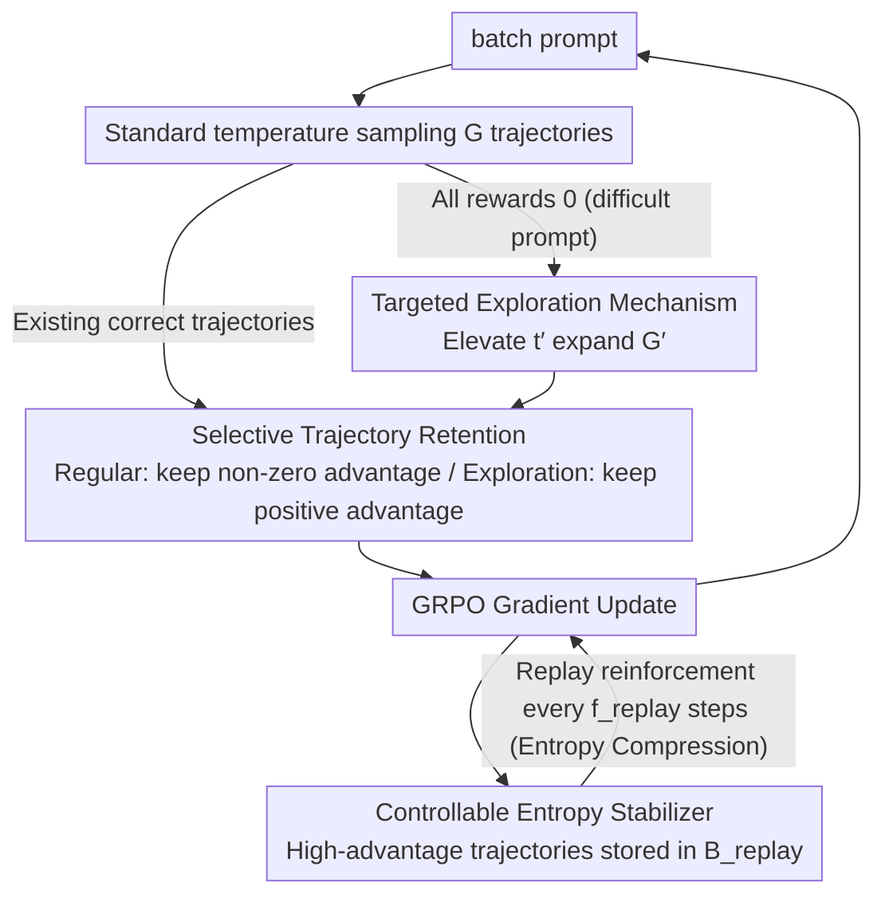

# Targeted Exploration via Unified Entropy Control for Reinforcement Learning

**Conference**: ACL 2026 Findings  
**arXiv**: [2604.14646](https://arxiv.org/abs/2604.14646)  
**Code**: [GitHub](https://github.com/597358816/UEC-RL)  
**Area**: Multimodal VLM  
**Keywords**: Entropy Control, GRPO, Exploration Strategy, Reinforcement Learning, Reasoning Enhancement

## TL;DR

Ours proposes UEC-RL, a unified bidirectional entropy control framework. By performing high-temperature targeted exploration for difficult prompts (increasing entropy) and consolidating high-quality trajectories via an experience replay stabilizer (decreasing entropy), it addresses the prevalent entropy collapse and training instability in GRPO, achieving a 37.9% relative gain on Geometry3K.

## Background & Motivation

**Background**: Reinforcement Learning (RL) has become a core paradigm for LLM/VLM post-training. GRPO is widely adopted as a lightweight alternative to PPO—it removes the critic network and estimates advantages through group-relative reward normalization, offering high computational efficiency and competitive reasoning performance.

**Limitations of Prior Work**: GRPO faces two prominent issues in complex reasoning tasks: (1) **Entropy Collapse**—the policy entropy drops rapidly, causing the model to converge prematurely to low-diversity behaviors and fail to discover low-probability but valuable reasoning paths; (2) **Training Instability**—in complex scenarios like multimodal reasoning, the correctness of sampled outputs varies significantly. The group-normalized rewards in GRPO fail to provide sufficient variance reduction, resulting in fragile gradient updates.

**Key Challenge**: GRPO lacks a bidirectional entropy regulation mechanism—it can neither actively increase entropy for enhanced exploration nor stabilize entropy in high-variance environments to ensure convergence. Existing remedies either introduce update variance (e.g., clip-higher in DAPO) or optimization bias (entropy rewards/shaping optimize entropy-related objectives rather than task rewards).

**Goal**: Design a unified framework to increase entropy for deep exploration when necessary and decrease entropy to ensure convergence when exploration becomes ineffective.

**Key Insight**: Based on the entropy change theorem of Natural Policy Gradient—when high-advantage actions have low probability under the current policy (negative covariance), the policy update increases entropy; otherwise, it decreases it. Therefore, negative covariance effects can be amplified by increasing the sampling temperature, selectively enhancing exploration for difficult prompts.

**Core Idea**: Implement bidirectional entropy control with two collaborative components—a Targeted Exploration mechanism (high-temperature sampling for difficult prompts + filtering valuable trajectories) and a Controllable Entropy Stabilizer (repetitive reinforcement of high-quality trajectories via experience replay to decrease entropy), dynamically balancing exploration and exploitation throughout training.

## Method

### Overall Architecture

UEC-RL is built upon GRPO. For each batch of prompts, $G$ trajectories are first sampled using a standard temperature. If all $G$ trajectories for a prompt yield zero rewards (marked as "difficult"), an additional $G'$ trajectories are sampled using an elevated temperature $t' > 1$. Valuable trajectories are filtered for gradient updates, while high-quality trajectories are stored in a replay buffer. Periodic replays from the buffer are performed to stabilize training.

### Key Designs

**1. Targeted Exploration: Targeted Temperature Elevation for "Stuck" Prompts**

The root of entropy collapse in GRPO is: once the model repeatedly fails to sample correct answers for certain difficult questions, the group-normalized advantages all become 0. These prompts stop contributing to gradients, forcing the model to narrow its focus only on simple tasks it has already mastered. UEC-RL uses a zero-cost signal to identify "difficult" cases—when the rewards of all $G$ trajectories sampled at standard temperature are 0 ($\max_i R_i = 0$). In such cases, it switches to a softened distribution (temperature $t' > 1$) to sample an additional $G'$ trajectories. This elevation is explained by the entropy change theorem: negative covariance occurs when high-advantage actions have low current policy probability, pushing entropy higher. $t'$ reduces the gap between high and low probability actions, precisely amplifying this negative covariance for "controlled" entropy increase. Since this is only activated for difficult prompts, the sampling overhead and distribution for simple prompts remain unaffected, directing the exploration budget precisely where needed.

**2. Controllable Entropy Stabilizer: Experience Replay for "Hard-Wiring" Good Trajectories to Reduce Entropy**

Unbounded temperature elevation would cause entropy to rise indefinitely and training to diverge. Thus, a reverse convergence force is required. The stabilizer stores high-advantage trajectories (advantage $> A_0$) discovered during exploration into a fixed-size replay buffer $\mathcal{B}_{replay}$, keeping only the latest $s'$ trajectories and performing a replay update every $f_{replay}$ steps. The key is that its entropy effect is exactly opposite to exploration: repeatedly reinforcing high-advantage trajectories shifts probability mass toward correct reasoning patterns, which produces positive covariance and decreases entropy according to Theorem 4.2. In other words, exploration "opens the gate for entropy," while replay "hard-wires good answers and pushes entropy back down." This push-pull dynamic allows training to transition naturally from exploration to convergence. Replay also addresses the sample efficiency issue where good trajectories initially have very low probabilities and a single gradient signal is too weak.

**3. Selective Trajectory Retention: Exploration is Not Blind Randomness**

Not all trajectories sampled via high temperature should enter the gradient—low-advantage exploration samples are essentially noise, and feeding them directly would pollute optimization and generalization. Retention rules differ by source: regular samples retain all non-zero advantage trajectories ($\hat{A}_{i,t} \neq 0$, both positive and negative, to provide full contrastive signals), while exploration samples from expanded sampling retain only positive advantage trajectories ($\hat{A}_{i,t} \geq 0$). This rule ensures "effective exploration"—emphasizing informative, high-quality diversity rather than injecting random noise for the sake of diversity.

### Loss & Training

Based on the GRPO objective function, a clipped surrogate objective with KL divergence regularization is used. Hyperparameters include exploration temperature $t'$, exploration group size $G'$, replay size $s'$, and replay frequency $f_{replay}$.

## Key Experimental Results

### Main Results (Textual Reasoning, Qwen2.5-math-7B)

| Method | AIME24 | MATH | GSM8K | MMLU | Average |
|------|--------|------|-------|------|------|
| GRPO | 25.8 | 77.6 | 87.1 | 45.0 | 50.34 |
| DAPO | 24.3 | 78.3 | 87.6 | 48.5 | 51.77 |
| **UEC-RL (Ours)** | **28.5** | **80.4** | **87.9** | **50.2** | **53.62** |

Geometry3K Multimodal Reasoning (Qwen2.5-VL-7B):

| Method | Accuracy | vs UEC-RL |
|------|--------|-----------|
| Baseline | 38.44 | -16.97 |
| GRPO | 50.75 | -4.66 |
| **UEC-RL (Ours)** | **55.41** | - |

### Ablation Study

| Configuration | Geometry3K | Description |
|------|-----------|------|
| UEC-RL (full) | 55.41 | Full model |
| w/o Exploration | ~50 | Returns to GRPO levels |
| w/o Replay | ~52 | Training instability |
| w/o Selective Retention | ~51 | Noisy samples affect optimization |

### Key Findings
- UEC-RL consistently outperforms all RL baselines in both textual and multimodal reasoning, with an average Gain of +2.88% (Qwen2.5-math-7B) and +1.07% (VLM).
- Achieves a 37.9% relative Gain on Geometry3K (38.44→55.41), while maintaining higher training efficiency (time per step is only 0.79× that of GRPO).
- UEC-RL consistently leads in Pass@k evaluations, indicating not only high top-1 accuracy but also better generation diversity.
- Both exploration and stabilization components are necessary: using either alone fails to achieve optimal results.

## Highlights & Insights
- **The bidirectional entropy control concept** is ingenious: it does not simply "slow down entropy decay" (like DAPO), but actively increases entropy when needed and decreases it when convergence is required. Theoretical guidance from the entropy change theorem makes the design more principled.
- **"Difficult prompt detection → Targeted Exploration"** strategy is practical: it identifies difficulty at zero cost (all sampling failures = difficult) and allocates computational budget only to difficult samples, ensuring high resource efficiency.
- **Application of Experience Replay in LLM RL**: Introducing replay ideas from classic RL into GRPO training improves sample efficiency and provides theoretically guaranteed entropy stabilization through repeated reinforcement.

## Limitations & Future Work
- Only validated on 7B/8B scale models; performance on larger models is unknown.
- Hyperparameters such as exploration temperature $t'$ and replay frequency $f_{replay}$ require tuning.
- Difficult prompt detection (all sampling failures) is binary and might miss "partially difficult" samples.
- Theoretical analysis is based on an approximation of Natural Policy Gradient; a gap exists with the actual clipped objective.
- Replay buffers may introduce distribution shift issues, though keeping only the latest trajectories mitigates this.

## Related Work & Insights
- **vs GRPO**: GRPO lacks entropy regulation; UEC-RL adds bidirectional control. Both use the same base objective function.
- **vs DAPO**: DAPO slows entropy decay via clip-higher but introduces update variance; UEC-RL controls entropy more precisely via targeted exploration and a replay stabilizer.
- **vs Entropy Reward/KL-cov**: These methods introduce bias by optimizing entropy-related terms; UEC-RL indirectly influences entropy by adjusting the sampling strategy without changing the optimization goal.

## Rating
- Novelty: ⭐⭐⭐⭐ The bidirectional entropy control framework is conceptually clear with solid theoretical support.
- Experimental Thoroughness: ⭐⭐⭐⭐ Covers text + multimodal, multiple benchmarks, Pass@1, and Pass@k.
- Writing Quality: ⭐⭐⭐⭐ Clear structure with coherent theoretical derivation and experimental analysis.
- Value: ⭐⭐⭐⭐ Provides practical guidance for improving GRPO training; code is open-source.

<!-- RELATED:START -->

## Related Papers

- [\[AAAI 2026\] Reasoning with Exploration: An Entropy Perspective](../../AAAI2026/reinforcement_learning/reasoning_with_exploration_an_entropy_perspective.md)
- [\[ACL 2026\] HEALing Entropy Collapse: Enhancing Exploration in Few-Shot RLVR via Hybrid-Domain Entropy Dynamics Alignment](healing_entropy_collapse_enhancing_exploration_in_few-shot_rlvr_via_hybrid-domai.md)
- [\[ACL 2026\] NaviMaster: Learning a Unified Policy for GUI and Embodied Navigation Tasks](navimaster_learning_a_unified_policy_for_gui_and_embodied_navigation_tasks.md)
- [\[ACL 2026\] Semantic-Space Exploration and Exploitation in RLVR for LLM Reasoning](semantic-space_exploration_and_exploitation_in_rlvr_for_llm_reasoning.md)
- [\[ICLR 2026\] Entropy-Preserving Reinforcement Learning (REPO / ADAPO)](../../ICLR2026/reinforcement_learning/entropy-preserving_reinforcement_learning.md)

<!-- RELATED:END -->
