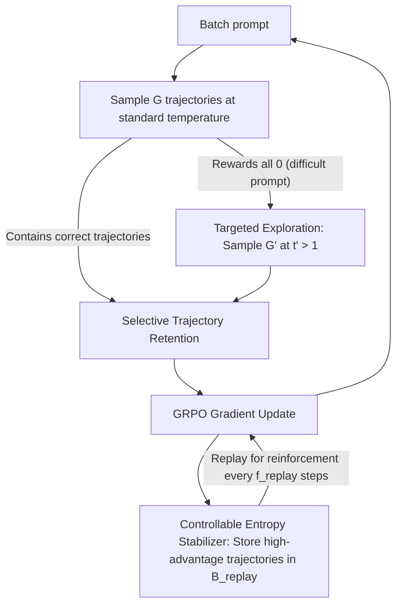

# Targeted Exploration via Unified Entropy Control for Reinforcement Learning

**Conference**: ACL 2026 Findings  
**arXiv**: [2604.14646](https://arxiv.org/abs/2604.14646)  
**Code**: [GitHub](https://github.com/597358816/UEC-RL)  
**Area**: Multimodal VLM  
**Keywords**: Entropy Control, GRPO, Exploration Strategy, Reinforcement Learning, Reasoning Enhancement

## TL;DR

This paper proposes UEC-RL, a unified bidirectional entropy control framework. It addresses the common issues of entropy collapse and training instability in GRPO through targeted high-temperature exploration for difficult prompts (increasing entropy) and experience replay stabilizers to consolidate high-quality trajectories (decreasing entropy), achieving a 37.9% relative improvement on Geometry3K.

## Background & Motivation

**Background**: Reinforcement Learning (RL) has become a core paradigm for LLM/VLM post-training. GRPO is widely adopted as a lightweight alternative to PPO—it removes the critic network and estimates advantages through group-relative reward normalization, offering high computational efficiency and competitive reasoning performance.

**Limitations of Prior Work**: GRPO faces two prominent issues in complex reasoning tasks: (1) **Entropy collapse**—policy entropy drops rapidly, causing the model to converge prematurely to low-diversity behaviors and failing to discover low-probability but valuable reasoning paths; (2) **Training instability**—in complex scenarios like multimodal reasoning, the correctness of sampled outputs varies significantly. GRPO's group-normalized rewards provide insufficient variance reduction, leading to fragile gradient updates.

**Key Challenge**: GRPO lacks a bidirectional entropy regulation mechanism—it can neither proactively increase entropy to enhance exploration nor stabilize entropy in high-variance environments to ensure convergence. Existing remedies either introduce update variance (e.g., DAPO's clip-higher) or optimization bias (entropy rewards/shaping optimize for entropy-related objectives rather than task rewards).

**Goal**: Design a unified framework to increase entropy for deep exploration when necessary and decrease entropy to ensure convergence when exploration becomes ineffective.

**Key Insight**: Based on the entropy change theorem of Natural Policy Gradient—policy updates increase entropy when high-advantage actions has low probability under the current policy (negative covariance) and decrease it otherwise. Therefore, entropy can be selectively increased for difficult prompts by raising the sampling temperature to amplify the negative covariance effect.

**Core Idea**: Implement bidirectional entropy control via two synergetic components—a targeted exploration mechanism (high-temperature sampling for difficult prompts + filtering valuable trajectories) and a controllable entropy stabilizer (reinforcing high-quality trajectories via experience replay to reduce entropy), dynamically balancing exploration and exploitation throughout training.

## Method

### Overall Architecture

UEC-RL is built upon GRPO. For each batch of prompts, $G$ trajectories are first sampled using a standard temperature. If all $G$ trajectories for a prompt yield zero rewards (labeled "difficult"), an additional $G'$ trajectories are sampled with an increased temperature $t' > 1$. Valuable trajectories are filtered for gradient updates, while high-quality trajectories are stored in a replay buffer. Periodic replay from the buffer is performed to stabilize training.

### Key Designs

**1. Targeted Exploration Mechanism: High-temperature exploration only for "stuck" prompts**

The root of entropy collapse in GRPO is that once a model repeatedly fails to sample correct answers for certain difficult problems, the group-normalized advantages become zero. These prompts stop contributing gradients, causing the model to narrow its focus only on simple problems it has already mastered. UEC-RL uses a zero-cost signal to identify "difficult" prompts—when the rewards of all $G$ trajectories from standard sampling are zero ($\max_i R_i = 0$). For these, it uses a softened distribution (temperature $t' > 1$) to sample an additional $G'$ trajectories. The effect of temperature elevation is explained by the entropy change theorem: negative covariance occurs when high-advantage actions have low probability, pushing entropy up. $t'$ narrows the gap between high and low probability actions, amplifying this negative covariance and "controllably" raising entropy. Since it is only activated for difficult prompts, the sampling overhead and distribution for simple prompts remain unaffected, focusing the exploration budget where it is needed most.

**2. Controllable Entropy Stabilizer: Consolidating good trajectories to reduce entropy**

Indefinite temperature increases would cause training divergence; thus, a counteracting convergence force is required. The stabilizer stores high-advantage trajectories (advantage $> A_0$) found during exploration into a fixed-size replay buffer $\mathcal{B}_{replay}$, keeping only the latest $s'$ trajectories, and performs a replay update every $f_{replay}$ steps. The key lies in its entropy effect, which is the inverse of exploration: repeatedly reinforcing high-advantage trajectories moves probability mass toward correct reasoning patterns. According to Theorem 4.2, this generates positive covariance, thereby reducing entropy. In essence, exploration "opens a gap to let entropy in," while replay "locks in the found answers and pushes entropy back down." This push-pull dynamic ensures a natural transition from exploration to convergence. Replay also addresses sample efficiency issues where high-quality trajectories might have too low an initial probability for a single gradient signal to be effective.

**3. Selective Trajectory Retention: Exploration is not indiscriminate encouragement of randomness**

Not all trajectories sampled via high temperature should enter the gradient calculation—low-advantage exploration samples are essentially noise and can pollute optimization. Retention rules are distinguished by source: for regular samples, all non-zero advantage trajectories are kept ($\hat{A}_{i,t} \neq 0$ for both positive and negative signals); for exploration samples from extended sampling, only positive advantage trajectories are kept ($\hat{A}_{i,t} \geq 0$). This rule ensures "effective exploration" by emphasizing informative, high-quality diversity rather than injecting random noise for the sake of diversity.

### Loss & Training

Based on the GRPO objective function, the framework uses a clipped surrogate objective with KL divergence regularization. Hyperparameters include exploration temperature $t'$, exploration group size $G'$, replay size $s'$, and replay frequency $f_{replay}$.

## Key Experimental Results

### Main Results (Textual Reasoning, Qwen2.5-math-7B)

| Method | AIME24 | MATH | GSM8K | MMLU | Average |
|------|--------|------|-------|------|------|
| GRPO | 25.8 | 77.6 | 87.1 | 45.0 | 50.34 |
| DAPO | 24.3 | 78.3 | 87.6 | 48.5 | 51.77 |
| **UEC-RL** | **28.5** | **80.4** | **87.9** | **50.2** | **53.62** |

Geometry3K Multimodal Reasoning (Qwen2.5-VL-7B):

| Method | Accuracy | vs UEC-RL |
|------|--------|-----------|
| Baseline | 38.44 | -16.97 |
| GRPO | 50.75 | -4.66 |
| **UEC-RL** | **55.41** | - |

### Ablation Study

| Configuration | Geometry3K | Description |
|------|-----------|------|
| UEC-RL (full) | 55.41 | Complete model |
| w/o Exploration | ~50 | Reverts to GRPO levels |
| w/o Replay | ~52 | Training becomes unstable |
| w/o Selective Retention | ~51 | Noisy samples impact optimization |

### Key Findings
- UEC-RL consistently outperforms all RL baselines in both textual and multimodal reasoning, with average improvements of +2.88% (Qwen2.5-math-7B) and +1.07% (VLM).
- Achieves a 37.9% relative improvement on Geometry3K (38.44 → 55.41) with higher training efficiency (step time is 0.79× that of GRPO).
- UEC-RL leads consistently in Pass@k evaluations, indicating not only higher top-1 accuracy but also better generation diversity.
- Both exploration and stabilization components are necessary: neither can achieve optimal results independently.

## Highlights & Insights
- **Bidirectional Entropy Control**: The approach is ingenious; rather than simply "slowing down entropy decay" (like DAPO), it actively increases entropy when needed and decreases it to ensure convergence. This theoretical guidance based on the entropy change theorem makes the design more principled.
- **Targeted Exploration**: The "difficult prompt detection → targeted exploration" strategy is practical, using a zero-cost signal (all samples failed = difficult) to allocate the computational budget efficiently.
- **Experience Replay in LLM RL**: Introducing replay concepts from classical RL into GRPO improves sample efficiency and provides theoretically guaranteed entropy stabilization.

## Limitations & Future Work
- Validated only on 7B/8B scale models; performance on larger models is unknown.
- Hyperparameters such as exploration temperature $t'$ and replay frequency $f_{replay}$ require tuning.
- Difficult prompt detection (all samples failed) is binary and may miss "partially difficult" samples.
- Theoretical analysis is based on Natural Policy Gradient approximations, leaving a gap with the actual clipped objective.
- The replay buffer may introduce distribution shift issues, although keeping only recent trajectories mitigates this.

## Related Work & Insights
- **vs GRPO**: GRPO lacks entropy regulation; UEC-RL adds bidirectional entropy control while using the same base objective.
- **vs DAPO**: DAPO slows down entropy decay via clip-higher but introduces update variance; UEC-RL controls entropy more precisely via targeted exploration and replay.
- **vs Entropy Rewards/KL-cov**: These methods introduce bias by optimizing entropy-related terms; UEC-RL influences entropy indirectly by adjusting the sampling strategy without changing the optimization goal.

## Rating
- Novelty: ⭐⭐⭐⭐ Clear bidirectional entropy control framework with solid theoretical support.
- Experimental Thoroughness: ⭐⭐⭐⭐ Covers text/multimodal tasks, multiple benchmarks, and Pass@1/Pass@k metrics.
- Writing Quality: ⭐⭐⭐⭐ Well-structured with coherent theoretical derivation and experimental analysis.
- Value: ⭐⭐⭐⭐ Provides practical guidance for improving GRPO training; code is open-source.

<!-- RELATED:START -->

## Related Papers

- [\[AAAI 2026\] Reasoning with Exploration: An Entropy Perspective](../../AAAI2026/reinforcement_learning/reasoning_with_exploration_an_entropy_perspective.md)
- [\[ACL 2026\] HEALing Entropy Collapse: Enhancing Exploration in Few-Shot RLVR via Hybrid-Domain Entropy Dynamics Alignment](healing_entropy_collapse_enhancing_exploration_in_few-shot_rlvr_via_hybrid-domai.md)
- [\[ACL 2026\] NaviMaster: Learning a Unified Policy for GUI and Embodied Navigation Tasks](navimaster_learning_a_unified_policy_for_gui_and_embodied_navigation_tasks.md)
- [\[ICLR 2026\] Entropy-Preserving Reinforcement Learning (REPO / ADAPO)](../../ICLR2026/reinforcement_learning/entropy-preserving_reinforcement_learning.md)
- [\[ACL 2026\] Semantic-Space Exploration and Exploitation in RLVR for LLM Reasoning](semantic-space_exploration_and_exploitation_in_rlvr_for_llm_reasoning.md)

<!-- RELATED:END -->
