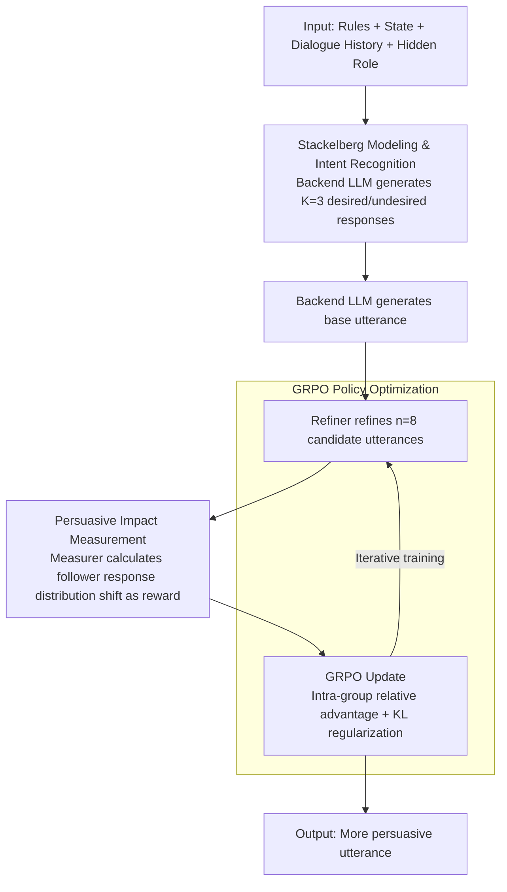

# The Stackelberg Speaker: Optimizing Persuasive Communication in Social Deduction Games

**Conference**: ACL 2026  
**arXiv**: [2510.09087](https://arxiv.org/abs/2510.09087)  
**Code**: [https://3dagentworld.github.io/leader_follower](https://3dagentworld.github.io/leader_follower)  
**Area**: Reinforcement Learning / Social Deduction Games  
**Keywords**: Persuasive Communication, Social Deduction Games, Stackelberg Game, GRPO, LLM Agents

## TL;DR

This paper models turn-based dialogues in Social Deduction Games (SDGs) as a Stackelberg game, where the current player acts as a leader optimizing the persuasiveness of an utterance by measuring the response distribution of the next player. A Refiner model trained using GRPO significantly outperforms baselines across four game benchmarks, including Werewolf and Avalon.

## Background & Motivation

**Background**: LLM agents have achieved significant progress in Social Deduction Games (SDGs) such as Werewolf and Avalon. Existing methods primarily focus on information processing (inferring roles of other players) and strategic selection (choosing optimal actions).

**Limitations of Prior Work**: Current approaches overlook the core role of persuasive communication—in SDGs, success depends not only on making correct inferences but also on persuading others to act according to one's intent. Existing RL methods (e.g., SLA, LSPO) simplify the rich natural language space into limited action classification problems, failing to optimize utterances in the continuous language space.

**Key Challenge**: The core challenge of SDGs is not "knowing what is right," but "making others believe you are right." The persuasive dimension is central to game success and real human interaction but remains nearly untouched in current research.

**Goal**: Explicitly model and optimize persuasive communication in SDGs, enabling agents to actively guide the dialogue flow toward favorable outcomes.

**Key Insight**: Borrow the Stackelberg game framework from game theory—if a leader fully understands the follower's response distribution to different actions, they can choose the action that maximizes their own utility. In turn-based dialogue, the current speaker is the leader.

**Core Idea**: Train a Refiner model to refine base utterances into more persuasive versions. The reward signal is based on the shift in the next player's response probability distribution caused by that utterance (increasing desired response probabilities and decreasing undesired ones).

## Method

### Overall Architecture

The process consists of three steps: (1) Intent Recognition—the API LLM analyzes the current situation to generate $K=3$ sets of desired and undesired follower responses; (2) Impact Measurement—the API LLM generates a base utterance, the Refiner refines it into multiple candidates, and a Measurer calculates the shift in the follower's response distribution for each candidate as the reward; (3) Policy Optimization—GRPO is used to optimize the Refiner to maximize persuasive impact.

### Key Designs

**1. Stackelberg Modeling & Intent Recognition: Mapping Persuasion to an Optimizable Objective**

The most difficult aspect to quantify in SDGs is "persuasiveness"—it is neither win rate (too delayed and sparse) nor simple action classification (as in SLA or LSPO, which simplify natural language and eliminate the persuasion dimension). This paper utilizes the Stackelberg game framework: in each speaking turn, the current player $p_t$ is the leader and the next player $p_{t+1}$ is the follower. The leader's goal is to anticipate the follower's reaction and select the most advantageous utterance. In implementation, the backend LLM synthesizes game rules $\mathcal{R}$, state $G_t$, dialogue history $D_t$, and the hidden role $r_t$ to generate $K=3$ sets of desired responses $\hat{u}_{t+1}^{+,(k)}$ and undesired responses $\hat{u}_{t+1}^{-,(k)}$. This step operationalizes the vague goal of "making them believe me" into explicit target responses, paving the way for scoring via probability shifts.

**2. Persuasive Impact Measurement: Scoring Utterances in the Follower's Probability Space**

With target responses defined, an objective metric is needed to measure persuasiveness. Rather than using subjective human annotation or unreliable heuristics, this method uses Qwen2.5-72B as a Measurer to simulate follower response patterns, measuring directly in its probability space. For a candidate utterance $u_t^{(i)}$, the reward is the sum of log probabilities of desired responses minus the sum of log probabilities of undesired responses:

$$R(u_t^{(i)}) = \sum_k \log P_\mathcal{F}(\hat{u}_{t+1}^{+,(k)} | \text{ctx} \cup \{u_t^{(i)}\}) - \sum_k \log P_\mathcal{F}(\hat{u}_{t+1}^{-,(k)} | \text{ctx} \cup \{u_t^{(i)}\})$$

Essentially, the more an utterance increases the probability of "what we want them to say" and decreases the probability of "what we don't want them to say," the higher the score. Using an independent LLM with accessible probabilities as a follower bypasses the limitation where API LLMs like GPT-4o do not provide token probabilities.

**3. GRPO Policy Optimization: Specializing Small Models for Utterance Enhancement**

The reward signal is used to train the Refiner—a Qwen2.5-7B model with LoRA (rank 16) dedicated to refining base utterances from the strong API LLM. For each base utterance, $n=8$ candidates are sampled. GRPO calculates relative advantages within the group for policy updates, including a KL divergence penalty to prevent divergence. GRPO is selected because it does not require an additional critic; updates are performed using the reward distribution of the 8 candidates. This division of labor—where the strong API LLM handles semantic understanding and the small Refiner handles persuasive enhancement—allows the method to be layered on top of any existing strategy.

### Loss & Training

The GRPO objective is: $$\mathcal{J}(\theta) = \mathbb{E}_c[\frac{1}{n}\sum_i \mathcal{L}_i - \beta D_{KL}(\pi_\theta || \pi_{ref})]$$, with $n=8, \epsilon=0.2, \beta=0.04$. 4000 instances were collected from 500 self-play games for training. The backend LLM was randomly selected from GPT-4o, Gemini-2.5-Flash, and Claude-3.5-Haiku. The learning rate was $1 \times 10^{-6}$, and training took approximately 50 hours on 4×A800 for 3 epochs.

## Key Experimental Results

### Main Results

| Game | Method | Overall Win Rate |
|------|------|---------|
| Werewolf | LSPO | 38.6% |
| Werewolf | **Ours + LSPO** | **44.7%** |
| Avalon | Strategist | 57.4% |
| Avalon | **Ours + Strategist** | **61.3%** |
| ONUW | RL-ins. | 48.5% |
| ONUW | **Ours + RL-ins.** | **51.5%** |

### Ablation Study

| Reward Variant | Werewolf Avg | Avalon Avg | ONUW Avg |
|---------|-----------|-----------|---------|
| ReAct (Baseline) | 49.0 | 44.0 | 48.0 |
| Pos-Only + ReAct | 64.0 | 58.0 | 60.0 |
| Neg-Only + ReAct | 49.0 | 46.0 | 47.0 |
| **Ours + ReAct** | **70.0** | **61.0** | **61.0** |

### Key Findings

- Positive rewards (increasing desired response probability) contribute significantly more than negative rewards.
- The Refiner performs better when combined with strong baselines, indicating the method complements rather than replaces existing strategies.
- Improvement is particularly notable for deceptive roles—in Werewolf, the Werewolf win rate increased from 79% to 84.2%.
- The method successfully generalizes to the Sotopia social simulation environment, beyond just SDGs.

## Highlights & Insights

- Modeling turn-based dialogue as a Stackelberg game is highly natural; quantifying persuasiveness as "follower response probability shift" is more granular than directly optimizing for win rates.
- Simulating the follower's response distribution with an independent LLM skillfully bypasses the token probability accessibility issues of API LLMs.
- Positioning the Refiner as an "utterance polisher" is practical—it retains the semantic understanding of strong API LLMs while the small model specializes in persuasive enhancement.

## Limitations & Future Work

- The Measurer uses a fixed LLM to simulate the follower, while real opponent behaviors may differ.
- Full information (known opponent roles) was used during training, which is unavailable during inference.
- Each game requires a separately trained checkpoint; cross-game transfer has not been explored.

## Related Work & Insights

- **vs SLA/LSPO**: These simplify language into finite candidate choices, whereas this work optimizes directly in the continuous language space. The Refiner can be used as a modular addition.
- **vs Cicero**: Cicero seeks global equilibrium in Diplomacy; this paper uses local Stackelberg optimization to avoid computational intractability.

## Rating

- Novelty: ⭐⭐⭐⭐⭐ The combination of Stackelberg modeling and persuasive rewards is novel.
- Experimental Thoroughness: ⭐⭐⭐⭐⭐ Covers three SDGs plus Sotopia, multiple baseline integrations, and complete ablations.
- Writing Quality: ⭐⭐⭐⭐ Theoretically sound, though some sections are formula-dense.
- Value: ⭐⭐⭐⭐ Provides a feasible framework for persuasive communication in LLM agents.

<!-- RELATED:START -->

<!-- RELATED:END -->

## Related Papers

- [\[ICML 2026\] Learning in Structured Stackelberg Games](../../ICML2026/reinforcement_learning/learning_in_structured_stackelberg_games.md)
- [\[ICLR 2026\] Learning to Play Multi-Follower Bayesian Stackelberg Games](../../ICLR2026/reinforcement_learning/learning_to_play_multi-follower_bayesian_stackelberg_games.md)
- [\[ICLR 2026\] Nearly-Optimal Bandit Learning in Stackelberg Games with Side Information](../../ICLR2026/reinforcement_learning/nearly-optimal_bandit_learning_in_stackelberg_games_with_side_information.md)
- [\[NeurIPS 2025\] Learning in Stackelberg Mean Field Games: A Non-Asymptotic Analysis](../../NeurIPS2025/reinforcement_learning/learning_in_stackelberg_mean_field_games_a_non-asymptotic_analysis.md)
- [\[ACL 2026\] Breaking the Impasse: Dual-Scale Evolutionary Policy Training for Social Language Agents](breaking_the_impasse_dual-scale_evolutionary_policy_training_for_social_language.md)

<!-- RELATED:END -->
