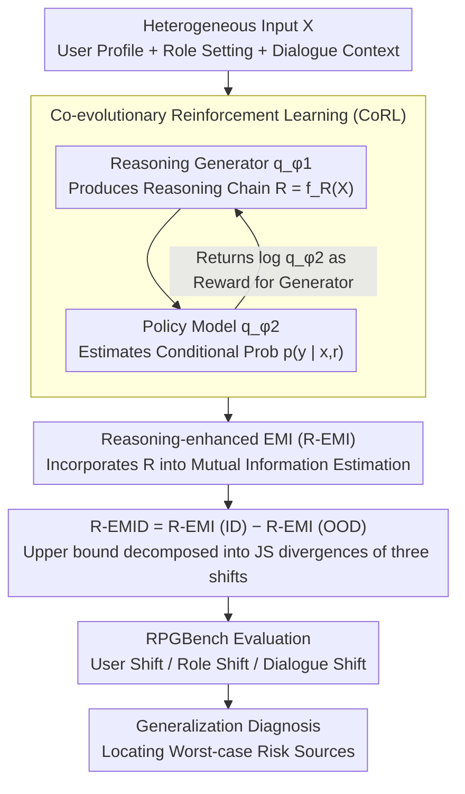

# Understanding Generalization in Role-Playing Models via Information Theory

**Conference**: ACL 2026 Findings  
**arXiv**: [2512.17270](https://arxiv.org/abs/2512.17270)  
**Code**: [GitHub](https://github.com/AlibabaResearch/DAMO-ConvAI/tree/main/RPM-Generalization)  
**Area**: Reinforcement Learning / Role-Playing Models  
**Keywords**: Role-playing models, generalization, information theory, distribution shift, reinforcement learning

## TL;DR

This paper proposes the first information-theoretic framework, R-EMID, to quantify the performance degradation of Role-Playing Models (RPMs) under distribution shifts of users, roles, and dialogues. By introducing intermediate reasoning processes and Co-evolutionary Reinforcement Learning (CoRL) for accurate estimation, it identifies user shift as the primary generalization risk and finds that reinforcement learning is the only consistently effective method for improvement.

## Background & Motivation

**Background**: Role-playing models (RPMs) are critical applications of LLMs, widely deployed in entertainment, education, and emotional companionship. Platforms like Character.AI serve global users, requiring RPMs to handle diverse linguistic and cultural backgrounds, simulate unseen characters, and manage increasingly complex multi-turn dialogues.

**Limitations of Prior Work**: (1) RPMs often fail in real-world deployment (e.g., cultural inappropriateness, character inconsistency), yet a theoretical framework to systematically understand these failures is lacking; (2) Empirical methods like LLM-as-a-judge cannot provide fine-grained diagnostics—they indicate performance drops but fail to identify which specific shift caused the degradation; (3) There is no formal framework connecting distribution shifts to performance degradation, preventing worst-case risk analysis.

**Key Challenge**: RPM inputs are inherently heterogeneous (user profiles, character settings, dialogue contexts). Directly estimating the conditional response generation probability $p(y|x)$ is extremely difficult, yet it is essential for information-theoretic generalization metrics.

**Goal**: (1) Define three categories of distribution shifts in RPMs; (2) Propose information-theoretic metrics to quantify performance degradation; (3) Derive upper bounds to predict worst-case performance; (4) Systematically evaluate the generalization effects of various training methods.

**Key Insight**: Building on the existing EMID framework, this work introduces an intermediate reasoning process $R = f_R(X)$ to transform the complex dependencies of heterogeneous inputs into explicit connections within a reasoning chain, making conditional probability estimation more feasible.

**Core Idea**: Quantify RPM performance degradation via Reasoning-enhanced Effective Mutual Information Difference (R-EMID), using Co-evolutionary Reinforcement Learning to train the reasoning generator and policy model for accurate metric estimation.

## Method

### Overall Architecture

The R-EMID framework consists of three levels: (1) Theoretical Metric Level—defining R-EMI and R-EMID to quantify performance on a given distribution and cross-distribution degradation; (2) Estimation Level—employing two LLMs (a reasoning generator $q_{\phi_1}$ and a policy model $q_{\phi_2}$) via CoRL for accurate conditional probability estimation; (3) Application Level—utilizing R-EMID and its upper bound to evaluate the generalization of various RPM training methods.

### Key Designs

**1. Reasoning-enhanced Effective Mutual Information Difference (R-EMID): A Computable Metric for Performance Degradation**

To quantify degradation across distributions, the most natural tool is the Effective Mutual Information Difference (EMID). However, it requires direct estimation of $p(y|x)$—an impossible task for RPMs where input $x$ is a tangled heterogeneity of user, role, and context. R-EMID resolves this by inserting an intermediate reasoning variable $R = f_R(X)$, expanding $I(P_{XY})$ to $I(P_{X_R Y})$ (where $X_R = (X, R)$). This explicitly represents the dependencies within the reasoning chain. R-EMID is defined as the difference between R-EMI on the ID and OOD distributions, and its upper bound can be decomposed into the sum of JS divergences of the three shifts:

$$\sqrt{2/3}\,\hat{H} \sum_{z} D_{JS}^{1/2}(P_{X_z} \| Q_{X_z}) + 8\Delta^{1/4}$$

This decomposition allows for a grounded worst-case risk analysis by assigning specific contributions to user, role, and dialogue shifts.

**2. Co-evolutionary Reinforcement Learning (CoRL): Mutually Rewarding Reasoning and Policy Models**

Accurate R-EMID requires both useful reasoning and precise probability estimation. CoRL enables the reasoning generator $q_{\phi_1}(r|x)$ and the policy model $q_{\phi_2}(y|x,r)$ to evolve together. The generator produces reasoning to help the policy extract useful information, while the policy model feeds its log-probability back as a reward. Both are optimized using GRPO. This "Reasoning Quality ↑ → Probability Estimation ↑ → Reasoning Reward ↑" cycle avoids distribution mismatch and ensures estimation accuracy.

**3. RPGBench: A Comprehensive Benchmark for Three Shift Categories**

To validate R-EMID and compare training methods, a dataset covering all three shifts is required. RPGBench fills this gap with 17k samples: 5k ID samples (English users, real roles, 4-turn dialogues) and specific OOD sections—User Shift (5 non-English cultures), Role Shift (fictional characters), and Dialogue Shift (8-turn long dialogues or word-level reshuffling). This controlled design aligns empirical evaluation with the theoretical R-EMID upper bound.

### Loss & Training

CoRL is optimized using GRPO. Both modules are initialized via SFT and then trained through alternating RL. Experiments use Qwen3-4B and LLaMA-3-8B. Evaluation involves correlation analysis of 121 pairs across 11 LLMs and 11 shift scenarios.

## Key Experimental Results

### Main Results

| Training Method | ID R-EMI | OOD-ZH R-EMI | OOD-Fictional Role R-EMI | Max Risk↓ |
|:---|:---|:---|:---|:---|
| SFT | Baseline | Significant Drop | Moderate Drop | High |
| Data Aug | Unstable | Unstable | Unstable | Unstable |
| **RL** | **Improved** | **Improved** | **Improved** | **Lowest** |
| ThinkingSFT | Decrease | Decrease | Decrease | High |
| ThinkingRL | Decrease | Decrease | Decrease | High |

### Ablation Study

| Configuration | ID Perplexity | User Shift | Role Shift | Dialogue Shift |
|:---|:---|:---|:---|:---|
| Full (CoRL+Reasoning) | 4.852 | 4.525 | 5.048 | 5.469 |
| w/o CoRL | 5.457 | 5.108 | 5.779 | 5.988 |
| w/o Reasoning | 6.266 | 5.596 | 6.413 | 6.846 |

### Key Findings

- **Finding 1**: User shift presents the greatest generalization risk as changes in user background cascade through role selection and dialogue content.
- **Finding 2**: RL is the only consistently effective method—the SFT baseline outperforms data augmentation and Chain-of-Thought (Thinking) training in most shift scenarios.
- **Finding 3**: Naive integration of reasoning trajectories is harmful—ThinkingSFT and ThinkingRL perform worse than standard SFT.
- R-EMID shows a strong Pearson correlation with LLM-as-a-judge scores, validating the metric's effectiveness.

## Highlights & Insights

- First application of information-theoretic generalization theory to RPMs, providing a theoretical tool beyond empirical evaluation.
- The decomposed R-EMID upper bound reveals the individual contributions of different shifts, guiding targeted model improvements.
- The finding that "reasoning trajectories do not necessarily improve generalization" challenges the intuition that adding internal thought always helps.

## Limitations & Future Work

- The reasoning process introduces computational overhead; while trajectories can be cached, efficiency remains a concern.
- The theoretical R-EMID upper bound is not yet perfectly tight, leaving room for refinement.
- Validated only on Qwen3-4B and LLaMA-3-8B; generalization behavior might differ in larger models.
- The OOD construction in RPGBench may not fully cover all real-world distribution shifts.

## Related Work & Insights

- **vs EMID (Oh et al.)**: Original EMID correlates poorly with heterogeneous inputs; R-EMID improves this significantly via reasoning variables.
- **vs LLM-as-a-judge**: LLM-as-a-judge is empirical; R-EMID provides a theoretical upper bound and risk prediction with provable guarantees.
- **vs Data Augmentation**: DA requires prior knowledge of target distributions, which is often unavailable in RPM scenarios.

## Rating

- Novelty: ⭐⭐⭐⭐⭐ First info-theoretic framework for RPM generalization; innovative theory and methodology.
- Experimental Thoroughness: ⭐⭐⭐⭐ Large-scale validation across 11 models and 11 shifts, though training experiments were limited to two models.
- Writing Quality: ⭐⭐⭐⭐ Clear theoretical derivation, though high notation density requires careful reading.
- Value: ⭐⭐⭐⭐⭐ Provides both a theoretical foundation and practical guidance for RPM generalization.

<!-- RELATED:START -->

## Related Papers

- [\[ICML 2026\] Game of Thought: Robust Information Seeking with Large Language Models Using Game Theory](../../ICML2026/reinforcement_learning/game_of_thought_robust_information_seeking_with_large_language_models_using_game.md)
- [\[CVPR 2026\] Cloning Deterministic Worlds: The Critical Role of Latent Geometry in Long-Horizon World Models](../../CVPR2026/reinforcement_learning/cloning_deterministic_worlds_the_critical_role_of_latent_geometry_in_long-horizo.md)
- [\[ICLR 2026\] Unveiling the Cognitive Compass: Theory-of-Mind-Guided Multimodal Emotion Reasoning](../../ICLR2026/reinforcement_learning/unveiling_the_cognitive_compass_theory-of-mind-guided_multimodal_emotion_reasoni.md)
- [\[ICLR 2026\] Understanding and Improving Hyperbolic Deep Reinforcement Learning](../../ICLR2026/reinforcement_learning/understanding_and_improving_hyperbolic_deep_reinforcement_learning.md)
- [\[ICML 2026\] Safety Generalization Under Distribution Shift in Safe Reinforcement Learning: A Diabetes Testbed](../../ICML2026/reinforcement_learning/safety_generalization_under_distribution_shift_in_safe_reinforcement_learning_a_.md)

<!-- RELATED:END -->
