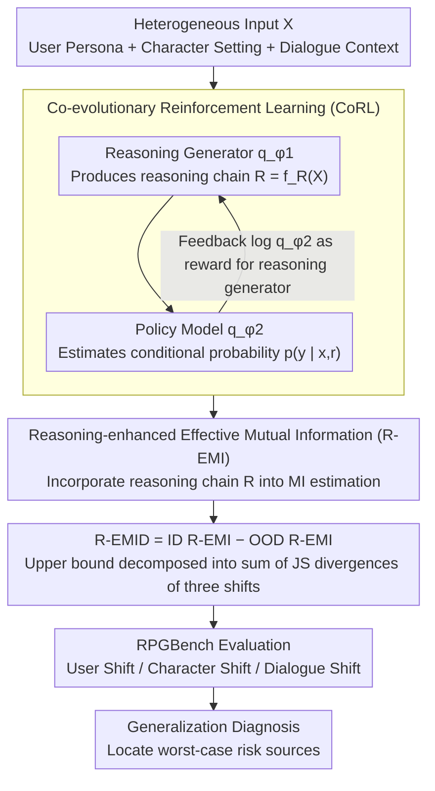

# Understanding Generalization in Role-Playing Models via Information Theory

**Conference**: ACL 2026 Findings  
**arXiv**: [2512.17270](https://arxiv.org/abs/2512.17270)  
**Code**: [GitHub](https://github.com/AlibabaResearch/DAMO-ConvAI/tree/main/RPM-Generalization)  
**Area**: Reinforcement Learning / Role-Playing Models  
**Keywords**: Role-playing models, Generalization, Information theory, Distribution shift, Reinforcement learning

## TL;DR

This paper proposes the first information-theoretic framework, R-EMID, to quantify the performance degradation of role-playing models (RPMs) under user/character/dialogue distribution shifts. By introducing reasoning processes and Co-evolutionary Reinforcement Learning (CoRL) for accurate estimation, the study finds that user shift poses the greatest generalization risk, and reinforcement learning is the only consistently effective improvement method.

## Background & Motivation

**Background**: Role-playing models (RPMs) are critical applications of LLMs, widely deployed in entertainment, education, and emotional companionship. Platforms like Character.AI serve global users, requiring RPMs to handle users from diverse linguistic and cultural backgrounds, simulate unseen characters, and manage increasingly complex multi-turn dialogues.

**Limitations of Prior Work**: (1) RPMs often experience failures like cultural inappropriateness and character inconsistency in deployment, yet there is a lack of a theoretical framework for systematic understanding; (2) Empirical methods like LLM-as-a-judge cannot provide fine-grained diagnostics—they indicate performance drops but fail to pinpoint which shift caused the degradation; (3) The absence of a formalized framework linking distribution shifts to performance degradation precludes worst-case risk analysis.

**Key Challenge**: RPM inputs are inherently heterogeneous (user persona, character setting, dialogue context), making direct estimation of the conditional response generation probability $p(y|x)$ extremely difficult, which is essential for information-theoretic generalization metrics.

**Goal**: (1) Define three categories of distribution shifts in RPMs; (2) Propose information-theoretic metrics to quantify performance degradation; (3) Derive an upper bound to predict worst-case scenarios; (4) Systematically evaluate the generalization effects of various training methods.

**Key Insight**: By introducing an intermediate reasoning process $R = f_R(X)$ based on the existing EMID framework, complex dependencies of heterogeneous inputs are transformed into explicit connections within a reasoning chain, making conditional probability estimation feasible.

**Core Idea**: Performance degradation in RPMs is quantified via Reasoning-enhanced Effective Mutual Information Difference (R-EMID), using Co-evolutionary Reinforcement Learning to train a reasoning generator and a policy model for accurate estimation of this metric.

## Method

### Overall Architecture

The R-EMID framework consists of three levels: (1) Theoretical Metric Level—defining R-EMI and R-EMID to quantify performance on a given distribution and cross-distribution degradation; (2) Estimation Level—utilizing two LLMs (a reasoning generator $q_{\phi_1}$ and a policy model $q_{\phi_2}$) via CoRL for accurate conditional probability estimation; (3) Application Level—using R-EMID and its upper bound to evaluate the generalization of various RPM training methods.

### Key Designs

**1. Reasoning-enhanced Effective Mutual Information Difference (R-EMID): A Computable Metric for Performance Degradation**

To quantify RPM degradation across distributions, Effective Mutual Information Difference (EMID) is the natural tool. However, it requires direct estimation of $p(y|x)$—which is nearly impossible for RPMs where input $x$ is a tangled heterogeneity of user, character, and context. R-EMID breaks this by inserting an intermediate reasoning variable $R = f_R(X)$, expanding $I(P_{XY})$ to $I(P_{X_R Y})$ (where $X_R = (X, R)$). This makes implicit dependencies explicit in the reasoning chain, facilitating probability estimation. R-EMID is defined as the difference between R-EMI on the ID distribution and OOD distribution, and can be further decomposed into an upper bound sum of JS divergences of the three shift types:

$$\sqrt{2/3}\,\hat{H} \sum_{z} D_{JS}^{1/2}(P_{X_z} \| Q_{X_z}) + 8\Delta^{1/4}$$

This upper bound allows "total degradation" to be decomposed into contributions from user, character, and dialogue, enabling evidence-based worst-case risk analysis rather than vague performance drop observations.

**2. Co-evolutionary Reinforcement Learning (CoRL): Mutual Rewards for Reasoner and Policy Model**

Accurate R-EMID calculation requires a useful reasoning process and a reliable conditional probability estimate. These are interdependent; training them separately leads to distribution mismatch. CoRL enables co-evolution: the reasoning generator $q_{\phi_1}(r|x)$ produces reasoning chains to help the policy model extract useful information, while the policy model $q_{\phi_2}(y|x,r)$ feeds its log probability back to the reasoner as a reward. Both are optimized alternately using GRPO. This "Reasoning Quality↑ → Probability Estimation↑ → Reasoning Reward↑" cycle avoids the misalignment that occurs when modules are optimized independently.

**3. RPGBench Evaluation Suite: Categorizing Three Shifts Simultaneously**

Validating R-EMID's diagnostic capabilities and comparing training methods requires a dataset covering all three shifts, which was previously unavailable. RPGBench fills this gap with 17k samples: 5k ID samples (English users, real characters, 4-turn dialogues) as a baseline, and OOD sections constructed for each dimension—user shift (5 non-English cultural backgrounds), character shift (fictional characters), and dialogue composition shift (8-turn long dialogues or word-level shuffling). This controlled shift design corresponds directly to the three JS divergence terms in the R-EMID upper bound.

### Loss & Training

CoRL is optimized based on GRPO, with both modules initialized via SFT before alternating RL. Models used are Qwen3-4B and LLaMA-3-8B. Evaluation involves correlation analysis of 121 pairs across 11 LLMs in 11 shift scenarios.

## Key Experimental Results

### Main Results

| Training Method | ID R-EMI | OOD-ZH R-EMI | OOD-Fictional R-EMI | Max Risk↓ |
|---------|---------|-------------|------------------|---------|
| SFT | Baseline | Significant Drop | Medium Drop | High |
| Data Aug | Unstable | Unstable | Unstable | Unstable |
| **RL** | **Improve** | **Improve** | **Improve** | **Lowest** |
| ThinkingSFT | Decrease | Decrease | Decrease | Higher |
| ThinkingRL | Decrease | Decrease | Decrease | Higher |

### Ablation Study

| Configuration | ID Perplexity | User Shift | Character Shift | Dialogue Shift |
|------|---------|---------|---------|---------|
| Full (CoRL + Reasoning) | 4.852 | 4.525 | 5.048 | 5.469 |
| w/o CoRL | 5.457 | 5.108 | 5.779 | 5.988 |
| w/o Reasoning | 6.266 | 5.596 | 6.413 | 6.846 |

### Key Findings

- **Finding 1**: User shift introduces the greatest generalization risk, as changes in user background cascade into character selection and dialogue content.
- **Finding 2**: RL is the only consistently effective method—the SFT baseline outperforms data augmentation and Chain-of-Thought (CoT) training in all shift scenarios.
- **Finding 3**: Naively adding reasoning trajectories is harmful—ThinkingSFT and ThinkingRL perform worse than standard SFT.
- The Pearson correlation coefficient between R-EMID and LLM-as-a-judge metrics reaches a strong level, validating the metric's effectiveness.

## Highlights & Insights

- First application of information-theoretic generalization theory to role-playing models, providing a theoretical tool beyond empirical evaluation.
- The decomposition of the R-EMID upper bound reveals the individual contributions of the three shifts, guiding targeted improvements.
- The finding that "reasoning trajectories do not necessarily improve generalization" challenges the intuition that adding reasoning always boosts performance.

## Limitations & Future Work

- The reasoning process increases computational overhead; while trajectories can be pre-cached, it remains inefficient.
- The R-EMID upper bound is theoretically loose and has room for refinement.
- Validated only on Qwen3-4B and LLaMA-3-8B; generalization behavior in larger models may differ.
- The OOD construction in RPGBench may not fully cover distribution shifts present in real-world deployments.

## Related Work & Insights

- **vs EMID (Oh et al.)**: Original EMID shows weak correlation on heterogeneous inputs (low correlation with LLM-as-a-judge); R-EMID improves this significantly via reasoning variables.
- **vs LLM-as-a-judge**: LLM-as-a-judge is an empirical metric without theoretical upper bounds or risk prediction; R-EMID provides provable generalization guarantees.
- **vs Data Augmentation**: DA relies on prior knowledge of target distributions, which is usually unavailable in RPM scenarios.

## Rating

- Novelty: ⭐⭐⭐⭐⭐ First information-theoretic framework for RPM generalization; innovative theory and empirical results.
- Experimental Thoroughness: ⭐⭐⭐⭐ Large-scale validation across 11 models and 11 shifts, though training experiments were limited to two models.
- Writing Quality: ⭐⭐⭐⭐ Clear theoretical derivation, though high notation density requires careful reading.
- Value: ⭐⭐⭐⭐⭐ Provides a theoretical foundation and practical guidance for RPM generalization.

<!-- RELATED:START -->

## Related Papers

- [\[ICML 2026\] Game of Thought: Robust Information Seeking with Large Language Models Using Game Theory](../../ICML2026/reinforcement_learning/game_of_thought_robust_information_seeking_with_large_language_models_using_game.md)
- [\[ICLR 2026\] Unveiling the Cognitive Compass: Theory-of-Mind-Guided Multimodal Emotion Reasoning](../../ICLR2026/reinforcement_learning/unveiling_the_cognitive_compass_theory-of-mind-guided_multimodal_emotion_reasoni.md)
- [\[ICLR 2026\] Understanding and Improving Hyperbolic Deep Reinforcement Learning](../../ICLR2026/reinforcement_learning/understanding_and_improving_hyperbolic_deep_reinforcement_learning.md)
- [\[ICML 2026\] Safety Generalization Under Distribution Shift in Safe Reinforcement Learning: A Diabetes Testbed](../../ICML2026/reinforcement_learning/safety_generalization_under_distribution_shift_in_safe_reinforcement_learning_a_.md)
- [\[ICLR 2026\] MergeMix: A Unified Augmentation Paradigm for Visual and Multi-Modal Understanding](../../ICLR2026/reinforcement_learning/mergemix_a_unified_augmentation_paradigm_for_visual_and_multi-modal_understandin.md)

<!-- RELATED:END -->
