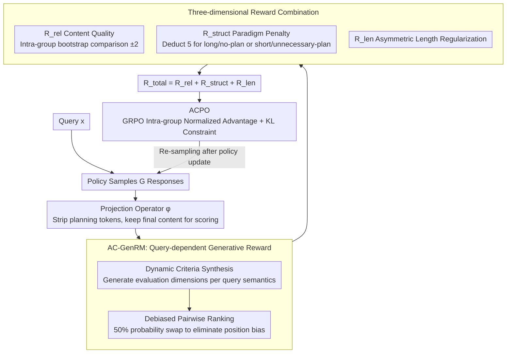

# UniCreative: Unifying Long-form Logic and Short-form Sparkle via Reference-Free Reinforcement Learning

**Conference**: ACL 2026 Findings  
**arXiv**: [2604.05517](https://arxiv.org/abs/2604.05517)  
**Code**: [https://github.com/weixiaolong94-hub/UniCreative](https://github.com/weixiaolong94-hub/UniCreative)  
**Area**: Reinforcement Learning / Creative Writing  
**Keywords**: Creative Writing, Reference-Free RL, Preference Optimization, Generative Reward Model, Metacognition

## TL;DR

This paper proposes the UniCreative framework, which unifies two creative writing modes—long-form (Plan $\rightarrow$ Write) and short-form (Direct Generation)—using Adaptive Constrained Preference Optimization (ACPO) and Adaptive Criteria Generative Reward Model (AC-GenRM). Without SFT or reference solutions, the model develops an emergent metacognitive ability to autonomously distinguish task types.

## Background & Motivation

**Background**: While LLMs excel in general text generation, creative writing remains plagued by two fundamental challenges: long-form texts (e.g., novels, scripts) require global structural coherence and are prone to thematic drift or repetition; short-form texts (e.g., poetry, greetings, ad copy) require linguistic flair, yet autoregressive models tend to favor high-probability "safe" tokens, leading to mediocre outputs.

**Limitations of Prior Work**: (1) Simply increasing context windows for long-form text does not resolve structural degradation, which necessitates explicit planning; (2) Imposing planning mechanisms on short-form text can be overly restrictive, stifling the "spark" of inspiration; (3) Existing alignment methods (RLHF/DPO) rely heavily on high-quality annotated data and reference answers, which are extremely costly and difficult to scale in open-ended creative tasks.

**Key Challenge**: The "myopia" of long-form text (structural collapse due to lack of global planning) and the "over-determination" of short-form text (excessive structural constraints suppressing expressive diversity) are opposing failure modes that cannot be strictly addressed by a unified generation strategy.

**Goal**: To build a unified framework where the model autonomously judges when to plan and when to generate directly, without relying on any human-annotated completed texts.

**Key Insight**: Planning is treated as a "dynamically invocable computational resource" rather than a fixed prerequisite step. Through reinforcement learning, the model learns to adaptively switch between the two modes.

**Core Idea**: Skip the SFT stage and directly train the model using reference-free reinforcement learning (ACPO), utilizing an Adaptive Criteria Generative Reward Model (AC-GenRM) to provide fine-grained preference signals.

## Method

### Overall Architecture

UniCreative aims to enable a single model to excel at both long-form text requiring global planning and short-form text requiring flair, without relying on SFT or reference answers. It consists of two interlocking components: AC-GenRM for "scoring" and ACPO for "learning." AC-GenRM temporarily generates evaluation criteria based on query semantics and performs debiased pairwise ranking of candidate outputs. ACPO optimizes the policy by combining three reward signals—content quality, structural paradigm, and output length—within the GRPO framework. During training, the model samples $G$ responses per query, and AC-GenRM generates relative rewards through internal competition to drive policy updates.

### Key Designs

**1. AC-GenRM: Query-dependent reward criteria instead of a "one-size-fits-all" metric**

Creative writing lacks standard answers; the dimensions of "good" for a mystery novel and a love poem are entirely different. Fixed evaluation criteria inevitably miss these nuances. Furthermore, LLMs as judges exhibit known position biases. AC-GenRM addresses these via two steps. First, Dynamic Criteria Synthesis: given query $x$, the critic model $\pi_{critic}$ automatically generates evaluation dimensions specific to that query (e.g., focusing on "plot twists" for a horror story vs. "warmth" for a greeting card). Second, Debiased Pairwise Ranking: symmetric data augmentation is used during training, swapping the order of two responses with 50% probability to force the reward model to truly compare content rather than memorize positions.

**2. Three-dimensional Reward Combination: Orthogonal signals for content, structure, and length**

Rewarding content quality alone does not teach the model "when to plan" or "how long to write." Thus, the total reward is $R_{total} = R_{rel} + R_{struct} + R_{len}$. $R_{rel}$ comes from AC-GenRM's bootstrap comparison (winner $+2$, loser $-2$ within a group). $R_{struct}$ is a paradigm-aware penalty where $\beta_s=5.0$ is deducted if long-form text lacks planning or short-form text utilizes unnecessary planning. $R_{len}$ is an asymmetric length regularization that penalizes long-form text for being too short and short-form text for being too long, with a cap $\gamma=5.0$ to prevent gradient spikes.

**3. ACPO: Policy optimization without SFT or reference answers, paying only for final content**

Since SFT requires annotated completions that are expensive for open-ended creative tasks, ACPO optimizes the policy starting directly from the base/thinking model using GRPO. For each query, $G$ responses are sampled to calculate the intra-group normalized advantage $A_i$. The policy is updated using a clipped importance ratio and KL divergence constraint, avoiding the instability of a value network. A key detail is the projection operator $\phi$, which strips planning tokens before scoring to ensure rewards reflect the final content quality rather than the length of the plan itself.

### Loss & Training

The training utilizes the GRPO objective function to maximize clipped advantages minus the KL penalty. Training was conducted on Qwen3 series models (1.7B, 4B, 8B) using 8 H800 GPUs, starting RL directly from the thinking models without intermediate SFT steps.

## Key Experimental Results

### Main Results

| Model | WritingBench Avg Score | Blessing Excellence Rate |
| :--- | :--- | :--- |
| Qwen3-8B-Thinking | 77.11 | 68.0% |
| Qwen3-8B-Thinking + RL | 82.42 | 93.6% |
| Qwen3-4B-Thinking + RL | 77.36 | 91.4% |
| Claude-Sonnet-3.7 | 78.48 | - |
| DeepSeek-R1-0528 | 83.22 | - |
| Claude-Sonnet-4.5 | - | 93.2% |

Qwen3-8B + RL approaches DeepSeek-R1-0528 on WritingBench and surpasses Claude-Sonnet-4.5 on Blessing short-form tasks.

### Ablation Study

| Configuration | WritingBench | Blessing | Note |
| :--- | :--- | :--- | :--- |
| Qwen3-8B Base | 70.75 | 43.6% | No Thinking, No RL |
| + Thinking | 77.11 | 68.0% | Thinking Mode |
| + Thinking + RL | 82.42 | 93.6% | Complete Method, +25.6% Gain |

### Key Findings

- **Significant RL Gain**: RL training alone (without SFT) provides a 5-10 point improvement on WritingBench and increases the excellence rate on Blessing from 68% to 93.6%.
- **High AC-GenRM Alignment**: Qwen3-8B AC-GenRM achieves an agreement rate of 0.807 with expert judgment on LitBench and 0.994 on Blessing, outperforming Claude-Sonnet-3.7 (0.731) and GPT-4.1 (0.702).
- **Emergent Metacognition**: Trained models autonomously learn to use the Plan-then-Write mode for long-form tasks and direct generation for short-form tasks without explicit task labels.
- **Small Model Benefits**: The 1.7B model improved from 64.2% to 90.0% on Blessing through RL, approaching the performance of much larger models.

## Highlights & Insights

- **Feasibility of Reference-Free RL**: It is demonstrated for the first time in creative writing that the SFT stage can be completely bypassed; RL with an adaptive reward model can match or exceed SFT+RLHF performance.
- **Ingenious Structural Paradigm Penalty**: A simple binary penalty effectively teaches the model to select the appropriate cognitive mode autonomously.
- **Dynamic Criteria Synthesis**: The concept of generating evaluation dimensions based on query semantics is generalizable to the evaluation of all open-ended generation tasks.

## Limitations & Future Work

- Evaluation still relies on LLM judges (GPT-4o for WritingBench), while automated evaluation of subjective creation remains an open problem.
- Results are only verified on the Qwen3 series; generalization to other base models has not been tested.
- Task categorization (Long/Short) is coarse; optimal strategies for medium-length tasks (e.g., emails, reports) remain uncertain.
- Structural paradigm penalties currently require pre-defined task type labels, limiting fully autonomous mode selection.

## Related Work & Insights

- **vs Writing-Zero/LongWriter-Zero**: These methods focus on long-form RL optimization; UniCreative unifies both long and short modes and removes the SFT requirement.
- **vs DPO/RLHF**: Traditional methods rely on reference answers and annotated preference pairs; UniCreative removes reference dependency via bootstrap comparison.
- **vs GRPO (DeepSeek-R1)**: UniCreative adds structural paradigm constraints and adaptive length regularization to GRPO, tailoring it for creative writing scenarios.

## Rating

- Novelty: ⭐⭐⭐⭐ Innovative framework for unifying long/short creation and reference-free RL.
- Experimental Thoroughness: ⭐⭐⭐⭐ Strong comparisons across model sizes and benchmarks (WritingBench/Blessing).
- Writing Quality: ⭐⭐⭐⭐ Clear motivation and methodological design.
- Value: ⭐⭐⭐⭐ Provides a practical paradigm for RL optimization in open-ended creative tasks.

<!-- RELATED:START -->

## Related Papers

- [\[ACL 2026\] LoVeC: Reinforcement Learning for Better Verbalized Confidence in Long-Form Generations](lovec_reinforcement_learning_for_better_verbalized_confidence_in_long-form_gener.md)
- [\[ICLR 2026\] Safe Continuous-time Multi-Agent Reinforcement Learning via Epigraph Form](../../ICLR2026/reinforcement_learning/safe_continuous-time_multi-agent_reinforcement_learning_via_epigraph_form.md)
- [\[ACL 2026\] Free Energy-Driven Reinforcement Learning with Adaptive Advantage Shaping for Unsupervised Reasoning in LLMs](free_energy-driven_reinforcement_learning_with_adaptive_advantage_shaping_for_un.md)
- [\[ACL 2026\] Targeted Exploration via Unified Entropy Control for Reinforcement Learning](targeted_exploration_via_unified_entropy_control_for_reinforcement_learning.md)
- [\[ICLR 2026\] SPELL: Self-Play Reinforcement Learning for Evolving Long-Context Language Models](../../ICLR2026/reinforcement_learning/spell_self-play_reinforcement_learning_for_evolving_long-context_language_models.md)

<!-- RELATED:END -->
