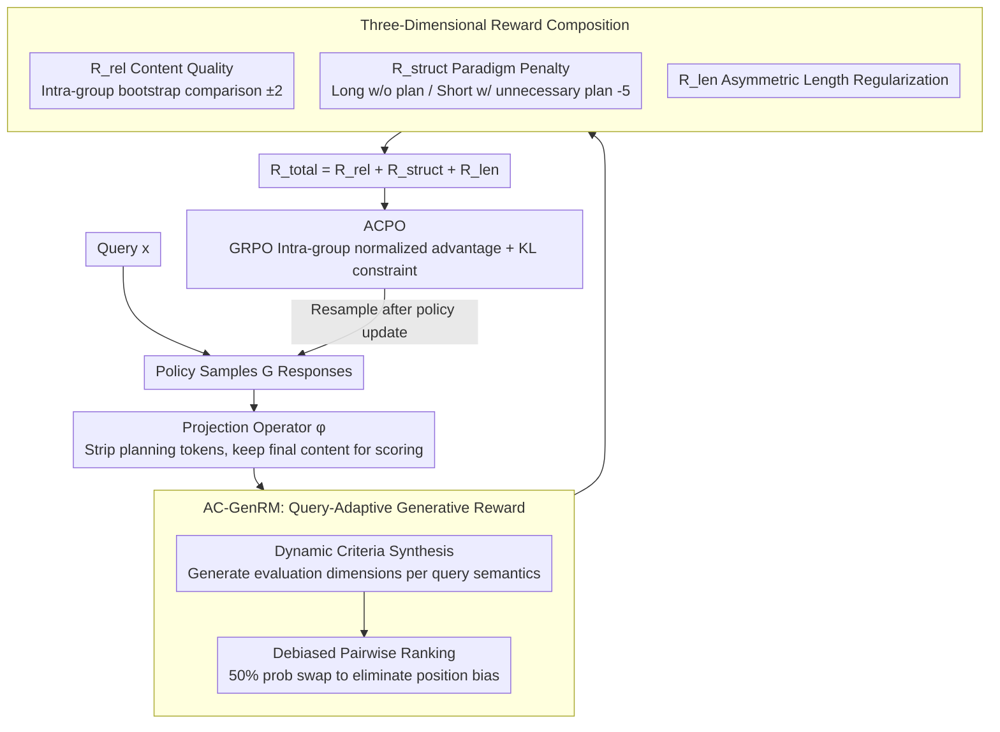

# UniCreative: Unifying Long-form Logic and Short-form Sparkle via Reference-Free Reinforcement Learning

**Conference**: ACL 2026 Findings  
**arXiv**: [2604.05517](https://arxiv.org/abs/2604.05517)  
**Code**: [https://github.com/weixiaolong94-hub/UniCreative](https://github.com/weixiaolong94-hub/UniCreative)  
**Area**: Reinforcement Learning / Creative Writing  
**Keywords**: Creative Writing, Reference-Free RL, Preference Optimization, Generative Reward Model, Metacognition

## TL;DR

This paper proposes the UniCreative framework, which unifies long-form (planning $\rightarrow$ writing) and short-form (direct generation) creative writing modes through Adaptive Constraint Preference Optimization (ACPO) and an Adaptive Criteria Generative Reward Model (AC-GenRM). Without requiring SFT or reference labels, the model emerges with metacognitive abilities to autonomously distinguish task types.

## Background & Motivation

**Background**: LLMs exhibit excellent performance in general text generation, but creative writing remains plagued by two fundamental challenges: long-form texts (e.g., novels, scripts) require global structural coherence and are prone to thematic drift and repetition; short-form texts (e.g., poetry, greetings, advertisements) require linguistic "sparkle," yet autoregressive models tend toward high-probability "safe" tokens, leading to mediocre outputs.

**Limitations of Prior Work**: (1) Merely increasing context windows for long-form text cannot solve structural degradation, which necessitates explicit planning; (2) imposing planning mechanisms on short-form text can be overly restrictive, stifling the creative "spark"; (3) current alignment methods (RLHF/DPO) rely heavily on high-quality annotated data and reference answers, which are extremely costly and difficult to scale for open-ended creative tasks.

**Key Challenge**: The "myopia" of long-form text (structural collapse due to lack of global planning) and the "over-determinism" of short-form text (expression diversity suppressed by excessive structural constraints) represent two opposing failure modes that cannot be solved with a single generation strategy.

**Goal**: Construct a unified framework that allows the model to autonomously determine when planning is necessary and when it should generate directly, without depending on any human-annotated completed text.

**Key Insight**: Treat planning as a "dynamically callable computational resource" rather than a fixed prerequisite, enabling the model to learn to switch adaptively between the two modes via reinforcement learning.

**Core Idea**: Skip the SFT phase and directly train the model through reference-free reinforcement learning (ACPO), utilizing an Adaptive Criteria Generative Reward Model (AC-GenRM) to provide fine-grained preference signals.

## Method

### Overall Architecture

UniCreative aims to enable a single model to excel at both long-form text requiring global planning and short-form text emphasizing creativity, without depending on SFT or reference answers. It consists of two interlocking components: AC-GenRM for "scoring" and ACPO for "learning." The scoring end, AC-GenRM, generates evaluation criteria on the fly based on query semantics and performs debiased pairwise ranking of candidate outputs. The learning end, ACPO, optimizes the policy based on the GRPO framework by stacking three reward signals: content quality, structural paradigm, and output length. During training, the model samples $G$ responses for each query, and AC-GenRM generates relative rewards through internal competition among these responses to drive policy updates.

### Key Designs

**1. AC-GenRM: Adapting reward criteria to query semantics rather than using a single metric**

Creative writing lacks standard answers; the dimensions of "quality" for a mystery novel and a love poem are entirely different. A fixed evaluation standard inevitably fails to capture these nuances. Furthermore, LLMs acting as judges suffer from position bias. AC-GenRM solves these via two steps. First, Dynamic Criteria Synthesis: given query $x$, the critic model $\pi_{critic}$ first generates evaluation dimensions tailored to that query—horror stories focus on "plot twists" and "atmosphere," while greeting cards focus on "warmth" and "conciseness." Second, Debiased Pairwise Ranking: symmetric data augmentation is used during training, swapping the order of two responses with 50% probability to force the reward model to compare content rather than memorize positions, strictly aligning preference signals with the generated dynamic criteria.

**2. Three-Dimensional Reward Composition: Content, structure, and length as orthogonal signals**

Rewarding only content quality fails to teach the model "when to plan" or "how long to write." Thus, the total reward is $R_{total} = R_{rel} + R_{struct} + R_{len}$. $R_{rel}$ comes from AC-GenRM bootstrapping, where group responses compete (winner $+2$, loser $-2$). $R_{struct}$ is a paradigm-aware penalty: $\beta_s=5.0$ is deducted if long text lacks planning or if short text includes unnecessary planning. This binary signal forces the model to select its cognitive mode. $R_{len}$ is asymmetric length regularization, penalizing long-form responses for being too short and short-form for being too long, with a cap $\gamma=5.0$ to prevent gradient spikes from anomalous samples.

**3. ACPO: Policy optimization without SFT or reference answers, paying only for final content**

Traditional SFT requires annotated completions, which is expensive and difficult to scale for open-ended creativity. ACPO skips SFT and optimizes the policy directly via GRPO. For each query, $G$ responses are sampled, intra-group normalized advantages $A_i$ are calculated, and the policy is updated using clipped importance ratios and KL divergence constraints to avoid the instability of a value network—this is particularly beneficial for high-variance gradients in long-form generation. Crucially, a projection operator $\phi$ strips planning tokens before AC-GenRM scoring, ensuring rewards reflect only the final content quality and do not mis-reward models simply for "writing long plans."

### Loss & Training

The training utilizes the GRPO objective function, maximizing clipped advantage minus the KL penalty. Training was performed on Qwen3 series (1.7B, 4B, 8B) using 8x H800 GPUs, starting RL directly from thinking models without intermediate SFT steps.

## Key Experimental Results

### Main Results

| Model | WritingBench Avg | Blessing Excellence Rate |
| :--- | :--- | :--- |
| Qwen3-8B-Thinking | 77.11 | 68.0% |
| Qwen3-8B-Thinking + RL (Ours) | 82.42 | 93.6% |
| Qwen3-4B-Thinking + RL (Ours) | 77.36 | 91.4% |
| Claude-Sonnet-3.7 | 78.48 | - |
| DeepSeek-R1-0528 | 83.22 | - |
| Claude-Sonnet-4.5 | - | 93.2% |

Qwen3-8B + RL approaches DeepSeek-R1-0528 (83.22) on WritingBench and surpasses Claude-Sonnet-4.5 on the Blessing short-form benchmark.

### Ablation Study

| Configuration | WritingBench | Blessing | Description |
| :--- | :--- | :--- | :--- |
| Qwen3-8B Base | 70.75 | 43.6% | No thinking, no RL |
| + Thinking | 77.11 | 68.0% | Thinking mode |
| + Thinking + RL | 82.42 | 93.6% | Full method, gain +25.6% |

### Key Findings

- **Massive RL Gains**: RL-only training (no SFT) yields a 5-10 point improvement on WritingBench and increases the Blessing rate from 68% to 93.6%.
- **High Alignment of AC-GenRM**: Qwen3-8B AC-GenRM achieves 0.807 consistency with expert judgment on LitBench and 0.994 on Blessing, outperforming Claude-Sonnet-3.7 (0.731) and GPT-4.1 (0.702).
- **Emergent Metacognition**: Trained models autonomously learn to use the Plan-then-Write mode for long-form tasks and direct generation for short-form tasks without explicit task labels.
- **Small Model Benefits**: The 1.7B model improved from 64.2% to 90.0% (Blessing) via RL, approaching large-model performance.

## Highlights & Insights

- **Feasibility of Reference-Free RL**: The work demonstrates that the SFT stage can be bypassed entirely in creative writing; RL with an adaptive reward model can match or exceed SFT+RLHF performance, drastically reducing annotation costs.
- **Clever Paradigm Penalty Design**: Simple binary penalties (penalizing no plan for long text/plan for short text) successfully teach models to choose the correct cognitive mode, offering a minimalist yet effective design.
- **Dynamic Criteria Synthesis**: The concept of AC-GenRM generating evaluation dimensions based on query semantics is generalizable to the evaluation of all open-ended generation tasks.

## Limitations & Future Work

- Evaluation still relies on LLM judges (WritingBench uses GPT-4o), as the automatic evaluation of subjective creativity remains an open problem.
- Results are only verified on the Qwen3 series; generalization to other base models is untested.
- Task classification (long/short) is coarse-grained; optimal strategies for medium-length tasks (e.g., emails, reports) are uncertain.
- Structural paradigm penalties require predefined task labels (Long/Short), limiting fully autonomous mode selection.

## Related Work & Insights

- **vs. Writing-Zero/LongWriter-Zero**: While these focus on long-form RL, UniCreative unifies both long and short modes and removes the SFT requirement.
- **vs. DPO/RLHF**: Traditional methods rely on reference answers and preference pairs; UniCreative removes reference dependency via bootstrap comparison.
- **vs. GRPO (DeepSeek-R1)**: UniCreative builds upon GRPO by adding structural paradigm constraints and adaptive length regularization specifically for creative writing.

## Rating

- Novelty: ⭐⭐⭐⭐ Innovative unified framework and reference-free RL training strategy.
- Experimental Thoroughness: ⭐⭐⭐⭐ Thorough evaluation across multiple model sizes and dual benchmarks (WritingBench/Blessing).
- Writing Quality: ⭐⭐⭐⭐ Clear motivation and methodological design.
- Value: ⭐⭐⭐⭐ Provides a practical paradigm for RL optimization in open-ended creative tasks.

<!-- RELATED:START -->

## Related Papers

- [\[ACL 2026\] LoVeC: Reinforcement Learning for Better Verbalized Confidence in Long-Form Generations](lovec_reinforcement_learning_for_better_verbalized_confidence_in_long-form_gener.md)
- [\[ICLR 2026\] Safe Continuous-time Multi-Agent Reinforcement Learning via Epigraph Form](../../ICLR2026/reinforcement_learning/safe_continuous-time_multi-agent_reinforcement_learning_via_epigraph_form.md)
- [\[ACL 2026\] Free Energy-Driven Reinforcement Learning with Adaptive Advantage Shaping for Unsupervised Reasoning in LLMs](free_energy-driven_reinforcement_learning_with_adaptive_advantage_shaping_for_un.md)
- [\[ICLR 2026\] SPELL: Self-Play Reinforcement Learning for Evolving Long-Context Language Models](../../ICLR2026/reinforcement_learning/spell_self-play_reinforcement_learning_for_evolving_long-context_language_models.md)
- [\[ACL 2026\] Targeted Exploration via Unified Entropy Control for Reinforcement Learning](targeted_exploration_via_unified_entropy_control_for_reinforcement_learning.md)

<!-- RELATED:END -->
