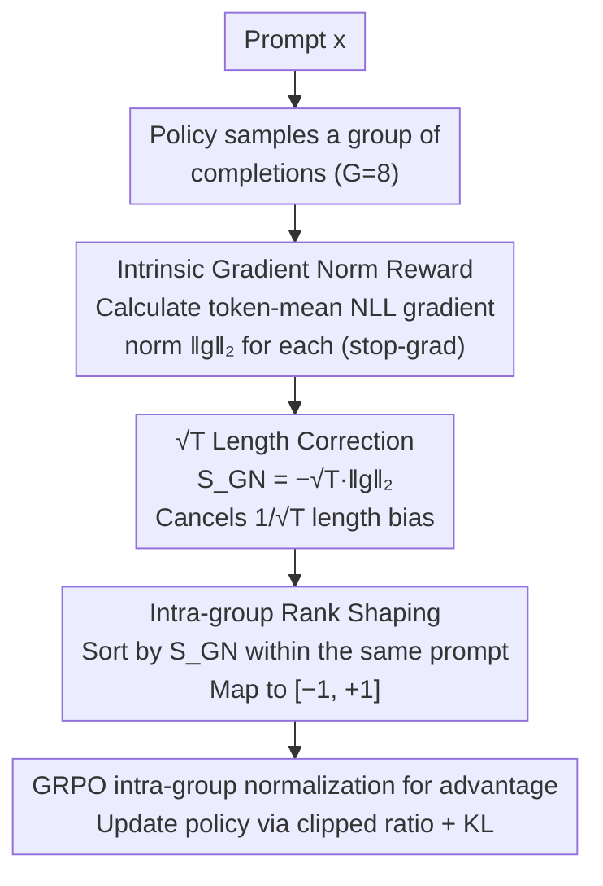

# Verifier-Free RL for LLMs via Intrinsic Gradient-Norm Reward

**Conference**: ACL2026 Findings  
**arXiv**: [2605.09920](https://arxiv.org/abs/2605.09920)  
**Code**: https://github.com/ZJUSCL/VIGOR  
**Area**: Reinforcement Learning  
**Keywords**: verifier-free RL, GRPO, intrinsic reward, gradient norm, length correction  

## TL;DR
VIGOR employs the teacher-forced NLL gradient norm of each completion under current model parameters as an intrinsic reward, favoring outputs with low gradient norms. It stabilizes GRPO using $\sqrt{T}$ length correction and intra-group rank shaping, thereby enhancing mathematical and code reasoning without requiring gold answers or external verifiers.

## Background & Motivation
**Background**: RLVR has become an important post-training paradigm for enhancing LLM reasoning capabilities. Mathematical tasks typically use exact-match verifiers, while coding tasks often utilize unit tests or execution results as rewards. Algorithms like GRPO sample a set of completions for each prompt and use intra-group reward normalization to derive advantages.

**Limitations of Prior Work**: Verifiable rewards are not available for all tasks. Math answers require extractable and precise matches, and code requires test cases. Constructing reliable verifiers for open-ended QA, long-form generation, or weakly supervised tasks remains difficult. Existing verifier-free methods use majority voting, likelihood, entropy, or self-certainty to construct intrinsic signals, but these signals are often exploited by the model during training, leading to reward proxy degeneration, length bloating, or performance regression in later stages.

**Key Challenge**: RL post-training requires reward signals to guide the model toward better outputs. However, if the reward originates from the model itself, it must be independent of labels while remaining resistant to model manipulation. Local distribution signals like token probability or entropy are computationally cheap but easily influenced by surface-level behaviors; external verifiers are more reliable but lack universality.

**Goal**: The authors aim to identify an intrinsic reward that relies solely on the policy model itself, has low requirements for output formatting, and maintains stability during training, allowing GRPO to continue improving reasoning capabilities without answer labels or task verifiers.

**Key Insight**: From an optimization perspective: if a completion induces a smaller negative log-likelihood (NLL) gradient norm under teacher-forced conditions relative to current parameters, it suggests the completion is closer to a smooth/stable region of the current policy, leading to a milder update direction. Conversely, a large gradient norm may imply that the output is inconsistent with the current model or requires drastic parameter adjustments.

**Core Idea**: Rank-shaping the length-corrected gradient norms of completions into intra-group rewards. Completions with low gradient norms receive high rewards, while those with high norms receive low rewards, followed by policy updates using GRPO.

## Method
The intuition behind VIGOR is as follows: for the same prompt, the model samples 8 candidate solutions. Each candidate is treated as a teacher-forced training sample to calculate the gradient of its token-mean NLL with respect to current parameters. If a candidate results in a flatter loss surface and a smaller gradient in the parameter space, the authors consider it a more "self-consistent" and stable output. VIGOR does not need to know if the final answer is correct; instead, it ranks candidates based on this stability signal within the same group to serve as a relative reward for GRPO.

### Overall Architecture
Given a prompt $x$, the current policy $\pi_\theta$ samples a set of completions $\{y_i\}_{i=1}^{G}$ (with $G=8$ in the experiments). For each completion $y=(y_1,\ldots,y_T)$, the token-mean NLL $\ell_{mean}(x,y)=\frac{1}{T}\sum_{t=1}^{T}\ell_t(x,y)$ is first computed, followed by the $\ell_2$ norm of the gradient $g(x,y)=\nabla_\theta \ell_{mean}(x,y)$. This norm is treated as a scalar reward signal and is not used for further backpropagation.

A significant issue exists with the raw mean gradient norm: as completions get longer, token-level gradients tend to cancel each other out during averaging, causing $\|g\|_2$ to decrease roughly by $1/\sqrt{T}$. Directly rewarding low gradient norms would encourage the model to generate longer text to "cheat" the reward. Therefore, VIGOR uses $S_{GN}(x,y)=-\sqrt{T}\|g(x,y)\|_2$, where $\sqrt{T}$ cancels the length bias, and the negative sign converts the "smaller is better" gradient norm into a "larger is better" reward.

Finally, the $G$ values of $S_{GN}$ for the same prompt are ranked. The worst completion is mapped to -1 and the best to +1, with intermediate values distributed uniformly. Intra-group normalization per GRPO is then applied to obtain the advantage for policy updates.

### Key Designs
**1. Gradient Norm as a verifier-free intrinsic reward: Replacing "correctness" with local geometry in parameter space**

Many tasks lack reliable verifiers—open-ended QA, long-form generation, and weakly supervised tasks make it difficult to construct gold answers or executors. Existing signals like entropy/self-certainty derived directly from vocabulary distributions are easily manipulated by surface token patterns. VIGOR adopts a different perspective: treating each completion as a teacher-forced sequence, it calculates the gradient norm $\|g(x,y)\|_2$ of the mean NLL $\ell_{mean}(x,y)$ relative to current parameters. A smaller gradient norm indicates the output falls in a smoother region causing less drastic updates, thus being judged superior within the group. Compared to local probability distributions, the gradient norm aggregates changes across the high-dimensional parameter space, making it theoretically harder to manipulate via simple token-level patterns.

**2. $\sqrt{T}$ Length Correction: Closing the "length-hacking" loophole**

The raw mean gradient norm possesses a critical bias: longer completions lead to higher cancellation of token-level gradients during averaging, causing $\|g\|_2$ to scale roughly by $1/\sqrt{T}$. Empirically, the raw gradient norm drops from ~180 to ~90 across length bins of 250 to 1000 tokens, but remains stable between $2.85\times10^3$ and $2.91\times10^3$ after multiplying by $\sqrt{T}$. Consequently, the reward is defined as $S_{GN}(x,y)=-\sqrt{T}\|g(x,y)\|_2$. Without this step, particularly in 3B models, the system triggers length exploitation and accuracy collapse.

**3. Intra-group rank-based reward shaping: Retaining relative order while discarding incomparable absolute magnitudes**

The scale of gradient norms can vary significantly across different prompts. Using raw values would allow a few extreme prompts to dominate the updates. VIGOR ranks the $G$ values of $S_{GN}$ for a single prompt from 0 to $G-1$ and maps them to $R_{GN}(x,y_i)=2\frac{rank_i}{G-1}-1$, where the worst is $-1$ and the best is $+1$. This flattens the contribution of each prompt, eliminating scale variance and suppressing outliers, aligning naturally with the relative optimization context of GRPO.

### Loss & Training
VIGOR is directly integrated into GRPO. For each prompt, $G=8$ completions are sampled, length-corrected gradient norm rewards are calculated, and rank normalization is applied, followed by mean-std normalization to obtain the advantage $\hat{A}_i$. The policy objective is identical to GRPO: maximizing the product of the clipped probability ratio and the advantage, constrained by a KL divergence penalty. A critical implementation detail is the use of stop-gradients: while the reward is derived from the gradient norm of current parameters, it is detached as a constant during training to avoid the overhead and instability of second-order gradients.

## Key Experimental Results

### Main Results
Experiments were conducted on Qwen2.5-3B-Base and Qwen2.5-7B-Base, using the MATH training set and a subset of CodeContests for post-training. During training, VIGOR does not use reference answers; gold answers are only used for evaluation and the GT-Reward baseline. Evaluation covers MATH-500, GSM8K, AMC, LiveCodeBench v6, CRUX, MMLU-Pro, and IFEval.

| Training Set / Model | Method | Math Avg. | Code Avg. | MMLU-Pro | IFEval |
|----------------------|--------|-----------|-----------|----------|--------|
| MATH / Qwen2.5-3B    | Base   | 48.34     | 16.98     | 36.92    | 28.30  |
| MATH / Qwen2.5-3B    | INTUITOR| 57.10    | 26.79     | 24.48    | 29.11  |
| MATH / Qwen2.5-3B    | VIGOR  | 59.14     | 27.95     | 32.65    | 31.72  |
| MATH / Qwen2.5-7B    | Base   | 42.58     | 9.69      | 47.21    | 35.90  |
| MATH / Qwen2.5-7B    | INTUITOR| 66.46    | 38.51     | 43.04    | 34.91  |
| MATH / Qwen2.5-7B    | VIGOR  | 69.77     | 40.42     | 43.09    | 37.03  |

| Training Set / Model | Method | GSM8K | MATH500 | AMC | Math Avg. | LiveCodeBench | CRUX | Code Avg. |
|----------------------|--------|-------|---------|-----|-----------|---------------|------|-----------|
| CodeContests / 3B    | Base   | 67.93 | 54.80   | 22.28 | 48.34   | 9.57          | 24.38| 16.98     |
| CodeContests / 3B    | INTUITOR| 75.13| 58.60   | 22.59 | 52.11   | 11.47         | 39.38| 25.43     |
| CodeContests / 3B    | VIGOR  | 77.10 | 62.80   | 29.82 | 56.57   | 11.65         | 35.62| 23.64     |

### Ablation Study

| Model | Configuration | Math Avg. | Code Avg. | MMLU-Pro | IFEval | Description |
|-------|---------------|-----------|-----------|----------|--------|-------------|
| Qwen2.5-3B | Full VIGOR | 59.14 | 27.95 | 32.65 | 31.72 | Full method |
| Qwen2.5-3B | w/o $\sqrt{T}$ | 20.71 | 0.00 | 36.39 | 29.30 | Collapses on GSM8K/AMC; code transfer zeroed |
| Qwen2.5-3B | w/o rank | 58.00 | 27.07 | 33.44 | 30.19 | Slight drop in math; trade-off in general capability |
| Qwen2.5-7B | Full VIGOR | 69.77 | 40.42 | 43.09 | 37.03 | Full method |
| Qwen2.5-7B | w/o $\sqrt{T}$ | 68.29 | 41.34 | 41.34 | 37.23 | 7B is more stable but still worse than full |
| Qwen2.5-7B | w/o rank | 69.21 | 40.06 | 34.19 | 38.32 | Significant MMLU-Pro degradation; rank shaping protects general ability |

| Rank | Step 10 Acc. | Step 20 Acc. | Meaning |
|------|--------------|--------------|---------|
| 1 (Best) | 70.50 | 72.30 | Completions with best gradient norm rank are most often correct |
| 2 | 68.20 | 71.10 | High rank maintains higher accuracy |
| 4 | 67.00 | 67.40 | Median samples significantly lower than top rank |
| 6 | 60.70 | 66.00 | Lower rank accuracy decreases |
| 8 (Worst) | 52.70 | 63.40 | Gap between best and worst rank is 17.8/8.9 points |

### Key Findings
- In MATH post-training, VIGOR improves math avg. by +3.31 and code avg. by +1.91 over INTUITOR on the 7B model; it also improves math, code, and IFEval on the 3B model.
- Cross-domain transfer is evident: when trained only on MATH, code averages for 3B/7B improve from 16.98/9.69 to 27.95/40.42.
- Code training serves as a sanity check. VIGOR improves math from 48.34 to 56.57 on CodeContests, but the code average of 23.64 is lower than INTUITOR's 25.43, suggesting gradient norms might not be as sensitive to discrete algorithmic choices.
- Reward reliability analysis shows that completions in the top 25% by gradient norm are more stable than INTUITOR during training, avoiding the late-stage degradation seen with self-certainty rewards.
- $\sqrt{T}$ correction is the most critical component; without it on the 3B model, length hacking occurs, resulting in nearly zero scores on GSM8K and AMC.

## Highlights & Insights
- This paper shifts reward signals from "surface output probabilities" to "parameter space local geometry." The gradient norm does not judge answer correctness directly but whether the completion aligns with a stable region of the current policy.
- The implementation of length correction is both critical and transparent. The authors identify the $1/\sqrt{T}$ bias in mean NLL gradients and demonstrate that failing to correct it leads to training collapse.
- Rank shaping is highly suited to the relative context of GRPO. It acknowledges that absolute intrinsic reward values are incomparable across prompts and instead utilizes intra-prompt ordering, enhancing stability.
- This approach is transferable to weakly verifiable tasks: when external rewards are unavailable, one can use internal signals like gradients, curvature, or consistency for candidate ranking, potentially combined with sparse human or automated verification.

## Limitations & Future Work
- The paper primarily validates tasks where correctness can still be measured (math/code). Whether low gradient norms correspond to better outputs in open-ended writing, dialogue, or safety alignment is uncertain.
- Calculating the gradient norm for every completion is more expensive than forward-only signals like entropy; although an LM-head-only approximation is mentioned in the appendix, it may remain a bottleneck for larger models.
- The gradient norm is essentially a proxy. Models might eventually learn "low-gradient but useless" patterns, maintaining the risk of reward exploitation.
- On code tasks, VIGOR's CRUX performance is inferior to INTUITOR, indicating that parameter space smoothness cannot fully replace execution feedback in scenarios requiring discrete algorithmic correctness.

## Related Work & Insights
- **vs RLVR / GT-Reward**: RLVR uses exact match or executors, providing reliable rewards but depending on task verifiers; VIGOR is more universal but relies on an indirect proxy.
- **vs INTUITOR / RLIF**: INTUITOR uses internal confidence/likelihood signals which degrade in late stages; VIGOR utilizes gradient norms and rank shaping for more stable training dynamics.
- **vs Majority Voting / Pseudo-labeling**: Methods like TTRL/Co-rewarding depend on extractable and aggregatable final answers; VIGOR does not require answer extraction and is theoretically better suited for free-form completions.
- **vs Entropy-based intrinsic reward**: Entropy is derived from token distributions and influenced by local probabilities; gradient norms aggregate signals from the parameter space, acting as a consistency check between the completion and the model state.

## Rating
- Novelty: ⭐⭐⭐⭐⭐ Using teacher-forced gradient norms for verifier-free rewards is a distinct perspective compared to confidence/entropy methods.
- Experimental Thoroughness: ⭐⭐⭐⭐☆ Main experiments, cross-domain transfer, dynamics, and ablations are comprehensive; open-ended task verification is missing.
- Writing Quality: ⭐⭐⭐⭐☆ Method derivation is clear, and length bias explanation is solid. Some cost details are in the appendix.
- Value: ⭐⭐⭐⭐☆ Highly valuable for RL post-training in scenarios without verifiers, though gradient calculation costs may limit deployment scope.

<!-- RELATED:START -->

## Related Papers

- [\[ICLR 2026\] Graph-Theoretic Intrinsic Reward: Guiding RL with Effective Resistance](../../ICLR2026/reinforcement_learning/graph-theoretic_intrinsic_reward_guiding_rl_with_effective_resistance.md)
- [\[ACL 2026\] Free Energy-Driven Reinforcement Learning with Adaptive Advantage Shaping for Unsupervised Reasoning in LLMs](free_energy-driven_reinforcement_learning_with_adaptive_advantage_shaping_for_un.md)
- [\[ICLR 2026\] Principled RL for Diffusion LLMs Emerges from a Sequence-Level Perspective](../../ICLR2026/reinforcement_learning/principled_rl_for_diffusion_llms_emerges_from_a_sequence-level_perspective.md)
- [\[ICLR 2026\] A Reward-Free Viewpoint on Multi-Objective Reinforcement Learning](../../ICLR2026/reinforcement_learning/a_reward-free_viewpoint_on_multi-objective_reinforcement_learning.md)
- [\[ICLR 2026\] Do Not Let Low-Probability Tokens Over-Dominate in RL for LLMs](../../ICLR2026/reinforcement_learning/do_not_let_low-probability_tokens_over-dominate_in_rl_for_llms.md)

<!-- RELATED:END -->
