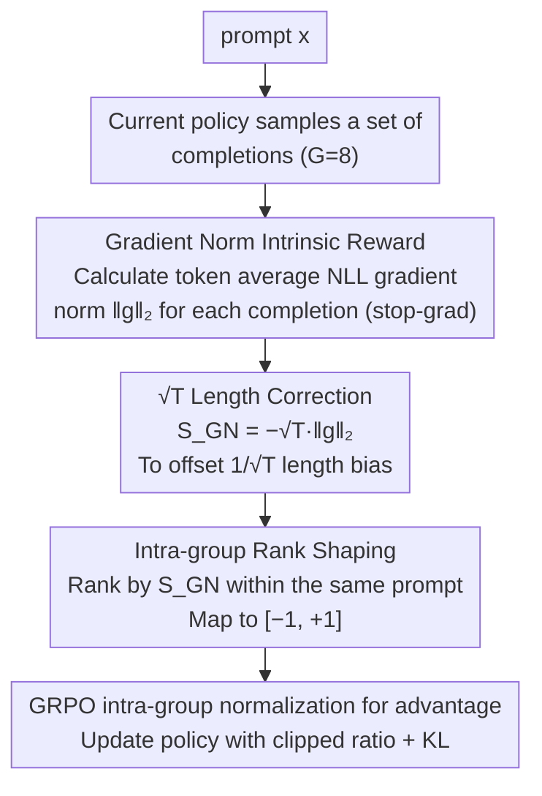

# Verifier-Free RL for LLMs via Intrinsic Gradient-Norm Reward

**Conference**: ACL2026 Findings  
**arXiv**: [2605.09920](https://arxiv.org/abs/2605.09920)  
**Code**: https://github.com/ZJUSCL/VIGOR  
**Area**: Reinforcement Learning  
**Keywords**: verifier-free RL, GRPO, intrinsic reward, gradient norm, length correction  

## TL;DR
VIGOR utilizes the teacher-forced NLL gradient norm of each completion under current model parameters as an intrinsic reward, favoring outputs with low gradient norms. It stabilizes GRPO through $\sqrt{T}$ length correction and intra-group rank shaping, thereby improving mathematical and code reasoning without requiring gold answers or external verifiers.

## Background & Motivation
**Background**: RLVR has emerged as a significant post-training paradigm for enhancing the reasoning capabilities of LLMs. Mathematical tasks typically use exact-match verifiers, while coding tasks often rely on unit tests or execution results as rewards. Algorithms like GRPO sample a set of completions for each prompt and use intra-group reward normalization to derive advantages.

**Limitations of Prior Work**: Verifiable rewards are not available for all tasks. Math answers require extractability and exact matching, while code requires test cases. It is difficult to construct reliable verifiers for open-ended QA, long-form generation, or weakly supervised tasks. Existing verifier-free methods use majority voting, likelihood, entropy, or self-certainty to construct intrinsic signals, but these signals are often "exploited" by the model during training, leading to reward proxy degeneration, length bloating, or late-stage performance regression.

**Key Challenge**: RL post-training requires rewards to guide the model toward better outputs. However, if the reward originates from the model itself, it must be independent of labels yet resistant to easy manipulation by the model. Local distribution signals like token probability/entropy are cheap but easily influenced by surface-level behaviors; external verifiers are more reliable but lack universality.

**Goal**: The authors aim to identify an intrinsic reward that relies solely on the policy model itself, has low requirements for output format, and remains stable during training, enabling GRPO to continue improving reasoning capabilities in the absence of answer labels and task verifiers.

**Key Insight**: This paper approaches the problem from an optimization perspective: if a completion induces a smaller negative log-likelihood (NLL) gradient norm under teacher-forced conditions for the current parameters, it suggests the completion is closer to a smooth/stable region of the current policy, leading to milder update directions. Conversely, a large gradient norm may imply the output is inconsistent with the current model or requires drastic parameter adjustments.

**Core Idea**: Convert the length-corrected gradient norm of completions into intra-group rewards. Completions with low gradient norms receive high rewards, while those with high gradient norms receive low rewards, followed by policy updates using GRPO.

## Method
The intuition of VIGOR can be understood as follows: for the same prompt, the model samples 8 candidate solutions. Each candidate can be viewed as a teacher-forced training sample, for which the gradient of its average token NLL with respect to current parameters is calculated. If a candidate results in a flatter loss surface and smaller gradient in the parameter space, the authors treat it as a more "self-consistent" and stable output. VIGOR does not need to know if the final answer is correct; instead, it ranks candidates based on this stability signal within the same group to serve as a relative reward for GRPO.

### Overall Architecture
Given a prompt $x$, the current policy $\pi_\theta$ samples a set of completions $\{y_i\}_{i=1}^{G}$ ($G=8$ in experiments). For each completion $y=(y_1,\ldots,y_T)$, the token average NLL $\ell_{mean}(x,y)=\frac{1}{T}\sum_{t=1}^{T}\ell_t(x,y)$ is first calculated, followed by the $\ell_2$ norm of the gradient $g(x,y)=\nabla_\theta \ell_{mean}(x,y)$. This norm is treated as a scalar reward signal and is not used for further backpropagation.

Base average gradient norms suffer from a serious issue: longer completions tend to have token-level gradients that cancel each other out during averaging, causing $\|g\|_2$ to scale roughly by $1/\sqrt{T}$. Directly rewarding low gradient norms would encourage the model to generate longer text to "cheat" the reward. Therefore, VIGOR uses $S_{GN}(x,y)=-\sqrt{T}\|g(x,y)\|_2$, where $\sqrt{T}$ cancels the length bias and the negative sign converts the "smaller is better" gradient norm into a "larger is better" reward.

Finally, the $G$ values of $S_{GN}$ for the same prompt are ranked. The worst completion is mapped to -1 and the best to +1, with intermediate values uniformly distributed. Advantages are then derived via GRPO's intra-group normalization to update the policy.

### Key Designs
**1. Gradient norm as verifier-free intrinsic reward: Replacing "correctness" with local geometry in parameter space**

Many tasks lack reliable verifiers—open-ended QA, long-form generation, and weakly supervised tasks are difficult for gold answer construction or execution. Existing signals like entropy/self-certainty are derived directly from vocabulary distributions and are easily exploited by surface token patterns. VIGOR changes perspective: by treating each completion as a teacher-forced sequence and calculating the gradient norm $\|g(x,y)\|_2$ of the average NLL $\ell_{mean}(x,y)$, it determines that lower norms indicate outputs falling in smoother regions of the policy that provoke less drastic updates. Compared to local probability distributions, the gradient norm aggregates global changes in a high-dimensional parameter space, making it theoretically harder to manipulate via simple token-level patterns.

**2. $\sqrt{T}$ length correction: Closing the "write longer to cheat" loophole**

The original average gradient norm has a fatal bias: in longer completions, token-level gradients cancel out more easily during averaging, and $\|g\|_2$ decreases roughly by $1/\sqrt{T}$. Rewarding low gradient norms thus indirectly rewards longer sequences. Empirical evidence clearly shows that across length bins of approximately 250/500/750/1000 tokens, the raw gradient norm drops from ~180 to ~90, but remains stable between $2.85\times10^3$ and $2.91\times10^3$ after multiplying by $\sqrt{T}$. Consequently, the final reward is set as $S_{GN}(x,y)=-\sqrt{T}\|g(x,y)\|_2$. Without this step, 3B models in particular suffer from length explosion and accuracy collapse.

**3. Intra-group rank-based reward shaping: Retaining relative order while discarding absolute magnitudes**

Gradient norm scales can vary significantly across different prompts. Using raw values might allow a few extreme prompts to dominate updates. VIGOR ranks $G$ completions for each prompt, with ranks from 0 to $G-1$, and maps them to $R_{GN}(x,y_i)=2\frac{rank_i}{G-1}-1$. This maps the worst to $-1$ and the best to $+1$. This flattens contributions within each prompt, eliminates scale variance across prompts, and suppresses the influence of reward outliers, naturally fitting GRPO's context of group relative optimization.

### Loss & Training
VIGOR integrates directly into GRPO. For each prompt, $G=8$ completions are sampled, length-corrected gradient norm rewards are calculated, rank normalization is applied, and intra-group mean-std normalization yields the advantage $\hat{A}_i$. The policy objective is identical to GRPO: maximize the product of the clipped probability ratio and the advantage, constrained by a KL divergence penalty relative to the reference policy. A critical implementation detail is the use of `stop-gradient`: while the reward is calculated from the gradient norm of current parameters, it is detached as a constant during training to avoid costs and instabilities associated with second-order gradients.

## Key Experimental Results

### Main Results
Experiments were conducted on Qwen2.5-3B-Base and Qwen2.5-7B-Base, using the MATH training set and CodeContests subset for post-training. VIGOR does not use reference answers during training; gold answers are only used for evaluation and the GT-Reward baseline. Evaluation covers MATH-500, GSM8K, AMC, LiveCodeBench v6, CRUX, MMLU-Pro, and IFEval.

| Training Set / Model | Method | Math Avg. | Code Avg. | MMLU-Pro | IFEval |
|-------------|------|-----------|-----------|----------|--------|
| MATH / Qwen2.5-3B | Base | 48.34 | 16.98 | 36.92 | 28.30 |
| MATH / Qwen2.5-3B | INTUITOR | 57.10 | 26.79 | 24.48 | 29.11 |
| MATH / Qwen2.5-3B | VIGOR | 59.14 | 27.95 | 32.65 | 31.72 |
| MATH / Qwen2.5-7B | Base | 42.58 | 9.69 | 47.21 | 35.90 |
| MATH / Qwen2.5-7B | INTUITOR | 66.46 | 38.51 | 43.04 | 34.91 |
| MATH / Qwen2.5-7B | VIGOR | 69.77 | 40.42 | 43.09 | 37.03 |

| Training Set / Model | Method | GSM8K | MATH500 | AMC | Math Avg. | LiveCodeBench | CRUX | Code Avg. |
|-------------|------|-------|---------|-----|-----------|---------------|------|-----------|
| CodeContests / Qwen2.5-3B | Base | 67.93 | 54.80 | 22.28 | 48.34 | 9.57 | 24.38 | 16.98 |
| CodeContests / Qwen2.5-3B | INTUITOR | 75.13 | 58.60 | 22.59 | 52.11 | 11.47 | 39.38 | 25.43 |
| CodeContests / Qwen2.5-3B | VIGOR | 77.10 | 62.80 | 29.82 | 56.57 | 11.65 | 35.62 | 23.64 |

### Ablation Study

| Model | Configuration | Math Avg. | Code Avg. | MMLU-Pro | IFEval | Description |
|------|------|-----------|-----------|----------|--------|------|
| Qwen2.5-3B | Full VIGOR | 59.14 | 27.95 | 32.65 | 31.72 | Full method |
| Qwen2.5-3B | w/o $\sqrt{T}$ | 20.71 | 0.00 | 36.39 | 29.30 | GSM8K/AMC collapse without length correction |
| Qwen2.5-3B | w/o rank | 58.00 | 27.07 | 33.44 | 30.19 | Slight drop in math; trade-off in general capability |
| Qwen2.5-7B | Full VIGOR | 69.77 | 40.42 | 43.09 | 37.03 | Full method |
| Qwen2.5-7B | w/o $\sqrt{T}$ | 68.29 | 41.34 | 41.34 | 37.23 | 7B is more stable to length bias but still lower than full |
| Qwen2.5-7B | w/o rank | 69.21 | 40.06 | 34.19 | 38.32 | Significant MMLU-Pro degradation; rank shaping protects general capability |

| Rank | Step 10 Acc. | Step 20 Acc. | Meaning |
|------|--------------|--------------|------|
| 1 (best) | 70.50 | 72.30 | Completions with best gradient norm rank are most often correct |
| 2 | 68.20 | 71.10 | High rank maintains high accuracy |
| 4 | 67.00 | 67.40 | Median samples are significantly lower than top rank |
| 6 | 60.70 | 66.00 | Lower rank accuracy decreases |
| 8 (worst) | 52.70 | 63.40 | Gap between best and worst rank is 17.8/8.9 points |

### Key Findings
- In MATH post-training, VIGOR improves math average by +3.31 and code average by +1.91 on 7B compared to INTUITOR; on 3B, it simultaneously improves math, code, and IFEval.
- Cross-domain transfer is evident: when trained only on MATH, the code average for 3B/7B increases from 16.98/9.69 to 27.95/40.42.
- Code training serves as a lightweight sanity check. On CodeContests, VIGOR improves math average from 48.34 to 56.57, but its code average of 23.64 is lower than INTUITOR’s 25.43, suggesting gradient norms may not be highly sensitive to discrete algorithmic choices.
- Reward reliability analysis shows that completions in the top-25% by gradient norm remain more stable during training than INTUITOR, avoiding the late-stage degradation seen with self-certainty rewards.
- $\sqrt{T}$ correction is the most critical component; notably on 3B models, removing it leads to length hacking, where GSM8K drops to 0.08 and AMC to 1.66.

## Highlights & Insights
- This paper shifts rewards from "surface probability of output" to "local geometry in parameter space," providing a fresh perspective. The gradient norm does not judge answer correctness directly but assess whether a completion aligns with the stable regions of the current policy.
- The length correction is both crucial and honestly presented. The authors identify the $1/\sqrt{T}$ bias in average NLL gradients and demonstrate with experiments that failure to correct it lead to collapse.
- Rank shaping is well-suited for GRPO’s comparative context. It acknowledges that absolute intrinsic reward values are incomparable cross-prompt and only utilizes intra-prompt ranking, enhancing stability.
- This approach can be transferred to weakly-verifiable tasks: when external rewards are unavailable, internal signals like gradients/curvature/consistency can rank candidates, potentially combined with sparse human or automated judging.

## Limitations & Future Work
- The paper primarily validates reasoning tasks (math and code) where correctness is evaluable. It remains uncertain if low gradient norms correspond to better outputs in open-ended writing, dialogue, or safety alignment.
- Calculating the gradient norm for each completion is more expensive than forward-only entropy or likelihood rewards, requiring automatic differentiation; although a LM-head-only approximation is provided in the appendix, scale remains a bottleneck.
- The gradient norm is essentially a proxy. Models might eventually learn "low-gradient but useless" patterns, maintaining the risk of reward exploitation.
- On coding tasks, VIGOR’s CRUX performance is inferior to INTUITOR, suggesting that in scenarios requiring discrete algorithmic correctness, parameter space smoothness cannot entirely replace execution feedback.

## Related Work & Insights
- **vs RLVR / GT-Reward**: RLVR uses exact match or executors for reliable but verifier-dependent rewards; VIGOR is more universal but relies on an indirect proxy.
- **vs INTUITOR / RLIF**: INTUITOR uses internal policy confidence/likelihood signals which are prone to late-stage degradation; VIGOR’s gradient norm and rank shaping offer more stable training dynamics.
- **vs Majority Voting Pseudo-labeling**: Methods like TTRL/Co-rewarding depend on answer extractability and aggregation; VIGOR does not require answer extraction, making it theoretically better for free-form completions.
- **vs Entropy-based intrinsic reward**: Entropy is derived from token distributions and is easily influenced by local probability patterns; gradient norms aggregate parameter-space signals, acting as a consistency check between the completion and the model state.

## Rating
- Novelty: ⭐⭐⭐⭐⭐ Using teacher-forced gradient norms as verifier-free rewards is a distinct perspective compared to confidence/entropy methods.
- Experimental Thoroughness: ⭐⭐⭐⭐☆ Main experiments, cross-domain transfer, training dynamics, rank-accuracy, and ablations are all thorough; verification on open-ended tasks is missing.
- Writing Quality: ⭐⭐⭐⭐☆ Method derivation is clear, and the length bias explanation is appropriate; some training cost details are relegated to the appendix.
- Value: ⭐⭐⭐⭐☆ High value for RL post-training in verifier-absent scenarios, though gradient calculation costs may limit wide deployment.

<!-- RELATED:START -->

## Related Papers

- [\[ACL 2026\] Free Energy-Driven Reinforcement Learning with Adaptive Advantage Shaping for Unsupervised Reasoning in LLMs](free_energy-driven_reinforcement_learning_with_adaptive_advantage_shaping_for_un.md)
- [\[NeurIPS 2025\] RL Tango: Reinforcing Generator and Verifier Together for Language Reasoning](../../NeurIPS2025/reinforcement_learning/rl_tango_reinforcing_generator_and_verifier_together_for_lan.md)
- [\[ICML 2026\] From Reward-Free Representations to Preferences: Rethinking Offline Preference-Based Reinforcement Learning](../../ICML2026/reinforcement_learning/from_reward-free_representations_to_preferences_rethinking_offline_preference-ba.md)
- [\[ACL 2026\] RL-PLUS: Countering Capability Boundary Collapse of LLMs in Reinforcement Learning with Hybrid-policy Optimization](rl-plus_countering_capability_boundary_collapse_of_llms_in_reinforcement_learnin.md)
- [\[ACL 2026\] LearnAlign: Data Selection for LLM Reinforcement Learning with Improved Gradient Alignment](learnalign_data_selection_for_llm_reinforcement_learning_with_improved_gradient_.md)

<!-- RELATED:END -->
