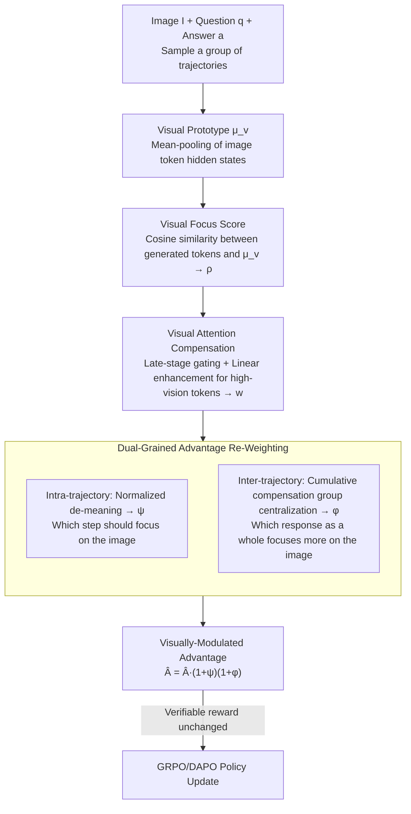

# Visually-Guided Policy Optimization for Multimodal Reasoning

**Conference**: ACL2026  
**arXiv**: [2604.09349](https://arxiv.org/abs/2604.09349)  
**Code**: https://github.com/wzb-bupt/VGPO  
**Area**: Reinforcement Learning  
**Keywords**: Multimodal Reasoning, Reinforcement Learning, GRPO, Visual Attention, Visual Forgetting

## TL;DR
VGPO utilizes hidden state similarity to locate vision-related tokens during RLVR training, then strengthens visual attention through late-stage visual compensation and intra/inter-trajectory advantage re-weighting. This enables Qwen2.5-VL-7B to outperform GRPO/DAPO and existing vision-enhanced RL methods in mathematical multimodal reasoning and vision-dependent tasks.

## Background & Motivation
**Background**: Methods like RLVR and GRPO/DAPO have significantly improved the step-by-step reasoning capabilities of VLMs, particularly in tasks with verifiable answers such as mathematics, geometry, and visual question answering. Current multimodal reasoning research typically focuses on final answer rewards, rollout diversity, KL/entropy regularization, or external visual verifiers.

**Limitations of Prior Work**: The reasoning process of VLMs remains heavily text-dominated. When generating long reasoning chains, models may briefly attend to the image initially, but subsequently rely increasingly on the problem text and previously generated tokens. This leads to sparse visual token activation, eventually resulting in visual fact forgetting, hallucinations, or erroneous reasoning based on language priors.

**Key Challenge**: Multimodal reasoning requires the model to consistently utilize visual evidence throughout long chains, whereas standard RL only rewards final answer correctness regardless of whether the model faithfully "looks" at the image. Existing vision-enhancement methods often introduce special tokens, extra forward passes, noisy image contrasts, or auxiliary models, leading to high training costs and system complexity.

**Goal**: The authors aim to directly incorporate "consistent visual attention during reasoning" into policy optimization without introducing extra models or external visual verification processes, ensuring the model pursues both answer correctness and sufficient use of visual evidence.

**Key Insight**: The similarity between the hidden states of generated tokens and image tokens can serve as an endogenous Visual Focus Score. When the model genuinely utilizes visual information, this similarity increases, and the corresponding visual attention regions are typically semantically reasonable.

**Core Idea**: Construct visual attention signals using the model's own hidden states and transform them into re-weighting factors for the RL advantage function, allowing correct answer rewards to propagate along more visually faithful reasoning trajectories.

## Method
VGPO can be viewed as adding a "visual faithfulness modulator" over RL frameworks like DAPO/GRPO. While original RLVR only considers the final reward of each rollout (e.g., exact match), VGPO redistributes advantages at both token and trajectory granularities without changing the verifiable reward itself: visual-related tokens receive higher update weights, and trajectories with stronger overall visual focus are also weighted more heavily.

### Overall Architecture
Given image $I$, textual question $q$, and answer $a$, the policy model samples a group of reasoning trajectories. First, VGPO derives a visual prototype from the hidden states of image tokens and calculates the similarity between each generated token and the visual prototype to form a Visual Focus Score. Subsequently, Visual Attention Compensation applies linear enhancement to high-visual-similarity tokens in the later stages of reasoning to counteract temporal visual forgetting. Finally, Dual-Grained Advantage Re-Weighting embeds this visual compensation signal into the policy objective: intra-trajectory weighting distinguishes token-level visual importance, while inter-trajectory weighting distinguishes the overall visual accumulation of the entire response.

### Key Designs
**1. Visual Focus Score: Identifying if a token is "thinking about the image" via hidden state similarity**

To strengthen visual faithfulness, it is necessary to identify which tokens in a long reasoning chain are actually using visual evidence—yet relying on manual annotation or auxiliary models is costly. VGPO aggregates input image token hidden states into a visual prototype $\mu_v$ (defaulting to mean-pooling) and calculates the cosine similarity between the current generated token's hidden state $h_{i,t}$ and $\mu_v$, normalized to a visual focus score $\rho_{i,t}=0.5(\mathcal{S}(h_{i,t},\mu_v)+1)\in[0,1]$. When the model utilizes visual information, this similarity rises. This signal is inexpensive, endogenous, and can be integrated end-to-end without extra forward passes or critic models.

**2. Visual Attention Compensation: Addressing late-stage visual decay strategically**

Directly using $\rho_{i,t}$ systematically underestimates late-stage visual tokens because visual attention naturally decays as generation progresses—the source of temporal visual forgetting. VGPO constructs compensation weights $w_{i,t}=\rho_{i,t}[1+G_i(\rho_{i,t})\beta t/T_i]$, where $t/T_i$ provides linear enhancement over time to target the late stages prone to forgetting. The gate $G_i$ only activates for top-$\kappa$ visual score tokens in the latter half of the trajectory to avoid over-strengthening non-visual tokens. Default hyperparameters are $\beta=0.3$, $\gamma=0.5$, $\kappa=0.2$. This ensures early problem comprehension is unperturbed while precisely targeting visual forgetting.

**3. Dual-Grained Advantage Re-Weighting: Managing "which step" and "which response"**

Focusing only on local tokens ignores whether the total response is visually consistent, while focusing only on the trajectory fails to credit key visual steps. VGPO modulates advantages at both levels. Within a trajectory, $w_{i,t}$ is min-max normalized and de-meaned to obtain $\psi_{i,t}$, giving higher advantage to tokens with above-average visual activation. Across trajectories, the total compensation score $s_i=\sum_t w_{i,t}$ is normalized and centralized within the rollout group to obtain $\phi_i$. The final standard advantage is replaced by $\hat{A}^{\mathcal{V}}_{i,t}=\hat{A}_i(1+\psi_{i,t})(1+\phi_i)$. Consequently, rewards for correct answers propagate through more visually faithful tokens and trajectories, while the verifiable reward remains unchanged.

### Loss & Training
The base optimization follows the group-relative policy optimization style of GRPO/DAPO: multiple responses are sampled per question, binary rewards are assigned based on exact match, and advantages are standardized within the group. VGPO simply replaces the standard advantage with the visually-modulated advantage $\hat{A}^{\mathcal{V}}_{i,t}$. Experiments utilize Qwen2.5-VL 3B, 7B, and 32B versions. Training involves 2 epochs on ViRL39K, Geo3K, and MMK12 datasets with a learning rate of $1\times 10^{-6}$, rollout batch size of 512, maximum length of 2,048, and evaluation temperature of 0.

## Key Experimental Results

### Main Results
The main experiments compare the Qwen2.5-VL-7B base model, GRPO, DAPO, VGPO, and existing 7B multimodal reasoning methods. VGPO achieves the best average performance across general mathematical/geometric reasoning and vision-dependent multimodal reasoning tasks.

| Method | Avg-Math↑ | Avg-Vision↑ | Gain (Rel. to Base) | Description |
|--------|------|------|----------|------|
| Qwen2.5-VL-7B | 50.0 | 48.7 | - | No RL post-training |
| + GRPO | 62.6 | 58.8 | Math +25.2%, Vision +20.7% | Group-relative answer reward only |
| + DAPO | 63.8 | 59.6 | Math +27.6%, Vision +22.4% | Stronger RL baseline |
| PAPO-D-7B | 65.5 | 60.4 | - | Vision-enhanced RL method |
| VPPO-RL-7B | 65.7 | 61.3 | - | KL-aware vision enhancement |
| + VGPO | 66.6 | 63.3 | Math +33.2%, Vision +30.0% | Ours, best on both metrics |

| Setting | Avg-Math↑ | Avg-Vision↑ | Description |
|------|---------|------|------|
| Qwen2.5-VL-3B + DAPO | 55.3 | 48.3 | Small model baseline |
| Qwen2.5-VL-3B + VGPO | 57.7 | 53.6 | Significant gains in vision tasks |
| Qwen2.5-VL-32B + DAPO | 68.4 | 64.8 | Large model baseline |
| Qwen2.5-VL-32B + VGPO | 70.7 | 66.7 | Gains persist at 32B scale |
| 7B + DAPO w/ Geo3K 2.1K | 57.4 | 54.8 | Small training set scenario |
| 7B + VGPO w/ Geo3K 2.1K | 60.4 | 55.8 | Outperforms DAPO with limited data |
| 7B + DAPO w/ MMK12 6.4K | 60.8 | 58.8 | Medium training set scenario |
| 7B + VGPO w/ MMK12 6.4K | 62.4 | 60.3 | Generalizes across different data |

### Ablation Study

| Configuration | Avg-Math↑ | Avg-Vision↑ | Overall↑ | Description |
|------|---------|------|------|------|
| DAPO baseline | 63.8 | 59.6 | 62.2 | No visual advantage re-weighting |
| + Intra-trajectory | 66.1 | 62.5 | 64.6 | Token-level re-weighting is effective |
| + Inter-trajectory | 65.3 | 62.0 | 64.0 | Trajectory-level accumulation helps |
| + Intra & Inter | 66.6 | 63.3 | 65.3 | Complementary, best performance |

| Compensation Strategy | Avg-Math↑ | Avg-Vision↑ | Overall↑ | Description |
|------|---------|------|------|------|
| DAPO baseline | 63.8 | 59.6 | 62.2 | No visual compensation |
| Step-Function | 64.7 | 60.7 | 63.1 | Abrupt compensation causes instability |
| Exponential | 65.1 | 61.0 | 63.5 | Over-emphasizes final tokens |
| Linear (VGPO) | 66.6 | 63.3 | 65.3 | Best fits progressive visual forgetting |
| Full-trajectory compensation | 53.0 | 54.2 | 53.5 | Full compensation significantly hurts performance |
| Late-trajectory compensation | 66.6 | 63.3 | 65.3 | Targeting late-stage decay is most effective |

### Key Findings
- Text-dominated reasoning is a genuine phenomenon. Observations on Qwen2.5-VL-7B show visual attention peaks briefly early on, then declines progressively.
- The late/early visual accumulation ratio for correct samples is higher than for incorrect ones (~0.680 vs. 0.532), indicating that sustained visual attention is linked to accuracy.
- VGPO's improvements are consistent across scales and datasets (3B to 32B, and various data settings).
- Visual compensation must be "late and precise." Full-trajectory compensation drops overall performance significantly (62.2 to 53.5), suggesting that forcing the model to look at the image too early hinders textual problem parsing.

## Highlights & Insights
- The core highlight of VGPO is converting visual faithfulness from an external supervision into an internal signal. It avoids extra GPT critics, noisy dual forward passes, or special visual tokens.
- The dual-grained advantage design is intuitive: token-level weighting addresses "which step," while trajectory-level weighting addresses "which response," which is more suitable for long-chain reasoning than a single regularization term.
- Late compensation insights are significant: visual grounding is not "the more the better," but rather needs to be applied when the model is most likely to forget visual evidence.
- This paper serves as a reminder that RLVR based solely on final answers may reward incorrect reasoning paths. Even with a correct answer, the model might rely on language priors; visual process signals align the training objective more closely with the essence of multimodal tasks.

## Limitations & Future Work
- Visual Focus Score assumes that similarity between hidden states and image prototypes represents visual grounding, but this may not always distinguish between actual visual evidence and language concepts semantically related to the image.
- The method requires access to internal hidden states and image tokens, making it difficult to use with closed-source VLMs or API-only models.
- Hyperparameters $\beta, \gamma, \kappa$ affect training stability. While the paper provides sensitivity analysis, recalibration may be needed for different architectures.
- Evaluation is focused on math, geometry, and vision-dependent tasks with verifiable answers; effectiveness on open-ended VQA, captioning, or agent planning is yet to be confirmed.
- Improved visual attention ratios do not automatically equate to increased causal faithfulness. Future work could integrate counterfactual editing or evidence attribution to verify reliance on correct visual regions.

## Related Work & Insights
- **vs GRPO/DAPO**: GRPO/DAPO optimizes final verifiable rewards; VGPO builds on this by incorporating visual focus into advantage allocation to solve multimodal visual forgetting.
- **vs PAPO/VPPO**: Unlike methods using noisy images or KL divergence to highlight visual tokens, VGPO utilizes internal hidden state similarity, avoiding extra forward passes and external visual comparisons.
- **vs Look-Back / latent visual tokens**: While some methods introduce tokens to trigger re-viewing the image, VGPO maintains the generation format and encourages sustained attention through the training objective.
- **Insights for Future Work**: Multimodal RL should go beyond outcome rewards to include process-level modality-use rewards, encouraging models to use the right modality at the right time.

## Rating
- Novelty: ⭐⭐⭐⭐ Using hidden-state visual focus to modulate RL advantages is clever, though built upon the GRPO/DAPO framework.
- Experimental Thoroughness: ⭐⭐⭐⭐⭐ Comprehensive coverage across scales, data, ablations, and hyperparameter analysis.
- Writing Quality: ⭐⭐⭐⭐ Clear formula chains and smooth narrative, despite dense technical sections.
- Value: ⭐⭐⭐⭐⭐ Directly applicable to multimodal RLVR, visual faithful reasoning, and reducing visual hallucinations.

<!-- RELATED:START -->

## Related Papers

- [\[ICLR 2026\] From Narrow to Panoramic Vision: Attention-Guided Cold-Start Reshapes Multimodal Reasoning](../../ICLR2026/reinforcement_learning/from_narrow_to_panoramic_vision_attention-guided_cold-start_reshapes_multimodal_.md)
- [\[ICLR 2026\] Unveiling the Cognitive Compass: Theory-of-Mind-Guided Multimodal Emotion Reasoning](../../ICLR2026/reinforcement_learning/unveiling_the_cognitive_compass_theory-of-mind-guided_multimodal_emotion_reasoni.md)
- [\[ACL 2026\] Bridging SFT and RL: Dynamic Policy Optimization for Robust Reasoning](bridging_sft_and_rl_dynamic_policy_optimization_for_robust_reasoning.md)
- [\[ICLR 2026\] FAPO: Flawed-Aware Policy Optimization for Efficient and Reliable Reasoning](../../ICLR2026/reinforcement_learning/fapo_flawed-aware_policy_optimization_for_efficient_and_reliable_reasoning.md)
- [\[ICML 2026\] Perceptual Flow Network for Visually Grounded Reasoning](../../ICML2026/reinforcement_learning/perceptual_flow_network_for_visually_grounded_reasoning.md)

<!-- RELATED:END -->
