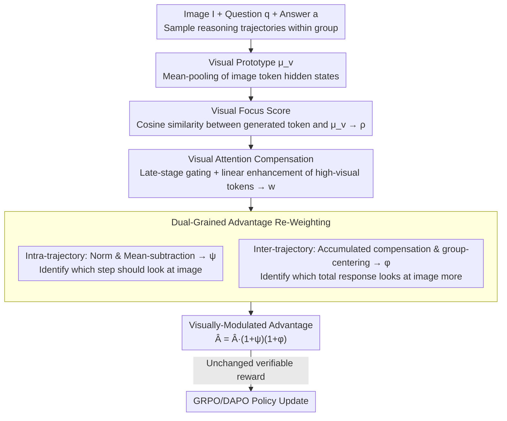

# Visually-Guided Policy Optimization for Multimodal Reasoning

**Conference**: ACL2026  
**arXiv**: [2604.09349](https://arxiv.org/abs/2604.09349)  
**Code**: https://github.com/wzb-bupt/VGPO  
**Area**: Reinforcement Learning  
**Keywords**: Multimodal Reasoning, Reinforcement Learning, GRPO, Visual Attention, Visual Forgetting

## TL;DR
VGPO utilizes hidden-state similarity to locate vision-related tokens during RLVR training. By applying late-stage visual compensation and dual-grained advantage re-weighting (intra- and inter-trajectory), it strengthens visual focus. Qwen2.5-VL-7B equipped with VGPO outperforms GRPO/DAPO and existing vision-enhanced RL methods in mathematical multimodal reasoning and vision-dependent tasks.

## Background & Motivation
**Background**: Methods like RLVR and GRPO/DAPO have significantly enhanced the step-by-step reasoning capabilities of VLMs, particularly in tasks with verifiable answers such as mathematics, geometry, and visual question answering. Current multimodal reasoning research typically focuses on final answer rewards, rollout diversity, KL/entropy regularization, or external visual verifiers.

**Limitations of Prior Work**: The reasoning process of VLMs remains heavily text-dominant. When generating long reasoning chains, models may briefly focus on the image initially but increasingly rely on the question text and previously generated tokens as the process continues. This leads to sparse visual token activation, visual fact forgetting, hallucinations, or erroneous reasoning based on language priors.

**Key Challenge**: Multimodal reasoning requires the model to persistently use image evidence throughout long chains. However, conventional RL only rewards final answer correctness, regardless of whether the model faithfully consulted the image. Existing vision-enhancing methods often introduce special tokens, extra forward passes, noisy image comparisons, or auxiliary models, resulting in high training costs and system complexity.

**Goal**: The authors aim to integrate "persistent visual attention during reasoning" directly into policy optimization without introducing extra models or external visual verification processes, ensuring the model pursues both answer correctness and sufficient use of visual evidence.

**Key Insight**: It is observed that the similarity between the hidden states of generated tokens and image tokens can serve as an endogenous Visual Focus Score. When the model genuinely utilizes visual information, this similarity increases, and the corresponding attended image regions are typically semantically plausible.

**Core Idea**: Construct a visual focus signal using the model's own hidden states and transform it into a re-weighting factor for the RL advantage function. This allows rewards for correct answers to propagate along reasoning trajectories that are more visually faithful.

## Method
VGPO can be understood as adding a "visual faithfulness modulator" on top of RL frameworks like DAPO/GRPO. While original RLVR only considers the final reward of each rollout (e.g., exact match), VGPO reallocates advantages at both token and trajectory granularities: vision-related tokens receive higher update weights, and trajectories with stronger overall visual focus are also weighted more heavily.

### Overall Architecture
Given an image $I$, a textual question $q$, and an answer $a$, the policy model samples a group of reasoning trajectories. First, VGPO extracts a visual prototype from the hidden states of image tokens and calculates the similarity between each generated token and the prototype to form a Visual Focus Score. Then, Visual Attention Compensation applies linear enhancement to high-similarity tokens in the latter half of the reasoning process to counteract temporal visual forgetting. Finally, Dual-Grained Advantage Re-Weighting embeds this visual compensation signal into the policy objective: intra-trajectory weighting distinguishes token-level visual importance, while inter-trajectory weighting distinguishes the overall visual accumulation of the entire response.

### Key Designs
**1. Visual Focus Score: Identifying if a token is truly "thinking about the image" via hidden-state similarity**

To strengthen visual faithfulness, it is necessary to identify which tokens in a long reasoning chain are actually using visual evidence—yet relying on manual annotation or auxiliary models is costly. VGPO aggregates the hidden states of input image tokens into a visual prototype $\mu_v$ (via mean-pooling) and calculates the cosine similarity between the current generated token's hidden state $h_{i,t}$ and $\mu_v$, normalized to a focus score $\rho_{i,t}=0.5(\mathcal{S}(h_{i,t},\mu_v)+1)\in[0,1]$. This signal is inexpensive, endogenous, and can be integrated end-to-end without extra forward passes or critic models.

**2. Visual Attention Compensation: Addressing late-stage visual decay precisely**

Using $\rho_{i,t}$ directly systematically underestimates late-stage visual tokens because visual attention naturally decays as generation progresses—the source of temporal visual forgetting. VGPO constructs compensation weights $w_{i,t}=\rho_{i,t}[1+G_i(\rho_{i,t})\beta t/T_i]$: where $t/T_i$ linearly increases compensation with generation position to focus on the latter stages more prone to forgetting. The gate $G_i$ only activates for tokens in the latter half of the trajectory that belong to the top-$\kappa$ visual scores, preventing the forced enhancement of non-visual tokens. Default hyperparameters are $\beta=0.3$, $\gamma=0.5$, and $\kappa=0.2$.

**3. Dual-Grained Advantage Re-Weighting: Token-level "which step" vs. Trajectory-level "which response"**

Focusing only on local tokens ignores whether the entire response is consistently grounded, while focusing only on the whole trajectory fails to accurately assign rewards to critical visual steps. VGPO modulates advantages at both levels. Within a trajectory, $w_{i,t}$ is min-max normalized and mean-subtracted to obtain $\psi_{i,t}$, giving higher advantages to tokens with above-average visual activation. Across trajectories, the total compensation score $s_i=\sum_t w_{i,t}$ is normalized and centered within the rollout group to obtain $\phi_i$. The final advantage is $\hat{A}^{\mathcal{V}}_{i,t}=\hat{A}_i(1+\psi_{i,t})(1+\phi_i)$, allowing rewards to flow through visually faithful paths while the verifiable reward itself remains unchanged.

### Loss & Training
The base optimization follows the styles of GRPO/DAPO: a group of responses is sampled for each question, binary rewards are obtained via exact match, and advantages are normalized within the group. VGPO simply replaces standard advantages with visually-modulated advantages $\hat{A}^{\mathcal{V}}_{i,t}$. Experiments were conducted using Qwen2.5-VL 3B, 7B, and 32B on ViRL39K, Geo3K, and MMK12 datasets for 2 epochs with a learning rate of $1\times 10^{-6}$, rollout batch size of 512, and max length of 2,048.

## Key Experimental Results

### Main Results
The main experiment compares Qwen2.5-VL-7B (base), GRPO, DAPO, VGPO, and existing 7B multimodal reasoning methods. VGPO achieves the best average performance across general mathematical/geometric reasoning and vision-dependent multimodal reasoning tasks.

| Method | Avg-Math↑ | Avg-Vision↑ | Gain (vs. Base) | Note |
|--------|------|------|----------|------|
| Qwen2.5-VL-7B | 50.0 | 48.7 | - | No RL post-training |
| + GRPO | 62.6 | 58.8 | Math +25.2%, Vision +20.7% | Group-relative reward only |
| + DAPO | 63.8 | 59.6 | Math +27.6%, Vision +22.4% | Stronger RL baseline |
| PAPO-D-7B | 65.5 | 60.4 | - | Vision-enhanced RL |
| VPPO-RL-7B | 65.7 | 61.3 | - | KL-aware vision enhancement |
| + VGPO | 66.6 | 63.3 | Math +33.2%, Vision +30.0% | Best performance |

| Setting | Avg-Math↑ | Avg-Vision↑ | Note |
|------|---------|------|------|
| Qwen2.5-VL-3B + DAPO | 55.3 | 48.3 | 3B Model baseline |
| Qwen2.5-VL-3B + VGPO | 57.7 | 53.6 | Significant vision gain |
| Qwen2.5-VL-32B + DAPO | 68.4 | 64.8 | 32B Model baseline |
| Qwen2.5-VL-32B + VGPO | 70.7 | 66.7 | Gains persist at 32B |
| 7B + DAPO w/ Geo3K 2.1K | 57.4 | 54.8 | Small training set |
| 7B + VGPO w/ Geo3K 2.1K | 60.4 | 55.8 | Outperforms DAPO with less data |
| 7B + DAPO w/ MMK12 6.4K | 60.8 | 58.8 | Medium training set |
| 7B + VGPO w/ MMK12 6.4K | 62.4 | 60.3 | Generalizes across datasets |

### Ablation Study

| Configuration | Avg-Math↑ | Avg-Vision↑ | Overall↑ | Note |
|------|---------|------|------|------|
| DAPO baseline | 63.8 | 59.6 | 62.2 | No visual re-weighting |
| + Intra-trajectory | 66.1 | 62.5 | 64.6 | Token-level weighting is effective |
| + Inter-trajectory | 65.3 | 62.0 | 64.0 | Trajectory-level help is present |
| + Intra & Inter | 66.6 | 63.3 | 65.3 | Complementary, best results |

| Compensation Strategy | Avg-Math↑ | Avg-Vision↑ | Overall↑ | Note |
|------|---------|------|------|------|
| DAPO baseline | 63.8 | 59.6 | 62.2 | No visual compensation |
| Step-Function | 64.7 | 60.7 | 63.1 | Abrupt changes cause instability |
| Exponential | 65.1 | 61.0 | 63.5 | Over-emphasizes final token |
| Linear (VGPO) | 66.6 | 63.3 | 65.3 | Best matches progressive forgetting |
| Full-trajectory compensation | 53.0 | 54.2 | 53.5 | Full compensation hurts performance |
| Late-trajectory compensation | 66.6 | 63.3 | 65.3 | Targeting decay is most effective |

### Key Findings
- Text-dominant reasoning is a real phenomenon. In Qwen2.5-VL-7B, visual attention peaks early and then gradually declines during generation.
- Correct samples exhibit a higher late/early visual accumulation ratio than incorrect ones (approx. 0.680 vs. 0.532), indicating that persistent focus is correlated with accuracy.
- VGPO's improvements are consistent across scales (3B, 7B, 32B) and datasets (Geo3K/MMK12/ViRL39K).
- Visual compensation must be "late and precise." Full-trajectory compensation dropped the overall score from 62.2 to 53.5, suggesting that forcing visual grounding too early interferes with text parsing.

## Highlights & Insights
- A key highlight of VGPO is converting visual faithfulness from an external supervision signal to an internal one. It requires no GPT-based judging, no noisy dual-forward passes, and no special look-back tokens.
- The dual-grained advantage design is natural. Token-level weighting addresses "which step to look," while trajectory-level weighting addresses "which response to trust," fitting long-chain reasoning better than simple regularization.
- Late compensation insights: visual grounding is not "the more the better"; rather, it should be reinforced where the model is most likely to forget evidence.
- This paper serves as a reminder that RLVR based solely on final answers may reward incorrect reasoning paths. Correct answers can still result from language priors; visual process signals bring training objectives closer to the essence of multimodal tasks.

## Limitations & Future Work
- The Visual Focus Score assumes similarity signifies grounding, but this similarity might not always distinguish true visual evidence from semantically related linguistic concepts.
- The method requires access to internal hidden states, making it difficult to apply to closed-source VLMs or API-only models.
- Hyperparameters ($\beta, \gamma, \kappa$) influence stability and may require re-calibration for different architectures.
- Evaluation is focused on verifiable math and vision tasks; its effectiveness for open-ended VQA, captioning, or real-world agent planning remains to be explored.
- Increased visual attention ratios do not automatically equate to causal faithfulness. Future work could include counterfactual image editing or occlusion experiments to verify dependency on correct regions.

## Related Work & Insights
- **vs. GRPO/DAPO**: While they optimize final verifiable rewards, VGPO incorporates visual focus into advantage allocation to solve multimodal visual forgetting.
- **vs. PAPO/VPPO**: Unlike methods using noisy images or KL divergence, VGPO uses hidden-state similarity, avoiding extra forward passes and external comparisons.
- **vs. Look-Back / Latent visual tokens**: Rather than changing generation formats with special tokens, VGPO encourages persistent focus through the training objective.
- **Insights**: Multimodal RL should go beyond outcome rewards to include process-level modality-use rewards, teaching models when to use which modality.

## Rating
- Novelty: ⭐⭐⭐⭐ Hidden-state modulated advantage is clever, though built on the GRPO/DAPO framework.
- Experimental Thoroughness: ⭐⭐⭐⭐⭐ Comprehensive scaling, data expansion, and ablation of re-weighting and compensation strategies.
- Writing Quality: ⭐⭐⭐⭐ Clear formulas and logical narrative, though the Method section is somewhat dense.
- Value: ⭐⭐⭐⭐⭐ Directly relevant for multimodal RLVR, visual faithfulness, and reducing visual hallucinations.

<!-- RELATED:START -->

## Related Papers

- [\[ICLR 2026\] From Narrow to Panoramic Vision: Attention-Guided Cold-Start Reshapes Multimodal Reasoning](../../ICLR2026/reinforcement_learning/from_narrow_to_panoramic_vision_attention-guided_cold-start_reshapes_multimodal_.md)
- [\[ICLR 2026\] Boosting Multi-Domain Reasoning of LLMs via Curvature-Guided Policy Optimization](../../ICLR2026/reinforcement_learning/boosting_multi-domain_reasoning_of_llms_via_curvature-guided_policy_optimization.md)
- [\[ICLR 2026\] Unveiling the Cognitive Compass: Theory-of-Mind-Guided Multimodal Emotion Reasoning](../../ICLR2026/reinforcement_learning/unveiling_the_cognitive_compass_theory-of-mind-guided_multimodal_emotion_reasoni.md)
- [\[ICLR 2026\] Multi-Agent Guided Policy Optimization](../../ICLR2026/reinforcement_learning/multi-agent_guided_policy_optimization.md)
- [\[ICLR 2026\] Guided Policy Optimization under Partial Observability](../../ICLR2026/reinforcement_learning/guided_policy_optimization_under_partial_observability.md)

<!-- RELATED:END -->
