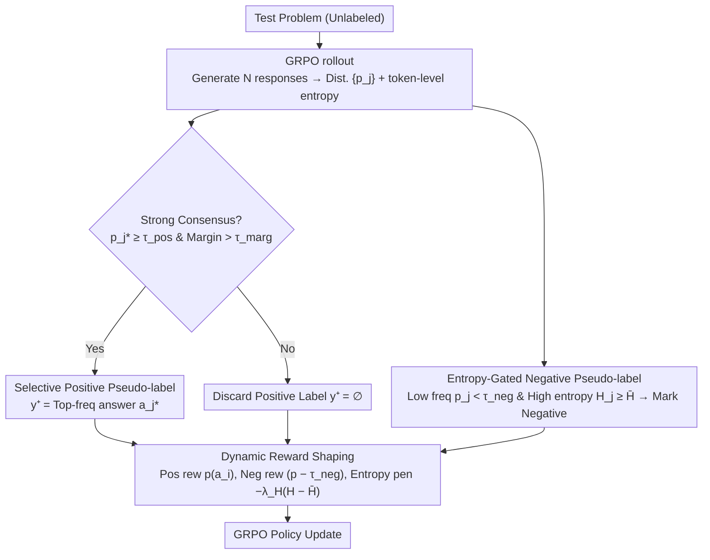

# SCRL: What If Consensus Lies? Selective-Complementary Reinforcement Learning at Test Time

**Conference**: ACL 2026  
**arXiv**: [2603.19880](https://arxiv.org/abs/2603.19880)  
**Code**: [https://github.com/Jasper-Yan/SCRL](https://github.com/Jasper-Yan/SCRL)  
**Area**: Reinforcement Learning / LLM Reasoning  
**Keywords**: Test-Time Reinforcement Learning, Pseudo-label Noise, Negative Labels, Consensus Reliability, Unsupervised Reasoning

## TL;DR

This paper proposes SCRL (Selective-Complementary Reinforcement Learning), a robust test-time reinforcement learning framework. It mitigates label noise amplification by using selective positive pseudo-labels (filtering unreliable majorities with strict consensus criteria) and entropy-gated negative pseudo-labels (introducing negative supervision signals in TTRL for the first time to prune incorrect trajectories). SCRL achieves up to a 10.1 percentage point improvement over TTRL on AIME25.

## Background & Motivation

**Background**: Test-Time Reinforcement Learning (TTRL) enables LLMs to self-improve on unlabeled test streams by deriving pseudo-rewards via majority voting consensus, becoming a key paradigm for unsupervised reasoning.

**Limitations of Prior Work**: Existing TTRL methods rely entirely on a positive pseudo-labeling strategy, where majority voting selects the most frequent answer as the positive label. However, on difficult problems, the answer distribution is highly dispersed and consensus is weak. The group normalization in GRPO amplifies noise: when the positive label frequency $f$ is small, the normalized advantage of positive samples $\hat{A}^+ = \sqrt{(1-f)/f}$ becomes very large. Consequently, a few incorrect positive pseudo-labels disproportionately influence policy updates, leading to premature convergence on spurious solutions.

**Key Challenge**: On difficult problems, identifying the correct answer is hard, but identifying incorrect ones is relatively easy. Existing methods overlook the potential of negative labels; when the correct answer cannot be reliably identified, the search space can still be narrowed by pruning incorrect trajectories.

**Goal**: To simultaneously utilize positive and negative signals in TTRL, pruning the search space with negative labels when consensus is unreliable rather than forcing the selection of a positive label.

**Key Insight**: Distinguish between "infrequent but potentially correct" and "infrequent and definitely incorrect" answers using generation uncertainty (token-level entropy). High frequency with low entropy suggests a likely correct answer, while low frequency with high entropy suggests a high probability of error.

**Core Idea**: Provide positive supervision only when the consensus is sufficiently strong (selectivity) and prune definitely incorrect trajectories with negative labels when consensus is insufficient (complementarity). These cooperate through dynamic reward shaping to achieve robust test-time learning.

## Method

### Overall Architecture

SCRL aims to prevent test-time reinforcement learning from being misled by noise in difficult, weak-consensus scenarios. It layers three defenses over GRPO: first, it uses strict criteria to decide whether to provide a positive label; second, it identifies clearly incorrect low-frequency trajectories as negative labels to prune the search space; finally, it adaptively scales the magnitude of positive and negative reward signals based on consensus strength. Together, these transform the "naive majority voting" of TTRL into a robust framework that "learns from positives when consensus is credible and excludes errors when it is not."

### Key Designs

**1. Selective Positive Pseudo-labeling: No Positive Label if Consensus is Weak**

A pain point of TTRL is that majority voting on difficult problems often selects an answer that is only "slightly more frequent" than others. Reinforcing this as a positive label cements incorrect solutions. SCRL adds a dual-gate to positive supervision: for $N$ responses, the answer distribution $\{p_j\}$ is analyzed. A positive pseudo-label $y^+ = a_{j^*}$ is declared only if the highest proportion $p_{j^*} \geq \tau_{\text{pos}}$ (sufficient support) **and** the margin over the second-best answer $(p_{j^*} - p_{(2)}) > \tau_{\text{marg}}$ (clear lead) are both met. Otherwise, $y^+ = \varnothing$, and positive supervision is discarded for the current round. This dual condition ensures consensus is only trusted when the distribution is both "sharp and separated," cutting off noise amplification at the source.

**2. Entropy-Gated Negative Pseudo-labeling: Using Uncertainty to Separate Errors from Rare Truths**

When a positive label cannot be provided, SCRL introduces negative supervision to prune definitely incorrect trajectories—a first in TTRL. The challenge is that low-frequency answers can be either rare correct solutions or incorrect reasoning. SCRL uses token-level entropy during generation for disambiguation: for each answer $a_j$, the average trajectory entropy $\bar{H}_j$ is calculated. A negative label is assigned only if $p_j < \tau_{\text{neg}}$ (low frequency) **and** $\bar{H}_j \geq \bar{H}$ (above global average uncertainty). The condition $\bar{H}_j \geq \bar{H}$ is crucial—it protects rare correct solutions where the model is certain, while only punishing trajectories that are both scarce and uncertain.

**3. Dynamic Reward Shaping: Aligning Reward Magnitude with Consensus Reliability**

Fixed reward values can amplify noise when consensus fluctuates. SCRL adaptively scales both positive and negative signals: the positive reward is set to the answer proportion $p(a_i)$, granting more reward for stronger consensus; the negative reward is $(p(a_i) - \tau_{\text{neg}})$, imposing heavier penalties for rarer answers. An entropy penalty $-\lambda_H(\bar{H}(a_i) - \bar{H})$ is added to push the policy toward low-uncertainty responses. By combining these three weighted components, the reward intensity always follows consensus reliability, preventing a one-size-fits-all reward from over-reinforcing incorrect samples in weak-consensus situations.

### Loss & Training

GRPO is used as the base RL algorithm. It utilizes the AdamW optimizer with a cosine learning rate schedule (peak $5 \times 10^{-7}$). Updates involve generating 64 (or 32) candidate responses for label estimation and downsampling to 32 (or 16) for training. Thresholds are set at $\tau_{\text{pos}}=0.375, \tau_{\text{marg}}=0.125, \tau_{\text{neg}}=0.125$. The experiments were conducted on 8×A100 80GB GPUs.

## Key Experimental Results

### Main Results

**Pass@1 Accuracy (%) on Qwen2.5-Math-7B**

| Method | AIME25 | AMC | MATH-500 | Minerva | Average |
|------|--------|-----|---------|---------|------|
| Baseline | 4.6 | 34.0 | 46.5 | 10.1 | 23.6 |
| + TTRL | 16.8 | 65.7 | 85.7 | 14.5* | 41.6 |
| **+ SCRL** | **26.9** | **66.9** | **85.6** | **41.6** | **49.3** |
| Gain vs TTRL | +10.1 | +1.2 | -0.1 | +27.1 | +7.7 |

*Note: TTRL performance degrades sharply after reaching a 14.5% peak on Minerva.*

**Pass@1 (%) on Llama-3.1-8B-Instruct**

| Method | AIME24 | AMC | Average |
|------|--------|------|------|
| + TTRL | 10.0 | 32.3 | 21.2 |
| + RESTRAIN | 16.7 | 40.0 | 28.4 |
| **+ SCRL** | **21.9** | 36.1 | **29.0** |

### Ablation Study

| Configuration | AIME25 | AMC | Description |
|------|--------|-----|------|
| Full SCRL | 26.9 | 66.9 | Complete model |
| w/o Negative Labels | 19.4 | 65.3 | Negative label contribution: +7.5 (AIME25) |
| w/o Selective Positives | 21.5 | 66.1 | Selectivity contribution: +5.4 |
| w/o Entropy Gating | 23.1 | 65.8 | Entropy condition contribution: +3.8 |
| w/o Dynamic Reward | 24.2 | 66.0 | Dynamic reward contribution: +2.7 |

### Key Findings

- The largest improvement (+10.1) occurs on the most difficult task (AIME25), which is exactly where weak consensus is most prevalent.
- While TTRL exhibits training instability on Minerva (performance rises then drops sharply), SCRL maintains stable training dynamics (41.6% vs 14.5%).
- Negative labels contribute most significantly to difficult tasks (+7.5 on AIME25), validating the strategy of "excluding what is wrong when the right is unknown."
- SCRL's effectiveness is more pronounced under low rollout budgets; when budgets are limited, consensus is less reliable, making SCRL's protective mechanisms more critical.
- Consistent effectiveness across model families (Qwen, Llama) and scales (1B-7B) demonstrates model-agnosticism.

## Highlights & Insights

- The insight "consensus can be wrong" directly challenges the fundamental assumption of TTRL; the negative label mechanism provides a natural and elegant solution.
- Entropy gating is the key to distinguishing "rare truths" from "actual errors." Neither frequency nor uncertainty alone is sufficient; it is the intersection of the two that provides reliability.
- Dynamic reward shaping ensures the intensity of positive and negative signals matches consensus reliability, avoiding noise amplification inherent in fixed rewards.

## Limitations & Future Work

- Threshold parameters ($\tau_{\text{pos}}, \tau_{\text{marg}}, \tau_{\text{neg}}$) were fixed across all experiments, which may lack flexibility for certain tasks.
- Validation was limited to mathematics and general reasoning; tasks like code generation were not explored.
- Negative labels contribute less to simple tasks and may introduce unnecessary complexity there.
- Future work could explore adaptive threshold mechanisms and finer-grained uncertainty estimation.

## Related Work & Insights

- **vs TTRL**: TTRL uses only positive labels, amplifying noise under weak consensus. SCRL adds selectivity and negative labels as protective mechanisms.
- **vs RESTRAIN**: RESTRAIN penalizes overconfidence and low-consistency responses but remains within a positive-label framework. SCRL introduces true negative supervision signals.
- **vs SPINE**: SPINE limits updates to high-entropy forking tokens; SCRL operates at the answer level, offering strong complementarity.

## Rating

- Novelty: ⭐⭐⭐⭐⭐ First to introduce negative supervision to TTRL; the selective-complementary framework is elegantly designed.
- Experimental Thoroughness: ⭐⭐⭐⭐⭐ Multi-model, multi-scale, multi-task, with detailed ablation and label quality analysis.
- Writing Quality: ⭐⭐⭐⭐ Clear motivation and complete mathematical derivation.
- Value: ⭐⭐⭐⭐⭐ Significantly addresses the core bottleneck of TTRL with substantial performance gains.

<!-- RELATED:START -->

## Related Papers

- [\[ACL 2026\] Beyond Majority Voting: Towards Fine-grained and More Reliable Reward Signal for Test-Time Reinforcement Learning](beyond_majority_voting_towards_fine-grained_and_more_reliable_reward_signal_for_.md)
- [\[NeurIPS 2025\] Reinforcement Learning Teachers of Test Time Scaling](../../NeurIPS2025/reinforcement_learning/reinforcement_learning_teachers_of_test_time_scaling.md)
- [\[ICLR 2026\] Self-Harmony: Learning to Harmonize Self-Supervision and Self-Play in Test-Time Reinforcement Learning](../../ICLR2026/reinforcement_learning/self-harmony_learning_to_harmonize_self-supervision_and_self-play_in_test-time_r.md)
- [\[ICML 2025\] Test-Time Adaptation with Binary Feedback](../../ICML2025/reinforcement_learning/test-time_adaptation_with_binary_feedback.md)
- [\[ICLR 2026\] Representation-Based Exploration for Language Models: From Test-Time to Post-Training](../../ICLR2026/reinforcement_learning/representation-based_exploration_for_language_models_from_test-time_to_post-trai.md)

<!-- RELATED:END -->
