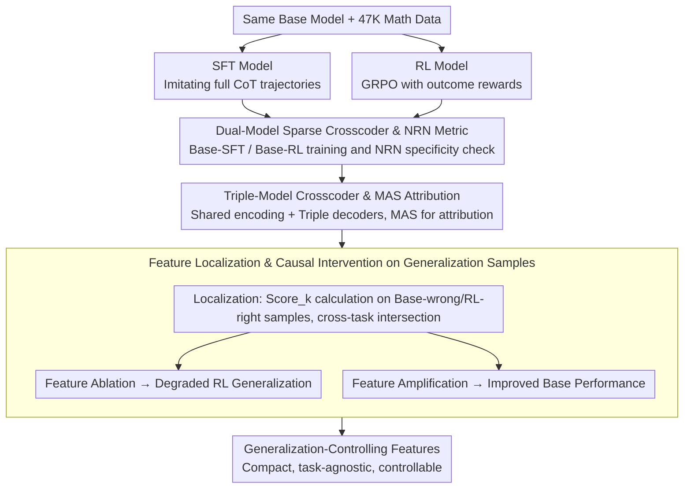

# Why Does Reinforcement Learning Generalize? A Feature-Level Mechanistic Study of Post-Training in Large Language Models

**Conference**: ACL2026  
**arXiv**: [2604.25011](https://arxiv.org/abs/2604.25011)  
**Code**: https://github.com/danshi777/RL-generalization  
**Area**: RL Post-training / Mechanistic Interpretability  
**Keywords**: RL Generalization, SFT Forgetting, Sparse Crosscoder, Feature Intervention, LLM Post-training

## TL;DR
Applying strictly controlled SFT/RL post-training comparisons and Sparse Crosscoder feature alignment, this paper finds that while SFT rapidly forms numerous specialized features, RL tends to retain base representations while gradually enhancing a small set of cross-task generalization features. Ablating these features significantly harms RL generalization, whereas amplifying them improves base model performance.

## Background & Motivation
**Background**: In LLM post-training, SFT and RL are commonly used to enhance reasoning capabilities. SFT typically imitates complete CoT trajectories from strong teachers, while RL provides rewards based solely on the correctness of final answers. Empirically, RL often transfers well to tasks like common sense and scientific QA beyond math training, whereas SFT occasionally sacrifices general capabilities.

**Limitations of Prior Work**: Existing literature mostly remains at the behavioral level, observing better RL generalization and more pronounced SFT forgetting without explaining internal representation changes. Analyzing output distributions or global hidden state shifts only provides coarse explanations and fails to identify which internal features actually control generalization.

**Key Challenge**: RL has weaker supervision (only outcome-based, no full trajectory), yet it is more effective at preserving and expanding general abilities. SFT has denser supervision but is more likely to push the model toward the training distribution and teacher style. This suggests that "supervision intensity" does not equal "generalization mechanism"; the key may lie in how post-training rewrites the existing feature space.

**Goal**: The authors aim to answer three questions while controlling for data, base model, and scale: What model-specific features do SFT and RL introduce? How do these features form and stabilize? Does RL possess a set of localizable, intervenable cross-task generalization features?

**Key Insight**: The paper utilizes a Sparse Crosscoder to map the residual stream activations of the base, SFT, and RL models into a single sparse feature space. This allows for a feature-by-feature analysis of whether a feature belongs to the base, SFT, or RL model, rather than merely comparing global vector distances.

**Core Idea**: By using cross-model sparse feature alignment and causal intervention, the study transforms the question "Why does RL generalize?" from behavioral observation into a mechanistic inquiry: "Does RL enhance a compact, task-agnostic, and controllable set of generalization features?"

## Method
The method consists of two layers: first, constructing fair post-training control experiments where SFT and RL differ only in training paradigm; second, using the Sparse Crosscoder to align activations and identify generalization-controlling features through attribution, dynamics analysis, and intervention.

### Overall Architecture
The input consists of two post-trained versions of the same base model (experiments on Qwen3-4B-Base and Qwen2.5-7B, validated on Llama3.1-8B-Instruct) using identical mathematical training data. The authors first train two pairwise Sparse Crosscoders (Base-SFT, Base-RL) to measure introduced specificity. Then, a triple-model Crosscoder is trained to place Base, SFT, and RL into a unified sparse space. Finally, focusing on "Base-wrong, RL-right" samples, they locate generalization features and perform causal validation via ablation and amplification.

### Key Designs
**1. Dual-Model Sparse Crosscoder and NRN Specificity Metric**: Direct comparisons of hidden states are messy. Crosscoder reconstructs residual activations of the base and one post-trained model simultaneously, mapping dimensions to shared or specific features. The authors use NRN: $NRN=||W^{T}_{dec,k}||_1/(||W^{O}_{dec,k}||_1+||W^{T}_{dec,k}||_1)$, where values near 1 indicate post-training specificity and 0 indicates base specificity. SFT shows a heavy right tail (highly specific features), while RL has fewer extreme features, primarily retaining and reweighting base representations.

**2. Triple-Model Crosscoder and MAS Attribution**: To make feature indices comparable across Base, SFT, and RL, the triple-model Crosscoder uses one shared encoder and three decoders. Feature norms are normalized into $MAS_O$, $MAS_S$, and $MAS_R$ (summing to 1). This allows for definitive attribution of features to SFT-unique, RL-unique, or shared categories.

**3. Feature Localization and Causal Intervention**: To establish causality, the authors focus on samples where the base model fails but the RL model succeeds. They compute the average activation difference $Score_k=E[f_k^{RL}(x)-f_k^{Base}(x)]$ across non-math tasks. Features exceeding a threshold that intersect across tasks are identified as task-agnostic generalization-controlling features. Validation is bidirectional: ablating these features degrades RL performance, while amplifying them in the base model improves results, proving they are functional control points rather than noise.

### Loss & Training
SFT and RL start from the same base model and use 47K high-quality math problems. SFT targets full CoT trajectories from Qwen3-32B-Instruct using cross-entropy. RL uses GRPO, rewarding only the final answer correctness.

RL uses the verl framework with a batch size of 128, learning rate $1e-6$, 8 rollouts per prompt, and a 1 epoch limit. SFT uses LLaMA-Factory with a batch size of 128 and learning rate $5e-5$. The Crosscoders analyze 32,768 sparse features trained on 400M tokens from OpenThoughts-114k and RedPajama, with a batch size of 1024, learning rate $1e-4$, and a sparsity coefficient of 2.

## Key Experimental Results

### Main Results
RL not only improves math performance but also significantly outperforms SFT on non-training domain tasks like CommonsenseQA, SciQ, and ARC-Challenge. While SFT shows large math gains, it often suffers from forgetting in general tasks.

| Model | MATH500 | AIME24 | AIME25 | OpenBookQA | CommonsenseQA | SciQ | ARC-Challenge |
|------|---------|--------|--------|------------|----------------|------|---------------|
| Qwen3-4B-Base | 26.0 | 13.3 | 0.0 | 23.6 | 20.1 | 78.5 | 36.0 |
| Qwen3-4B-SFT | 68.4 | 13.3 | 13.3 | 25.8 | 19.6 | 51.8 | 34.4 |
| Qwen3-4B-RL | 77.0 | 26.7 | 20.0 | 27.2 | 50.5 | 89.5 | 39.3 |
| RL - SFT | +8.6 | +13.4 | +6.7 | +1.4 | +31.0 | +37.7 | +4.9 |
| Qwen2.5-7B | 40.0 | 10.0 | 3.3 | 28.4 | 77.6 | 86.9 | 41.9 |
| Qwen2.5-7B-SFT | 69.2 | 13.3 | 10.0 | 26.4 | 30.1 | 79.4 | 37.0 |
| Qwen2.5-7B-RL | 71.4 | 20.0 | 13.3 | 32.8 | 76.1 | 90.7 | 42.5 |
| RL - SFT | +2.2 | +6.7 | +3.3 | +6.4 | +46.0 | +11.3 | +5.5 |

### Ablation Study
The feature intervention experiment provides strong evidence. Generalization features (50 for Qwen3-4B, 16 for Qwen2.5-7B) overlapped by over 80% across different tasks.

| Intervention | Model | OpenBookQA | CommonsenseQA | HeadQA | SciQ | ARC-Challenge | Note |
|------|------|------------|----------------|--------|------|---------------|------|
| Ablate Gen Features | Qwen3-4B-RL | -46.2 | -43.9 | -21.2 | -14.0 | -33.3 | RL loses key correct samples |
| Ablate Gen Features | Qwen2.5-7B-RL | -21.9 | -24.4 | -23.8 | -44.4 | -20.0 | Features are necessary for RL |
| Amplify Gen Features | Qwen3-4B-Base | +36.3 | +36.0 | +21.2 | +38.0 | +33.3 | Base model improves with injection |
| Amplify Gen Features | Qwen2.5-7B | +12.5 | +24.4 | +14.3 | +55.6 | +40.0 | Knowledge exists, needs activation |

Testing on unseen LogiQA and PIQA: ablating RL generalization features dropped scores by upstanding margins (e.g., -24.5 for Qwen3-4B-RL), while amplifying them in the base model boosted scores (e.g., +28.2 for Qwen3-4B-Base).

### Key Findings
- SFT features stabilize earlier: top-50 SFT-specific features overlap heavily across periodic checkpoints, suggesting the rapid formation of fixed teacher trajectory templates. RL features show low overlap across checkpoints, indicating continuous exploration.
- RL performs "restrained" rewriting: NRN and MAS distributions reveal that SFT creates many strong model-specific features, whereas RL focuses on reweighting preserved base representations.
- Generalization is not scattered: Generalization features are highly consistent across diverse tasks (OpenBookQA to ARC), supporting the "compact task-agnostic features" hypothesis.

## Highlights & Insights
- The most valuable design is converting "RL Generalization" into an intervenable mechanistic problem, establishing a causal chain beyond simple representation distance.
- The paper provides a clear intuition: SFT carves teacher trajectory templates into the model, whereas RL adjusts outcome-oriented control features on top of existing capabilities.
- The observation that "base models don't lack knowledge, they lack mechanisms to activate generalization features" suggests that future training could explicitly encourage the activation of these transferable features rather than just providing more CoT data.
- The triple-model Crosscoder is a robust tool for comparing multiple alignment methods (DPO, RLHF, etc.) to see how they rewrite internal features differently.

## Limitations & Future Work
- Sparse Crosscoders might miss mechanisms that are not linearly reconstructible or not visible in middle-layer residual streams.
- While causality is proven, the study doesn't demonstrate how to stably induce these features via objective functions alone.
- Experiments focus on math-to-QA transfer; it remains unclear if these findings hold for code, long-range planning, or safety alignment.
- Feature thresholding (20% of max score) is empirical. More robust selection criteria, such as bootstrap consistency, are needed.

## Related Work & Insights
- **vs. Behavioral SFT/RL comparison**: Improves upon prior reports of RL generalization by localizing specific features and formation dynamics.
- **vs. Global representation drift**: While previous work attributes SFT's poor generalization to distribution drift, this study identifies exactly which sparse features drive this observation.
- **vs. SAE Interpretability**: SAEs are usually model-specific; the Crosscoder approach used here is superior for cross-model comparative analysis.

## Rating
- Novelty: ⭐⭐⭐⭐⭐ High marks for the mechanistic explanation and causal intervention approach.
- Experimental Thoroughness: ⭐⭐⭐⭐☆ Solid controlled training and multi-model validation, though task types are somewhat limited.
- Writing Quality: ⭐⭐⭐⭐☆ Logical flow is clear, though some technical details are dense.
- Value: ⭐⭐⭐⭐⭐ Highly influential for understanding RL post-training and designing better alignment objectives.

<!-- RELATED:START -->

## Related Papers

- [\[ACL 2026\] Scaling Behaviors of LLM Reinforcement Learning Post-Training: An Empirical Study](scaling_behaviors_of_llm_reinforcement_learning_post-training_an_empirical_study.md)
- [\[ICLR 2026\] Post-training Large Language Models for Diverse High-Quality Responses](../../ICLR2026/reinforcement_learning/post-training_large_language_models_for_diverse_high-quality_responses.md)
- [\[ICML 2026\] Can Large Language Models Generalize Procedures Across Representations?](../../ICML2026/reinforcement_learning/can_large_language_models_generalize_procedures_across_representations.md)
- [\[ACL 2026\] A Survey of Reinforcement Learning for Large Language Models under Data Scarcity: Challenges and Solutions](a_survey_of_reinforcement_learning_for_large_language_models_under_data_scarcity.md)
- [\[ICLR 2026\] Representation-Based Exploration for Language Models: From Test-Time to Post-Training](../../ICLR2026/reinforcement_learning/representation-based_exploration_for_language_models_from_test-time_to_post-trai.md)

<!-- RELATED:END -->
