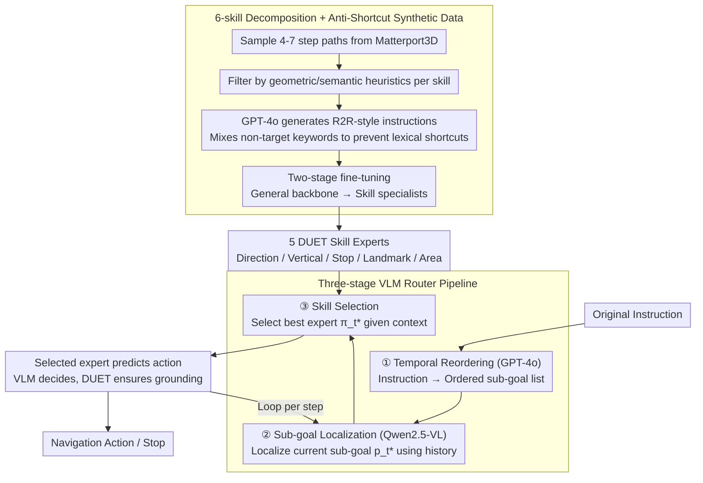

# Breaking Down and Building Up: Mixture of Skill-Based Vision-and-Language Navigation Agents

**Conference**: ACL 2026  
**arXiv**: [2508.07642](https://arxiv.org/abs/2508.07642)  
**Code**: https://github.com/HLR/SkillNav  
**Area**: Robotics / Vision-and-Language Navigation / Modular Agents  
**Keywords**: VLN, Skill Decomposition, VLM Router, Synthetic Data, GSA-R2R Generalization

## TL;DR
SkillNav decomposes the Vision-and-Language Navigation (VLN) task into five atomic skills (Directional Adjustment, Vertical Movement, Stop, Landmark Recognition, and Area Recognition) plus one Temporal Planning skill. Each skill fine-tunes a DUET sub-agent using synthetic data, while a training-free VLM router performs temporal reordering, sub-goal localization, and skill selection. SkillNav achieves SOTA generalization on GSA-R2R (Test-N-Scene SPL of 48% vs. the previous high of 43%).

## Background & Motivation

**Background**: The mainstream VLN research is polarized: (1) Supervised black-box agents (DUET / BEVBERT / ScaleVLN / SRDF), which are trained end-to-end on large-scale synthetic data, show strong in-domain performance on R2R but tend to memorize training trajectories; (2) Zero-shot LLM/VLM agents (MapGPT / NavGPT / DiscussNav), which generalize stably but lack fine-grained visual grounding, leading to a success rate (SR) gap of up to ~36 percentage points compared to supervised models.

**Limitations of Prior Work**: Supervised models exhibit a sharp drop in performance in "new building types + new instruction styles" scenarios like GSA-R2R. LLM models lack embodied grounding and cannot accurately select viewpoints. Multi-agent collaborative works (DiscussNav / FlexVLN / CLASH) combine multiple models but often activate many models per step, creating redundancy, and fall back to zero-shot LLM decisions during conflicts, sacrificing in-domain precision.

**Key Challenge**: The trade-off between "Broad Generalization (requiring world knowledge from LLMs)" and "Precise Execution (requiring fine-tuned visual grounding)." End-to-end agents favor the latter, while LLM agents favor the former; the two have been difficult to reconcile.

**Goal**: (1) Identify the "minimal set of executable atomic skills" so each skill can be individually refined; (2) Use VLMs only for high-level reasoning such as "skill selection + temporal planning" to avoid direct takeover of low-level actions; (3) Train each skill agent in a closed-loop using synthetic data without relying on manual labeling.

**Key Insight**: The authors reuse four atomic skills proposed by NavNuances (DC / VM / LR / RR) and add Stop and Temporal Order Planning, mimicking the human cognitive process of "decomposing tasks into reusable sub-actions and scheduling them as needed."

**Core Idea**: Replace the "monolithic end-to-end policy" with a combination of "skill decomposition + skill-specific synthetic data + VLM router," decoupling high-level planning from low-level execution to let LLM reasoning and fine-tuned visual grounding each play to their strengths.

## Method

### Overall Architecture
SkillNav aims to address the issue where end-to-end agents excel in-domain but fail in new environments, while LLM agents generalize well but lack precision. The approach decouples these abilities: first, navigation is decomposed into five atomic skills $\mathcal{S} = \{\pi_{da}, \pi_{vm}, \pi_{sp}, \pi_{ld}, \pi_{ar}\}$ (Directional Adjustment / Vertical Movement / Stop / Landmark Recognition / Area Recognition). Each skill is fine-tuned into a DUET expert using synthetic data, specializing in low-level visual grounding and action prediction. A training-free VLM router handles high-level reasoning: reordering the original instruction into sequential sub-goals, localizing the current sub-goal, and selecting one of the five experts. In this pipeline, the VLM only makes discrete "who to deploy" decisions, while the fine-tuned experts always predict the actual actions.

### Key Designs

**1. 6-skill Decomposition + Anti-Shortcut Synthetic Data: Breaking Navigation into Refinable Atomic Units**
Supervised models fail on GSA-R2R largely because monolithic policies mix all sub-capabilities and memorize trajectories. SkillNav reuses the four skills from NavNuances (DC / VM / LR / RR) and adds Stop and Temporal Order Planning to slice tasks into six semantically independent units. Data is synthesized rather than manually labeled: 4-7 step paths are sampled from Matterport3D and filtered via heuristics (e.g., Direction requires frequent turns, Vertical requires height changes $>2$ units). GPT-4o generates instructions based on observations. Critically, this data is "anti-shortcut"—Vertical Movement data deliberately includes non-vertical keywords (Landmark 18.72% + Direction 8.05%) to force the model to learn from visual context rather than a dictionary, as words like "down" vary across datasets.

**2. Three-Stage VLM Router: Intervening Only for Skill Switching**
The difficulty of delegating high-level planning to VLMs lies in overhead and temporal reasoning. If a VLM manages low-level actions every step, it is slow and couples reasoning errors with grounding errors. The SkillNav router utilizes a three-stage pipeline: (1) GPT-4o explicitly reorders instructions with temporal keywords into a structured sub-goal list; (2) Qwen2.5-VL-7B localizes the current sub-goal $p_t^*$ and provides a reasoning trace $r_t$; (3) The Skill Router selects the matching expert $\pi_t^* = \arg\max_{\pi \in \mathcal{S}} \text{Router}(I, p_t^*, r_t)$. This division makes each VLM call targeted and errors traceable; ablation shows that explicit temporal reordering is vital, as disabling it drops Test-N-Scene SPL by 2.5%.

**3. Decoupling VLM Reasoning and Fine-tuned Execution: Localizing Errors**
End-to-end VLM agents suffer from the coupling of reasoning and grounding errors. SkillNav strictly restricts the VLM to discrete "which skill to select" decisions. The selected expert uses its own DUET weights, the original instruction, current observations, and the topological map for the final action prediction. Even if the VLM misjudges, the worst case is a "wrong expert" being deployed, while execution grounding is still anchored by a trained DUET specialist. Expert activation frequencies confirm this precision-first strategy: control-based skills ($\pi_{sp}$ 34.42% + $\pi_{da}$ 23.61% = 58%) are frequently called, while semantic skills ($\pi_{ld}$ 14.23% + $\pi_{ar}$ 18.75%) activate only for specific object recognition, indicating that "continuous state verification" occurs more frequently than "sparse semantic anchoring."

### Loss & Training
Two-stage fine-tuning is employed: Stage 1 involves 50,000 iterations (batch 32, lr 5e-5) on ScaleVLN augmented data + R2R + Temporal synthesis to create a skill-agnostic backbone. Stage 2 involves 30,000 iterations (batch 16) on each skill-specific dataset to refine the five experts. The router uses vLLM with greedy decoding (temperature 0, max length 40,960) to select one skill per step.

## Key Experimental Results

### Main Results: R2R + GSA-R2R Comparison

| Method | R2R Val-Unseen SPL | R2R Test-Unseen SPL | GSA-R2R Test-R-Basic SPL | GSA-R2R Test-N-Basic SPL | GSA-R2R Test-N-Scene SPL |
|------|--------------------|---------------------|---------------------------|---------------------------|---------------------------|
| DUET | 60 | 59 | 47 | 37 | 30 |
| BEVBERT | 64 | 62 | 45 | 35 | 27 |
| ScaleVLN † | 70 | 68 | 67 | 57 | 43 |
| SRDF † | 78 | 77 | 63 | 49 | 43 |
| MapGPT (LLM) | 35 | — | 30 | 23 | 23 |
| NavGPT-2 (FlanT5-5B) | 61 | 60 | 45 | 35 | 43 |
| **SkillNav (ScaleVLN-Aug) †** | 77 (+6.54) | 70 (+1.80) | **69** (+2.18) | **61** (+4.18) | **48** (+5.26) |
| **SkillNav (SRDF-Aug) †** | **78** | **77** | 64 | 50 | 45 |

†=Augmented with large-scale synthetic data. SkillNav sets a new SOTA on GSA-R2R, with Test-N-Scene SPL increasing by 5.26 percentage points over ScaleVLN.

### Ablation Study: Action Router Mechanisms

| Reorder | Router | Test-R-Basic SPL | Test-N-Basic SPL | Test-N-Scene SPL |
|---------|--------|------------------|------------------|------------------|
| ✗ | Qwen | 67.80 | 59.62 | 45.43 |
| ✔ | Qwen | **68.88** | **61.34** | **47.96** |
| ✗ | GLM | 66.27 | 58.63 | 42.64 |
| ✔ | GLM | 67.93 | 59.73 | 46.51 |
| Random skill (no router) | — | 67.46 | 59.71 | 43.17 |
| ✔ | GPT-4o | **69.18** | **62.48** | **48.96** |

### Key Findings
- **Removing Temporal Reordering** → Test-N-Scene SPL drops by 2.5%, proving that an explicit temporal structural scaffold is indispensable.
- **Skill Subset Ablation**: Combinations of 2-4 skills consistently underperform compared to all 5 skills (e.g., best 4-skill SR of 80.80 vs. 5-skill SR of 82.59), proving the importance of "completeness" in decomposition.
- **Expert Activation Frequency**: Control-based skills ($\pi_{sp}$ + $\pi_{da}$ = 58%) are much higher than semantic skills, suggesting that "continuous state verification" is more frequent in navigation than "sparse semantic anchoring."
- **Inference Overhead**: SkillNav takes 9.69s/case, which is 2-4x faster than NavGPT/FlexVLN, but still ~50x slower than ScaleVLN (28 inferences/s).

## Highlights & Insights
- **Defining Skills as Semantic Intents**: The authors clarify that atomic skills are defined at the level of semantic intent rather than motor execution (e.g., "walk to the far end of the room" is an Area Identification skill, even if it involves multiple forward moves and turns). This prevents both over-fragmentation and excessive coarseness.
- **VLM Decides, Expert Executes**: Restricting the VLM to the discrete decision of "selecting a skill" localizes errors. Execution is left to fine-tuned DUET specialists. This "high-level reasoning + low-level grounding" decoupling is key to generalization.
- **Two-stage Fine-tuning to Prevent Catastrophic Forgetting**: Training a backbone on large-scale data first, then branching into specialists, is more stable than a single-stage multi-skill training approach.
- **Anti-Shortcut Data Design**: Deliberately including misleading keywords in synthetic datasets forces the model to learn from vision rather than lexical memory, a strategy highly applicable to other embodied AI tasks.

## Limitations & Future Work
- **Evaluation in Discrete Environments**: SkillNav was not tested in continuous control environments (VLN-CE / Habitat) or on real robots, where a continuous action space would require a new skill executor.
- **High Inference Overhead**: Being 50x slower than supervised models makes deployment in latency-constrained scenarios difficult without router distillation.
- **Incomplete Skill Library**: It does not cover object manipulation or human-aware navigation, requiring future expansion.
- **Closed/Open Model Mix (GPT-4o + Qwen2.5-VL)**: High reproduction costs and dependency on the GPT-4o API for temporal reordering.
- **Grounding Bottleneck**: Error analysis of failures shows the bottleneck is often visual grounding (e.g., binding "sink" to the wrong object) rather than router reasoning, indicating a need for stronger visual grounding modules.

## Related Work & Insights
- **vs. DUET (Backbone)**: Uses DUET as the base but splits it into 5 specific experts + 1 VLM router, significantly enhancing generalization.
- **vs. ScaleVLN / SRDF**: Though both use large-scale synthesis, SkillNav's skill-based bucketing and Stage-2 specialization outperform monolithic models.
- **vs. MapGPT / NavGPT / DiscussNav**: These zero-shot LLM routes lack grounding; SkillNav fuses the strengths of both worlds.
- **vs. FlexVLN / CLASH (Planner-Executor)**: Similar hierarchical ideas, but these models often have step-wise redundancy or fall back to zero-shot LLMs during conflicts; SkillNav always picks the single best-fit specialist.
- **vs. SAME (State-Adaptive MoE)**: Similar to MoE, but while SAME uses implicit routing, SkillNav uses explicit semantic skill routing, offering better interpretability.

## Rating
- Novelty: ⭐⭐⭐⭐ The combination of skill decomposition, VLM routing, and synthetic data loops is conceptually robust and provides real generalization gains.
- Experimental Thoroughness: ⭐⭐⭐⭐⭐ Comprehensive testing across R2R, GSA-R2R, RxR, and NavNuances, plus extensive ablations and overhead analysis.
- Writing Quality: ⭐⭐⭐⭐ Detailed appendices provide full transparency on skill definitions, data construction, and hyperparameters.
- Value: ⭐⭐⭐⭐ Open-sourced code and synthetic data pipelines provide a viable path for modular LLM-integrated navigation.

<!-- RELATED:START -->

## Related Papers

- [\[ACL 2026\] VLN-NF: Feasibility-Aware Vision-and-Language Navigation with False-Premise Instructions](vln-nf_feasibility-aware_vision-and-language_navigation_with_false-premise_instr.md)
- [\[ICML 2026\] Dive into the Scene: Breaking the Perceptual Bottleneck in Vision-Language Decision Making via Focus Plan Generation](../../ICML2026/robotics/dive_into_the_scene_breaking_the_perceptual_bottleneck_in_vision-language_decisi.md)
- [\[ICLR 2026\] Test-Time Mixture of World Models for Embodied Agents in Dynamic Environments](../../ICLR2026/robotics/test-time_mixture_of_world_models_for_embodied_agents_in_dynamic_environments.md)
- [\[CVPR 2026\] ProFocus: Proactive Perception and Focused Reasoning in Vision-and-Language Navigation](../../CVPR2026/robotics/profocus_proactive_perception_and_focused_reasoning_in_vision-and-language_navig.md)
- [\[CVPR 2026\] MergeVLA: Cross-Skill Model Merging Toward a Generalist Vision-Language-Action Agent](../../CVPR2026/robotics/mergevla_cross-skill_model_merging_toward_a_generalist_vision-language-action_ag.md)

<!-- RELATED:END -->
