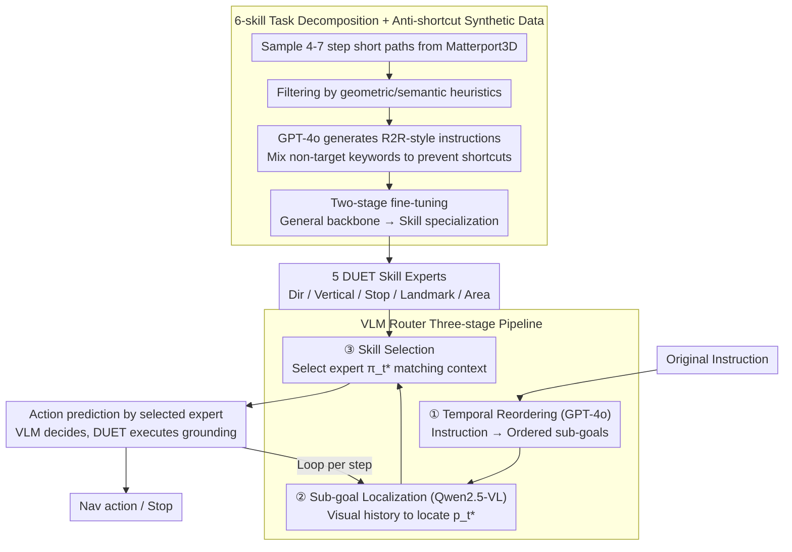

# Breaking Down and Building Up: Mixture of Skill-Based Vision-and-Language Navigation Agents

**Conference**: ACL 2026  
**arXiv**: [2508.07642](https://arxiv.org/abs/2508.07642)  
**Code**: https://github.com/HLR/SkillNav  
**Area**: Robotics / Vision-Language Navigation / Modular Agents  
**Keywords**: VLN, Skill Decomposition, VLM router, Synthetic data, GSA-R2R Generalization

## TL;DR
SkillNav decomposes the vision-language navigation task into 5 atomic skills (Direction Adjustment, Vertical Movement, Stop, Landmark Identification, Area Identification) + 1 Temporal Order Planning skill. Each skill fine-tunes a DUET sub-agent using synthetic data, while a training-free VLM router performs temporal reordering + sub-goal localization + skill selection. It achieves SOTA generalization capabilities on GSA-R2R (Test-N-Scene SPL 48% vs. the previous highest of 43%).

## Background & Motivation

**Background**: Current VLN approaches are polarized: (1) Supervised black-box agents (DUET / BEVBERT / ScaleVLN / SRDF) trained end-to-end on large-scale synthetic data, which are strong in-domain for R2R but prone to memorizing training trajectories; (2) zero-shot LLM/VLM agents (MapGPT / NavGPT / DiscussNav), which generalize stably but lack fine-grained visual grounding, showing an SR gap of up to ~36 percentage points compared to supervised models.

**Limitations of Prior Work**: Supervised models suffer sharp performance drops in scenarios like GSA-R2R with "new building types + new instruction styles." LLM models lack embodied grounding and cannot precisely select viewpoints. While multi-agent collaboration works (DiscussNav / FlexVLN / CLASH) combine multiple models, they often activate several models per step causing redundancy and revert to zero-shot LLM decisions during conflicts, sacrificing in-domain precision.

**Key Challenge**: The trade-off between "broad generalization (requiring world knowledge from LLMs)" and "precise execution (requiring fine-tuned visual grounding)." End-to-end agents favor the latter, while LLM agents favor the former; the two have remained difficult to reconcile.

**Goal**: (1) Identify a "minimum set of atomic skills for execution" to allow specialized training for each; (2) utilize the VLM's reasoning advantages only for high-level decisions like "skill selection + temporal planning," avoiding direct control over low-level actions; (3) achieve closed-loop training for each skill agent without relying on human annotations by using synthetic data.

**Key Insight**: The authors reuse 4 atomic skills proposed by NavNuances (DC / VM / LR / RR) and add Stop and Temporal Order Planning, mimicking the human cognitive process of "decomposing tasks into reusable sub-actions and scheduling them as needed."

**Core Idea**: Replace the "monolithic end-to-end policy" with "skill decomposition + skill-specific synthetic data + VLM router," decoupling high-level planning from low-level execution to let LLM reasoning and fine-tuned visual grounding play to their respective strengths.

## Method

### Overall Architecture
SkillNav addresses the issue where end-to-end agents perform well in-domain but fail in new environments, whereas pure LLM agents rationalize well but lack grounding. The approach decouples these capabilities: first, "navigation" is decomposed into 5 atomic skills $\mathcal{S} = \{\pi_{da}, \pi_{vm}, \pi_{sp}, \pi_{ld}, \pi_{ar}\}$ (Direction Adjustment / Vertical Movement / Stop / Landmark Identification / Area Identification). Each skill is fine-tuned into a DUET expert for low-level visual grounding and action prediction. A training-free VLM router handles high-level reasoning, reordering original instructions into ordered sub-goals, localizing the current sub-goal, and selecting one of the 5 experts. In this pipeline, the LLM only makes discrete "who to send" decisions, while the fine-tuned experts always predict the actions.

### Key Designs

**1. 6-skill task decomposition + anti-shortcut synthetic data pipeline: Decomposing navigation into minimal specialized units.**
A major reason supervised models fail on GSA-R2R is that a single giant policy learns all sub-capabilities together and memorizes trajectories. SkillNav uses 4 atomic skills from NavNuances (DC / VM / LR / RR) plus Stop and Temporal Order Planning, partitioning the task into 6 semantically independent units. Data is generated synthetically: 4-7 step paths are sampled from Matterport3D, filtered by heuristics (e.g., Vertical requires a height difference $>2$ units), and GPT-4o generates R2R-style instructions. Crucially, the data is "anti-shortcut"—for Vertical Movement, non-vertical keywords (Landmark 18.72% + Direction 8.05%) are mixed in to force the model to learn from visual context rather than linguistic cues.

**2. VLM Router three-stage pipeline: Engaging the LLM only for skill switching rather than every step.**
The difficulty in delegating high-level planning to VLMs lies in overhead and temporal reasoning. If a VLM handles low-level actions every step, it is slow and couples reasoning errors with grounding errors. SkillNav's router uses a three-stage flow: first, GPT-4o reorders instructions with temporal keywords into an explicit ordered sub-goal list; second, Qwen2.5-VL-7B uses visual history to locate the current sub-goal $p_t^*$ and provides a reasoning trace $r_t$; finally, the Skill Router selects the matching expert $\pi_t^* = \arg\max_{\pi \in \mathcal{S}} \text{Router}(I, p_t^*, r_t)$. This division makes each VLM call specialized and errors localizable. Ablations show temporal reordering is essential, as disabling it drops Test-N-Scene SPL by 2.5%.

**3. Decoupling VLM reasoning from fine-tuned execution: Isolating errors to expert selection rather than action execution.**
End-to-end VLM agents often suffer from coupled reasoning and grounding errors. SkillNav strictly limits the VLM to the discrete "which skill" decision. The selected expert uses its own DUET weights, the original instruction, current observations, and the topological map for the final action prediction. If the VLM makes a mistake, it usually just "sends the wrong expert," but the execution grounding is still handled by a trained DUET, keeping the error within an interpretable stage. Expert activation frequency shows that control skills ($\pi_{sp}$ 34.42% + $\pi_{da}$ 23.61% = 58%) are called more frequently than semantic skills, indicating "continuous state verification" is more common than "sparse semantic anchoring."

### Loss & Training
Two-stage fine-tuning: Stage 1 involves 50,000 iterations (batch 32, lr 5e-5) on ScaleVLN augmented data + R2R + Temporal synthesis to create a skill-agnostic backbone. Stage 2 involves 30,000 iterations (batch 16) on each skill-specific dataset to specialize the 5 experts. The Router utilizes vLLM + greedy decoding (temperature 0, max length 40,960) to select one skill per step.

## Key Experimental Results

### Main Results: R2R + GSA-R2R Comparison

| Method | R2R Val-Unseen SPL | R2R Test-Unseen SPL | GSA-R2R Test-R-Basic SPL | GSA-R2R Test-N-Basic SPL | GSA-R2R Test-N-Scene SPL |
|------|--------------------|---------------------|---------------------------|---------------------------|---------------------------|
| DUET | 60 | 59 | 47 | 37 | 30 |
| BEVBERT | 64 | 62 | 45 | 35 | 27 |
| ScaleVLN † | 70 | 68 | 67 | 57 | 43 |
| SRDF † | 78 | 77 | 63 | 49 | 43 |
| MapGPT (LLM) | 35 | — | 30 | 23 | 23 |
| NavGPT-2 (FlanT5-5B) | 61 | 60 | 45 | 35 | 43 |
| **SkillNav (ScaleVLN-Aug) †** | 77 (+6.54) | 70 (+1.80) | **69** (+2.18) | **61** (+4.18) | **48** (+5.26) |
| **SkillNav (SRDF-Aug) †** | **78** | **77** | 64 | 50 | 45 |

†=Augmented with large-scale synthetic data. SkillNav sets a new SOTA on GSA-R2R, with Test-N-Scene SPL increasing by 5.26 percentage points over ScaleVLN.

### Ablation Study: Action Router Mechanisms

| Reorder | Router | Test-R-Basic SPL | Test-N-Basic SPL | Test-N-Scene SPL |
|---------|--------|------------------|------------------|------------------|
| ✗ | Qwen | 67.80 | 59.62 | 45.43 |
| ✔ | Qwen | **68.88** | **61.34** | **47.96** |
| ✗ | GLM | 66.27 | 58.63 | 42.64 |
| ✔ | GLM | 67.93 | 59.73 | 46.51 |
| Random skill (no router) | — | 67.46 | 59.71 | 43.17 |
| ✔ | GPT-4o | **69.18** | **62.48** | **48.96** |

### Key Findings
- **Impact of Temporal Reordering**: Removing it dropped Test-N-Scene SPL by 2.5%, proving the necessity of explicit temporal structure.
- **Completeness of Skills**: Any combination of 2-4 skills performed worse than the full set of 5 (e.g., best 4-skill SR 80.80 vs. 5-skill 82.59), confirming decomposition completeness.
- **Activation Frequency**: Control-oriented skills are called far more often than semantic ones, suggesting "continuous state verification" is critical.
- **Inference Overhead**: SkillNav takes 9.69s/case, which is 2-4× faster than NavGPT/FlexVLN but ~50× slower than ScaleVLN.

## Highlights & Insights
- **Defining skills at the semantic intent level**: The authors clarify that skills are defined by semantic intent rather than motor execution (e.g., "walk to the far end" is a Region Identification skill regardless of specific motor turns), avoiding both "over-decomposition" and "coarse decomposition."
- **VLM decides, it does not execute**: By restricting the VLM to discrete skill selection, errors are localized. The execution grounding is handled by fine-tuned specialists.
- **Two-stage fine-tuning prevents catastrophic forgetting**: Branching into specialized experts from a general backbone is more stable than single-stage training for all skills.
- **"Anti-shortcut" data design**: Intentionally including non-relevant keywords forces models to learn from visual context rather than linguistic biases found in specific datasets.

## Limitations & Future Work
- **Discrete viewpoint simulators**: Evaluation was not conducted on VLN-CE or continuous control setups like Habitat.
- **High inference overhead**: 50× slower than supervised models; requires distillation or caching for latency-constrained deployment.
- **Skill library completeness**: Lacks specialized scenarios like object manipulation or transparent materials.
- **Dependency on mixed closed/open models**: Reliance on GPT-4o and Qwen-VL makes replication potentially sensitive to API stability.
- **Grounding remains the bottleneck**: Error analysis shows that most failures stem from VLM binding target words to the wrong objects in cluttered scenes rather than routing errors.

## Related Work & Insights
- **vs DUET (backbone)**: Builds on DUET but splits it into 5 specialized agents + a VLM router, significantly enhancing generalization.
- **vs ScaleVLN / SRDF**: Also uses synthetic data but improves by bucketizing data by skill and specializing in Stage 2.
- **vs MapGPT / NavGPT / DiscussNav**: Pure LLM routes; SkillNav combines their reasoning with zero-shot grounding via fine-tuned execution.
- **vs FlexVLN / CLASH (planner-executor)**: While similar in hierarchy, SkillNav improves efficiency by selecting a top-1 specialist rather than activating redundant models or reverting to zero-shot upon conflict.

## Rating
- Novelty: ⭐⭐⭐⭐ Combination of "skill decomposition + VLM router + synthetic data loop" yields real generalization gains.
- Experimental Thoroughness: ⭐⭐⭐⭐⭐ Extensive testing across R2R, GSA-R2R, RxR, and NavNuances with various ablations.
- Writing Quality: ⭐⭐⭐⭐ Detailed appendices for data construction and hyperparams.
- Value: ⭐⭐⭐⭐ Open-sourced code and synthetic data pipeline provide a viable path for modular VLM agents.

<!-- RELATED:START -->

## Related Papers

- [\[ACL 2026\] VLN-NF: Feasibility-Aware Vision-and-Language Navigation with False-Premise Instructions](vln-nf_feasibility-aware_vision-and-language_navigation_with_false-premise_instr.md)
- [\[ICML 2026\] Dive into the Scene: Breaking the Perceptual Bottleneck in Vision-Language Decision Making via Focus Plan Generation](../../ICML2026/robotics/dive_into_the_scene_breaking_the_perceptual_bottleneck_in_vision-language_decisi.md)
- [\[CVPR 2026\] ProFocus: Proactive Perception and Focused Reasoning in Vision-and-Language Navigation](../../CVPR2026/robotics/profocus_proactive_perception_and_focused_reasoning_in_vision-and-language_navig.md)
- [\[CVPR 2026\] MergeVLA: Cross-Skill Model Merging Toward a Generalist Vision-Language-Action Agent](../../CVPR2026/robotics/mergevla_cross-skill_model_merging_toward_a_generalist_vision-language-action_ag.md)
- [\[ICLR 2026\] Test-Time Mixture of World Models for Embodied Agents in Dynamic Environments](../../ICLR2026/robotics/test-time_mixture_of_world_models_for_embodied_agents_in_dynamic_environments.md)

<!-- RELATED:END -->
