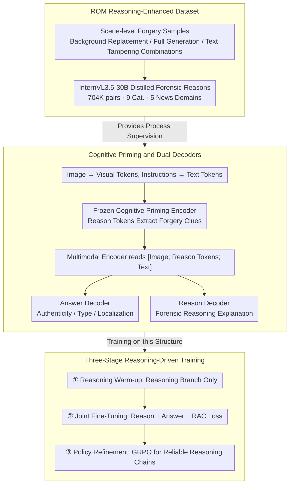

# Cultivating Forensic Reasoning for Generalizable Multimodal Manipulation Detection

**Conference**: ACL2026  
**arXiv**: [2603.01993](https://arxiv.org/abs/2603.01993)  
**Code**: https://github.com/YcZhangSing/REFORM  
**Area**: Multimodal Forensics / AIGC Detection  
**Keywords**: Multimodal Forgery Detection, Forensic Reasoning, GRPO, Forgery Localization, ROM Dataset

## TL;DR
This paper proposes REFORM, shifting multimodal forgery detection from "direct label fitting" to "learning a verifiable forensic reasoning process." Through the ROM reasoning-annotated dataset, dual decoders, and GRPO training, REFORM achieves superior cross-domain generalization and interpretable detection results on ROM, DGM4, and MMFakeBench.

## Background & Motivation
**Background**: Multimodal media forgery has expanded from local facial editing to complex combinations of entire news images, backgrounds, captions, and body text. Existing methods like the DGM4 series, knowledge-enhanced approaches, and vision-language models typically model the task as detection, classification, or localization, outputting authenticity, forgery types, and regions based on image-text news inputs.

**Limitations of Prior Work**: Most mainstream methods rely on result-oriented supervision, mapping training samples directly to final labels. While effective on closed-set data, this approach leads models to memorize statistical artifacts specific to a dataset—such as textures from particular generators, linguistic distributions of news domains, or specific editing patterns—rather than learning "why an inconsistency exists." Consequently, detectors often fail when test domains, generators, or forgery methods change.

**Key Challenge**: Multimodal forensics requires a transferable chain of logical evidence, yet training signals often consist solely of the final answer. Label supervision informs the model that a sample is "fake" but rarely constrains it to find credible visual evidence, textual evidence, or contradictions between the two.

**Goal**: The authors aim to simultaneously solve three sub-problems: constructing a benchmark with broader coverage and reasoning annotations; enabling models to explicitly generate forensic justifications while maintaining consistency between reasons and answers; and applying reinforcement learning after SFT to constrain the format, accuracy, localization, and consistency of the reasoning chain.

**Key Insight**: Generalization capability should not stem solely from larger vision-language models or more external knowledge, but from the optimization of the "forensic thinking process." By rewarding correct, coherent, and localizable reasoning chains in the training objectives, the model is more likely to capture stable cross-domain forgery logic.

**Core Idea**: Replace pure result fitting with reasoning-driven optimization. The detector first learns to explain forgery evidence, then utilizes consistency losses and GRPO to bind explanations, classification, and localization together.

## Method

### Overall Architecture
REFORM addresses the failure of result-oriented supervision in cross-domain scenarios. It reframes detection as "learning a verifiable forensic reasoning process" through a closed loop of data, architecture, and training. Given a multimodal news sample (image + text prompt + content), the model encodes the image into visual tokens and task instructions into text tokens. A frozen Cognitive Priming Encoder allows learnable reason tokens to extract forgery clues from the context. These are then passed to parallel decoders: the Answer Decoder outputs authenticity, forgery types, and coordinates, while the Reason Decoder outputs explanatory forensic reasoning. Training proceeds in three stages: initial reasoning warm-up for reason tokens, joint fine-tuning with consistency constraints, and policy refinement via GRPO.

### Key Designs

**1. ROM Reasoning-Enhanced Dataset: Shifting training signals from "short answers" to "wide-coverage scene-level forgery + forensic reasons"**

Traditional datasets like DGM4 focus on face editing, causing models to learn local artifacts that fail cross-domain. ROM extends the face categories of MDSM by adding BackgroundReplacement, FullGeneration, and scene-level combinations with TextFabrication. It comprises 704,456 image-text pairs across 5 news domains and 9 forgery categories. Using InternVL3.5-30B, textual reasoning descriptions (approx. 130 tokens) are distilled for each sample. Expanding forgery to full-image generation and background replacement forces the model to focus on cross-modal logical contradictions rather than facial textures.

**2. Cognitive Priming and Dual Decoders: Separating "evidence finding" from "answer providing" into related but non-interfering tasks**

Sharing a single decoder often causes gradient conflicts between answer and reasoning generation. REFORM uses a frozen Cognitive Priming Encoder to process $S_{inp}=[T_i;T_r;T_t]$, keeping only updated reason tokens $\hat{T}_r$. The multimodal encoder then reads $S_p=[T_i;\hat{T}_r;T_t]$. Predictions are handled separately: the Answer Decoder outputs structured predictions, and the Reason Decoder outputs explanations. This separation prevents gradient interference and supports switching between reasoning and "Fast Mode" (skipping reason generation) during deployment without affecting prediction accuracy.

**3. Three-Stage Reasoning-Driven Training: Transitioning from "stating reasons" to "reasons supporting answers" and "actively exploring reliable reasoning"**

Pure SFT suffers from exposure bias and logical disconnects where reasoning and answers disagree. REFORM uses a three-stage progression: **Reasoning Warm-up** freezes most modules to train only the reasoning branch with language modeling loss $\mathcal{L}_{LM_r}$. **Joint Fine-Tuning** unfreezes all modules and adds answer loss $\mathcal{L}_{LM_a}$ plus a Reason-Answer Consistency loss $\mathcal{L}_{RAC}=\max\{0,\eta-\cos(\mathbf{v}^R,\mathbf{v}^A)\}$, ensuring semantic alignment between reason and answer vectors. **Policy Refinement** uses GRPO to compare candidate reasons, rewarding chains that follow the format, are verified by a consistency checker, and align with the final answer.

### Loss & Training
The focus is not on a classification head but on integrating the reasoning chain into the optimization objective. During Warm-up, the reasoning branch is optimized using $\mathcal{L}_{LM_r}$. Joint Fine-Tuning optimizes both reason and answer outputs, using $\mathcal{L}_{RAC}$ to prevent semantic fractures. Policy Refinement utilizes GRPO, where the Consistency Verifier (a TinyBERT model with classification heads) achieves >99% accuracy in determining if a generated reason supports the predicted forgery type.

## Key Experimental Results

### Main Results

| Dataset / Setting | Metric | REFORM | Baseline | Interpretation |
|--------|------|------|----------|------|
| ROM Cross-Domain | AVG ACC | 88.22 | AMD 85.92 / HAMMER 72.41 | Significantly outperforms feature alignment and agent pipelines in new domains. |
| ROM Guardian | ACC / mAP / mIoU | 81.52 / 67.75 / 81.64 | - | Reasoning supervision maintains high detection and localization quality out-of-domain. |
| MMFakeBench (0-shot) | F1 | 74.9 | Various 7B/13B LVLMs | Small models achieve strong zero-shot generalization through forensic reasoning. |
| DGM4 | ACC / AVG mAP | 76.65 / 65.72 | mAP for fine-tuned LVLMs < 47 | Outperforms specialized detectors on face-centric DGM4, proving general applicability. |
| Efficiency | Params / Throughput | 376M / Fast: 13.17 pairs/s | FKA-Owl 6.7B, MMD-Agent 34B | Dual decoders enable high-speed screening with fewer parameters than large agents. |

### Ablation Study

| Config | NYT ACC | NYT mAP | Guardian ACC | Guardian mAP | Description |
|------|---------|---------|--------------|--------------|---------------|
| $\mathcal{L}_{LM_a}$ | 84.88 | 66.16 | 72.18 | 45.86 | Result-oriented training only. |
| $\mathcal{L}_{LM_a}+\mathcal{L}_{LM_r}$ | 87.76 | 73.01 | 74.74 | 53.65 | Simultaneous improvement in detection and localization via reasoning. |
| + $\mathcal{L}_{RAC}$ | 87.84 | 73.25 | 75.71 | 54.11 | Consistency constraint provides additional gains. |
| + GRPO | 88.22 | 76.08 | 81.52 | 67.75 | RL contributes most to cross-domain performance, especially Guardian mAP. |

### Key Findings
- **Reasoning is functional, not just decorative**: Adding $\mathcal{L}_{LM_r}$ alone improves NYT ACC from 84.88 to 87.76 and Guardian mAP from 45.86 to 53.65.
- **GRPO is vital for generalization**: The complete model improves Guardian performance from 75.71 ACC / 54.11 mAP (at SFT+RAC) to 81.52 ACC / 67.75 mAP.
- **Reason token length has a sweet spot**: 32 tokens achieved the optimal ACC (88.22). Too few tokens lose detail; too many increase generation burden.
- **Teacher quality is not the sole factor**: Replacing the InternVL3.5-30B teacher with Qwen2.5-VL-3B caused only a minor decline (0.84 ACC decrease on Guardian).
- **Efficiency-Interpretability trade-off**: "Explainable Mode" operates at 1.03 pairs/s, while "Fast Mode" reaches 13.17 pairs/s without sacrificing prediction accuracy.

## Highlights & Insights
- The most valuable design is turning interpretability from a "post-hoc display" into a "training constraint." While many papers generate explanations, REFORM makes reasons a core part of the training objective and RL reward.
- ROM's significance lies in its category boundaries, which mirror real-world forgery ecosystems. Scene-level tamperings force the model to identify logical modal contradictions rather than just facial artifacts.
- Dual decoders represent a practical engineering compromise, allowing for both rigorous forensic audit (Explainable Mode) and high-speed screening (Fast Mode).
- The TinyBERT verifier provides a clever, computable consistency signal for GRPO, preventing reasoning generation from becoming an uncontrollable long-text reward problem.

## Limitations & Future Work
- **Dependency on distilled reasons**: While audits show reasons recall >80% of evidence, the reasons themselves lack explicit quality optimization; teacher hallucinations might propagate to the student.
- **Inference latency**: 1.03 pairs/s is unsuitable for real-time applications. Future work could explore non-autoregressive generation or two-stage deployment.
- **Dual-use risks**: The authors withheld the generation pipeline and detailed prompts for ethical reasons, which may impact perfect reproducibility.
- **Text-only reasoning**: Future versions could integrate visual evidence, trajectory maps, or counterfactual edits to align more closely with human forensic workflows.

## Related Work & Insights
- **vs HAMMER / HAMMER++**: While HAMMER emphasizes cross-modal feature alignment, REFORM treats the reasoning chain as an optimizable object, leading to superior cross-domain ACC and mAP.
- **vs FKA-Owl**: FKA-Owl uses external knowledge to aid generalization. REFORM internalizes stable judgment logic through reasoning training, even without retrieval agents.
- **vs AMD**: AMD introduces artifact tokens and manipulation-oriented reasoning. REFORM extends this with reason-answer consistency and GRPO-based policy refinement, outperforming AMD on ROM (88.22 vs 85.92 AVG ACC).
- **vs MMD-Agent**: REFORM reaches better performance with only 376M parameters compared to larger agent-based pipelines, suggesting that "learning reasoning during training" can replace "constructing agents during testing."

## Rating
- **Novelty**: ⭐⭐⭐⭐⭐ Reframing detection as reasoning-driven optimization with a complete loop of architecture and RL.
- **Experimental Thoroughness**: ⭐⭐⭐⭐⭐ Comprehensive coverage across ROM, MMFakeBench, DGM4, and detailed audits of reasoning credibility.
- **Writing Quality**: ⭐⭐⭐⭐☆ Clear narrative and comprehensive tables, though some appendix details and dense formula sections are heavy.
- **Value**: ⭐⭐⭐⭐⭐ Directly impacts AIGC forensics, interpretable detection, and small model generalization.

<!-- RELATED:START -->

## Related Papers

- [\[CVPR 2026\] Probabilistic Concept Graph Reasoning for Multimodal Misinformation Detection](../../CVPR2026/robotics/probabilistic_concept_graph_reasoning_for_multimodal_misinformation_detection.md)
- [\[ACL 2026\] GoViG: Goal-Conditioned Visual Navigation Instruction Generation via Multimodal Reasoning](govig_goal-conditioned_visual_navigation_instruction_generation_via_multimodal_r.md)
- [\[CVPR 2026\] FantasyVLN: Unified Multimodal Chain-of-Thought Reasoning for Vision-and-Language Navigation](../../CVPR2026/robotics/fantasyvln_unified_multimodal_chain-of-thought_reasoning_for_vision-and-language.md)
- [\[CVPR 2026\] AdaDexTrack: Dynamic Modulation for Adaptive and Generalizable Dexterous Manipulation Tracking](../../CVPR2026/robotics/adadextrack_dynamic_modulation_for_adaptive_and_generalizable_dexterous_manipula.md)
- [\[CVPR 2026\] Hoi! - A Multimodal Dataset for Force-Grounded, Cross-View Articulated Manipulation](../../CVPR2026/robotics/hoi_-_a_multimodal_dataset_for_force-grounded_cross-view_articulated_manipulatio.md)

<!-- RELATED:END -->
