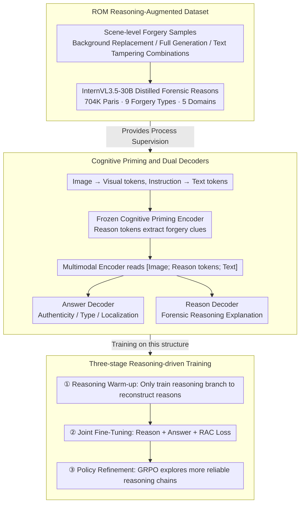

# Cultivating Forensic Reasoning for Generalizable Multimodal Manipulation Detection

**Conference**: ACL2026  
**arXiv**: [2603.01993](https://arxiv.org/abs/2603.01993)  
**Code**: https://github.com/YcZhangSing/REFORM  
**Area**: Multimodal Forensics / AIGC Detection  
**Keywords**: Multimodal Fake Detection, Forensic Reasoning, GRPO, Forgery Localization, ROM Dataset

## TL;DR
This paper proposes REFORM, shifting multimodal forgery detection from "direct label fitting" to "learning a verifiable forensic reasoning process." Through the ROM reasoning-annotated dataset, a dual-decoder architecture, and GRPO training, REFORM achieves superior cross-domain generalization and interpretable detection results on ROM, DGM4, and MMFakeBench.

## Background & Motivation
**Background**: Multimodal media forgery has expanded from local facial editing to complex compositional forgeries involving news images, backgrounds, captions, and body text. Existing methods like the DGM4 series, knowledge-enhanced approaches, and Vision-Language Models (VLMs) typically model the task as detection, classification, or localization—taking image-text news as input and outputting authenticity, forgery types, and regions.

**Limitations of Prior Work**: Most mainstream methods rely on result-oriented supervision, mapping training samples to final labels. While effective on closed-set data, this often causes models to memorize statistical artifacts specific to a dataset—such as textures of specific generators, language distributions of certain news domains, or particular editing patterns—rather than learning "why an inconsistency exists." Consequently, detectors fail when the test domain, generator, or forgery method changes.

**Key Challenge**: Multimodal forensics requires a transferable logical chain of evidence, yet training signals are often limited to the final answer. Label supervision informs the model that something is "fake" but rarely constrains it to find credible visual evidence, textual evidence, or the contradictions between them.

**Goal**: The authors aim to address three sub-problems: constructing a comprehensive benchmark with reasoning annotations; enabling models to explicitly generate forensic justifications while maintaining consistency between reasoning and answers; and using reinforcement learning after SFT to constrain the format, accuracy, localization, and consistency of the reasoning chain.

**Key Insight**: Generalization should not stem solely from larger VLMs or more external knowledge, but from optimizing the "forensic thinking process." By rewarding correct, coherent, and localizable reasoning chains in the training objective, the model is more likely to capture stable cross-domain forgery logic.

**Core Idea**: Replace pure result-fitting with reasoning-driven optimization. The detector first learns to explain forensic evidence, then uses consistency losses and GRPO to tie explanation, classification, and localization together.

## Method

### Overall Architecture
REFORM addresses the limitation where result-oriented supervision causes models to memorize statistical artifacts. It reframes detection as "learning a verifiable forensic reasoning process" through a closed loop of data, structure, and training. Given a multimodal news sample (image + text prompt + content), the model encodes the image into visual tokens and instructions into text tokens. A frozen Cognitive Priming Encoder allows a set of learnable reason tokens to extract forgery clues from the context. These tokens are then fed into two parallel decoders: the Answer Decoder outputs authenticity, forgery type, and localization coordinates, while the Reason Decoder generates explanatory forensic reasoning. Training proceeds in three stages: warm-up for the reasoning branch, joint fine-tuning with consistency constraints, and policy refinement via GRPO to discover more reliable reasoning paths.

### Key Designs

**1. ROM Reasoning-Augmented Dataset: Shifting training signals from "short answers" to "broad scene-level forgery + forensic reasons"**

Traditional DGM4 focuses on facial editing, causing models to learn local artifacts that fail cross-domain. ROM extends the facial categories of MDSM by adding BackgroundReplacement, FullGeneration, and combinations with TextFabrication. It comprises 704,456 image-text pairs across 5 news domains and 9 forgery types. InternVL3.5-30B is used to distill textual reasoning (approx. 130 tokens) for each sample. Expanding forgery to full image generation and background replacement forces the model to focus on cross-modal logical contradictions rather than facial textures.

**2. Cognitive Priming and Dual Decoders: Decoupling "finding evidence" and "providing answers" into related but non-interfering tasks**

Sharing a single decoder can lead to gradient conflict between answer and reason generation. In REFORM, the frozen Cognitive Priming Encoder processes $S_{inp}=[T_i;T_r;T_t]$ to obtain updated reason tokens $\hat{T}_r$. The multimodal encoder then reads $S_p=[T_i;\hat{T}_r;T_t]$ and passes it to the Answer Decoder for structured prediction and the Reason Decoder for forensic explanation. This decoupling avoids gradient competition and supports switching between reasoning mode and "Fast Mode" (skipping reason generation without changing the answer).

**3. Mechanism: Transitioning the model from "stating reasons" to "reasons supporting answers" and finally to "active exploration of reliable reasons"**

Pure SFT suffers from exposure bias and logical disconnection (the "reason says A, answer says B" problem). REFORM uses three stages: Reasoning Warm-up (training only the reasoning branch with $\mathcal{L}_{LM_r}$); Joint Fine-Tuning (unfreezing the whole model with answer loss $\mathcal{L}_{LM_a}$ and Reason-Answer Consistency loss $\mathcal{L}_{RAC}=\max\{0,\eta-\cos(\mathbf{v}^R,\mathbf{v}^A)\}$); and Policy Refinement using GRPO to compare candidate reasons and reward those that are well-formatted, verifiable, and consistent with the answer. This final stage contributes most to cross-domain gains.

### Loss & Training
The focus is on incorporating the reasoning chain into the optimization objective rather than just adding a classification head. The total objective for joint training is $\mathcal{L}_{RJF}=\mathcal{L}_{LM_r}+\mathcal{L}_{LM_a}+\mathcal{L}_{RAC}$, where $\mathcal{L}_{RAC}$ enforces alignment between reasoning and answer vectors via a cosine margin. For Policy Refinement, a Consistency Verifier (using TinyBERT) evaluates whether the generated reasons logically support the model's forgery type prediction, achieving over 99% classification accuracy on reason-label pairs.

## Key Experimental Results

### Main Results
| Dataset / Setting | Metric | REFORM | Baselines | Analysis |
|--------|------|------|----------|------|
| ROM Cross-domain | AVG ACC | 88.22 | AMD 85.92 / HAMMER 72.41 / MMD-Agent-34B 57.45 | Significantly outperforms feature alignment, traditional detection, and retrieval-based agent pipelines in new domains. |
| ROM Guardian (OOD) | ACC / mAP / mIoU | 81.52 / 67.75 / 81.64 | - | Reasoning supervision maintains high detection and localization quality even in out-of-distribution tests. |
| MMFakeBench (Zero-shot) | F1 | 74.9 | Various 7B/13B LVLM baselines | Gains strong zero-shot generalization on unseen types (e.g., manual Photoshop) via forensic reasoning. |
| DGM4 | ACC / AVG mAP | 76.65 / 65.72 | Fine-tuned LVLMs (mAP < 47) | Also outperforms specialized detectors on face-centric DGM4, showing general applicability beyond ROM. |
| Efficiency | Params / Throughput | 376M / Fast Mode: 13.17 pairs/s | FKA-Owl 6.7B, MMD-Agent 34B | Dual decoders enable high throughput; parameters are far fewer than large model agents. |

### Ablation Study
| Configuration | NYT ACC | NYT mAP | NYT mIoU | Guardian ACC | Guardian mAP | Guardian mIoU | Explanation |
|------|---------|---------|----------|--------------|--------------|---------------|------|
| $\mathcal{L}_{LM_a}$ | 84.88 | 66.16 | 75.98 | 72.18 | 45.86 | 78.72 | Answer-only; still result-oriented learning. |
| $\mathcal{L}_{LM_a}+\mathcal{L}_{LM_r}$ | 87.76 | 73.01 | 77.68 | 74.74 | 53.65 | 79.59 | Reasoning supervision improves both detection and localization. |
| + $\mathcal{L}_{RAC}$ | 87.84 | 73.25 | 78.00 | 75.71 | 54.11 | 79.58 | Further gain from reason-answer consistency. |
| + GRPO | 88.22 | 76.08 | 78.48 | 81.52 | 67.75 | 81.64 | Reinforcement learning provides the largest boost, especially for OOD mAP. |

### Key Findings
- The reasoning branch is not just decorative. Adding $\mathcal{L}_{LM_r}$ alone increased NYT ACC from 84.88 to 87.76 and Guardian mAP from 45.86 to 53.65.
- GRPO is critical for cross-domain generalization, boosting Guardian ACC/mAP from 75.71/54.11 to 81.52/67.75.
- There is a "sweet spot" for reasoning token length; 32 tokens reached the optimal ACC of 88.22.
- Robustness to teacher quality: Replacing InternVL3.5-30B with Qwen2.5-VL-3B resulted in only minor performance drops.
- Explainable mode carries an inference cost (1.03 pairs/s vs. 13.17 pairs/s in Fast Mode), but the dual-decoder design ensures Fast Mode retains full prediction accuracy.

## Highlights & Insights
- The most valuable design is turning interpretability from a "post-hoc display" into a "training constraint." Unlike many papers where explanation is a byproduct, REFORM uses reasoning to drive the training objective and RL rewards.
- ROM’s significance lies in its category boundaries, which represent the real-world forgery ecosystem. Categories like background replacement force the model to look at cross-modal logic rather than low-level facial artifacts.
- The dual-decoder is a practical engineering compromise. It retains explainability during training while allowing a high-speed "Fast Mode" for deployment without sacrificing accuracy.
- Using a TinyBERT verifier provides a computationally efficient consistency signal for GRPO, preventing the reasoning generation from becoming an unconstrained long-text reward problem.

## Limitations & Future Work
- Dependency on distilled reasons: Though audit shows reasons recall >80% of evidence, teacher hallucinations or templated explanations may still propagate to the student model.
- High latency in explanation mode: 1.03 pairs/s is suitable for auditing but not all real-time scenarios. Future work could explore non-autoregressive reasoning or two-stage deployment.
- Dual-use risk: The authors chose not to release the generation pipeline and detailed prompts to control ethical risks, which may affect full external reproducibility.
- Reasoning is currently text-based. Future work could combine reasoning with visual evidence trajectories or counterfactual editing to bring explanations closer to human forensic processes.

## Related Work & Insights
- **vs HAMMER / HAMMER++**: HAMMER emphasizes feature alignment. REFORM treats the reasoning chain as an optimizable object, leading to stronger cross-domain performance.
- **vs FKA-Owl**: FKA-Owl uses external knowledge, whereas REFORM internalizes stable judgment logic through reasoning training, even without a retrieval agent.
- **vs AMD**: AMD is the closest baseline using manipulation-oriented reasoning. REFORM advances this by adding reason-answer consistency and GRPO, yielding higher accuracy on ROM.
- **vs MMD-Agent**: MMD-Agent uses multi-step agents with 34B parameters. REFORM achieves superior performance on ROM with only 376M parameters, showing that "learning reasoning during training" can replace "constructing agents during testing."

## Rating
- Novelty: ⭐⭐⭐⭐⭐ Reframes forgery detection as reasoning-driven optimization with a complete loop of data, architecture, and RL.
- Experimental Thoroughness: ⭐⭐⭐⭐⭐ Comprehensive coverage across ROM, MMFakeBench, DGM4, and detailed ablation/audit studies.
- Writing Quality: ⭐⭐⭐⭐☆ Clear main narrative, but dense formulas and tables in some sections make for a heavy read.
- Value: ⭐⭐⭐⭐⭐ Directly impacts AIGC forensics and interpretable detection, offering a blueprint for verifiable reasoning supervision.

<!-- RELATED:START -->

## Related Papers

- [\[ACL 2026\] GoViG: Goal-Conditioned Visual Navigation Instruction Generation via Multimodal Reasoning](govig_goal-conditioned_visual_navigation_instruction_generation_via_multimodal_r.md)
- [\[CVPR 2026\] FantasyVLN: Unified Multimodal Chain-of-Thought Reasoning for Vision-and-Language Navigation](../../CVPR2026/robotics/fantasyvln_unified_multimodal_chain-of-thought_reasoning_for_vision-and-language.md)
- [\[CVPR 2026\] AdaDexTrack: Dynamic Modulation for Adaptive and Generalizable Dexterous Manipulation Tracking](../../CVPR2026/robotics/adadextrack_dynamic_modulation_for_adaptive_and_generalizable_dexterous_manipula.md)
- [\[CVPR 2026\] AffordGen: Generating Diverse Demonstrations for Generalizable Object Manipulation with Affordance Correspondence](../../CVPR2026/robotics/affordgen_generating_diverse_demonstrations_for_generalizable_object_manipulatio.md)
- [\[ACL 2025\] SELF-PERCEPT: Introspection Improves LLMs' Detection of Multi-Person Mental Manipulation in Conversations](../../ACL2025/robotics/self_percept_manipulation_detection.md)

<!-- RELATED:END -->
