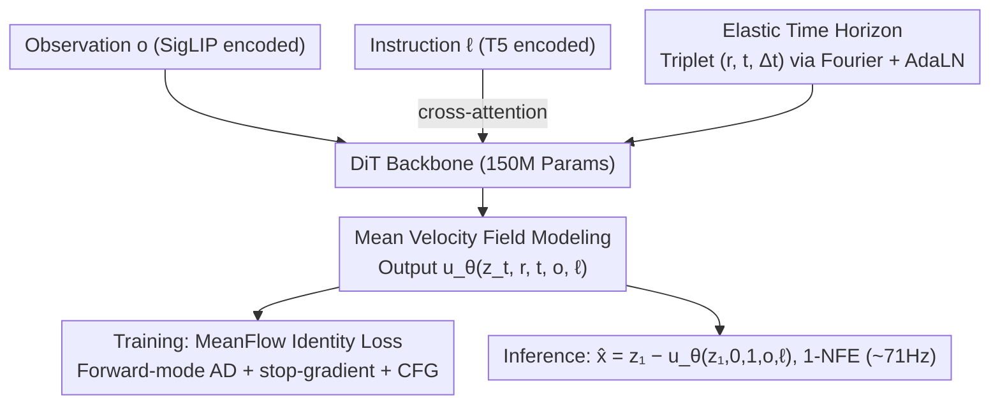

# ElasticFlow: One-Step Physics-Consistent Policy with Elastic Time Horizons for Language-Guided Manipulation

**Conference**: ACL 2026 Findings  
**arXiv**: [2605.08799](https://arxiv.org/abs/2605.08799)  
**Code**: TBD  
**Area**: Embodied AI / Diffusion Policy / Flow Matching / Robot Manipulation  
**Keywords**: One-step diffusion, mean velocity field, elastic time, flow matching, VLA

## TL;DR
ElasticFlow is proposed to replace instantaneous velocity field learning with a Mean Velocity Field (MeanFlow) for language-conditioned robot actions. Combined with an "Elastic Time Horizon $\Delta t=t-r$" to explicitly encode control granularity, it achieves 1-NFE one-step inference (~71Hz), outperforming OpenVLA and $\pi_0$ on long-horizon tasks such as LIBERO-Long and CALVIN ABC-D.

## Background & Motivation

**Background**: In embodied AI, generalist policies mapping visual observations and language instructions to continuous actions primarily follow two paths: Diffusion Policies (e.g., Diffusion Policy, $\pi_0$) dominate due to strong multimodal modeling capabilities, while autoregressive VLAs (e.g., OpenVLA, RT-2) rely on token discretization for language-action alignment.

**Limitations of Prior Work**: Iterative denoising in diffusion policies requires dozens of NFEs (Network Function Evaluations), leading to latency > 100ms and control frequencies of only 8–12Hz, which cannot respond to rapidly changing physical environments (e.g., intercepting rolling objects). Existing acceleration schemes (Consistency Model, Progressive Distillation) require complex teacher-student pipelines and often sacrifice "physical consistency," resulting in high-frequency jitter (Jerk) or non-smooth paths. Autoregressive VLAs are even slower (~5Hz) due to token-by-token generation, and discretization introduces quantization errors.

**Key Challenge**: (1) The trade-off between inference speed and physical consistency: simply reducing step counts causes trajectories to lose geometric smoothness. (2) "Temporal heterogeneity" in robot tasks is ignored: short-range reactive control requires millisecond-level jitter suppression, while long-range tasks require second-level trajectory planning. Traditional fixed-horizon networks suffer from Spectral Bias, failing to model high-frequency and low-frequency signals simultaneously.

**Goal**: (1) Achieve 1-NFE inference without distillation; (2) Maintain geometrically smooth and physically consistent one-step predictions; (3) Enable a single set of weights to perform both millisecond reactive control and long-range multi-stage planning.

**Key Insight**: Building on MeanFlow proposed by Geng et al. (2025) in generative modeling, the authors learn the "mean velocity" over a time interval $[r,t]$ rather than instantaneous velocity. A single forward pass yields the total displacement from noise to data. This approach is adapted for robot action flows, exposing $\Delta t=t-r$ to the network as a "control granularity knob."

**Core Idea**: Use a mean velocity field $u(z_t,r,t)$ instead of instantaneous velocity $v(z_t,t)$ in action generation, utilizing $\Delta t$ as a "Spectral Zoom Lens" to unify short-range reactions and long-range planning.

## Method

### Overall Architecture
ElasticFlow aims to solve two problems simultaneously: enabling 1-NFE one-step inference for language-conditioned policies without losing physical consistency, and allowing the same weights to handle both millisecond-level reactions and second-level planning. The workflow is as follows: observation $o$ is encoded by SigLIP, language instruction $\ell$ is encoded by T5, and both are injected into a 150M parameter DiT backbone via cross-attention. An Elastic Time Horizon module encodes the time triplet $(r,t,\Delta t)$ using Fourier features, injected via AdaLN modulation. The network outputs mean velocity field predictions $u_\theta(z_t,r,t,o,l)$ rather than instantaneous velocities. Training uses the MeanFlow Identity Loss with Forward-mode AD supervision. During inference, given $z_1\sim\mathcal{N}(0,I)$, a single forward pass yields the action chunk $\hat{x}=z_1-u_\theta(z_1,0,1,o,\ell)$ without iteration or distillation.

### Key Designs

**1. Mean Velocity Field Modeling (MeanFlow Identity): Transforming action generation from "Multi-step ODE Integration" to "One-step Mapping"**

The slow inference of diffusion policies stems from learning instantaneous velocity, which only describes local tangents and requires multiple ODE integration steps to recover global displacement. Reducing steps leads to jitter. ElasticFlow learns the mean velocity over a time interval: $u(z_t,r,t)\triangleq\frac{1}{t-r}\int_{r}^{t}v(z_\tau,\tau)d\tau$. From the Fundamental Theorem of Calculus, the identity $u(z_t,r,t)=v(z_t,t)-(t-r)\frac{d}{dt}u(z_t,r,t)$ is derived (where $\frac{d}{dt}$ represents the total derivative including $v\cdot\nabla_z u$ and $\partial_t u$). The network prediction is pulled toward the right side of this identity, with the ground truth instantaneous velocity constructed using optimal transport $v(z_t,t)=x_{\text{target}}-x_{\text{noise}}$. Thus, one-step prediction contains geometric information of the entire interval, and the $(t-r)\frac{d}{dt}u$ term acts as a "manifold curvature correction," suppressing jitter. Experiments show that one-step ElasticFlow achieves lower Jerk ($1.1\times 10^{-3}$) than 10-step standard CFM ($3.2\times 10^{-3}$).

**2. Elastic Time Horizon: Seamless switching between high-frequency reaction and low-frequency planning with a continuous parameter $\Delta t$**

Robot tasks exhibit "temporal heterogeneity." Due to Spectral Bias in neural networks, fixed horizons struggle to fit both high and low-frequency signals. ElasticFlow inputs both absolute time $t$ and interval length $\Delta t=t-r$ into the network, encoded via Gaussian Fourier features $\text{Emb}(r,t)=\text{MLP}([\text{FF}(t),\text{FF}(t-r)])$ to modulate the DiT via AdaLN. During inference, $\Delta t$ is chosen based on task granularity: small $\Delta t$ for local pose adjustment and large $\Delta t$ for long-range planning, switching dynamically within a single weight space. Explicitly injecting $\Delta t$ acts as a "spectral zoom lens," telling the network which scale to focus on. Mismatch tests (forcing the wrong $\Delta t$) validate this: using small $\Delta t$ for long-range tasks causes "nearsightedness" (success rate drops to 45.3%), while using large $\Delta t$ for short-range tasks causes "sluggishness" (drops to 55.7%).

**3. Forward-mode AD + Stop-gradient + CFG Training: Stabilizing MeanFlow Identity training with language guidance**

Directly Calculating gradients for this bootstrapped target can diverge, and second-order terms are computationally expensive. The loss is defined as $\mathcal{L}(\theta)=\mathbb{E}_{t,r,x_1,\epsilon,c}[\|u_\theta(z_t,r,t,o,c)-\text{sg}(\mathcal{T}_{\text{target}})\|_2^2]$, where $\mathcal{T}_{\text{target}}=v(z_t,t)-(t-r)(v(z_t,t)\cdot\nabla_z u_\theta+\partial_t u_\theta)$. The stop-gradient $\text{sg}(\cdot)$ isolates the bootstrapped term for stable optimization. The Jacobian-vector product $\nabla_z u_\theta$ is computed efficiently using forward-mode automatic differentiation to avoid Hessian overhead. Conditions $c\in\{\ell,\emptyset\}$ are substituted with a null token with probability $p_{\text{drop}}$ for joint training. During inference, Classifier-Free Guidance is implemented via $\hat{x}=z_1-(u_\theta(\cdot,\emptyset)+w(u_\theta(\cdot,\ell)-u_\theta(\cdot,\emptyset)))$ to adjust semantic alignment for one-step inference.

### Loss & Training
The Mean Squared Error to the MeanFlow Identity target $\mathcal{T}_{\text{target}}$ is minimized. A stop-gradient $\text{sg}(\cdot)$ is used to stabilize bootstrapping. CFG uses a drop probability $p_{\text{drop}}$, and the guidance scale $w\in[1.5,2.5]$ remains stable. The DiT backbone has only 150M parameters, lighter than the 300M UNet in Diffusion Policy.

## Key Experimental Results

### Main Results
**LIBERO Suite + CALVIN ABC-D**:

| Benchmark / Metric | ElasticFlow | Prev. SOTA | Key Baseline |
|---|---|---|---|
| LIBERO-Spatial (SR ↑) | 98.4 | 98.8 (HiF-VLA) | $\pi_0$ 96.8 |
| LIBERO-Object (SR ↑) | 99.3 | 99.4 (HiF-VLA) | $\pi_0$ 98.8 |
| LIBERO-Goal (SR ↑) | **98.7** | 97.9 (OpenVLA-OFT) | $\pi_0$ 95.8 |
| LIBERO-Long (SR ↑) | **97.6** | 96.4 (HiF-VLA) | $\pi_0$ 85.2 |
| LIBERO Average | **98.5** | 98.0 (HiF-VLA) | Octo 75.1 |
| CALVIN ABC-D 3rd Person (Avg.Len. ↑) | **4.15** | 4.08 (HiF-VLA) | $\pi_0$ 3.65 |
| CALVIN ABC-D Multi-view (Avg.Len. ↑) | **4.37** | 4.35 (HiF-VLA) | $\pi_0$ 3.92 |
| RoboTwin Long & Extra Long (SR ↑) | **71.1** | 69.0 (SimpleVLA-RL) | $\pi_0$ 43.3 / RDT 27.8 |

The 12% jump in LIBERO-Long (from 85.2 for $\pi_0$ to 97.6) is significant, as long-horizon tasks are where diffusion policies typically fail.

**Inference Latency (RTX 4090, batch=1)**:

| Method | NFE | Latency (ms) ↓ | Freq (Hz) ↑ |
|------|-----|-----------|------------|
| OpenVLA (7B Transformer) | Auto-reg. | 200.0 | ~5 |
| Diffusion Policy (300M UNet) | 16 (DDIM) | 120.0 | ~8 |
| $\pi_0$ (300M DiT) | 10 (Euler) | 85.0 | ~12 |
| Consistency Policy | 2 | 28.0 | ~35 |
| **ElasticFlow (150M DiT)** | **1** | **14.0** | **~71** |

ElasticFlow provides a 5× speedup compared to Diffusion Policy and 14× compared to OpenVLA.

### Ablation Study

| Config | Long Horizon SR | Short Horizon SR | Description |
|------|----------------|----------------|------|
| w/o Horizon Input | 52.7% | 61.5% | Without $\Delta t$, success rate drops by 18.4% |
| Fixed $\Delta t=10$ | 58.2% | 94.5% | Strong short-range, weak long-range |
| Fixed $\Delta t=50$ | 62.1% | 55.4% | Moderate long-range, failed short-range |
| Mismatch Force $\Delta t=10$ on Long | 45.3% | — | Nearsightedness: local focus only |
| Mismatch Force $\Delta t=50$ on Short | — | 55.7% | Sluggishness: slow reaction |
| **ElasticFlow (Dynamic $\Delta t$)** | **71.1%** | **98.2%** | Full model |

| Training Objective | Steps | Success Rate | Jerk ↓ | Latency |
|---------|------|-------|-------|------|
| Standard CFM ($v_t$) | 1-NFE | 12.4% | $8.5\times 10^{-2}$ | 14ms |
| Standard CFM ($v_t$) | 10-NFE | 68.5% | $3.2\times 10^{-3}$ | 140ms |
| **ElasticFlow ($u_t$)** | **1-NFE** | **71.1%** | $\mathbf{1.1\times 10^{-3}}$ | **14ms** |

### Key Findings
- The $\Delta t$ module is crucial: removing it drops performance by 18.4%. Mismatch tests validate that fixed-horizon approaches are insufficient.
- Mean velocity field modeling ensures high physical consistency in 1-NFE: one-step Jerk ($1.1\times 10^{-3}$) is lower than 10-step CFM ($3.2\times 10^{-3}$), proving curvature correction suppresses jitter.
- Standard Flow Matching fails at 1-NFE (12.4% SR), while ElasticFlow achieves 71.1%, suggesting the modeling target itself must change.
- ElasticFlow maintains high success rates on the 4th and 5th instructions of CALVIN chains (83.6% / 72.7%), showing superior long-instruction stability compared to baselines.
- The CFG guidance scale $w$ is stable within $[1.5, 2.5]$.

## Highlights & Insights
- Shifting from learning instantaneous velocity to mean velocity is a paradigm shift: it moves the ODE integration bottleneck from "runtime computation" to "training-time representation." 1-NFE becomes a mathematical equivalence rather than an engineering compromise.
- The Elastic Time Horizon $\Delta t$ is highly efficient: adding one dimension plus Fourier encoding allows a single network to handle both reaction and planning, avoiding the need for cascaded multi-horizon networks.
- The "Spectral Zoom Lens" metaphor is physically grounded. Mismatch Tests provide counterfactual analysis, mapping the abstract problem of Spectral Bias to observable robot behaviors.
- Distillation-free training has high engineering value: unlike Consistency Policy, ElasticFlow reaches 1-NFE in a single phase, reducing deployment costs.

## Limitations & Future Work
- Data scale is limited to millions of interactions; scaling laws on billion-scale datasets like Open X-Embodiment are yet to be verified.
- While forward-mode AD is cheaper than Hessian, it still adds significant overhead to training compared to standard methods.
- The choice of $\Delta t$ relies on task priors; it would be ideal if the policy could adaptively select the horizon based on context.
- Language injection relies on cross-attention; deeper latent fusion with MLLMs may improve semantic parsing for complex instructions.
- High-frequency inference leaves very little time for error correction; integration with MPC or online RL for closed-loop correction is a natural next step.
- Sim-to-Real was only qualitatively and partially quantitatively evaluated on xArm6; further cross-platform validation is needed.

## Related Work & Insights
- **vs Diffusion Policy (Chi 2023) / $\pi_0$**: All use flow/diffusion, but DP/$\pi_0$ require multi-step integration. ElasticFlow learns the mean velocity field for 1-step, physically smoother results.
- **vs Consistency Policy (Prasad 2024)**: These require training a teacher then distilling, which is complex and can lose diversity. ElasticFlow is distillation-free.
- **vs OpenVLA / CogACT**: Autoregressive VLAs use tokenization, resulting in lower frequency and quantization errors. ElasticFlow generates in continuous space with 10x higher frequency.
- **vs MeanFlow (Geng 2025)**: This work is the first to implement the MeanFlow concept in embodied control, adding Elastic Time Horizons and CFG.
- **vs ACT (Zhao 2023)**: ACT uses heuristic temporal aggregation which can over-smooth. ElasticFlow enforces physical consistency via its identity formula.

## Rating
- Novelty: ⭐⭐⭐⭐ First application of MeanFlow in robot control combined with Elastic Time Horizons.
- Experimental Thoroughness: ⭐⭐⭐⭐ Covers LIBERO, CALVIN, RoboTwin, and xArm6 real-robot tests; clever Mismatch Test design.
- Writing Quality: ⭐⭐⭐⭐ Clear derivations and intuitive geometric explanations.
- Value: ⭐⭐⭐⭐⭐ Provides a practical 1-NFE paradigm for VLA/diffusion policies with both engineering and methodological merit.

<!-- RELATED:START -->

## Related Papers

- [\[ICML 2026\] Mixture of Horizons in Action Chunking](../../ICML2026/robotics/mixture_of_horizons_in_action_chunking.md)
- [\[ICLR 2026\] VLBiMan: Vision-Language Anchored One-Shot Demonstration Enables Generalizable Bimanual Robotic Manipulation](../../ICLR2026/robotics/vlbiman_vision-language_anchored_one-shot_demonstration_enables_generalizable_bi.md)
- [\[CVPR 2026\] SRPO: Self-Referential Policy Optimization for Vision-Language-Action Models](../../CVPR2026/robotics/srpo_self-referential_policy_optimization_for_vision-language-action_models.md)
- [\[ICLR 2026\] Real-Time Robot Execution with Masked Action Chunking](../../ICLR2026/robotics/real-time_robot_execution_with_masked_action_chunking.md)
- [\[ICLR 2026\] MoMaGen: Generating Demonstrations under Soft and Hard Constraints for Multi-Step Bimanual Mobile Manipulation](../../ICLR2026/robotics/momagen_generating_demonstrations_under_soft_and_hard_constraints_for_multi-step.md)

<!-- RELATED:END -->
