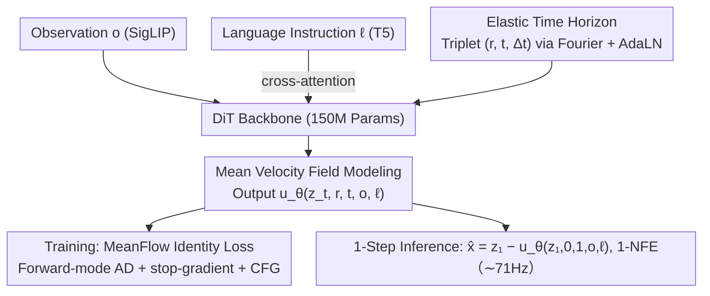

# ElasticFlow: One-Step Physics-Consistent Policy with Elastic Time Horizons for Language-Guided Manipulation

**Conference**: ACL 2026 Findings  
**arXiv**: [2605.08799](https://arxiv.org/abs/2605.08799)  
**Code**: TBD  
**Area**: Embodied AI / Diffusion Policy / Flow Matching / Robot Manipulation  
**Keywords**: One-step diffusion, Mean velocity field, Elastic time, Flow matching, VLA  

## TL;DR
The paper proposes ElasticFlow, which replaces instantaneous velocity fields with MeanFlow (mean velocity fields) for learning language-conditioned robotic actions. By explicitly encoding control granularity using an "Elastic Time Horizon $\Delta t=t-r$", it achieves 1-NFE single-step inference (~71Hz) and outperforms OpenVLA and $\pi_0$ on long-horizon tasks such as LIBERO-Long and CALVIN ABC-D.

## Background & Motivation

**Background**: In Embodied AI, generalist policies that map visual observations and language instructions to continuous actions primarily follow two paths: Diffusion Policies ($\pi_0$, etc.), which are dominant due to strong multi-modal modeling, and autoregressive VLAs (OpenVLA, RT-2), which leverage token discretization for language-action alignment.

**Limitations of Prior Work**: Iterative denoising in diffusion policies requires dozens of NFEs (Network Function Evaluations), leading to latencies > 100ms and control frequencies of only 8–12Hz, failing to respond to fast-changing physical environments (e.g., intercepting rolling objects). Acceleration schemes like Consistency Models or Progressive Distillation require complex teacher-student pipelines and often sacrifice "physical consistency," resulting in high-frequency jitter (Jerk) or non-smooth trajectories. Autoregressive VLAs are even slower (~5Hz) due to token-by-token generation and introduce quantization errors from discretization.

**Key Challenge**: (1) There is a trade-off between inference speed and physical consistency; reducing steps often causes trajectories to lose geometric smoothness. (2) Robotic tasks exhibit "temporal heterogeneity," which is often ignored—short-range reactive control requires millisecond jitter suppression, while long-range tasks require second-level trajectory planning. Traditional fixed-horizon networks suffer from Spectral Bias, failing to model high-frequency and low-frequency signals simultaneously.

**Goal**: (1) Achieve 1-NFE inference without distillation; (2) Ensure single-step predictions remain geometrically smooth and physically consistent; (3) Enable a single set of weights to perform both millisecond reactive control and long-range multi-stage planning.

**Key Insight**: Leveraging MeanFlow, proposed by Geng et al. (2025) in generative modeling, the model directly learns the "mean velocity" over a time interval $[r, t]$ rather than instantaneous velocity. This allows a single forward pass to obtain the total displacement from noise to data. The authors adapt this to robotic action flows and expose $\Delta t=t-r$ to the network as a "control granularity knob."

**Core Idea**: Replace the instantaneous velocity field $v(z_t, t)$ with the mean velocity field $u(z_t, r, t)$ in action generation, and use $\Delta t$ as a "Spectral Zoom Lens" to unify short-range reaction and long-range planning.

## Method

### Overall Architecture
ElasticFlow aims to achieve 1-NFE inference without losing physical consistency while enabling both millisecond reaction and long-range planning. Observations $o$ are encoded via SigLIP, and language instructions $\ell$ via T5, then injected into a 150M-parameter DiT backbone through cross-attention. An Elastic Time Horizon module encodes the time triplet $(r, t, \Delta t)$ using Fourier features, modulated via AdaLN. The network outputs a predicted mean velocity field $u_\theta(z_t, r, t, o, \ell)$. Training uses the MeanFlow Identity Loss with Forward-mode AD supervision. At inference, given $z_1\sim\mathcal{N}(0, I)$, a single forward pass yields the action chunk $\hat{x}=z_1-u_\theta(z_1, 0, 1, o, \ell)$, without iteration or distillation.

### Key Designs

**1. Mean Velocity Field Modeling (MeanFlow Identity): Transforming action generation from "multi-step ODE integration" to a "one-step mapping"**

The bottleneck in diffusion policy inference is that it learns instantaneous velocity, which describes only local tangents and requires multi-step ODE integration to recover global displacement. Disproportionately reducing steps leads to jerky trajectories. ElasticFlow instead learns the mean velocity over an interval $u(z_t, r, t) \triangleq \frac{1}{t-r} \int_{r}^{t} v(z_\tau, \tau) d\tau$. Based on the Fundamental Theorem of Calculus, the identity $u(z_t, r, t) = v(z_t, t) - (t-r) \frac{d}{dt} u(z_t, r, t)$ is derived (where $\frac{d}{dt}$ is the total derivative). During training, the network prediction is pulled toward the right side of this identity. The $(t-r) \frac{d}{dt} u$ term acts as a "manifold curvature correction," suppressing jitter. Experiments show that 1-step ElasticFlow achieves lower Jerk ($1.1 \times 10^{-3}$) than 10-step standard CFM ($3.2 \times 10^{-3}$).

**2. Elastic Time Horizon: Seamless switching between high-frequency reaction and low-frequency planning with a continuous parameter $\Delta t$**

Robotic tasks are temporally heterogeneous. Due to Spectral Bias, networks with fixed horizons struggle to fit both high-frequency reaction and low-frequency planning signals. ElasticFlow feeds the interval length $\Delta t=t-r$ into the network along with absolute time $t$. Both are encoded via Gaussian Fourier features $\text{Emb}(r,t) = \text{MLP}([\text{FF}(t), \text{FF}(t-r)])$ and modulated by AdaLN. During inference, $\Delta t$ is selected based on task granularity: small $\Delta t$ focuses on local pose adjustments, while large $\Delta t$ performs long-range trajectory planning. Mismatch tests (forcing an incorrect $\Delta t$) demonstrate its physical significance—long-range tasks drop to 45.3% accuracy with a small $\Delta t$ ("nearsightedness"), while short-range tasks drop to 55.7% with a large $\Delta t$ ("sluggishness").

**3. Forward-mode AD + Stop-gradient + CFG Training: Stable MeanFlow optimization and language-conditioned guidance**

Optimizing the bootstrapped target with second-order terms is computationally expensive and unstable. The loss is defined as $\mathcal{L}(\theta) = \mathbb{E}_{t, r, x_1, \epsilon, c} [\| u_\theta(z_t, r, t, o, c) - \text{sg}(\mathcal{T}_{\text{target}}) \|_2^2]$, where $\mathcal{T}_{\text{target}} = v(z_t, t) - (t-r)(v(z_t, t) \cdot \nabla_z u_\theta + \partial_t u_\theta)$. A stop-gradient $\text{sg}(\cdot)$ isolates the self-referencing term for stable optimization. The Jacobian-vector product $\nabla_z u_\theta$ is computed efficiently using forward-mode automatic differentiation (Forward-mode AD). Furthermore, Classifier-Free Guidance (CFG) is implemented by randomly replacing the condition $c$ with $\emptyset$, allowing the single-step inference to adjust semantic alignment strength via $\hat{x} = z_1 - (u_\theta(\cdot, \emptyset) + w(u_\theta(\cdot, \ell) - u_\theta(\cdot, \emptyset)))$.

### Loss & Training
Minimize the MSE to the MeanFlow Identity target $\mathcal{T}_{\text{target}}$. Use $\text{sg}(\cdot)$ for stable bootstrapping. Apply forward-mode AD for the term $\nabla_z u_\theta$. The DiT backbone contains only 150M parameters, making it lighter than the 300M UNet used in typical Diffusion Policies.

## Key Experimental Results

### Main Results
**LIBERO Suite + CALVIN ABC-D**:

| Benchmark / Metric | ElasticFlow | Prev. SOTA | Key Baseline |
|---|---|---|---|
| LIBERO-Spatial (SR ↑) | 98.4 | 98.8 (HiF-VLA) | $\pi_0$ 96.8 |
| LIBERO-Object (SR ↑) | 99.3 | 99.4 (HiF-VLA) | $\pi_0$ 98.8 |
| LIBERO-Goal (SR ↑) | **98.7** | 97.9 (OpenVLA-OFT) | $\pi_0$ 95.8 |
| LIBERO-Long (SR ↑) | **97.6** | 96.4 (HiF-VLA) | $\pi_0$ 85.2 |
| LIBERO Avg. | **98.5** | 98.0 (HiF-VLA) | Octo 75.1 |
| CALVIN ABC-D 3rd Person (Avg.Len. ↑) | **4.15** | 4.08 (HiF-VLA) | $\pi_0$ 3.65 |
| CALVIN ABC-D Multi-view (Avg.Len. ↑) | **4.37** | 4.35 (HiF-VLA) | $\pi_0$ 3.92 |
| RoboTwin Long & Extra Long (SR ↑) | **71.1** | 69.0 (SimpleVLA-RL) | $\pi_0$ 43.3 / RDT 27.8 |

The 12-point jump in LIBERO-Long (from 85.2 for $\pi_0$ to 97.6) is significant, as long-horizon tasks are where diffusion policies typically fail.

**Inference Latency (RTX 4090, batch=1)**:

| Method | NFE | Latency (ms) ↓ | Frequency (Hz) ↑ |
|------|-----|-----------|------------|
| OpenVLA (7B Transformer) | Auto-reg. | 200.0 | ∼5 |
| Diffusion Policy (300M UNet) | 16 (DDIM) | 120.0 | ∼8 |
| $\pi_0$ (300M DiT) | 10 (Euler) | 85.0 | ∼12 |
| Consistency Policy | 2 | 28.0 | ∼35 |
| **ElasticFlow (150M DiT)** | **1** | **14.0** | **71** |

ElasticFlow provides a 5× speedup over Diffusion Policy and 14× over OpenVLA.

### Ablation Study

| Configuration | Long Horizon SR | Short Horizon SR | Description |
|------|----------------|----------------|------|
| w/o Horizon Input | 52.7% | 61.5% | Removing $\Delta t$ causes an 18.4% drop. |
| Fixed $\Delta t=10$ | 58.2% | 94.5% | Strong short-range, weak long-range. |
| Fixed $\Delta t=50$ | 62.1% | 55.4% | Slightly better long-range, short-range fails. |
| Mismatch: $\Delta t=10$ on Long | 45.3% | — | Nearsightedness. |
| Mismatch: $\Delta t=50$ on Short | — | 55.7% | Sluggishness. |
| **ElasticFlow (Dynamic $\Delta t$)** | **71.1%** | **98.2%** | Full model. |

| Objective | Steps | Success Rate | Jerk ↓ | Latency |
|---------|------|-------|-------|------|
| Standard CFM ($v_t$) | 1-NFE | 12.4% | $8.5\times 10^{-2}$ | 14ms |
| Standard CFM ($v_t$) | 10-NFE | 68.5% | $3.2\times 10^{-3}$ | 140ms |
| **ElasticFlow ($u_t$)** | **1-NFE** | **71.1%** | $\mathbf{1.1\times 10^{-3}}$ | **14ms** |

### Key Findings
- The $\Delta t$ module is the primary contributor: removing it drops performance by 18.4%. The Mismatch Test confirms its physical role in balancing reactive behavior and planning.
- Mean velocity field modeling allows 1-NFE inference while maintaining physics consistency: ElasticFlow's Jerk is significantly lower than 10-step CFM.
- Standard Flow Matching fails at 1-NFE (12.4% SR), whereas ElasticFlow succeeds (71.1%), proving that speed gain requires a change in the modeling target, not just a smaller network.
- ElasticFlow maintains high success rates (83.6% - 72.7%) for the 4th and 5th instructions in CALVIN chains, showing better stability than baselines.

## Highlights & Insights
- Shifting from learning instantaneous velocity to mean velocity is a paradigm shift: it moves the ODE integration bottleneck from "runtime computation" to "training-time representation."
- The Elastic Time Horizon is highly efficient: it uses only a one-dimensional parameter yet enables a single set of weights to handle disparate temporal scales.
- The "Spectral Zoom Lens" metaphor is validated by constant counterfactual analysis (Mismatch Test), grounding abstract spectral bias in observable robotic behavior.
- Being "distillation-free" is a major engineering advantage, lowering deployment costs compared to multi-stage pipelines like Consistency Policies.

## Limitations & Future Work
- Data scale is limited to millions of interactions; scaling laws on datasets like Open X-Embodiment remain unverified.
- Forward-mode AD for Jacobian-vector products introduces extra training overhead.
- Selection of $\Delta t$ currently relies on task priors; an integrated learner for adaptive $\Delta t$ selection is needed.
- Sim-to-Real evaluation was primarily qualitative on an xArm6; extensive cross-platform validation is required.
- Combining 1-step inference with closed-loop correction mechanisms like MPC or online RL is a promising direction.

## Related Work & Insights
- **vs. Diffusion Policy / $\pi_0$**: Uses mean velocity rather than instantaneous velocity to achieve 1-step physics-consistent paths.
- **vs. Consistency Policy / Progressive Distillation**: Distillation-free one-stage training is simpler and more robust.
- **vs. OpenVLA**: Avoids the limitations of token discretization and low frequency (~5Hz) by generating in continuous action space at ~71Hz.
- **vs. MeanFlow (Geng 2025)**: Adapts MeanFlow from image generation to robotic control with the addition of Elastic Time Horizons.
- **vs. ACT (Zhao 2023)**: Ensures physical consistency at the formulaic level rather than through heuristic temporal aggregation.

## Rating
- Novelty: ⭐⭐⭐⭐
- Experimental Thoroughness: ⭐⭐⭐⭐
- Writing Quality: ⭐⭐⭐⭐
- Value: ⭐⭐⭐⭐⭐

<!-- RELATED:START -->

## Related Papers

- [\[ICML 2026\] Mixture of Horizons in Action Chunking](../../ICML2026/robotics/mixture_of_horizons_in_action_chunking.md)
- [\[ACL 2026\] When Does Language Matter? Multilingual Instructions Reveal Step-wise Language Sensitivity in Vision-Language-Action Models](when_does_language_matter_multilingual_instructions_reveal_step-wise_language_se.md)
- [\[ICLR 2026\] VLBiMan: Vision-Language Anchored One-Shot Demonstration Enables Generalizable Bimanual Robotic Manipulation](../../ICLR2026/robotics/vlbiman_vision-language_anchored_one-shot_demonstration_enables_generalizable_bi.md)
- [\[CVPR 2026\] RehearseVLA: Simulated Post-Training for VLAs with Physically-Consistent World Model](../../CVPR2026/robotics/rehearsevla_simulated_post-training_for_vlas_with_physically-consistent_world_mo.md)
- [\[ICLR 2026\] Verifier-Free Test-Time Sampling for Vision-Language-Action Models](../../ICLR2026/robotics/verifier-free_test-time_sampling_for_vision-language-action_models.md)

<!-- RELATED:END -->
## Related Papers

- [\[ICML 2026\] Mixture of Horizons in Action Chunking](../../ICML2026/robotics/mixture_of_horizons_in_action_chunking.md)
- [\[ICLR 2026\] VLBiMan: Vision-Language Anchored One-Shot Demonstration Enables Generalizable Bimanual Robotic Manipulation](../../ICLR2026/robotics/vlbiman_vision-language_anchored_one-shot_demonstration_enables_generalizable_bi.md)
- [\[CVPR 2026\] RehearseVLA: Simulated Post-Training for VLAs with Physically-Consistent World Model](../../CVPR2026/robotics/rehearsevla_simulated_post-training_for_vlas_with_physically-consistent_world_mo.md)
- [\[ACL 2026\] When Does Language Matter? Multilingual Instructions Reveal Step-wise Language Sensitivity in Vision-Language-Action Models](when_does_language_matter_multilingual_instructions_reveal_step-wise_language_se.md)
- [\[ICLR 2026\] Real-Time Robot Execution with Masked Action Chunking](../../ICLR2026/robotics/real-time_robot_execution_with_masked_action_chunking.md)

<!-- RELATED:END -->
