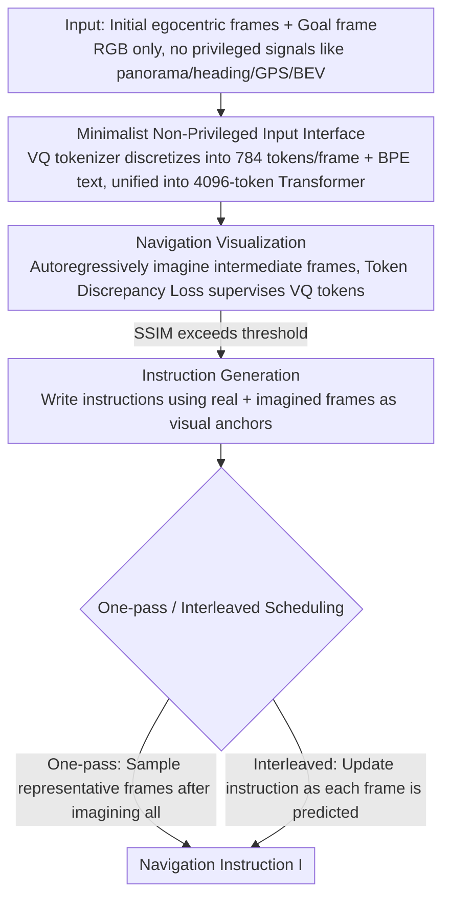

# GoViG: Goal-Conditioned Visual Navigation Instruction Generation via Multimodal Reasoning

**Conference**: ACL 2026 Findings  
**arXiv**: [2508.09547](https://arxiv.org/abs/2508.09547)  
**Code**: https://github.com/F1y1113/GoViG (Available)  
**Area**: Robotics / Vision-Language Navigation (VLN)  
**Keywords**: Navigation Instruction Generation, Egocentric, World Model, Multimodal Reasoning, Anole-7B

## TL;DR
GoViG proposes a new task of generating navigation instructions based only on initial and goal egocentric observations. It decomposes the task into two steps: "imagining intermediate frames then writing instructions." By jointly training Anole-7B with a dual objective of token-level MSE and label-smoothing CE, and employing one-pass or interleaved multimodal reasoning strategies, the method improves the BLEU-4 score from a baseline of 0.08 to 0.32, maintaining 0.27 on cross-domain real-world videos.

## Background & Motivation

**Background**: Mainstream VLN research focus on "following instructions to navigate," while the reverse task of "writing instructions from visual frames" is primarily used for data augmentation. Representative methods (Speaker-Follower, LANA, C-Instructor, BEV-Instructor, NavRAG, MapInstructor) almost all rely on **privileged inputs**—panoramas, action history, headings, GPS, 3D bboxes, BEV maps, or scene graphs.

**Limitations of Prior Work**: (1) These privileged signals are unavailable in real-world deployments (blind assistance, domestic robots, rescue in unknown environments); (2) Compressing visuals into landmarks or text summaries for LLMs causes the loss of critical **spatial and semantic details**; (3) General MLLMs (GPT-4o, Gemini, Claude) lack a "mental rehearsal" mechanism—humans plan routes by imagining intermediate scenes, whereas models jumping directly from two observations to natural language instructions suffer from temporal gaps and orientation errors.

**Key Challenge**: To achieve generalization, privileged inputs must be discarded in favor of egocentric RGB. however, information from only two-end observations is extremely sparse. Directly generating long instructions leads to "hallucinations"—it is necessary to **explicitly generate intermediate states** as visual anchors for the instructions.

**Goal**: (1) Formally define the GoViG task—input consists only of $\mathcal{O}=\{o_1,\dots,o_n\}$ and $o_g$, outputting natural language instruction $I$; (2) Design a unified autoregressive MLLM capable of both "frame prediction + instruction generation"; (3) Construct a hybrid real+synthetic benchmark to verify cross-domain generalization.

**Key Insight**: Drawing from world model concepts—since instructions are essentially linguistic descriptions of "future observation sequences," the model should "imagine first, then speak" like a human. The task is decomposed into Navigation Visualization (predicting the next frame) and Instruction Generation with Visual Cues (writing instructions based on real + predicted frames).

**Core Idea**: Utilize Anole-7B (a unified image-text autoregressive model based on Chameleon) to **jointly learn visual token prediction and text token prediction using the same Transformer**. Two reasoning strategies—one-pass and interleaved—are employed to choose between "imaging everything before speaking" vs. "imaging and speaking step-by-step."

## Method

### Overall Architecture

GoViG addresses an extremely sparse information task: writing natural language instructions to guide a person using only a few egocentric RGB frames near the start and one goal frame. The core idea mimics the human process of "rehearsing the route mentally before describing it"—first using a unified autoregressive MLLM to imagine intermediate frames one by one, then generating instructions using real and imagined frames as visual anchors. The pipeline is built on Anole-7B: during training, trajectories are split into "Navigation Visualization" (predicting the next frame) and "Instruction Generation" (writing instructions from a sequence of frames) to be learned jointly. During inference, image similarity is used as a stopping criterion; predicted frames are generated iteratively before the instruction, with both one-pass and interleaved scheduling available. A hybrid benchmark, R2R-Goal (74,737 synthetic trajectories + 1,080 real videos), was constructed, keeping 6 initial egocentric frames + 1 goal frame + instructions per entry.

### Key Designs

**1. Minimalist Non-Privileged Input Interface (Egocentric-only)**

To generalize to real scenarios like blind assistance or domestic robotics, the model cannot rely on privileged signals like panoramas, headings, action history, GPS, BEV, or 3D bboxes. GoViG narrows the input to a set of RGB frames $\{o_1,\dots,o_n, o_g\}$. Visuals are discretized via the Chameleon VQ tokenizer into 784 tokens/frame (256×256), and text uses BPE, both fed into a 4096-token causal Transformer without external landmark vocabularies or extra encoders. Given the token budget, a context size of 2 + 784 tokens/frame is the optimal trade-off; increasing history length required compressing frames to 400 tokens, which decreased performance, suggesting single-frame density is more important than frame count. This "zero-privilege + zero-preprocessing" interface allows cross-domain transfer without module changes: zero-shot transfer to real videos (GO Stanford / ReCon / HuRoN) maintains a BLEU-4 of 0.27, whereas other methods stay between 0.05–0.09.

**2. VQ-token level Token Discrepancy Loss: Lessening penalties for "nearly correct" visuals**

During "Navigation Visualization," intermediate frames are predicted autoregressively. Directly using cross-entropy treats visual tokens as independent discrete categories, penalizing a "dark brown door" prediction the same as a "red chair" if it misses the exact ground truth token. The authors introduced a loss that gives partial credit to similar codebook entries. For a ground truth token embedding $\text{emb}_i$ at position $i$, the MSE vector $\text{MSE}(\text{emb}_i, \mathcal{C}) \in \mathbb{R}^{1\times N}$ between it and the entire codebook $\mathcal{C}$ is calculated. The final loss is the dot product with the predicted distribution $P(t_i) \in \mathbb{R}^{1\times N}$:

$$\mathcal{L}_{\text{vis}} = \sum_{i=1}^n \text{MSE}(\text{emb}_i, \mathcal{C}) \cdot P(t_i)$$

This reduces the loss as long as the model places high probability on tokens similar to the ground truth. This change requires no extra network architecture but is vital for visual quality; replacing it with label-smoothing CE drops SSIM from 0.69 to 0.52 and PSNR from 20.02 to 15.35.

**3. One-Pass and Interleaved "Imagine-Express" Scheduling**

Two inference schedules are provided for turning imagined frames into instructions. One-pass iteratively predicts frames until they are close enough to the goal ($\text{SSIM}(\hat{o}_{k+t}, o_g) > \tau$), then samples $m-1$ representative frames from $\{o_2,\dots,o_k,\hat{o}_{k+1},\dots,\hat{o}_{k+t}\}$ to write the full instruction $I = F_\Theta(\{o_1, \hat{o}_{i_1},\dots,\hat{o}_{i_{m-1}}, o_g\})$. This emphasizes a global view and is faster (~1.2× speed of interleaved), suitable for known indoor scenes. Interleaved updates the instruction $I_t$ every time a new frame $\hat{o}_{k+t}$ is predicted, using the previous instruction as context: $I_t = F_\Theta(\{o_t,\dots,o_k,\hat{o}_{k+1},\dots,\hat{o}_{k+t},o_g,I_{t-1}\})$. this is closer to how humans revise plans while walking and provides higher accuracy (unseen BLEU-4 0.32 vs 0.29; user rating 4.85 vs 4.52), making it suitable for unknown/real-world scenes. Both schedules use the same trained model via prompt orchestration.

### Loss & Training
- Joint objective: $\mathcal{L} = \mathcal{L}_{\text{vis}}$ (visualization samples) + $\mathcal{L}_{\text{ins}}$ (instruction samples, label smoothing CE).
- Input-label concatenation sets labels for the input part to $-100$, calculating loss only on targets.
- AdamW lr=$2\times 10^{-4}$, 20 epochs, 4× A100 80GB, global batch size 8.
- Tokenizer is frozen; only LoRA adapters (rank=16, qkv-projection) in the Transformer are updated.

## Key Experimental Results

### Main Results

Instruction generation quality on R2R-Goal (BLEU-4 / CIDEr):

| Method | Val Seen BL-4 | Val Seen CI | Val Unseen BL-4 | Val Unseen CI | Test BL-4 | Test CI |
|---|---|---|---|---|---|---|
| Speaker-Follower | 0.10 | 0.08 | 0.09 | 0.06 | 0.09 | 0.06 |
| LANA | 0.05 | 0.05 | 0.05 | 0.06 | 0.05 | 0.03 |
| C-Instructor (Prev. SOTA) | 0.21 | 0.19 | 0.22 | 0.19 | 0.22 | 0.18 |
| GPT-4o + CoT | 0.08 | 0.17 | 0.09 | 0.16 | 0.08 | 0.17 |
| Gemini 3.0 | 0.09 | 0.13 | 0.09 | 0.14 | 0.08 | 0.12 |
| Claude 4 Opus | 0.10 | 0.15 | 0.09 | 0.13 | 0.09 | 0.14 |
| Anole-7B + CoT | 0.10 | 0.14 | 0.09 | 0.13 | 0.09 | 0.10 |
| **Anole-7B + One-pass (Ours)** | 0.34 | 0.20 | 0.29 | 0.18 | 0.29 | 0.19 |
| **Anole-7B + Interleaved (Ours)** | **0.36** | **0.22** | **0.32** | **0.20** | **0.33** | 0.18 |

Navigation Visualization Quality (val unseen):

| Method | SSIM ↑ | PSNR ↑ | LPIPS ↓ | DreamSim ↓ |
|---|---|---|---|---|
| GPT-4o + DALL·E | 0.29 | 9.57 | 0.72 | 0.61 |
| Anole-7B (Direct) | 0.50 | 14.98 | 0.39 | 0.27 |
| **Ours** | **0.69** | **20.02** | **0.27** | **0.13** |

Practical Usability (Success Rate of VLN navigators following generated instructions):

| Instruction Generator | ETPNav SR | ETPNav SPL | BEVBert SR | BEVBert SPL |
|---|---|---|---|---|
| Human Annotation | 0.36 | 0.28 | 0.34 | 0.27 |
| GPT-4o + CoT | 0.25 | 0.17 | 0.24 | 0.17 |
| C-Instructor | 0.29 | 0.19 | 0.27 | 0.18 |
| Anole-7B + One-pass | 0.31 | 0.20 | 0.29 | 0.21 |
| **Anole-7B + Interleaved** | **0.34** | **0.25** | **0.33** | 0.25 |

### Ablation Study

| Configuration | SSIM | PSNR | LPIPS | DreamSim | Description |
|---|---|---|---|---|---|
| w/o $\mathcal{L}_{\text{vis}}$ (using label smoothing CE) | 0.52 | 15.35 | 0.36 | 0.23 | Treats visual tokens as discrete categories |
| **w/ $\mathcal{L}_{\text{vis}}$ (Token Discrepancy Loss)** | **0.69** | **20.02** | **0.27** | **0.13** | +17 SSIM points |

Context-size / token-length trade-off: BLEU/CIDEr scores improve when context increases from 1 to 2. However, expanding to context 4-5 forced a reduction in per-frame quality (784 down to 400 tokens), causing scores to drop. This indicates **single-frame information density is more critical than the number of frames**.

Cross-domain Zero-shot Results (on GO Stanford+ReCon+HuRoN real video subset):

| Method | BLEU-4 | CIDEr | METEOR | ROUGE-L |
|---|---|---|---|---|
| C-Instructor | 0.15 | 0.08 | 0.12 | 0.15 |
| GPT-4o + CoT | 0.09 | 0.13 | 0.16 | 0.18 |
| Gemini 3.0 | 0.08 | 0.11 | 0.15 | 0.14 |
| Claude 4 Opus | 0.09 | 0.13 | 0.16 | 0.16 |
| **Anole-7B + Interleaved (Ours)** | **0.27** | **0.15** | **0.19** | **0.20** |

### Key Findings
- **Interleaved outperforms one-pass significantly**: +3 points in BLEU-4, higher user ratings (4.85 vs 4.52), and +3 points in follower success rate, proving "thinking while speaking" is closer to human cognitive processes.
- **Token Discrepancy Loss is key to visual quality**: Simply replacing CE with token-similarity-weighted loss yielded a 17-point SSIM gain, highlighting that visual tokens should not be treated as independent categories.
- **Context size has a saturation point**: Under a 4096 token budget, resolution per frame is more important than context length—a practical engineering conclusion for long-video deployment.
- **Stable dominance over closed-source LLMs in cross-domain tests**: Without training on real videos, the model's BLEU-4 (0.27) is 3x higher than GPT-4o+CoT (0.09) or Claude 4 Opus (0.09), confirming explicit visualization as a key for generalization.
- **Instruction generation approaches human level**: In follower tests with true VLN agents, interleaved instructions allowed ETPNav to reach a 0.34 SR, near the 0.36 SR of human annotations.

## Highlights & Insights
- **"World Model-based" Instruction Generation**: Redefining instruction generation as "using a world model to predict future observations, then summarizing them linguistically." This maps VLN "outputs" to an intermediate representation more grounded than text.
- **Simplicity of Token-similarity Loss**: Improving SSIM from 0.5 to 0.69 solely through an MSE-weighted term in the loss function, without extra network layers, provides a portable trick for any LM using a VQ tokenizer.
- **Unified Capability for One-pass / Interleaved**: The training does not distinguish between strategies; switching occurs via prompt orchestration, demonstrating that "scheduling strategies" can be decoupled from core model capability.
- **SSIM as Stop Signal**: Using image similarity rather than a step counter or specific action as a stopping condition allows for better domain transfer without manual budget tuning.

## Limitations & Future Work
- **Lack of real-time environmental feedback**: The current pipeline relies on imagined frames. If the visualization is incorrect, instruction errors accumulate linearly.
- **Context length limited by Chameleon's 4096 tokens**: In long hallways or multi-floor scenarios, the 6+1 frame limit is tight, forcing compression that reduces quality.
- **Limited real-world training data**: 1,080 real videos were used only for testing. Real-world deployment requires larger datasets of real egocentric visuals paired with instructions.
- **Visual realism of generated frames**: While DreamSim improved to 0.13, it remains below standard video generation quality. Frames serve as "semantic anchors" but are blurry.
- **Future Directions**: (i) Incorporating lightweight online correction by updating history with real observations; (ii) Using MLLMs with longer contexts (e.g., 32K); (iii) Predicting "latent trajectories" instead of raw RGB frames to reduce overhead.

## Related Work & Insights
- **vs. C-Instructor**: C-Instructor uses LLM + panorama + landmark vocabulary + CoT, achieving a BLEU-4 of 0.22 on unseen data. GoViG achieves 0.32 without panoramas or landmarks, proving "explicit visualization" beats "explicit landmarks."
- **vs. BEV-Instructor**: BEV-Instructor uses egocentric views but depends on multi-view inputs + BEV encoders. GoViG consolidates all spatial reasoning into the hidden states of a single MLLM.
- **vs. Anole-7B + CoT**: With the same backbone, naïve CoT gets 0.09 BLEU-4, whereas visualization jumps it to 0.32, showing text-only CoT cannot encode spatial relations effectively.
- **vs. GPT-4o + DALL·E**: Decoupled generation (DALL·E) yields an SSIM of 0.29, far below GoViG's 0.69, because the image generator lacks navigation context. End-to-end prediction within one autoregressive model preserves spatial coherence.
- **vs. World Models (e.g., Dreamer)**: Traditional world models predict in latent space for control; GoViG predicts in RGB token space for language generation, acting as a "linguistic variant" of a world model.

## Rating
- Novelty: ⭐⭐⭐⭐ New task definition (egocentric-only) + unified MLLM framework. The approach is a fresh combination of existing modules.
- Experimental Thoroughness: ⭐⭐⭐⭐⭐ Comparison against 9+ baselines including top-tier LLMs, across 4 metrics, user studies, agent follower tests, and cross-domain zero-shot evaluation.
- Writing Quality: ⭐⭐⭐⭐ Clear task definition and diagrams; however, method sections and some quantitative tables could be more readable.
- Value: ⭐⭐⭐⭐ Release of R2R-Goal data and code has immediate potential for blind assistance and emergency navigation; serves as the first strong "zero-privilege" baseline for instruction generation.

<!-- RELATED:START -->

## Related Papers

- [\[ACL 2026\] GROKE: Vision-Free Navigation Instruction Evaluation via Graph Reasoning on OpenStreetMap](groke_vision-free_navigation_instruction_evaluation_via_graph_reasoning_on_opens.md)
- [\[CVPR 2025\] Robotic Visual Instruction](../../CVPR2025/robotics/robotic_visual_instruction.md)
- [\[CVPR 2026\] FantasyVLN: Unified Multimodal Chain-of-Thought Reasoning for Vision-and-Language Navigation](../../CVPR2026/robotics/fantasyvln_unified_multimodal_chain-of-thought_reasoning_for_vision-and-language.md)
- [\[ACL 2026\] Cultivating Forensic Reasoning for Generalizable Multimodal Manipulation Detection](cultivating_forensic_reasoning_for_generalizable_multimodal_manipulation_detecti.md)
- [\[CVPR 2026\] MM-ACT: Learn from Multimodal Parallel Generation to Act](../../CVPR2026/robotics/mm-act_learn_from_multimodal_parallel_generation_to_act.md)

<!-- RELATED:END -->
