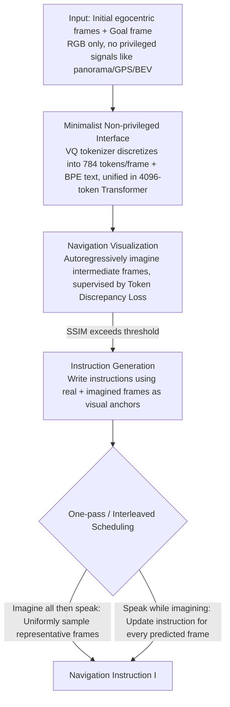

# GoViG: Goal-Conditioned Visual Navigation Instruction Generation via Multimodal Reasoning

**Conference**: ACL 2026 Findings  
**arXiv**: [2508.09547](https://arxiv.org/abs/2508.09547)  
**Code**: https://github.com/F1y1113/GoViG (Available)  
**Area**: Robotics / Vision-Language Navigation (VLN)  
**Keywords**: Navigation Instruction Generation, egocentric, World Model, multimodal reasoning, Anole-7B

## TL;DR
GoViG proposes a new task for generating navigation instructions based **solely on initial and goal egocentric observations**. The process is decomposed into two steps: "imagine intermediate visuals first, then write instructions." By joint training Anole-7B with a dual objective of token-level MSE and label-smoothing CE, and employing one-pass or interleaved multimodal reasoning strategies, the model pushes BLEU-4 from a baseline of 0.08 to 0.32, maintaining 0.27 on cross-domain real-world videos.

## Background & Motivation

**Background**: Mainstream VLN research focuses on "navigation by following instructions," while the reverse, "writing instructions from visuals," has primarily been used for data augmentation. Representative methods (Speaker-Follower, LANA, C-Instructor, BEV-Instructor, NavRAG, MapInstructor) almost all rely on **privileged inputs**—panoramas, action history, orientation, GPS, 3D bboxes, BEV maps, or scene graphs.

**Limitations of Prior Work**: (1) These privileged signals are unavailable in real-world deployments (blind assistance, household robots, rescue in unknown environments); (2) Even when compressing visuals into landmarks or text summaries for LLMs, critical **spatial and semantic details** are lost; (3) General MLLMs (GPT-4o, Gemini, Claude) lack a "mental rehearsal" mechanism—humans plan routes by first projecting intermediate scenes, whereas models jump directly from end-to-end observations to natural language, resulting in temporal discontinuities and directional errors.

**Key Challenge**: To achieve generalization, privileged inputs must be discarded in favor of egocentric RGB; however, providing only two terminal observations results in extremely sparse information. Directly generating long instructions leads to "hallucinations"—it is necessary to **explicitly generate intermediate states** to serve as visual anchors for the instructions.

**Goal**: (1) Formally define the GoViG task—input consists only of $\mathcal{O}=\{o_1,\dots,o_n\}$ and $o_g$, and the output is a natural language instruction $I$; (2) Design a unified autoregressive MLLM capable of both "frame prediction + instruction generation"; (3) Construct a hybrid real+synthetic benchmark to verify cross-domain generalization.

**Key Insight**: Drawing inspiration from the world model concept—since instructions are essentially linguistic descriptions of "future observation sequences," the model should "imagine first → speak later" like a human. The task is decomposed into Navigation Visualization (predicting the next frame) and Instruction Generation with Visual Cues (writing instructions based on real + predicted frames).

**Core Idea**: Use Anole-7B (a unified image-text autoregressive model based on Chameleon) to **jointly learn visual and text token prediction within the same Transformer**, then utilize one-pass or interleaved reasoning strategies to choose between "imaging everything once before speaking" vs. "speaking while imagining."

## Method

### Overall Architecture

GoViG addresses an extremely sparse information task: generating natural language instructions to guide a user based only on a few egocentric RGB frames near the start and a single goal frame. The core idea mimics human rehearsal: first, a unified autoregressive MLLM imagines intermediate frames one by one, then generates instructions using real and imagined frames as visual anchors. The pipeline is built on Anole-7B: during training, trajectories are split into "Navigation Visualization" and "Instruction Generation" samples for joint learning on the same Transformer. During inference, image similarity is used as a stopping criterion, and instructions are generated after or alongside predicted frames using one-pass or interleaved scheduling. A hybrid benchmark, R2R-Goal (74,737 synthetic trajectories + 1,080 real videos), was constructed, with each entry containing 6 initial egocentric frames + 1 goal frame + instructions.

### Key Designs

**1. Egocentric-only Minimalist Interface**

To generalize to real-world scenarios like blind assistance, the model cannot rely on privileged signals. GoViG restricts input to a set of RGB frames $\{o_1,\dots,o_n, o_g\}$. Visuals are discretized via the Chameleon VQ tokenizer into 784 tokens/frame ($256 \times 256$), and text is processed via BPE, both fed into a 4096-token causal Transformer without external landmark vocabularies or BEV encoders. Given the token budget, a context size of 2 with 784 tokens/frame was found to be the optimal trade-off; extending history required compressing frames to 400 tokens, which decreased performance, indicating that single-frame information density is more critical than the number of frames.

**2. VQ-token level Token Discrepancy Loss**

The "Navigation Visualization" step predicts intermediate frames autoregressively. Traditional cross-entropy treats visual tokens as independent discrete categories, penalizing a "dark brown door" prediction as heavily as a "red chair." The authors introduced a loss that grants partial credit for similar codebook entries. For a ground-truth token embedding $\text{emb}_i$ at position $i$, the MSE vector $\text{MSE}(\text{emb}_i, \mathcal{C}) \in \mathbb{R}^{1\times N}$ against the entire codebook $\mathcal{C}$ is calculated, and the sum of the inner product with the predicted distribution $P(t_i)$ is taken:

$$\mathcal{L}_{\text{vis}} = \sum_{i=1}^n \text{MSE}(\text{emb}_i, \mathcal{C}) \cdot P(t_i)$$

This ensures the loss is low as long as the model places probability on tokens similar to the ground truth. Replacing this with label-smoothing CE caused SSIM to drop from 0.69 to 0.52 and PSNR from 20.02 to 15.35.

**3. One-Pass vs. Interleaved Scheduling**

The authors provided two inference schedules: "Imagine all then speak" (One-pass) and "Speak while imagining" (Interleaved). One-pass iteratively predicts frames until similarity with the goal is sufficient ($\text{SSIM}(\hat{o}_{k+t}, o_g) > \tau$), then samples $m-1$ frames to write the full instruction $I$, emphasizing global view and speed. Interleaved updates instruction $I_t$ every time a new frame $\hat{o}_{k+t}$ is predicted, utilizing previous instructions as context until convergence. Interleaved is more accurate (unseen BLEU-4 0.32 vs 0.29; human rating 4.85 vs 4.52) and suitable for unknown environments.

### Loss & Training
- Joint objective: $\mathcal{L} = \mathcal{L}_{\text{vis}}$ (visualization samples) + $\mathcal{L}_{\text{ins}}$ (instruction samples, label smoothing CE).
- Input-label concatenation sets input labels to $-100$, calculating loss only on targets.
- AdamW optimizer, lr=$2\times 10^{-4}$, 20 epochs, 4× A100 80GB, global batch size 8.
- Tokenizer frozen; only LoRA adapters updated (rank=16, qkv-projection).

## Key Experimental Results

### Main Results

Instruction generation quality on R2R-Goal (BLEU-4 / CIDEr):

| Method | Val Seen BL-4 | Val Seen CI | Val Unseen BL-4 | Val Unseen CI | Test BL-4 | Test CI |
|---|---|---|---|---|---|---|
| Speaker-Follower | 0.10 | 0.08 | 0.09 | 0.06 | 0.09 | 0.06 |
| LANA | 0.05 | 0.05 | 0.05 | 0.06 | 0.05 | 0.03 |
| C-Instructor (Prev. SOTA) | 0.21 | 0.19 | 0.22 | 0.19 | 0.22 | 0.18 |
| GPT-4o + CoT | 0.08 | 0.17 | 0.09 | 0.16 | 0.08 | 0.17 |
| **Anole-7B + Interleaved (Ours)** | **0.36** | **0.22** | **0.32** | **0.20** | **0.33** | 0.18 |

Practical Usability (Success Rate of navigation agents following generated instructions):

| Instruction Generator | ETPNav SR | ETPNav SPL |
|---|---|---|
| Human Annotation | 0.36 | 0.28 |
| C-Instructor | 0.29 | 0.19 |
| **Anole-7B + Interleaved** | **0.34** | **0.25** |

### Ablation Study

| Configuration | SSIM ↑ | PSNR ↑ | LPIPS ↓ | DreamSim ↓ |
|---|---|---|---|---|
| w/o $\mathcal{L}_{\text{vis}}$ (using label smoothing CE) | 0.52 | 15.35 | 0.36 | 0.23 |
| **w/ $\mathcal{L}_{\text{vis}}$ (Token Discrepancy Loss)** | **0.69** | **20.02** | **0.27** | **0.13** |

### Key Findings
- **Interleaved outperforms one-pass**: BLEU-4 +3 points, human rating 4.85 vs 4.52, navigation success rate +3 points.
- **Token Discrepancy Loss is vital**: Replacing CE with this similarity-weighted loss yielded a 17-point gain in SSIM.
- **Context vs. Density**: Under a fixed budget, single-frame resolution is more important than context length for instruction quality.
- **Superiority over closed-source models**: BLEU-4 (0.27) is 3x higher than GPT-4o+CoT (0.09) in cross-domain tests, proving explicit visualization is key for generalization.

## Highlights & Insights
- **World Model for Instructions**: Redefining instruction generation as "predicting future observation sequences then summarizing them" maps the output to a grounded intermediate representation.
- **Simple Token-Similarity Loss**: Achieving massive image quality gains without extra network layers or second-stage training is a highly portable trick for any VQ-based LM.
- **Decoupled Strategy**: One-pass and interleaved modes share the same model, showing reasoning strategy can be decoupled from core capability via prompting.

## Limitations & Future Work
- **Lack of Environmental Feedback**: Future work includes incorporating real-time feedback; currently, predicted errors propagate.
- **Context Constraints**: Limited by the 4096 token window, long-range navigation requires sacrificing frame tokens.
- **Sim-to-Real Gap**: While visualization serves as a semantic anchor, the images are still blurry compared to realistic video generation models.

## Related Work & Insights
- **vs C-Instructor**: C-Instructor uses panoramas and landmark vocabularies; GoViG outperforms it without these, proving explicit visualization is more effective than explicit text landmarks.
- **vs World Models**: While traditional world models predict in latent space for control, GoViG predicts in RGB token space for language generation—a "linguistic variant" of world models.

## Rating
- Novelty: ⭐⭐⭐⭐ New task definition (egocentric-only) + unified MLLM framework.
- Experimental Thoroughness: ⭐⭐⭐⭐⭐ Comprehensive comparisons against 9+ baselines including GPT-4o and human studies.
- Writing Quality: ⭐⭐⭐⭐ Clear definitions and figures, though some table layouts are complex.
- Value: ⭐⭐⭐⭐ High potential for practical application in assistive robotics; provides a strong non-privileged baseline.

<!-- RELATED:START -->

## Related Papers

- [\[ACL 2026\] GROKE: Vision-Free Navigation Instruction Evaluation via Graph Reasoning on OpenStreetMap](groke_vision-free_navigation_instruction_evaluation_via_graph_reasoning_on_opens.md)
- [\[CVPR 2026\] Materialistic RIR: Material Conditioned Realistic RIR Generation](../../CVPR2026/robotics/materialistic_rir_material_conditioned_realistic_rir_generation.md)
- [\[CVPR 2025\] Robotic Visual Instruction](../../CVPR2025/robotics/robotic_visual_instruction.md)
- [\[CVPR 2026\] FantasyVLN: Unified Multimodal Chain-of-Thought Reasoning for Vision-and-Language Navigation](../../CVPR2026/robotics/fantasyvln_unified_multimodal_chain-of-thought_reasoning_for_vision-and-language.md)
- [\[ACL 2026\] Cultivating Forensic Reasoning for Generalizable Multimodal Manipulation Detection](cultivating_forensic_reasoning_for_generalizable_multimodal_manipulation_detecti.md)

<!-- RELATED:END -->
