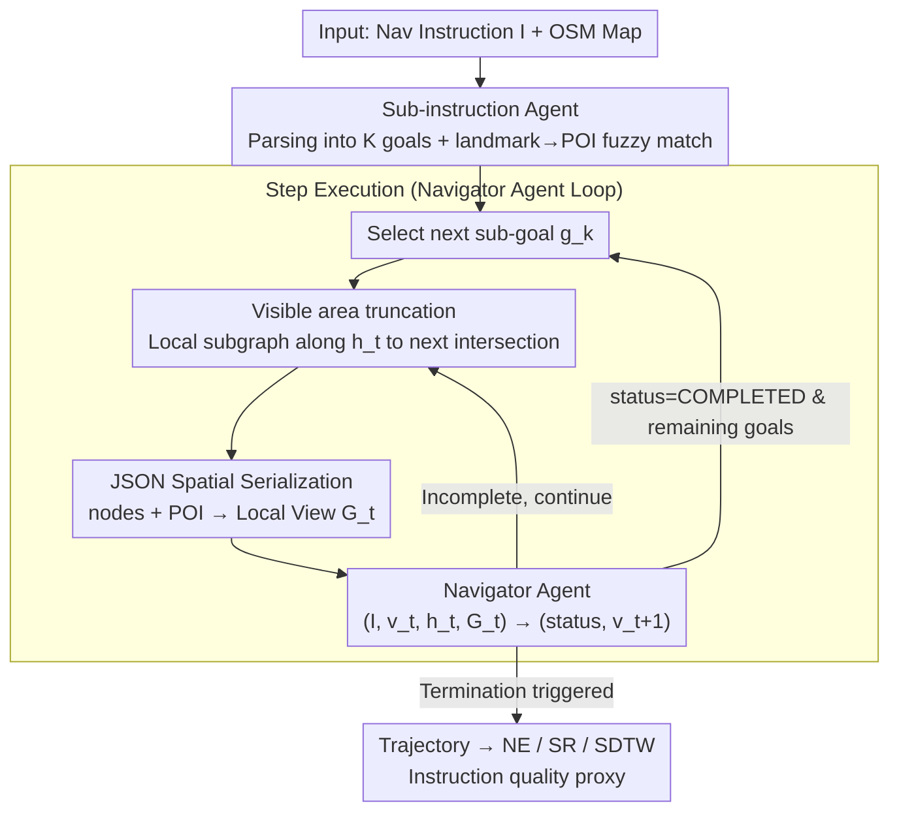

# GROKE: Vision-Free Navigation Instruction Evaluation via Graph Reasoning on OpenStreetMap

**Conference**: ACL 2026  
**arXiv**: [2601.07375](https://arxiv.org/abs/2601.07375)  
**Code**: https://anonymous.4open.science/r/groke (Anonymous)  
**Area**: Robotics / VLN Instruction Evaluation  
**Keywords**: Map2Seq, OpenStreetMap, LLM agent, graph reasoning, agent-as-judge  

## TL;DR
GROKE proposes evaluating navigation instructions **without any visual input**. By serializing OpenStreetMap (OSM) data into JSON, it utilizes Gemini-3 Pro as a follower agent to execute instructions along the graph. Performance metrics like Navigation Error (NE), Success Rate (SR), and SDTW are used as proxies for instruction quality. Compared to heuristic baselines on Map2Seq, GROKE reduces NE by 68.5%, and its NE scores correlate significantly with human judgments of "instruction clarity" ($r = -0.31, p < 0.01$).

## Background & Motivation

**Background**: Traditional navigation instruction evaluation (i.e., "how good is this instruction?") relies on machine translation metrics like BLEU, ROUGE, METEOR, or CIDEr. The Vision-and-Language Navigation (VLN) community increasingly favors "agent-as-judge" approaches—training a follower agent to follow instructions in high-fidelity visual simulators (e.g., Matterport3D, Touchdown) and judging quality based on success rates.

**Limitations of Prior Work**: (1) **Fatal flaws of n-gram metrics**: "Turn left at the bank" and "Turn right at the bank" receive near-perfect BLEU scores despite having opposite functions. Conversely, "Turn left after the red building" and "Head west past the brick structure" may have a BLEU of 0 while describing the same action. (2) **Visual followers confound language quality with visual recognition**: Does an agent fail because the instruction is ambiguous or because it misidentified a "stucco wall" as a "brick wall"? (3) **Accessibility**: High-end simulators like Google Street View or Matterport3D require licenses, terabytes of data, and significant compute, making evaluation inaccessible to many researchers.

**Key Challenge**: The "meaning" of an instruction is defined by its **compliance condition** (the set of physical trajectories that satisfy the instruction), which is independent of visual modality. However, current pragmatic evaluations couple visual perception, introducing both NLG and CV noise into the metrics.

**Goal**: (1) Develop a vision-free agent capable of following instructions using only symbolic OSM information. (2) Determine which spatial representation (textual, JSON, Graphviz, or grid) best supports LLM reasoning. (3) Validate the agent's SR/NE as a proxy for instruction navigability against human judgment.

**Key Insight**: The Map2Seq dataset is unique because its instructions are aligned with OSM nodes, edges, and POIs, allowing for the **decoupling of visual modalities**. A purely symbolic follower agent can be constructed to specifically measure the "structural and semantic navigability" of instructions.

**Core Idea**: Use an LLM as a follower, feeding it serialized **JSON local views** of the OSM map. A hierarchical two-agent architecture (Sub-instruction Agent + Navigator Agent) executes the navigation. The agent’s trajectory metrics serve as the "instruction quality score" without training or visual input.

## Method

### Overall Architecture

GROKE aims to solve the problem of evaluating navigation instructions. Rather than using n-gram metrics (which fail on functional opposites) or visual simulators (which confound vision and language), it fixes a vision-free LLM follower (Gemini-3 Pro). This agent follows instructions using purely symbolic OSM information. The resulting Navigation Error (NE), SR, and SDTW are interpreted as proxies for "how executable the instruction is." The system follows a training-free two-agent hierarchical architecture: a Sub-instruction Agent decomposes the full instruction $I$ into $K$ atomic sub-goals $\{g_1,\dots,g_K\}$ (e.g., MOVE_FORWARD, TURN_LEFT with natural language descriptions) and maps landmarks to OSM POIs using fuzzy matching. In the execution loop, the "visible area" is truncated at the next intersection, and the local subgraph is serialized into a JSON view $\mathcal{G}_t$. The Navigator Agent then processes $(I, v_t, h_t, \mathcal{G}_t)$ to output $(\text{status}_k, v_{t+1})$. A "COMPLETED" status advances the system to the next sub-goal. Termination occurs when all sub-goals are finished, total steps exceed 100, or a single sub-goal retry count exceeds 15.

### Key Designs

**1. Sub-instruction Agent: A state machine for decomposing long instructions**

Instructions often contain over 50 tokens and require multi-step spatial reasoning. Feeding the entire instruction to a navigator often leads to the model getting lost. The Sub-instruction Agent acts as a parser: $I \xrightarrow{\text{parse}} \{g_1,\dots,g_K\}$, where each goal is formatted as `("MOVE_FORWARD", "Go straight to the bank", TODO)`. This allows the Navigator to focus only on the current $g_k$, reducing the dual burden of "long-range planning" and "spatial reasoning." Ablations (Appendix A.2) show that removing this stage leads to a significant drop in SR.

**2. Intersection-based visible area truncation: Limiting scope to the next junction**

To prevent the LLM from being overwhelmed by irrelevant distant nodes and hallucinating, GROKE simulates a junction-based field of view (Algorithm 1). Starting from $v_t$ in direction $h_t$, it selects neighbors by $\arg\min_{v'} \Delta h(h_{\text{curr}}, h_{v'})$ while $\Delta h < 100^\circ$. It proceeds until it encounters a specific number of intersections ($\text{degree}(v) > 2$), plus a 3-node lookahead. POIs are attached to path nodes using a 50m threshold and Haversine distance. This captures all necessary decision-making information while compressing the token count.

**3. Vision-free JSON Spatial Serialization: LLM-friendly local map formats**

The serialization format of the local subgraph is critical. GROKE organizes the graph into two parts: "nodes" (ID, type, heading, and adjacency lists with relative bearings calculate via the bearing formula) and "POIs" (landmark ID, node reference, distance, and discretized relative direction: Forward/Left/Right/Back). A systematic comparison of representations—Textual, JSON, Graphviz DOT, and ASCII grid—revealed significant performance gaps: JSON (SR 63% / NE 68m) vs. Textual (SR 61% / NE 70m) vs. Graphviz (SR 40% / NE 96m) vs. Grid (SR 10% / NE 175m). The "0" cells in ASCII grids were often misinterpreted by the LLM as valid paths. JSON’s hierarchical structure proved most robust for recovering from local deviations (OSR 74% vs. Textual 67%).

## Key Experimental Results

### Main Results

Performance on two Map2Seq splits (700 trajectories per split):

| Method | TestSetA NE↓ | TestSetA SR↑ | TestSetA OSR↑ | TestSetA SDTW↑ | TestSetB NE↓ | TestSetB SR↑ | TestSetB OSR↑ | TestSetB SDTW↑ |
|---|---|---|---|---|---|---|---|---|
| Random Walker | 259.0 | 4.4% | 5.7% | 0.026 | 244.3 | 6.1% | 7.1% | 0.029 |
| Action Sampling (No Text) | 250.1 | 5.1% | 6.0% | 0.037 | 241.6 | 7.4% | 8.1% | 0.039 |
| Heuristic Agent (Regex+Angle) | 180.6 | 18.0% | 18.9% | 0.155 | 173.0 | 17.9% | 19.1% | 0.159 |
| **GROKE (Ours)** | **56.8** | **66.4%** | **78.4%** | **0.634** | **59.8** | **63.3%** | **78.0%** | **0.609** |

Human baseline SR is 0.86 / 0.84 (in Street View). GROKE's vision-free approach reaches ~74-77% of human performance.

Human correlation analysis (n=100, manual binary navigability labels):

| Metric | Pearson $r$ | $p$ | Spearman $\rho$ | $p$ |
|---|---|---|---|---|
| SR | 0.2865 | 0.0039** | 0.2865 | 0.0039** |
| OSR | 0.1860 | 0.0639 | 0.1860 | 0.0639 |
| SDTW | 0.2799 | 0.0048** | 0.2860 | 0.0039** |
| nDTW | 0.2457 | 0.0138* | 0.2895 | 0.0035** |
| **NE** | **-0.3096** | **0.0017**\*\* | **-0.3184** | **0.0012**\*\* |

NE is the metric most strongly correlated with human judgment.

### Ablation Study

Comparison of four spatial representations across difficulty levels (n=100 Map2Seq seen val):

| Representation | Easy NE | Easy SR | Medium NE | Medium SR | Hard NE | Hard SR | Overall |
|---|---|---|---|---|---|---|---|
| **JSON** | 62.1 | 61.2% | 61.2 | 68.4% | **112.9** | **53.8%** | Best for Hard tasks |
| Textual | 71.3 | 61.2% | **56.6** | 68.4% | 110.6 | 38.5% | Good for simple tasks |
| Graphviz DOT | 90.4 | 40.8% | 87.8 | 47.4% | 146.5 | 15.4% | High parsing overhead |
| ASCII Grid | 186.7 | 6.1% | 160.3 | 13.2% | 176.6 | 15.4% | Failed (misinterpreted '0') |
| Optimized Repr. | **35.6** | **77.6%** | **30.9** | **76.3%** | 93.3 | 53.8% | Upper bound with Prompt Eng. |

### Key Findings
- **JSON ≫ ASCII grid**: While grid representations are popular in visual LLM reasoning research, they failed here (10% SR). "0" padding confused the model into selecting empty space as valid paths.
- **Scalability of JSON**: While Textual and JSON perform similarly on Easy/Medium tasks, JSON significantly outperforms on Hard tasks (SR 53.8% vs. 38.5%). Structural hierarchy acts as better "scaffolding" for long-range planning.
- **NE as the Best Metric**: $r = -0.31, p < 0.01$, significantly better than OSR. Evaluation should prioritize NE over SR.
- **Vision is not always mandatory**: Map-only GROKE (SR 74%) trails humans in Street View (SR 86%) by only 12%, proving that navigation relies heavily on topology and landmarks rather than fine-grained visual details.
- **Cost Considerations**: Each trajectory averages 44k tokens, presenting a barrier for massive-scale deployment.

## Highlights & Insights
- **Task Inversion**: GROKE re-frames "agent evaluation" as "instruction evaluation." By fixing the agent, existing VLN metrics (SR/NE/SDTW) effectively measure the quality of the linguistic input.
- **Systematic Spatial Representation Comparison**: The discovery that "hierarchical JSON" is superior to textual or grid formats has implications for any LLM task involving graph reasoning (e.g., path planning, social networks).
- **Relative Direction Discretization**: Using discretization (Forward/Left/Right/Back) instead of raw angular values prevents precision-loss errors common in LLM numeric processing.
- **Counter-intuitive Insight**: A mission-critical insight for assistive technologies (like smart glasses for the visually impaired) is that symbolic topology + landmark descriptions are often sufficient for navigation, even without visual perception.

## Limitations & Future Work
- **Lack of Visual Anchors**: Instructions relying on specific visual attributes (e.g., "the house with the red door") will fail in GROKE, meaning such instructions are systematically undervalued.
- **Model Bias**: Conclusions are currently tied to Gemini-3 Pro and have not been cross-validated with GPT-4o or Claude.
- **Computational Cost**: High token consumption per trajectory necessitates distillation into smaller models for large-scale use.
- **Fuzzy Grounding**: If instructions say "the bank" but OSM only maps "Bank of America," matching may fail, leading to false negatives.

## Related Work & Insights
- **Comparison with Vision-based Followers**: Unlike VELMA or NavGPT which verbalize visual observations, GROKE uses structured OSM data directly, proving that map schemas alone can support robust navigation reasoning.
- **Comparison with BLEU/ROUGE**: While traditional metrics show near-zero correlation with human navigability judgment, GROKE’s NE metric provides a statistically significant correlation ($r \approx 0.3$), offering a superior diagnostic for NLG.

## Rating
- Novelty: ⭐⭐⭐⭐ Vision-free agent-as-judge is a clever reversal of the standard paradigm; JSON vs. Grid comparison is a solid contribution.
- Experimental Thoroughness: ⭐⭐⭐⭐ Covers 4 baselines, 4 representations, difficulty stratification, and human correlation; the n=100 subset for correlation is somewhat small.
- Writing Quality: ⭐⭐⭐⭐ Motivation is clear (especially the BLEU counter-examples); Algorithm and grounding details are explicit.
- Value: ⭐⭐⭐⭐ Provides a reproducible, low-barrier tool for the VLN community and insights for blind-assistive technologies.

<!-- RELATED:START -->

1. **Map2Seq**: "Learning to Map for Sequence-to-Sequence Navigation Instruction Generation," Chen et al., 2019.
2. **NavGPT**: "Explicit Reasoning in Vision-and-Language Navigation with Large Language Models," Zhou et al., 2023.
3. **VELMA**: "Verbalized Experience for Large Language Model based Agents," Schumann et al., 2023.

<!-- RELATED:END -->

## Related Papers

- [\[ACL 2026\] GoViG: Goal-Conditioned Visual Navigation Instruction Generation via Multimodal Reasoning](govig_goal-conditioned_visual_navigation_instruction_generation_via_multimodal_r.md)
- [\[CVPR 2026\] Parse, Search, and Confirmation: Training-Free Aerial Vision-and-Dialog Navigation with Chain-of-Thought Reasoning and Structured Spatial Memory](../../CVPR2026/robotics/parse_search_and_confirmation_training-free_aerial_vision-and-dialog_navigation_.md)
- [\[CVPR 2026\] ProFocus: Proactive Perception and Focused Reasoning in Vision-and-Language Navigation](../../CVPR2026/robotics/profocus_proactive_perception_and_focused_reasoning_in_vision-and-language_navig.md)
- [\[CVPR 2026\] AwareVLN: Reasoning with Self-awareness for Vision-Language Navigation](../../CVPR2026/robotics/awarevln_reasoning_with_self-awareness_for_vision-language_navigation.md)
- [\[CVPR 2026\] DecoVLN: Decoupling Observation, Reasoning, and Correction for Vision-and-Language Navigation](../../CVPR2026/robotics/decovln_decoupling_observation_reasoning_and_correction_for_vision-and-language_.md)

<!-- RELATED:END -->
