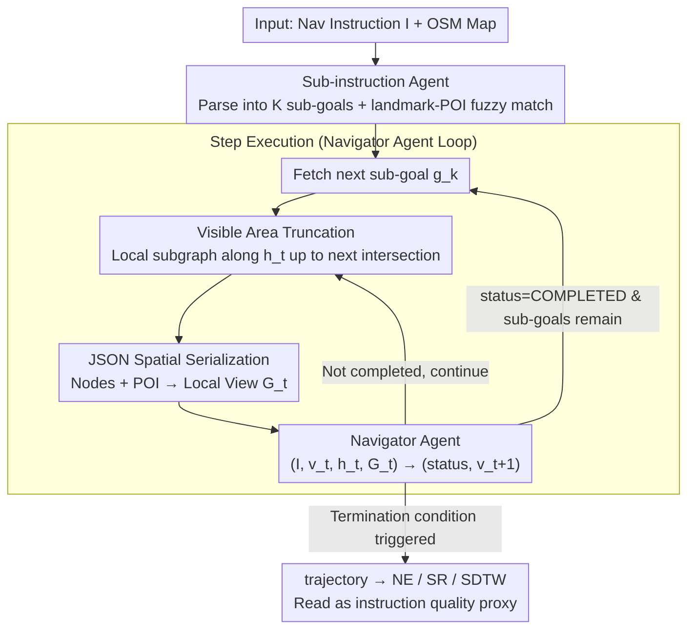

# GROKE: Vision-Free Navigation Instruction Evaluation via Graph Reasoning on OpenStreetMap

**Conference**: ACL 2026  
**arXiv**: [2601.07375](https://arxiv.org/abs/2601.07375)  
**Code**: https://anonymous.4open.science/r/groke (Anonymous)  
**Area**: Robotics / VLN Instruction Evaluation  
**Keywords**: Map2Seq, OpenStreetMap, LLM agent, graph reasoning, agent-as-judge

## TL;DR
GROKE proposes evaluating navigation instructions **without any vision** by serializing OpenStreetMap (OSM) data into JSON and utilizing Gemini-3 Pro as a follower agent to execute instructions on the graph. Navigation metrics (Navigation Error / SR / SDTW) serve as proxies for instruction quality. Compared to heuristic baselines on Map2Seq, it reduces Navigation Error (NE) by 68.5%, and results show that NE is significantly correlated with human judgment of "instruction clarity" ($r = -0.31, p < 0.01$).

## Background & Motivation

**Background**: Evaluating navigation instructions ("is this instruction good?") traditionally relies on machine translation metrics like BLEU, ROUGE, METEOR, or CIDEr. The Vision-and-Language Navigation (VLN) community increasingly favors "agent-as-judge" approaches—training a follower agent to navigate high-fidelity visual simulators like Matterport3D or Touchdown and using the success rate as a proxy for instruction quality.

**Limitations of Prior Work**: (1) **Fatal flaws of n-gram metrics**: "Turn left at the bank" and "Turn right at the bank" yield near-perfect BLEU scores despite having opposite functions. Conversely, "Turn left after seeing the red building" and "Head west past the brick structure" have zero BLEU overlap but describe the same action. (2) **Visual followers conflate language quality with visual perception**: Agent failure could stem from ambiguous instructions or the agent misidentifying a "stucco wall" as a "brick wall." (3) High-fidelity simulators (Google Street View, Matterport3D) involve licensing issues, terabytes of data, and high computational barriers, making evaluation inaccessible to many labs.

**Key Challenge**: The "meaning" of an instruction is defined by its **compliance condition** (the set of physical trajectories that satisfy it), which is independent of visual appearance. However, existing pragmatic evaluations couple visual perception, introducing both NLG noise and CV noise into the metrics.

**Goal**: (1) Develop a vision-free agent capable of following instructions using only symbolic OSM data; (2) Compare various spatial representations (textual, JSON, graphviz, grid) to find the most suitable format for LLM reasoning; (3) Validate the agent's SR/NE as a proxy for navigability against human judgment.

**Key Insight**: The uniqueness of the Map2Seq dataset lies in its instructions being aligned with OSM nodes, edges, and POIs, allowing for the **decoupling of the visual modality**. A purely symbolic follower agent can be constructed to evaluate the "structural/semantic executability" of instructions.

**Core Idea**: Treat an LLM as the follower and feed it a **JSON-serialized local field of view** from OSM. A hierarchical two-agent architecture (Sub-instruction Agent + Navigator Agent) executes the navigation. The agent's trajectory metrics are read back as "instruction quality scores," requiring zero training and zero vision.

## Method

### Overall Architecture

GROKE addresses the problem of evaluating navigation instructions. While traditional n-gram metrics like BLEU might score "turn left" and "turn right" similarly, and visual simulators conflate language ambiguity with visual misidentification, GROKE fixes a vision-free LLM follower (Gemini-3 Pro). This agent navigates using only symbolic OSM information. The resulting Navigation Error (NE), Success Rate (SR), and SDTW are interpreted as the "executability" of the instruction. The system is a training-free, hierarchical two-agent architecture: The Sub-instruction Agent first parses the full instruction $I$ into $K$ atomic sub-goals $\{g_1,\dots,g_K\}$ (e.g., MOVE_FORWARD, TURN_LEFT) and maps landmarks to OSM POIs via fuzzy matching. Then, a step-by-step execution loop begins. In each step, the field of view is truncated to the next intersection, and the local subgraph is serialized into a JSON view $\mathcal{G}_t$. The Navigator Agent takes $(I, v_t, h_t, \mathcal{G}_t)$ and outputs $(\text{status}_k, v_{t+1})$. If a COMPLETED status is returned, the system proceeds to the next sub-goal. Termination occurs when all sub-goals are done, total steps exceed 100, or a single sub-goal fails after 15 retries.

### Key Designs

**1. Sub-instruction Agent: A State Machine for Parsing Long Instructions**

A single instruction often contains over 50 tokens and multiple spatial reasoning steps. Feeding the entire instruction to the navigator can cause the model to lose track. The Sub-instruction Agent acts as a parser: $I \xrightarrow{\text{parse}} \{g_1,\dots,g_K\}$, where each sub-goal is formatted as `("MOVE_FORWARD", "Go straight to the bank", TODO)` with states like TODO, IN_PROGRESS, or COMPLETED. This allows the Navigator to focus on the current $g_k$ rather than the full text, turning "long-range planning" into "short-range execution + state tracking." This relieves the LLM from the dual burden of remembering five instruction steps while reasoning about space. Ablations (Appendix A.2) show that removing this phase and feeding the full instruction directly significantly drops the SR.

**2. Intersection-based Visible Area Truncation: Localizing the Field of View**

During execution, the system must decide the map range to present to the LLM. Including the entire map (thousands of nodes) causes token explosion and hallucinations due to irrelevant distant streets. GROKE uses Algorithm 1 to simulate an intersection-level view: starting from $v_t$ along direction $h_t$, it selects neighbors $v'$ minimizing $\Delta h(h_{\text{curr}}, h_{v'})$ where $\Delta h < 100^\circ$. It increments a counter upon hitting an intersection ($\text{degree}(v) > 2$) until $u$ intersections are passed, plus a 3-node lookahead. POIs are attached to path nodes based on a 50m threshold and Haversine distance. This captures all information needed for the next decision while compressing tokens from the full map to a few dozen nodes, mimicking what a human sees at an intersection.

**3. Vision-free JSON Spatial Serialization: Optimal Data Format for LLM Reasoning**

The choice of serialization format for the local subgraph is critical. GROKE organizes the local OSM subgraph into two parts: **Nodes**, including ID, type (intersection/waypoint), heading $h \in [0,360)$, and connection lists (target ID and bearing). Relative bearings are calculated using the spherical formula $h = \text{atan2}(\sin\Delta\lambda \cos\phi_2, \cos\phi_1\sin\phi_2 - \sin\phi_1\cos\phi_2\cos\Delta\lambda)$. **POIs** include a unique letter ID, parent node reference, relative direction (discrete categories: Forward / Left / Right / Back) using $\delta = (h_{v\to p} - h_{\text{curr}} + 180) \mod 360 - 180$, and Haversine distance. The authors compared four representations: Textual, JSON, Graphviz DOT, and ASCII grid. The results were stark: JSON (SR 63% / NE 58.8m), Textual (61% / 70m), Graphviz (40% / 96m), and Grid (10% / 175m). LLMs often hallucinated paths in the ASCII '0' grids. JSON's hierarchical structure improved the "recoverability" from local deviations (OSR 74% vs Textual 67%) and showed a massive 15-point SR gain on "Hard" tasks, indicating that structure is vital for long-range reasoning.

### Loss & Training
- **Training-free**: Utilizes Gemini-3 Pro with default temperature 1.0 and high reasoning settings; no fine-tuning.
- Average trajectory involves 5.91 steps, 44k total tokens, and 23k thinking tokens. While costly, the authors argue it is a justified price for case-study value.
- Engineered via the Google Agent Development Kit (ADK) with batch APIs.

## Key Experimental Results

### Main Results

Overall performance on two Map2Seq splits (700 instructions/split):

| Method | TestSetA NE↓ | TestSetA SR↑ | TestSetA OSR↑ | TestSetA SDTW↑ | TestSetB NE↓ | TestSetB SR↑ | TestSetB OSR↑ | TestSetB SDTW↑ |
|---|---|---|---|---|---|---|---|---|
| Random Walker | 259.0 | 4.4% | 5.7% | 0.026 | 244.3 | 6.1% | 7.1% | 0.029 |
| Action Sampling (No Text) | 250.1 | 5.1% | 6.0% | 0.037 | 241.6 | 7.4% | 8.1% | 0.039 |
| Heuristic Agent (Regex+Angle) | 180.6 | 18.0% | 18.9% | 0.155 | 173.0 | 17.9% | 19.1% | 0.159 |
| **GROKE (Ours)** | **56.8** | **66.4%** | **78.4%** | **0.634** | **59.8** | **63.3%** | **78.0%** | **0.609** |

Human baseline SR is approximately 0.86 / 0.84 in Street View; GROKE's vision-free approach reaches ~74-77% of human performance.

Human Correlation Analysis (n=100, manual binary labeling of navigability):

| Metric | Pearson $r$ | $p$ | Spearman $\rho$ | $p$ |
|---|---|---|---|---|
| SR | 0.2865 | 0.0039** | 0.2865 | 0.0039** |
| OSR | 0.1860 | 0.0639 | 0.1860 | 0.0639 |
| SDTW | 0.2799 | 0.0048** | 0.2860 | 0.0039** |
| nDTW | 0.2457 | 0.0138* | 0.2895 | 0.0035** |
| **NE** | **-0.3096** | **0.0017**\*\* | **-0.3184** | **0.0012**\*\* |

NE is the metric most strongly correlated with human judgment.

### Ablation Study

Comparison of spatial representations across difficulty levels (n=100 Map2Seq seen val):

| Representation | Easy NE | Easy SR | Medium NE | Medium SR | Hard NE | Hard SR | Overall |
|---|---|---|---|---|---|---|---|
| **JSON** | 62.1 | 61.2% | 61.2 | 68.4% | **112.9** | **53.8%** | Best; large lead on Hard |
| Textual | 71.3 | 61.2% | **56.6** | 68.4% | 110.6 | 38.5% | Good for easy; fails on Hard |
| Graphviz DOT | 90.4 | 40.8% | 87.8 | 47.4% | 146.5 | 15.4% | Parsing overhead is high |
| ASCII Grid | 186.7 | 6.1% | 160.3 | 13.2% | 176.6 | 15.4% | Disaster; LLM treats '0' as valid path |
| Optimized Repr. | **35.6** | **77.6%** | **30.9** | **76.3%** | 93.3 | 53.8% | Upper bound after Prompt Eng. on JSON |

### Key Findings
- **JSON ≫ ASCII Grid is a disruptive result**: Grid representations are popular in LLM vision-reasoning papers, but the SR here was only 10%. This reveals that text-based grid maps are practically unusable for LLM navigation—the abundance of '0' noise leads the model to pick empty cells as valid paths.
- **JSON's advantage scales with difficulty**: JSON and Textual are nearly tied on Easy/Medium tasks, but JSON (53.8% SR) crushes Textual (38.5% SR) on Hard tasks. This suggests hierarchical structures act as more scalable scaffolding for long-range reasoning.
- **NE is the best human-correlated metric**: With $r = -0.31, p < 0.01$, it outperforms OSR (not significant). Evaluation should prioritize NE over SR/OSR.
- **Vision-free performs surprisingly well**: Human SR is 86% vs GROKE at 74%. A 12-point gap is a reasonable trade-off for an approach that requires no Street View, no simulator, and no perception model.
- **Cost is a factor**: Averaging 44k tokens per trajectory using production-level Gemini models is expensive, posing a challenge for large-scale deployment.

## Highlights & Insights
- **Task Inversion**: The transformation of "agent evaluation" into "instruction evaluation"—by fixing the agent, the metrics reflect the instruction quality. This "frame inversion" is a smart research trick to reuse VLN benchmarks for a different problem.
- **Systematic Comparison of Spatial Representations**: Comparing Textual, JSON, Graphviz, and Grid is rare in spatial-LLM literature. The conclusion "hierarchical JSON is most stable" is valuable for any work using LLMs for graph reasoning (planning, power grids, social networks).
- **POI Proximity & Relative Direction Discretization**: Converting continuous angles into Four/Left/Right/Back categories (using $\delta = (h_{v\to p} - h_{\text{curr}} + 180) \mod 360 - 180$) prevents precision loss and is a simple yet effective preprocessing trick.
- **Counter-intuitive Finding**: The JSON-only follower achieves an NE of 56m (vs human ~25m in visual settings), proving that instruction navigability depends more on topology and landmarks than on visual granularities. This has applications for assistive technologies for the visually impaired.

## Limitations & Future Work
- **Inability to evaluate visual-anchor instructions**: Instructions like "turn left at the red door" or "follow the graffiti wall" fail in GROKE, even if humans navigate them easily. This leads to systematic underestimation of such instructions.
- **Model Bias**: Findings are currently tied to Gemini-3 Pro. It is unclear if JSON > Grid holds for GPT-4o, Claude, or LLaMA.
- **Computational Cost**: The high token count makes repeating the evaluation on thousands of instructions expensive.
- **Fuzzy Landmark Grounding**: Reliance on `partial_ratio` for matching landmarks (e.g., "the bank" vs "bank_of_america") might cause false negatives.
- **Future Directions**: (i) Supplementing OSM with cached Street View object tags; (ii) Knowledge distillation into smaller, cheaper models; (iii) Multi-LLM voting; (iv) Treating navigability as a scalar range rather than binary success.

## Related Work & Insights
- **Vs. Visual Followers (LANA, NavGPT)**: These agents coupling vision and language. GROKE provides a "pure language diagnostic" by stripping vision, serving as a complementary evaluation tool.
- **Vs. Traditional Metrics (BLEU/ROUGE)**: GROKE correlates with human judgment at $0.29\text{--}0.32$, whereas BLEU often shows zero correlation for navigation tasks. This supports moving away from n-gram metrics.
- **Vs. MapGPT / "Talk like a Graph"**: GROKE synthesizes graph encoding ablation with an agent-as-judge task and human validation, completing the full research cycle for symbolic navigation.

## Rating
- Novelty: ⭐⭐⭐⭐ "Vision-free agent-as-judge for instruction evaluation" is a clear new proposal.
- Experimental Thoroughness: ⭐⭐⭐⭐ Extensive baseline comparisons, representation ablations, and human correlations.
- Writing Quality: ⭐⭐⭐⭐ Clear motivation and explicit algorithms; the logic of why BLEU fails is well-articulated.
- Value: ⭐⭐⭐⭐ Provides a reproducible, zero-simulator tool for the VLN community and has high potential for assistive technology.

<!-- RELATED:START -->

## Related Papers

- [\[ACL 2026\] GoViG: Goal-Conditioned Visual Navigation Instruction Generation via Multimodal Reasoning](govig_goal-conditioned_visual_navigation_instruction_generation_via_multimodal_r.md)
- [\[CVPR 2026\] Parse, Search, and Confirmation: Training-Free Aerial Vision-and-Dialog Navigation with Chain-of-Thought Reasoning and Structured Spatial Memory](../../CVPR2026/robotics/parse_search_and_confirmation_training-free_aerial_vision-and-dialog_navigation_.md)
- [\[CVPR 2026\] ProFocus: Proactive Perception and Focused Reasoning in Vision-and-Language Navigation](../../CVPR2026/robotics/profocus_proactive_perception_and_focused_reasoning_in_vision-and-language_navig.md)
- [\[CVPR 2026\] Probabilistic Concept Graph Reasoning for Multimodal Misinformation Detection](../../CVPR2026/robotics/probabilistic_concept_graph_reasoning_for_multimodal_misinformation_detection.md)
- [\[CVPR 2026\] AwareVLN: Reasoning with Self-awareness for Vision-Language Navigation](../../CVPR2026/robotics/awarevln_reasoning_with_self-awareness_for_vision-language_navigation.md)

<!-- RELATED:END -->
