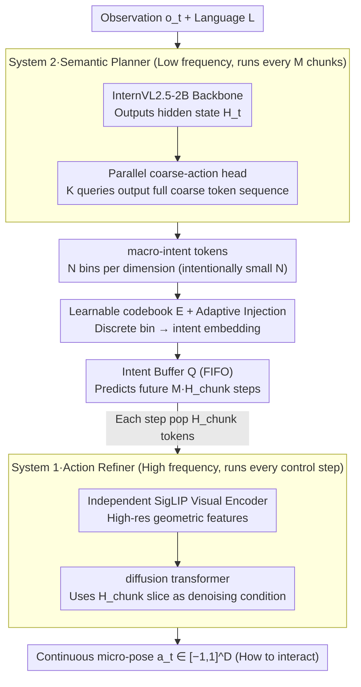

# Libra-VLA: Achieving Learning Equilibrium via Asynchronous Coarse-to-Fine Dual-System

**Conference**: ACL 2026  
**arXiv**: [2604.24921](https://arxiv.org/abs/2604.24921)  
**Code**: <https://libra-vla.github.io/>  
**Area**: VLA / Embodied AI / Dual-System Architecture  
**Keywords**: Vision-Language-Action Models, Hybrid Action Space, Dual-System, Asynchronous Execution, Coarse-to-Fine

## TL;DR
Libra-VLA decomposes robot actions into a hybrid action space of "discrete macro-intent + continuous micro-pose." It utilizes System 2 (VLM + parallel coarse-action head) for low-frequency planning and System 1 (diffusion transformer + independent SigLIP encoder) for high-frequency refinement. Achieving true asynchronous execution via an intent buffer, it reaches a SoTA of 97.2% on LIBERO and 79.5% zero-shot on LIBERO-Plus (10% higher than the previous OpenVLA-OFT+).

## Background & Motivation
**Background**: VLA models (OpenVLA, π0, π0.5, GR00T-N1, etc.) have become the mainstream paradigm for open-world general-purpose robots, directly grounding language instructions into motor commands. Predominant approaches follow two paths: (a) discretizing continuous actions into 256 bins for AR prediction (OpenVLA, π0-FAST); (b) attaching a diffusion head to a VLM backbone for direct continuous action output (π0, GR00T-N1, Diffusion Policy).

**Limitations of Prior Work**: Both approaches are **monolithic** "flat mappings"—a single network simultaneously processes high-level abstract semantic reasoning and low-level high-frequency motor control. This unified architecture ignores the inherent hierarchical structure of robot manipulation (coarse positioning followed by fine alignment), forcing a single model to bridge the massive "semantic-execution" gap and leading to excessive representation burden.

**Existing hierarchical attempts** are also insufficient: HAMSTER/MOKA use keypoints, and ViLA/Hi Robot use sub-instructions, focusing primarily on **temporal dimension** decomposition (shortening planning horizons). However, each step still requires crossing from high-level modalities to continuous motor commands, failing to simplify single-step representation complexity. HybridVLA, despite its name, independently predicts fine-grained actions and performs arithmetic averaging, which is essentially a parallel structure lacking hierarchy.

**Key Challenge**: There is a lack of hierarchy in the **action representation space**. Finer discrete bins reduce quantization error but diverge from the semantic abstraction of VLMs, while continuous outputs demand excessive geometric precision from the VLM. In dual-system architectures, GR00T-N1 uses static latents as bridges which become "outdated," FiS-VLA forces dual tasks on a single backbone causing "feature squeezing," and OpenHelix relies on uninterpretable high-dimensional black-box latents.

**Goal**: (1) Decompose hierarchy in the **action representation space** rather than just the timeline; (2) Balance the learning difficulty of two subsystems through task specialization; (3) Achieve truly asynchronous, interpretable, and low-latency execution.

**Key Insight**: Explicitly split actions into a hybrid space—discrete coarse directions (macro-intent, answering "where to go") + continuous micro-poses (micro-alignment, answering "how to interact"). The former naturally aligns with the discrete token output space of VLMs, while the latter only needs to generate residuals around anchors, significantly compressing the search space.

**Core Idea**: Replace "flat modality translation" with "two-stage simple mapping" + dual-system asynchronous execution + intent buffer for multi-step coarse direction pre-prediction.

## Method

### Overall Architecture

Libra-VLA addresses the issue that most existing VLAs are monolithic flat mappings. Its solution is a hierarchical decomposition in the **action representation space**, explicitly splitting actions into "discrete macro-intent (where to go) + continuous micro-pose (how to interact)." Consequently, the conditional probability of an action is decomposed as $P(\mathbf{a}_t \mid \mathbf{o}_t, L) \approx \underbrace{P(\mathbf{a}_t^f \mid \mathbf{a}_t^c, \mathbf{o}_t)}_{\text{Action Refiner}} \cdot \underbrace{P(\mathbf{a}_t^c \mid \mathbf{o}_t, L)}_{\text{Semantic Planner}}$. Architecturally, this is realized as dual-system asynchronous collaboration: System 2 (Semantic Planner, InternVL2.5-2B backbone + 12-layer parallel coarse-action head, hidden=1024) performs low-frequency planning, outputting $L_{\text{macro}} = M \times H_{\text{chunk}}$ coarse tokens (each $D$ dimensions, $N$ bins per dimension). System 1 (Action Refiner, diffusion transformer + independent SigLIP visual encoder $\mathcal{E}_{\text{vis}}$) high-frequency samples slices from the intent buffer as conditions to denoise continuous actions $\mathbf{a}_t \in [-1,1]^D$. The systems communicate via a FIFO Intent Buffer $\mathcal{Q}$ and a learnable codebook $\mathbf{E} \in \mathbb{R}^{N \times D}$ that converts discrete bins into embeddings.

### Key Designs

**1. Hybrid Action Space + Coarse-Grained Direction Discretization: Intentionally reducing bin counts**

Previous discrete VLAs (OpenVLA, π0-FAST) aimed for $N=256$ to approximate continuous control, resulting in a token space too large for VLMs to learn, alongside cumulative quantization errors. Libra-VLA does the opposite: it quantizes each dimension as $y_{t,i}^{gt} = \mathrm{clip}(\lfloor (a_{t,i}+1)/2 \times N \rfloor, 0, N-1)$ but intentionally chooses a very small $N \ll 256$. This allows tokens to represent "macro-intents," utilizing the VLM's semantic abstraction for discrete outputs while leaving quantization loss compensation to the subsequent continuous refiner. A key empirical finding is the **learning complexity equipartition** principle: performance follows an inverted U-curve relative to granularity $N$. Performance peaks when learning difficulties of both subsystems are balanced.

**2. Parallel Coarse-Action Head + Adaptive Intent Injection: Parallel token output and gap bridging**

For fast inference, the coarse-action head uses $K$ learnable queries to perform self-attention with the VLM output $\mathbf{H}_t$, predicting the entire chunk of coarse tokens in parallel: $\mathbf{Z}_{\text{act}} = \mathrm{SelfAttn}([\mathbf{Q}_{\text{act}}; \mathbf{H}_t])_{0:K}$. However, System 1 faces a dilemma during training: using early, inaccurate System 2 predictions introduces noise that damages refiner training, while standard teacher forcing leaves the refiner unable to handle planner noise during inference. The authors use a dynamic curriculum: when System 2 accuracy is below a threshold $\tau$, GT codebook embeddings are used; once above $\tau$, the system switches to sampling from $P(\mathbf{a}_t^c)$, allowing the refiner to internalize tolerance for planner deviations.

**3. Intent Buffer Powered Asynchronous Execution + Horizon Expansion: Amortizing VLM calls**

Traditional dual-systems (GR00T-N1) use static latents as bridges, which can decouple from the environment over time (lagging). Libra-VLA introduces a predictive intent buffer: System 2 predicts future $L_{\text{macro}} = M \cdot H_{\text{chunk}}$ steps of macro tokens to push into a FIFO buffer $\mathcal{Q}$. System 1 pops $H_{\text{chunk}}$ tokens as conditioning each step, while System 2 remains dormant for the next $M-1$ chunks. This ensures System 1 slices are time-synchronized, avoiding static latent lag. Furthermore, discrete tokens are physically interpretable, aiding debugging and safety auditing, while amortizing the expensive VLM computational cost across $M$ chunks.

### Loss & Training
The system jointly optimizes two losses:

- **Planner loss**: $\mathcal{L}_{\text{plan}} = \mathcal{L}_{\text{CE}}(P(\mathbf{a}_t^c), \mathbf{y}_t^{gt})$ (Standard cross-entropy, $N$-way classification per dimension).
- **Refiner loss**: $\mathcal{L}_{\text{diff}} = \mathbb{E}_{k, \mathbf{x}_0, \epsilon}[\|\epsilon - \epsilon_\theta(\mathbf{x}_k, \mathbf{F}_t^{\text{geo}}, \mathbf{e}_{\text{intent}})\|^2]$ (Standard DDPM noise prediction).
- **Total loss**: $\mathcal{L}_{\text{total}} = \lambda_{\text{diff}} \mathcal{L}_{\text{diff}} + \lambda_{\text{plan}} \mathcal{L}_{\text{plan}}$, with weights calibrated to balance gradient magnitudes.
- **Training**: All experiments were conducted **without large-scale robot pre-training**, fine-tuning directly from InternVL2.5-2B + SigLIP.

## Key Experimental Results

### Main Results: LIBERO Benchmark (4 task suites, 500 total rollouts)

| Method | Action Space | Spatial | Object | Goal | Long | **Avg** |
|------|--------------|---------|--------|------|------|---------|
| OpenVLA | Discrete | 84.7 | 88.4 | 79.2 | 53.7 | 76.5 |
| π0-FAST | Discrete | 96.4 | 96.8 | 88.6 | 60.2 | 85.5 |
| DD-VLA | Discrete | 97.2 | 98.6 | 97.4 | 92.0 | 96.3 |
| Diffusion Policy | Continuous | 78.3 | 92.5 | 68.3 | 50.5 | 72.4 |
| Octo | Continuous | 78.9 | 85.7 | 84.6 | 51.1 | 75.1 |
| GR00T-N1 | Continuous | 94.4 | 97.6 | 93.0 | 90.6 | 93.9 |
| GO-1 | Continuous | 96.2 | 97.8 | 96.0 | 89.2 | 94.8 |
| F1 | Continuous | 98.2 | 97.8 | 95.4 | 91.3 | 95.7 |
| GE-Act | Continuous | 98.2 | 97.6 | 95.8 | 94.4 | 96.5 |
| π0 | Continuous | 96.8 | 98.8 | 95.8 | 85.2 | 94.1 |
| π0.5 | Continuous | 98.8 | 98.2 | 98.0 | 92.4 | 96.9 |
| **Libra-VLA (Ours)** | **Hybrid** | **98.6** | **99.4** | **98.0** | **92.8** | **97.2** |

Ours achieves 97.2 Avg, leading the leaderboard, with particularly high scores in Object (99.4) and Long (92.8).

### LIBERO-Plus Robustness (7 perturbation types)

| Method | Camera | Robot | Lang | Light | BG | Noise | Layout | **Avg** |
|------|--------|-------|------|-------|-----|-------|--------|---------|
| **Zero-Shot Transfer** | | | | | | | | |
| OpenVLA | 0.8 | 3.5 | 23.0 | 8.1 | 34.8 | 15.2 | 28.5 | 15.6 |
| π0-FAST | 65.1 | 21.6 | 61.0 | 73.2 | 73.2 | 74.4 | 68.8 | 61.6 |
| OpenVLA-OFT | 56.4 | 31.9 | 79.5 | 88.7 | 93.3 | 75.8 | 74.2 | 69.6 |
| **Ours (Hybrid)** | **68.9** | **48.8** | **92.7** | **97.9** | **93.4** | **86.3** | **77.5** | **79.5** |

**Key Findings**: In zero-shot settings, Libra-VLA outperforms the runner-up (OpenVLA-OFT) by **+9.9 points** on average, proving that the hybrid space significantly reduces dependence on training distribution.

### Ablation Study

| Configuration | Trend | Description |
|------|------|------|
| Varying bin count $N$ | **Inverted U-Curve** | Validates the "learning complexity equipartition" principle; extreme $N$ values hinder one of the systems. |
| Removing Adaptive Intent Injection | Performance drop | Planner noise during inference collapses the refiner. |
| Removing independent SigLIP | Performance drop | Validates the "feature squeezing" bottleneck in shared backbones. |
| $M=1$ (Synchronous execution) | Similar performance | Significantly **increased inference latency**. |
| Static latent bridge | Long-horizon drop | Validates that the predictive intent buffer resists lagging. |

## Highlights & Insights
- **Hierarchical decomposition in the "action representation space"** is a paradigm shift: unlike previous temporal decompositions, this focuses on the discrete/continuous dichotomy of action spaces.
- **"Learning Complexity Equipartition" Principle**: Elevates hyperparameter $N$ tuning to a design philosophy of balancing difficulty between subsystems.
- **Predictive Intent Buffer for Asynchronous Execution**: Replacing static latents with future macro-intent sequences provides time-synced guidance, making dual-system VLAs practical for real-time robotics.
- **Inter-system Communication via Discrete Tokens**: Offers physical interpretability over black-box latents, facilitating safety audits and debugging.
- **Independent SigLIP for Refiner**: Decouples high-resolution geometric features from semantic features, resolving the "feature squeezing" found in single-backbone designs.

## Limitations & Future Work
- **Optimal $N$ is task-dependent**: The paper does not provide an automated method for selecting $N$.
- **Fixed horizon expansion factor $M$**: Hard-coded as $M=2$; excessive $M$ might lead to outdated macro-intents.
- **Assumed independence of dimensions**: Independent quantization may fail for highly coupled multi-joint coordination.
- **Limited Real-World Scale**: Only validated on LIBERO and small-scale real-robot experiments.
- **Backbone Constraints**: Only InternVL2.5-2B was explored; larger backbones might shift the inverted U-curve.

## Related Work & Insights
- **vs OpenVLA / π0-FAST**: These use $N=256$ to mimic continuity, incurring high VLM learning costs. Libra-VLA uses $N \ll 256$ to let the VLM focus on semantic coarse-grained direction.
- **vs π0 / GR00T-N1 (Continuous)**: These force VLMs to directly output continuous actions. Libra-VLA inserts "macro-intent" as an intermediate representation to anchor the search space for diffusion.
- **vs HAMSTER / Hi Robot (Temporal)**: These decompose steps in time but still use monolithic mappings; Libra-VLA's representation hierarchy is orthogonal and could be combined.
- **vs FiS-VLA**: Avoids "feature squeezing" by utilizing an independent SigLIP encoder.
- **vs HybridVLA**: Moves beyond parallel structures to a strict hierarchical decomposition with conditional dependency.

## Rating
- Novelness: ⭐⭐⭐⭐⭐ Hierarchical action representation + learning complexity equipartition is a major insight.
- Experimental Thoroughness: ⭐⭐⭐⭐ Strong LIBERO results and ablations, but lacks large-scale scaling curves.
- Writing Quality: ⭐⭐⭐⭐⭐ Clear motivations and clean justifications for each design choice.
- Value: ⭐⭐⭐⭐⭐ Provides generalizable design principles for dual-system VLAs with significant zero-shot gains.

<!-- RELATED:START -->

## Related Papers

- [\[ICLR 2026\] Ground Slow, Move Fast: A Dual-System Foundation Model for Generalizable Vision-Language Navigation](../../ICLR2026/robotics/ground_slow_move_fast_a_dual-system_foundation_model_for_generalizable_vision-la.md)
- [\[AAAI 2026\] Affordance-Guided Coarse-to-Fine Exploration for Base Placement in Open-Vocabulary Mobile Manipulation](../../AAAI2026/robotics/affordance-guided_coarse-to-fine_exploration_for_base_placem.md)
- [\[ICML 2026\] Dual Advantage Fields](../../ICML2026/robotics/dual_advantage_fields.md)
- [\[ICLR 2026\] SimpleVLA-RL: Scaling VLA Training via Reinforcement Learning](../../ICLR2026/robotics/simplevla-rl_scaling_vla_training_via_reinforcement_learning.md)
- [\[ICLR 2026\] SpikePingpong: Spike Vision-based Fast-Slow Pingpong Robot System](../../ICLR2026/robotics/spikepingpong_spike_vision-based_fast-slow_pingpong_robot_system.md)

<!-- RELATED:END -->
