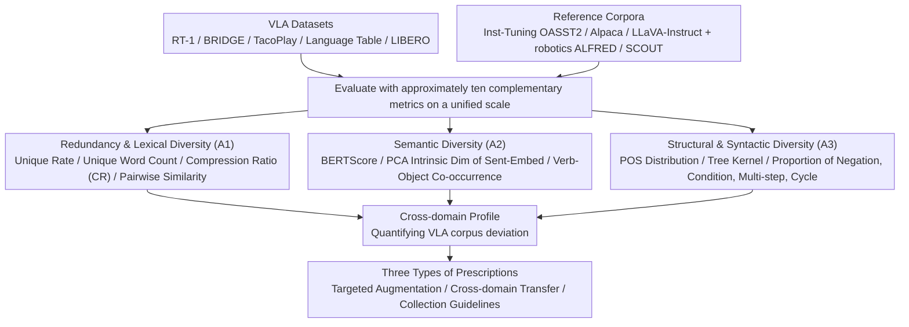

# Limited Linguistic Diversity in Embodied AI Datasets

**Conference**: ACL 2026  
**arXiv**: [2601.03136](https://arxiv.org/abs/2601.03136)  
**Code**: TBD  
**Area**: Embodied AI / Data Analysis / VLA / Linguistic Diversity  
**Keywords**: VLA Dataset Audit, Lexical Diversity, Semantic Diversity, Syntactic Diversity, Open X-Embodiment

## TL;DR
This study conducts a systematic "linguistic diversity checkup" on mainstream VLA training corpora (RT-1, BRIDGE, TacoPlay, Language Table, LIBERO), quantifying them across lexical, semantic, and syntactic dimensions. Findings reveal that **< 2% of instructions are unique, the entire RT-1 corpus contains only 49 unique words, and negation/conditional sentences account for < 1%**. This is significantly inferior to instruction-tuning corpora (OASST2 93%, Alpaca 99.8% unique). This "template-driven poverty" may be the root cause of VLA models' vulnerability to paraphrasing and generalization failures.

## Background & Motivation
**Background**: VLA models such as OpenVLA, RT-X, and $\pi_{0.5}$ are primarily trained on large-scale datasets like Open X-Embodiment (OXE). While OXE documentation emphasizes object, scene, and embodiment diversity, it **scarcely reports on the linguistic properties of the instructions**. Meanwhile, the community has observed that VLA models are sensitive to paraphrasing, vulnerable to distractors, and prone to generalization failures (Gao 2025, AgiBotWorld 2025, Wang 2024).

**Limitations of Prior Work**: Existing VLA research treats instructions as auxiliary labels, and no work has systematically quantified the **linguistic signals** within training data. While models show poor robustness to paraphrasing, it remains unknown: (a) How many instructions seen during training are redundant? (b) How rich is the vocabulary? (c) Is the syntactic structure diverse? (d) How frequently do common real-world constructs like negation or conditionals appear?

**Key Challenge**: The VLA community pursues "Generalist Robots + Natural Language Instructions," yet training data may be at a **toy-level in the linguistic dimension**. Models trained on millions of episodes might only see combinations of a few dozen template words. If training data is linguistically impoverished to this extent, the rich linguistic capabilities acquired by the model from its LLM backbone may be overwritten or suffer catastrophic forgetting.

**Goal**: (1) Establish an **operable multi-dimensional quantification framework** for "instruction linguistic diversity"; (2) Conduct a **systematic audit** of mainstream VLA datasets indexed against non-robotics corpora (instruction-tuning, dialogue); (3) Propose **targeted data augmentation/collection strategies** based on audit results.

**Key Insight**: Drawing from the framework of Tevet & Berant (2021) which divides diversity into form vs. content, this study further bifurcates it into lexical, semantic, and syntactic axes. Each axis uses multiple complementary metrics (to avoid single-metric limitations) and sets reference datasets (OASST2/Alpaca/LLaVA-Instruct/ALFRED/SCOUT) for comparison. This approach does not claim an "ideal metric value" but allows readers to intuitively perceive the deviation of VLA corpora.

**Core Idea**: Use three-dimensional multi-metric auditing and cross-domain reference corpora to transform the subjective sense of "linguistic poverty" into concrete data.

## Method

### Overall Architecture

This paper does not train any models but establishes a quantifiable checkup framework for "instruction linguistic diversity." It applies this framework to conduct "CT scans" on mainstream VLA corpora and a set of cross-domain reference corpora. The audited group consists of VLA datasets (RT-1, BRIDGE, TacoPlay, Language Table, LIBERO), while the reference group includes instruction-tuning/dialogue corpora (OASST2, Alpaca, LLaVA-Instruct) and language-oriented robotics corpora (ALFRED, SCOUT). Each dataset is evaluated along three axes (A1/A2/A3) using approximately ten complementary metrics to create a cross-domain profile, leading to prescriptions for augmentation, cross-domain transfer, and collection guidelines.

### Key Designs

**1. Analysis I: Redundancy and Lexical Diversity (A1)**

VLA datasets often contain millions of instructions, yet redundancy remains unquantified. A1 begins with basic statistics: total sentences #Sent, unique sentences #Uniq and % Uniq, and unique unigram count #Words. It then layers diversity metrics: **Compression Ratio (CR)** using gzip to measure global compressibility (lower is more diverse; Shaib 2025 verified it distinguishes human-written vs. LLM-written text), and pairwise similarities like ROUGE-L and BLEU. CR and pairwise metrics are used together because LLM literature shows data deduplication significantly impacts generalization, and over-parameterized networks can directly memorize training labels; high redundancy forces VLA models to memorize rather than generalize.

**2. Analysis II: Semantic Diversity (A2)**

Lexical variation does not guarantee task diversity. A2 measures "what is being said" rather than "how it is said" via embeddings. It approaches three levels: pairwise **BERTScore** mean of 1000 sampled pairs; dataset-level **PCA** of sentence vectors (USE/SBERT/CLIP/SONAR) to report the number of principal components required to explain 95% variance (intrinsic dimensionality); and a robotics-specific **Verb–Direct Object (VO) co-occurrence matrix** to count how many verbs pair with each object. Embedding metrics are robust to paraphrasing, capturing task richness, while VO co-occurrence serves as an interpretable diagnostic—if "banana" always pairs with "pick," the model learns a verb-object shortcut (simplicity bias).

**3. Analysis III: Structural and Syntactic Diversity (A3)**

Real-world commands often contain negation, conditionals, or cycles. A3 quantifies these layers. For surface syntax, it tracks POS pattern distributions and calculates pairwise similarity of constituency trees using **Constituency Tree Kernel (Moschitti 2006)**. For higher-order constructs, it uses dependency parsing and keyword patterns to automatically identify the proportion of **negation, conditional, multi-step, and cycle** structures. This is critical because syntactic poverty amplifies model bias, and structures like "don't take the rotten apple" or "repeat until finished" are essential for real-world deployment but are nearly absent in current VLA training.

### Loss & Training

Ours is a pure dataset audit/empirical study and does not train any models. POS and dependency parsing utilize spaCy, sentence embeddings use public USE/SBERT/CLIP/SONAR models, and all diversity metrics are averaged over 3 iterations of 1000 samples with standard deviations reported.

## Key Experimental Results

### Main Results: Multi-dimensional Cross-dataset Comparison (Table 2)

| Dataset | # Sent | # Uniq (% Uniq) | # Words | CR ↓ | ROUGE-L ↓ | BERTScore ↓ | USE PCA ↑ | Tree Kernel ↓ |
| :--- | :--- | :--- | :--- | :--- | :--- | :--- | :--- | :--- |
| **Inst-Tuning** | | | | | | | | |
| OASST2 | 42K+ | 39,301 (**93.33%**) | 35,445 | 2.75 | 0.05 | 0.45 | 254 | 2.25% |
| Alpaca | 53K+ | 52,996 (**99.81%**) | 18,141 | 3.20 | 0.10 | 0.57 | 231 | 3.66% |
| LLaVA-Instruct | 366K+ | 261,892 (71.45%) | 15,477 | 4.41 | 0.21 | 0.61 | 184 | 7.46% |
| **Lang-robotics** | | | | | | | | |
| ALFRED | 162K+ | 126,005 (79.9%) | 2,627 | 5.91 | 0.21 | 0.64 | 159 | 5.71% |
| SCOUT | 23K+ | 8,795 (39.4%) | 1,631 | 4.85 | 0.07 | 0.49 | 148 | 1.89% |
| **VLA Datasets** | | | | | | | | |
| RT-1 | 3.7M+ | **577 (0.02%)** | **49** | **118.20** | 0.19 | 0.64 | **33** | 5.09% |
| BRIDGE | 864K+ | 11,693 (**1.4%**) | 1,189 | 64.90 | 0.15 | 0.60 | 125 | 3.68% |
| TacoPlay | 214K | 403 (**0.2%**) | 74 | 158.86 | 0.30 | 0.68 | **42** | 8.86% |
| Language Table | 7.0M+ | 127,370 (1.81%) | 928 | 56.64 | 0.29 | 0.70 | 86 | 9.19% |
| LIBERO | 6.5K | 112 (**1.72%**) | 79 | 134.86 | 0.38 | 0.71 | **34** | 12.22% |

**Impactful Figures**:
- RT-1 contains **3.7M sentences but only 577 unique ones (0.02% uniqueness)**, utilizing only **49 unique words** across the entire corpus.
- VLA datasets have CR (Compression Ratio) 56-158, far higher than the 2.75-4.41 of instruction-tuning corpora—indicating extreme redundancy.
- USE PCA intrinsic dimensionality shows VLA datasets (33-125) are far less diverse than non-VLA corpora (148-254).

### Key Findings: Proportion of High-order Structural Constructs

| Construct Type | Avg. VLA Proportion | Avg. Non-VLA Proportion | Real-world Requirement |
| :--- | :--- | :--- | :--- |
| Negation | < 1% | Higher in ALFRED/SCOUT but still low | "Don't take the rotten apple" — Safety critical |
| Conditional | < 1% | < 2% | "If... then..." — Exception handling |
| Multi-step | Medium to High | Medium | Sequential logic, **best unique coverage** |
| Cycle | Nearly 0 | Only minor signals in SCOUT/ALFRED | "Repeat until..." — Long-horizon tasks |

### Key Findings
- **#Episode $\neq$ Linguistic Diversity**: RT-1 has 3.7 million commands but only 577 unique sentences. "Viewing 3.7M instances of the same 577 sentences" is a shocking data inefficiency for LLM backbones.
- **VLA Vocabulary is Extremely Concentrated**: Only **4 words appear across all VLA datasets**: `move, close, open, pick`. This effectively constitutes the VLA model's "action verb vocabulary."
- **Extreme Verb-Object Co-occurrence Bias**: In RT-1, "banana" almost exclusively pairs with "pick," and "knock" almost exclusively pairs with can-shaped objects. Models easily learn the shortcut "see banana $\rightarrow$ pick," ignoring the linguistic instruction.
- **Structural Poverty Outweighs Lexical Poverty**: Negation/conditional/cycle constructs < 1% means VLA models never see "don't do X" or "if Y then Z," effectively amputating these capabilities for deployment.
- **SCOUT (Wizard-of-Oz Dialogue) Outperforms all OXE Datasets**: With a 39.4% uniqueness rate and 1631 words, it proves **interactive collection** yields more diverse language than scripted/teleoperated methods.

## Highlights & Insights
- **Quantifying the Intangible**: Previous community complaints about VLA linguistic poverty were anecdotal; this paper provides hard data, such as RT-1's 49 unique words.
- **Cross-domain Comparison Methodology**: Placing VLA data on the same scale as OASST2/Alpaca makes the gap visceral (CR=158 vs. CR=2.75).
- **VO Co-occurrence as a Diagnostic Tool**: This heat-map approach can be directly applied to any instruction-conditioned imitation learning dataset to identify spurious correlations.
- **Actionable Prescriptions**: The authors transform diagnosis into treatment by suggesting targeted augmentation (syntax-guided paraphrasing), cross-domain transfer (mixing in procedural text), and annotation guidance.

## Limitations & Future Work
- **Omission of Cross-modal Alignment**: The audit focuses on text alone, without checking the consistency of instruction-image-trajectory pairings.
- **Lack of Direct Causal Proof**: The link between "VLA vulnerability" and "linguistic poverty" is a correlation; direct experiments retraining VLA models on enriched language data are needed.
- **Metric Limitations**: Metrics like BERTScore are insensitive to word order; while mitigated by multi-metric complementation, no single metric is infallible.
- **Scope of OXE Subsets**: Only 4 subsets were audited; while representative, they are not exhaustive.
- **Linguistic Scope**: Analysis is restricted to English-language datasets.

## Related Work & Insights
- **Vs. Xing et al. 2025 (VLA Shortcuts)**: While Xing focuses on visual shortcuts (perspective, background), this paper provides the missing, comprehensive linguistic audit.
- **Vs. OXE (Collaboration 2024)**: The OXE documentation emphasizes physical diversity; this paper serves as the "linguistic section" missing from the original report.
- **Vs. Shaib et al. 2025 (CR for Text Detection)**: Adapts the Compression Ratio as a dataset-level diversity proxy, confirming that VLA datasets exhibit unnaturally high CR (118-158).
- **Vs. Bender Rule (2019/2021)**: Aligns with the movement for data transparency, advocating that "language" be a mandatory item in robotics datasheets.

## Rating
- Novelty: ⭐⭐⭐⭐ (First systematic linguistic audit for VLA; community-defining)
- Experimental Thoroughness: ⭐⭐⭐⭐ (10+ datasets, 3 dimensions, exhaustive metrics, and human validation)
- Writing Quality: ⭐⭐⭐⭐⭐ (Clean logic chain, intuitive tables, and clear classification)
- Value: ⭐⭐⭐⭐⭐ (May fundamentally change the data collection SOP for next-generation VLA models)

<!-- RELATED:START -->

## Related Papers

- [\[CVPR 2026\] CLiViS: Unleashing Cognitive Map through Linguistic-Visual Synergy for Embodied Visual Reasoning](../../CVPR2026/robotics/clivis_unleashing_cognitive_map_through_linguistic-visual_synergy_for_embodied_v.md)
- [\[ICLR 2026\] D2E: Scaling Vision-Action Pretraining on Desktop Data for Transfer to Embodied AI](../../ICLR2026/robotics/d2e_scaling_vision-action_pretraining_on_desktop_data_for_transfer_to_embodied_a.md)
- [\[ICLR 2026\] Grounding Generative Planners in Verifiable Logic: A Hybrid Architecture for Trustworthy Embodied AI](../../ICLR2026/robotics/grounding_generative_planners_in_verifiable_logic_a_hybrid_architecture_for_trus.md)
- [\[ICLR 2026\] Cross-Embodiment Offline Reinforcement Learning for Heterogeneous Robot Datasets](../../ICLR2026/robotics/cross-embodiment_offline_reinforcement_learning_for_heterogeneous_robot_datasets.md)
- [\[ICLR 2026\] Rethinking Policy Diversity in Ensemble Policy Gradient in Large-Scale Reinforcement Learning](../../ICLR2026/robotics/rethinking_policy_diversity_in_ensemble_policy_gradient_in_large-scale_reinforce.md)

<!-- RELATED:END -->
