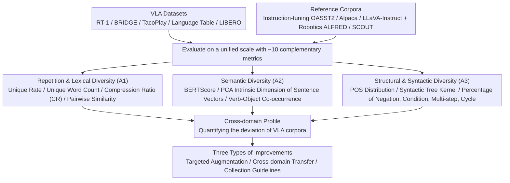

# Limited Linguistic Diversity in Embodied AI Datasets

**Conference**: ACL 2026  
**arXiv**: [2601.03136](https://arxiv.org/abs/2601.03136)  
**Code**: To be confirmed  
**Area**: Embodied AI / Data Analysis / VLA / Linguistic Diversity  
**Keywords**: VLA Dataset Audit, Lexical Diversity, Semantic Diversity, Syntactic Diversity, Open X-Embodiment

## TL;DR
This paper performs a systematic "linguistic diversity audit" on mainstream VLA training corpora (RT-1, BRIDGE, TacoPlay, Language Table, LIBERO). By quantifying lexical, semantic, and syntactic dimensions, it reveals that VLA data contains **< 2% unique instructions, RT-1 has only 49 unique words in the entire corpus, and negation/conditional sentences account for < 1%**. This "template-based poverty" compared to instruction-tuning corpora (OASST2 93%, Alpaca 99.8% unique) may be the root cause of VLA models' vulnerability to paraphrasing and generalization failures.

## Background & Motivation
**Background**: VLA models like OpenVLA, RT-X, and π0.5 are primarily trained on large-scale data such as Open X-Embodiment (OXE). While OXE documentation emphasizes object, scene, and embodiment diversity, it **scarcely reports on the characteristics of the instruction language itself**. Meanwhile, the community has observed that VLA models are sensitive to paraphrasing, vulnerable to distractors, and prone to generalization failures (Gao 2025, AgiBotWorld 2025, Wang 2024).

**Limitations of Prior Work**: Existing VLA research treats instructions as auxiliary labels. No study has systematically quantified what the **linguistic signals** in training data actually look like. While models show poor robustness to paraphrasing, major questions remain unanswered: (a) How many instructions are redundant during training? (b) How rich is the vocabulary? (c) Is the syntactic structure diverse? (d) How frequently do common real-world structures like negations or conditionals appear?

**Key Challenge**: The VLA community pursues "general-purpose robots + natural language instructions," but training data may be **toy-level in the linguistic dimension**. Models trained on millions of episodes might only see combinations of a few dozen template words. If training data is this linguistically impoverished, the rich linguistic capabilities acquired by models via their LLM backbones may be overwritten or suffer catastrophic forgetting.

**Goal**: (1) Establish an **actionable multi-dimensional quantification framework** for "instruction linguistic diversity"; (2) Conduct a **systematic audit** of mainstream VLA datasets and compare them with non-robotic corpora (instruction tuning, dialogue); (3) Propose **targeted data augmentation/collection strategies** based on audit results.

**Key Insight**: Borrowing from the Tevet & Berant 2021 framework that distinguishes form vs. content, this work further subdivides diversity into lexical, semantic, and syntactic axes. Each axis uses multiple complementary metrics to avoid single-metric limitations. Reference datasets (OASST2/Alpaca/LLaVA-Instruct/ALFRED/SCOUT) are used for comparison—not to claim an "ideal metric value," but to allow readers to intuitively perceive the deviation of VLA corpora.

**Core Idea**: Use a three-dimensional multi-metric audit combined with cross-domain reference corpora to transform the "feeling of linguistic poverty" into concrete numbers.

## Method

### Overall Architecture

This paper does not train any models but establishes a quantifiable diagnostic framework for "linguistic diversity of instructions." It applies this framework to conduct a "CT scan" of mainstream VLA corpora and a set of cross-domain reference corpora. The subjects include VLA datasets (RT-1, BRIDGE, TacoPlay, Language Table, LIBERO), while the reference side includes instruction tuning and dialogue corpora (OASST2, Alpaca, LLaVA-Instruct) and language-oriented robotics corpora (ALFRED, SCOUT). Each dataset is evaluated along lexical, semantic, and syntactic axes (A1/A2/A3) using approximately ten complementary metrics to create a cross-domain profile, leading to prescriptions for augmentation, cross-domain transfer, and collection guidelines.

### Key Designs

**1. Analysis I: Repetition and Lexical Diversity (A1)**

VLA datasets often contain millions of instructions, yet few have quantified how many are truly distinct. A1 starts with basic statistics: total sentences #Sent, unique sentences #Uniq and % Uniq, and unique unigram count #Words. It then layers diversity metrics: **Compression Ratio (CR)** using gzip to measure the global compressibility of the corpus (lower means more diverse; Shaib 2025 verified this distinguishes human vs. LLM text), and pairwise similarities like ROUGE-L, BLEU, Jaccard, and Levenshtein. CR and pairwise metrics are used together because LLM literature shows data deduplication significantly impacts generalization (Kandpal 2022, Lee 2022), and over-parameterized networks can directly memorize training labels (Zhang 2017). High repetition causes VLA models to memorize instructions rather than generalize; CR captures global compressibility, covering blind spots of pairwise metrics like ROUGE.

**2. Analysis II: Semantic Diversity (A2)**

Lexical variation does not necessarily imply task variety. A2 measures "what is being said" rather than "how it is said" using embeddings. It operates at three levels: pairwise **BERTScore** mean for 1,000 sampled instruction pairs; **PCA** on sentence vectors from four encoders (USE/SBERT/CLIP/SONAR) to report the number of components required to explain 95% variance (intrinsic dimensionality); and a robotics-specific **Verb–Direct Object co-occurrence matrix**. The latter counts how many verbs are paired with each object (or direction/manner adverbs for navigation). Embedding metrics are robust to paraphrasing, capturing task richness, while VO co-occurrence serves as an interpretable diagnostic—if "banana" is always paired with "pick," the model learns a verb-object shortcut, reflecting the simplicity bias noted by Shah 2020.

**3. Analysis III: Structural and Syntactic Diversity (A3)**

Real-world robot commands often involve negations, conditions, and loops. A3 specifically quantifies this layer. For surface syntax, it analyzes the frequency distribution of POS patterns and uses a **Constituency Tree Kernel (Moschitti 2006)** for pairwise tree similarity. For high-level constructs, it uses dependency parsing + keyword patterns + POS heuristics to automatically identify the proportions of **negation, conditional, multi-step, and cycle** constructs. Datasets with fewer than 600 unique sentences are manually annotated, while larger ones use an automated pipeline, with 500 samples per dataset manually reviewed to estimate annotation uncertainty. Syntactic poverty can amplify model bias (Aggarwal 2022), and structures like "don't take the rotten apple" or "repeat until finished" are critical for real-world deployment but virtually absent in current VLA training.

### Loss & Training

This study is a pure dataset audit/empirical research and does not train models. POS and dependency parsing are performed via spaCy. Sentence vectors use public USE/SBERT/CLIP/SONAR models. All diversity metrics are calculated as mean ± standard deviation across 3 repetitions of 1,000 sampled points.

## Key Experimental Results

### Main Results: Multi-dimensional Comparison Across Datasets (Core metrics from Table 2)

| Dataset | # Sent | # Uniq (% Uniq) | # Words | CR ↓ | ROUGE-L ↓ | BERTScore ↓ | USE PCA ↑ | Tree Kernel ↓ |
|--------|--------|------------------|---------|------|-----------|--------------|------------|----------------|
| **Instruction Tuning** | | | | | | | | |
| OASST2 | 42K+ | 39,301 (**93.33%**) | 35,445 | 2.75 | 0.05 | 0.45 | 254 | 2.25% |
| Alpaca | 53K+ | 52,996 (**99.81%**) | 18,141 | 3.20 | 0.10 | 0.57 | 231 | 3.66% |
| LLaVA-Instruct | 366K+ | 261,892 (71.45%) | 15,477 | 4.41 | 0.21 | 0.61 | 184 | 7.46% |
| **Robotics (Lang-oriented)** | | | | | | | | |
| ALFRED | 162K+ | 126,005 (79.9%) | 2,627 | 5.91 | 0.21 | 0.64 | 159 | 5.71% |
| SCOUT | 23K+ | 8,795 (39.4%) | 1,631 | 4.85 | 0.07 | 0.49 | 148 | 1.89% |
| **VLA Datasets** | | | | | | | | |
| RT-1 | 3.7M+ | **577 (0.02%)** | **49** | **118.20** | 0.19 | 0.64 | **33** | 5.09% |
| BRIDGE | 864K+ | 11,693 (**1.4%**) | 1,189 | 64.90 | 0.15 | 0.60 | 125 | 3.68% |
| TacoPlay | 214K | 403 (**0.2%**) | 74 | 158.86 | 0.30 | 0.68 | **42** | 8.86% |
| Language Table | 7.0M+ | 127,370 (1.81%) | 928 | 56.64 | 0.29 | 0.70 | 86 | 9.19% |
| LIBERO | 6.5K | 112 (**1.72%**) | 79 | 134.86 | 0.38 | 0.71 | **34** | 12.22% |

**Striking Figures**:
- RT-1 contains **3.7M sentences but only 577 unique ones (0.02% uniqueness rate)**, using only **49 unique words** (e.g., "bottle," "apple," "pick," "move," "coke") across the entire corpus.
- VLA datasets have CR (Compression Ratio) between 56-158, far higher than instruction-tuning corpora (2.75-4.41)—indicating extreme redundancy.
- USE PCA intrinsic dimensions show VLA datasets (33-125) are significantly less diverse than non-VLA corpora (148-254).

### Key Findings: Proportion of High-level Constructs (Table from Figure 5)

| Construct Type | Avg. VLA Proportion | Avg. Non-VLA Proportion | Real-world Requirement |
|-----------|----------------|-----------------|----------------|
| Negation | < 1% | Slightly higher in ALFRED/SCOUT | "Don't take the rotten apple" — Safety critical |
| Conditional | < 1% | < 2% | "If... then..." — Exception handling |
| Multi-step | Med to High (LIBERO highest) | Medium | Sequential logic, **best unique coverage** |
| Cycle | Nearly 0 | Minimal in SCOUT/ALFRED | "Repeat until..." — Long-horizon tasks |

### POS Pattern Concentration (Figure 4)

| Dataset | Most Frequent POS Pattern % | Example |
|--------|--------------------------|------|
| TacoPlay | **24%** | VERB→DET→ADJ→NOUN→ADP→DET→NOUN ("put the purple block on the table") |
| RT-1 | 11% | VERB→NOUN→NOUN→ADP→ADJ→NOUN ("place water bottle into white bowl") |
| BRIDGE | 3% | More diverse than RT-1/TacoPlay |
| Language Table | 4% | Comparable to BRIDGE |

### Key Findings
- **#Episode ≠ Linguistic Diversity**: RT-1 has 3.7 million commands but only 577 unique sentences. "Seeing the same 577 sentences 3.7M times" is a striking example of data inefficiency for those familiar with LLM training.
- **VLA Vocab is Extremely Concentrated**: Across all VLA datasets, **only 4 words appear simultaneously**: `move, close, open, pick`—effectively defining the VLA "action verb vocabulary."
- **Verb-Object Co-occurrence is Heavily Biased**: In RT-1, "banana" is almost exclusively paired with "pick," and "knock" almost exclusively with can-shaped objects. Models can easily learn the shortcut "see banana → pick," effectively **ignoring linguistic instructions** (a live example of simplicity bias).
- **Structural Poverty is Worse Than Lexical Poverty**: Negation/conditional/cycle constructs < 1% mean VLA models never learn "don't do X" or "if Y then Z," which are safety essentials for real-world deployment.
- **SCOUT (Wizard-of-Oz Dialogue) Significantly Outperforms OXE**: Unique rate of 39.4% and 1,631 unique words, with higher negation/cycle rates, proving **interactive collection** yields more diverse language than scripted/teleoperated methods.
- **LLM-generated Instructions (Alpaca) are More Unique Than Human (OASST2)**: LLM uniqueness is 99.8% vs. 93.3%. While LLMs excel at "reparaphrasing," LLaVA-Instruct dropped to 71.45% due to VQA templating—highlighting the importance of generation strategy.

## Highlights & Insights
- **Quantifying "VLA Linguistic Poverty"**: This work converts community complaints into hard data, such as RT-1's 49 unique words and 0.02% uniqueness rate. It fills a void for "datasheets for datasets" in the VLA field.
- **Cross-domain Comparison Methodology**: Placing VLA data on the same scale as OASST2/Alpaca/LLaVA-Instruct makes the gap intuitive (e.g., CR=158 vs CR=2.75).
- **VO Co-occurrence Heatmaps as Diagnostic Tools**: This simple tool identifies spurious correlations (shortcuts) in any language-conditioned imitation learning dataset.
- **Rigorous Multi-metric Approach**: By combining BERTScore, ROUGE-L, CR, and manual validation, the paper avoids single-metric biases, bringing necessary methodology rigor to dataset auditing.
- **Actionable Improvement Strategies**: Suggested prescriptions include (i) targeted augmentation via POS-guided LLM paraphrasing, (ii) cross-domain transfer with procedural texts, and (iii) annotation guidance for real-time rephrasing during collection.
- **Implicitly Supporting the "Bender-Rule"**: Echoes the call for data transparency (Bender 2019, 2021) by making "language" a mandatory reporting item for robotics data cards.

## Limitations & Future Work
- **Lack of Grounding Analysis**: The audit focuses on text without evaluating instruction-image-trajectory alignment. High linguistic diversity with poor grounding would still be detrimental.
- **No Direct Causal Proof**: The link between "VLA model fragility" and "linguistic poverty" is correlational. Re-training VLA models on enriched data to test robustness is a critical follow-up.
- **Metric Limitations**: BERTScore is insensitive to word order/antonyms; Tree Kernels can be unstable for long sentences. These are mitigated by multi-metric complementarity but remain limitations.
- **subset of OXE**: Only 4 subsets were analyzed. While representative, the audit is not exhaustive of all 40+ OXE datasets.
- **Data Acquisition Costs**: Acknowledges that the cost of physical collection with new objects/scenes limits semantic diversity. Suggests shifting investment Toward "new props + new environments."
- **Language Scope**: Analysis is limited to English; the diversity of multilingual VLA data remains unexplored.
- **Future Directions**: (1) Integrate this framework into mandatory dataset cards; (2) Conduct controlled experiments comparing templates vs. augmented paraphrases vs. dialogue; (3) Extend to multilingual VLA data; (4) Design a negation/conditional-based benchmark for VLA comprehension.

## Related Work & Insights
- **vs. Xing et al. 2025 (VLA Shortcut Analysis)**: While prior work focused on visual shortcuts, this paper provides a comprehensive, language-specific audit.
- **vs. OXE Original Paper (Collaboration 2024)**: This work serves as the "missing linguistic section" for OXE, which originally only emphasized embodiment diversity.
- **vs. Tevet & Berant 2021 (NLG Diversity Framework)**: Successfully migrates the form vs. content dichotomy to the robotics domain, adding VO co-occurrence analysis.
- **vs. Shaib et al. 2025 (CR for LLM Text Detection)**: Validates that Compression Ratio is a powerful proxy for diversity in robotics, highlighting the abnormally high CR (118-158) of VLA datasets.
- **vs. Bender 2019/2021 (Dataset Documentation)**: Implements the spirit of data transparency in Embodied AI—understanding model behavior requires documenting data characteristics.
- **vs. Driess et al. 2025 / Grover et al. 2025 (VLA Cap Degradation)**: While they observe that adding action experts hurts VLM capabilities, this paper suggests a potential cause: the training language itself is too impoverished to sustain VLM linguistic skills.
- **vs. Guo et al. 2024 (LLM-generated Diversity)**: Extends the argument that training diversity impacts downstream capabilities from pure LLM's to VLA scenarios.

## Rating
- Novelty: ⭐⭐⭐⭐ First systematic linguistic audit for VLA; community-defining despite borrowed metrics.
- Experimental Thoroughness: ⭐⭐⭐⭐ 10+ datasets, 3 dimensions, 10+ metrics, plus manual validation.
- Writing Quality: ⭐⭐⭐⭐⭐ Clean chain of logic from motivation to framework to actionable advice.
- Value: ⭐⭐⭐⭐⭐ Alerts VLA developers to a major blind spot; likely to change data collection SOPs.

<!-- RELATED:START -->

## Related Papers

- [\[ICLR 2026\] Image Quality Assessment for Embodied AI](../../ICLR2026/robotics/image_quality_assessment_for_embodied_ai.md)
- [\[ICLR 2026\] D2E: Scaling Vision-Action Pretraining on Desktop Data for Transfer to Embodied AI](../../ICLR2026/robotics/d2e_scaling_vision-action_pretraining_on_desktop_data_for_transfer_to_embodied_a.md)
- [\[ICLR 2026\] Grounding Generative Planners in Verifiable Logic: A Hybrid Architecture for Trustworthy Embodied AI](../../ICLR2026/robotics/grounding_generative_planners_in_verifiable_logic_a_hybrid_architecture_for_trus.md)
- [\[ICLR 2026\] Cross-Embodiment Offline Reinforcement Learning for Heterogeneous Robot Datasets](../../ICLR2026/robotics/cross-embodiment_offline_reinforcement_learning_for_heterogeneous_robot_datasets.md)
- [\[ICLR 2026\] Rethinking Policy Diversity in Ensemble Policy Gradient in Large-Scale Reinforcement Learning](../../ICLR2026/robotics/rethinking_policy_diversity_in_ensemble_policy_gradient_in_large-scale_reinforce.md)

<!-- RELATED:END -->
