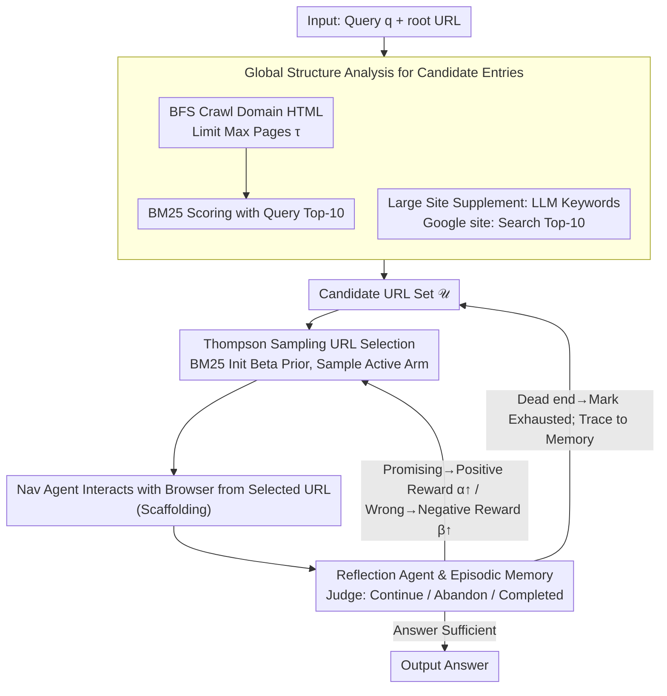

# Mango: Multi-Agent Web Navigation via Global-View Optimization

**Conference**: ACL2026  
**arXiv**: [2604.18779](https://arxiv.org/abs/2604.18779)  
**Code**: https://github.com/VichyTong/Mango  
**Area**: Web Agent / LLM Agent / Web Navigation  
**Keywords**: Web Navigation, Global Structure Analysis, Multi-Armed Bandit, Thompson Sampling, Episodic Memory

## TL;DR
Mango constructs a global approximate structure of a website before navigation and employs Thompson Sampling to dynamically allocate a limited navigation budget among candidate URLs. This prevents LLM web agents from blindly exploring from the homepage and significantly outperforms baselines such as AgentOccam and WebWalker on WebVoyager and WebWalkerQA.

## Background & Motivation
**Background**: LLM web agents typically start from a website's root URL and step-by-step search for answers through actions like clicking, inputting, and reading pages. Existing work mainly focuses on improving browser perception, action space alignment, step-by-step planning, or agentic search to enable better next-step decisions under local observations of the current page.

**Limitations of Prior Work**: Real-world websites often possess deep hierarchical structures and a vast number of pages. If all tasks start from the homepage, the agent must traverse many irrelevant pages top-down, making it easy to fall into navigation traps, explore incorrect branches, or fail to reach the target page within a strict action budget. While search strategies like MCTS can explore trajectory trees, the simulation overhead is prohibitive in web scenarios with large branching factors and long horizons.

**Key Challenge**: The bottleneck of web navigation is not just "where to click next," but also "where to start exploring." An agent with local observations may make decent action choices but still waste most of its budget due to a poor initial entry point; however, exhaustively crawling the entire site is impractical.

**Goal**: The authors aim to construct a lightweight global view before navigation to select entry URLs relevant to the user query, and then adaptively decide which entry to visit first, whether to continue exploration, or whether to abandon a path under a limited budget.

**Key Insight**: Mango treats candidate URLs as arms of a multi-armed bandit and the reflection results after a navigation attempt as reward signals. Compared to MCTS, which expands an entire interaction tree, the bandit approach only needs to quickly balance exploration and exploitation among candidate entries, making it more suitable for strict budgets.

**Core Idea**: A set of candidate URLs is first formed using lightweight BFS crawling, BM25, and site-specific Google searches. Then, Thompson Sampling, initialized with a BM25 relevance prior, is used to select URLs. After each navigation, a reflection agent judges whether the path is promising, updating the Beta posterior and episodic memory.

## Method

### Overall Architecture
The inputs to Mango are a user query $q$ and a root URL $u_r$. The system first performs **Global Structure Analysis**: it crawls reachable webpages within the same domain, filters non-HTML and external links, and uses BM25 to identify candidate URLs relevant to the query. For large websites difficult to cover via crawling, it prompts an LLM to generate search keywords and supplements candidates via Google `site:` searches. Next, it enters **URL Prioritization and Selection**: the candidate URL set $\mathcal{U}$ is modeled as a multi-armed bandit with a finite lifetime, using Thompson Sampling to select the next navigation entry from active arms. The navigation agent interacts with the browser environment starting from the selected URL. After an attempt, a reflection agent determines if the answer is sufficient or if the path is worth continuing, updating the posterior and writing to episodic memory.

In experiments, Mango uses a Playwright-based environment aligned with AgentOccam for WebVoyager, and a Crawl4AI environment aligned with WebWalker for WebWalkerQA, ensuring fair browser execution settings. The navigation budget $b$ for each URL and the number of Thompson Sampling iterations are both set to 10.

### Key Designs

**1. Global Structure Analysis for Candidate Entries: Filtering potential answer-containing entries from the site structure before navigation**

Homepages are often poor entry points, but crawling the entire site is infeasible. Thus, Mango builds a lightweight global approximate map. It performs a BFS crawl starting from the root URL, retaining only same-domain HTML pages up to a maximum page limit $\tau$. It then uses BM25 to score crawled pages against the user query, selecting the top-10 for the candidate set. For massive sites like arXiv with millions of pages, it prompts the LLM to generate keywords based on the query and supplements the top-10 results from Google `site:` searches. This transforms navigation from "blind search from the root" into "probing several relevant subtree entries," leveraging BM25 for internal reachability and Google for indexed pages.

**2. Thompson Sampling-based URL Selection: Dynamically deciding the most valuable entry to visit under a limited budget**

In what order should candidate entries be tested? Global relevance from BM25 is not fully reliable, and navigation feedback is limited. Mango models the candidate URL set $\mathcal{U}$ as a multi-armed bandit with a finite lifetime to compromise between the two. Each URL is an arm with states of Active/Exhausted, maintaining Beta distribution parameters $(\alpha_u, \beta_u)$. Initial values are derived from normalized BM25 scores $\rho_u=(\lambda_u-\min \lambda)/(\max \lambda-\min \lambda+\epsilon)$, where $\alpha_u^{(0)}=1+\kappa\rho_u$ and $\beta_u^{(0)}=1+\kappa(1-\rho_u)$. At each step, $\theta_u$ is sampled from the Beta posterior of active arms, and the URL with the maximum value is selected for navigation. If reflection yields a positive reward, $\alpha$ increases; otherwise, $\beta$ increases. Paths judged as dead ends are marked Exhausted. Compared to fixed sorting or MCTS simulating the entire tree, Thompson Sampling quickly balances exploration and exploitation among candidate entries within strict budgets.

**3. Reflection Agent & Episodic Memory: Determining if navigation is complete or worth continuing to avoid redundant failures**

Web navigation often requires multiple probes; using binary success/failure ignores the difference between "nearly complete" and "completely wrong." If the navigation agent claims completion, the reflection agent verifies if the final answer and action trajectory satisfy the query. If the answer is insufficient but the path is promising, a positive reward is given to make the URL more likely to be explored again; if the budget is exhausted, it judges if the current page remains relevant, giving a negative reward if not. Trajectories, outputs, and reflections for each attempt are written to episodic memory and fed to the navigation agent as context when the same URL is revisited. Reflection thus categorizes navigation states into "Continue / Abandon / Completed" and uses memory to reduce redundant exploration—reflection is no longer just a log but directly drives the posterior for the next URL selection.

### Loss & Training
Mango does not train new models; it is primarily an inference-time agent pipeline. Five backbones are used in experiments: GPT-5-mini and Qwen3-4B/8B/14B/32B. Qwen3 models have thinking mode disabled, with temperature=0.7 and top_p=0.8. Key hyperparameters include a navigation budget $b=10$, 10 Thompson Sampling iterations, and top-10 candidates from each source. Sensitivity analysis indicates $\kappa=3$, $\tau=1000$, and Top-10 candidates are optimal settings.

## Key Experimental Results

### Main Results

| Benchmark | Backbone | Best Baseline SR | Mango SR | Absolute Gain | Remarks |
|-----------|----------|------------------|----------|---------------|---------|
| WebVoyager | GPT-5-mini | AgentOccam 56.25 | 63.57 | +7.32 | Rounded to 63.6%, +7.3% in abstract |
| WebVoyager | Qwen3-32B | AgentOccam 34.11 | 37.98 | +3.87 | Improved on open-source models |
| WebWalkerQA| GPT-5-mini | WebWalker 25.74 | 52.50 | +26.76 | +26.8% in abstract |
| WebWalkerQA| Qwen3-4B | WebWalker 12.50 | 17.06 | +4.56 | Effective even on small models |
| WebWalkerQA| Qwen3-32B | WebWalker 16.76 | 28.38 | +11.62 | Mango scales monotonically with model size |

On WebWalkerQA, Mango with GPT-5-mini achieved 60.59% on single-source QA Overall and 44.41% on multi-source QA Overall, totaling 52.50%. In comparison, WebWalker achieved 29.41%, 22.06%, and 25.74%, while AgentOccam achieved 19.12%, 21.47%, and 20.29%, respectively.

### Ablation Study

| Benchmark | Backbone | Random URL | Google-only | MCTS | Mango | Key Conclusion |
|-----------|----------|------------|-------------|------|-------|----------------|
| WebVoyager | GPT-5-mini | 56.59 | 59.69 | 46.51 | 63.57 | Thompson Sampling significantly outperforms MCTS |
| WebVoyager | Qwen3-32B | 27.13 | 32.56 | 23.26 | 37.98 | Global structure + bandit both contribute |
| WebWalkerQA| GPT-5-mini | 47.50 | 49.41 | 42.21 | 52.50 | Google-only is insufficient; MCTS is budget-heavy |
| WebWalkerQA| Qwen3-32B | 19.85 | 25.88 | 16.47 | 28.38 | Mango maintains advantage on open-source models |

### Efficiency & Failure Analysis

| Analysis Item | Key Figure | Explanation |
|---------------|------------|-------------|
| WebVoyager GPT-5-mini action count | Mango 14.18, AgentOccam 9.46, WebWalker 7.38 | Mango is more willing to explore, solving more long-horizon tasks |
| WebWalkerQA GPT-5-mini action count | Mango 19.13, AgentOccam 10.09, WebWalker 10.38 | Success rate improvement comes with higher action costs |
| Failed Sample Count | 323 WebWalkerQA failures | Manual inspection of GPT-5-mini backbone failures |
| Exceed Budget | 52.4% | Budget exhausted due to deep information or initial candidate errors |
| Locating Wrongly | 24.6% | Misled by ambiguous links to incorrect subpages |
| Reasoning Error | 15.4% | Correct page reached, but extraction or reasoning failed |
| Out-of-date Golden Answers | 5.6% | Benchmark ground truth became obsolete |
| Reflection Error | 2.0% | Reflection agent prematurely judged information as sufficient |

### Key Findings
- Mango's primary gain comes from "pruning the search space before navigation." It does not make the LLM smarter, but provides it with a better starting set.
- MCTS performs poorly under strict budgets because it requires extensive interaction for expansion and evaluation; Thompson Sampling avoids trajectory tree simulation, making it better for candidate URL selection.
- The higher action count for Mango on GPT-5-mini is because it completes complex tasks where baselines had already plateaued, rather than just being inefficient.
- Over half of the failures are due to budget exhaustion, indicating that the global view is still an approximation and long-tail deep pages remain challenging.

## Highlights & Insights
- **Shifting from "In-page Decision" to "Entry Selection"**: Many web agent papers assume starting from the homepage; Mango directly challenges this. For large websites, entry selection is half the task.
- **BM25 Prior + Bandit Posterior is a Practical Combo**: BM25 provides cheap global relevance, while reflection rewards provide online feedback. This design is cheaper than pure LLM scoring and more adaptable than fixed sorting to initial estimation errors.
- **Integrating Reflection into URL Posterior**: Reflection is not just for logs or summaries; it directly influences the probability distribution of the next URL selection. This allows the reflection module to truly participate in control.
- **Honest Failure Analysis**: The authors distinguish between navigation failure, localization failure, reasoning failure, and benchmark obsolescence, showing that Mango solves exploration efficiency rather than all web QA issues.

## Limitations & Future Work
- The global structure is only a lightweight approximation and cannot cover massive, dynamic, or extremely deep sites. If target information is buried too deep, it may still exceed the budget.
- Candidate set quality is critical for the subsequent bandit. If BM25, LLM keywords, or Google results introduce poor entries early on, posterior correction may be too late under strict budgets.
- Even after reaching the correct page, failures can occur due to LLM reading comprehension or detail extraction errors, which navigation strategies alone cannot solve.
- Mango sometimes achieves higher success rates through more actions, which may not be cost-effective in latency-sensitive or API cost-sensitive scenarios.
- The use of Google Search as a supplement is subject to search API limitations, regional differences, personalization, and web updates in real-world deployment.

## Related Work & Insights
- **vs AgentOccam**: AgentOccam emphasizes aligning action and observation spaces to make browsers easier for LLMs to operate; Mango focuses on entry selection and budget allocation before navigation begins, making them complementary.
- **vs WebWalker**: WebWalker uses an explore-critic paradigm to explore pages incrementally; Mango reduces irrelevant exploration via global structure and bandits first.
- **vs MCTS web agent**: MCTS is suitable for simulatable search spaces with controllable branching; web navigation has high interaction costs and complex branching, where Mango's Thompson Sampling is more lightweight.
- **Inspiration**: Similar ideas can be applied to codebase navigation, document retrieval, and enterprise knowledge base QA: first establish a lightweight global index, then use bandits/reflection to allocate the budget across candidate entries.

## Rating
- Novelty: ⭐⭐⭐⭐☆ Addresses web navigation via global site structure and bandit entry selection—a clear and practical perspective.
- Experimental Thoroughness: ⭐⭐⭐⭐⭐ Includes two benchmarks, five backbones, action counts, ablations, sensitivity, and failure analyses.
- Writing Quality: ⭐⭐⭐⭐☆ Intuitive methodology with ample tables, though some notation and algorithm details are slightly scattered.
- Value: ⭐⭐⭐⭐⭐ Highly valuable for building practical web agents, especially for entry selection and reflection control in budget-constrained scenarios.

<!-- RELATED:START -->

## Related Papers

- [\[ICLR 2026\] MVR: Multi-view Video Reward Shaping for Reinforcement Learning](../../ICLR2026/robotics/mvr_multi-view_video_reward_shaping_for_reinforcement_learning.md)
- [\[AAAI 2026\] A Computable Game-Theoretic Framework for Multi-Agent Theory of Mind](../../AAAI2026/robotics/a_computable_game-theoretic_framework_for_multi-agent_theory_of_mind.md)
- [\[CVPR 2026\] DiffuView: Multi-View Diffusion Pretraining for 3D-Aware Robotic Manipulation](../../CVPR2026/robotics/diffuview_multi-view_diffusion_pretraining_for_3d_aware_robotic_manipulation.md)
- [\[AAAI 2026\] UrbanNav: Learning Language-Guided Urban Navigation from Web-Scale Human Trajectories](../../AAAI2026/robotics/urbannav_learning_language-guided_urban_navigation_from_web-scale_human_trajecto.md)
- [\[CVPR 2025\] CityWalker: Learning Embodied Urban Navigation from Web-Scale Videos](../../CVPR2025/robotics/citywalker_learning_embodied_urban_navigation_from_web-scale_videos.md)

<!-- RELATED:END -->
