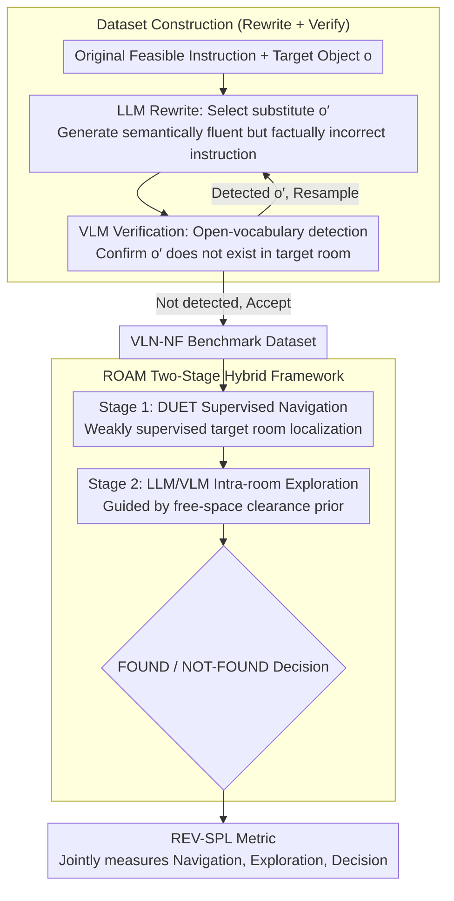

# VLN-NF: Feasibility-Aware Vision-and-Language Navigation with False-Premise Instructions

**Conference**: ACL 2026  
**arXiv**: [2604.10533](https://arxiv.org/abs/2604.10533)  
**Code**: [https://vln-nf.github.io/](https://vln-nf.github.io/)  
**Area**: Robotics/Embodied AI  
**Keywords**: Vision-and-Language Navigation, False Premise, NOT-FOUND, Embodied Exploration, Feasibility Awareness

## TL;DR

This paper proposes the VLN-NF benchmark—the first task requiring VLN agents to identify false-premise instructions and output NOT-FOUND in 3D partially observable environments. It further introduces the REV-SPL evaluation metric and the ROAM two-stage hybrid framework, where ROAM achieves 6.1 REV-SPL, representing a 45% improvement over supervised baselines.

## Background & Motivation

**Background**: Vision-and-Language Navigation (VLN) investigates how embodied agents navigate in 3D environments based on natural language instructions. Existing benchmarks (e.g., R2R, REVERIE) assume that instructions are always feasible and that target objects definitely exist within the environment.

**Limitations of Prior Work**: ใน In real-world deployments, human instructions are frequently erroneous—cognitive science research indicates that humans make mistakes in approximately one out of every seven object-location recalls. For instance, a user might say "get the plate on the kitchen table," while the plate is actually in the living room. Existing VLN agents cannot handle such scenarios, leading to either hallucinations of similar objects or infinite searching.

**Key Challenge**: In partially observable 3D environments, the fact that a target does not exist cannot be confirmed from a single viewpoint. It requires sufficient exploration to gather evidence before reaching a NOT-FOUND conclusion. However, current VLN systems lack this evidence-driven verification capability, and simply adding a NOT-FOUND action often leads to premature abandonment.

**Goal**: (1) Construct the VLN-NF benchmark dataset containing false-premise instructions; (2) Design the evaluation metric REV-SPL to jointly assess navigation, exploration, and decision-making; (3) Propose the ROAM framework for evidence-driven NOT-FOUND judgment.

**Key Insight**: The problem is decomposed into room-level navigation (suitable for supervised learning) and intra-room exploration-verification (driven by LLM/VLM), avoiding the issues caused by exploration uncertainty in end-to-end training.

**Core Idea**: Automatically construct a false-premise dataset through a scalable pipeline of LLM rewriting and VLM verification, and address the new task using a two-stage hybrid framework (supervised navigation + LLM/VLM exploration-verification).

## Method

### Overall Architecture

VLN-NF comprises three main contributions: (1) A dataset construction pipeline—using an LLM to rewrite feasible instructions into false-premise ones and a VLM to verify target absence; (2) The REV-SPL metric—jointly evaluating target room arrival, exploration coverage, and FOUND/NOT-FOUND decision accuracy; (3) The ROAM two-stage method—a first stage using a supervised model to localize the target room and a second stage using LLM/VLM for intra-room exploration and judgment. These components form a complete pipeline: first automatically generating false-premise data, then running ROAM for navigation and verification on this data, and finally using REV-SPL to score whether exploration was sufficient and the judgment was correct.

### Key Designs

**1. Dataset Construction Pipeline (Rewrite + Verify): Automatically converting feasible VLN instructions into false-premise ones**

Manual annotation of exploration behavior is extremely costly and highly uncertain. Thus, this paper utilizes an automated "LLM Rewrite + VLM Verify" pipeline to generate data at low cost. Given an original instruction and target object $o$, the LLM Rewriter selects a plausible substitute $o'$ from outside the list of objects in the target room (e.g., changing "water the plant under the window" to "wipe the sofa under the window"), generating a semantically fluent but factually incorrect instruction. The VLM Verifier then runs open-vocabulary detection on all panoramas of the target room to confirm that $o'$ indeed does not exist—resampling if detected and accepting only if not. A manual audit of 5% of samples showed an error rate of <2%, proving the process to be both affordable and scalable.

**2. REV-SPL Evaluation Metric: Jointly measuring navigation efficiency, exploration sufficiency, and decision correctness**

Standard SPL only considers whether the shortest path to the target is followed and cannot measure whether "evidence collection is sufficient." Direct application of SPL would reward degenerate behavior—outputting NOT-FOUND without exploration could still yield a score. REV-SPL therefore redefines the reference exploration path: if the instruction contains landmark clues, the reference path covers viewpoints where the original target was visible (using TSP for the shortest covering path); without landmarks, a greedy coverage strategy is used to traverse the room until 85%+ of objects are covered. Based on this, REV-SPL penalizes premature stopping (insufficient coverage) and incorrect decisions (misclassifying FOUND as NOT-FOUND or vice versa), while rewarding exploration efficiency, thereby incorporating "sufficiency of exploration" and "correctness of judgment" into a single score.

**3. ROAM Two-Stage Hybrid Framework: Evidence-driven judgment via supervised navigation + LLM/VLM exploration**

Purely supervised methods suffer from early termination due to covariate shift in imitation learning, while pure LLM methods are weak at navigating between rooms in partially observable environments. ROAM allows each to perform its strength. The first stage uses the DUET supervised model to navigate to the target room (weakly supervised, requiring only room-level labels). The second stage hands over to an LLM for planning exploration strategies and a VLM for open-vocabulary detection, combined with a free-space clearance prior to guide exploration towards uncovered areas. Finally, the FOUND or NOT-FOUND decision is made based on detection results. This way, the supervised model handles stable cross-room navigation, while the large models handle flexible intra-room exploration and verification, bypassing the uncertainty of exploration behavior in end-to-end training.

### Loss & Training

The first-stage DUET model utilizes standard VLN training (cross-entropy loss + navigation reward). The second-stage LLM/VLM exploration module requires no training, directly leveraging the zero-shot reasoning capabilities of pre-trained models.

## Key Experimental Results

### Main Results

| Method | Type | REV-SPL (val-unseen) |
|--------|------|------|
| DUET + VLN-NF | Supervised | 4.2 |
| NaviLLM | LLM-based | 1.0 |
| Gemini 1.5 Pro | LLM-based | 1.5 |
| ROAM | Hybrid | 6.1 |

ROAM outperforms the strongest supervised baseline by 45% and the LLM baselines by 4-6 times.

### Ablation Study

| Configuration | Key Metric | Description |
|------|---------|------|
| Full ROAM | 6.1 REV-SPL | Supervised Nav + LLM/VLM Exploration |
| w/o Free-space Prior | Lower REV-SPL | Decreased exploration coverage |
| DUET + Direct NF | 4.2 REV-SPL | Premature NOT-FOUND output |

### Key Findings

- **Existing VLN agents cannot handle false premises**: All baselines achieved very low REV-SPL on VLN-NF, primarily because decisions were made without sufficient exploration.
- **Premature abandonment is the core problem**: Simply adding a NOT-FOUND action to supervised VLN led the model to learn to "give up early," as covariate shift in imitation learning is particularly severe for exploration tasks.
- **LLMs excel at intra-room planning but fail at inter-room navigation**: Pure LLM methods (NaviLLM, Gemini) performed poorly without step-level navigation guidance, but ROAM successfully utilized LLMs for intra-room exploration planning.
- **High dataset quality**: The LLM Rewrite + VLM Verify pipeline achieved a manual audit error rate of <2%, making it cost-effective and scalable.

## Highlights & Insights

- **Filling the VLN reliability gap**: This is the first systematic study of false-premise navigation in 3D partially observable environments, addressing a significant gap in the VLN community regarding instruction unreliability.
- **Ingenious REV-SPL design**: Extending SPL to evidence-driven verification scenarios, the dual-mode design for reference exploration paths (landmark-guided vs. coverage scanning) well balances evaluation needs across different scenarios.
- **Transferable two-stage decomposition**: The approach of decoupling navigation and verification can be transferred to other embodied tasks requiring decision-making under uncertainty.

## Limitations & Future Work

- It currently focuses only on target-level false premises (object non-existence) and does not cover broader types of unreliable instructions like attribute errors or ambiguous instructions.
- Termination occurs immediately after a NOT-FOUND judgment, lacking recovery strategies (e.g., requesting clarification or trying alternative paths).
- The absolute REV-SPL values remain low (max 6.1), indicating that the task itself is highly challenging and offers significant room for improvement.
- The work is constructed only on REVERIE and has not been extended to other VLN benchmarks like R2R.

## Related Work & Insights

- **vs MoTIF**: MoTIF studies infeasible instructions in 2D mobile apps, but agents have full observability of the screen. VLN-NF is more difficult as it requires autonomous exploration in 3D partially observable environments to confirm target absence.
- **vs R2R-UNO**: R2R-UNO investigates instruction-environment mismatches caused by physical obstacles, focusing on navigability changes. VLN-NF focuses on semantic-level false premises where the target itself does not exist.

## Rating

- Novelty: ⭐⭐⭐⭐⭐ The first 3D partially observable VLN false-premise benchmark; problem definition is novel and practical.
- Experimental Thoroughness: ⭐⭐⭐⭐ Comparisons with multiple baselines are thorough, though absolute performance limits the depth of analysis.
- Writing Quality: ⭐⭐⭐⭐⭐ The motivation is clear, and the design of the method and evaluation is logically rigorous.
- Value: ⭐⭐⭐⭐ Opens a new direction for research into the reliability of VLN.

<!-- RELATED:START -->

## Related Papers

- [\[CVPR 2026\] GA-VLN: Geometry-Aware BEV Representation for Efficient Vision-Language Navigation](../../CVPR2026/robotics/ga-vln_geometry-aware_bev_representation_for_efficient_vision-language_navigatio.md)
- [\[ACL 2026\] Ability-Oriented Failure Attribution for Vision-Language Navigation Agents](where_did_it_go_wrong_capability-oriented_failure_attribution_for_vision-and-lan.md)
- [\[ICLR 2026\] Uncertainty-Aware Gaussian Map for Vision-Language Navigation](../../ICLR2026/robotics/uncertainty-aware_gaussian_map_for_vision-language_navigation.md)
- [\[CVPR 2026\] Towards Open Environments and Instructions: General Vision-Language Navigation via Fast-Slow Interactive Reasoning](../../CVPR2026/robotics/towards_open_environments_and_instructions_general_vision-language_navigation_vi.md)
- [\[ACL 2026\] Breaking Down and Building Up: Mixture of Skill-Based Vision-and-Language Navigation Agents](breaking_down_and_building_up_mixture_of_skill-based_vision-and-language_navigat.md)

<!-- RELATED:END -->
