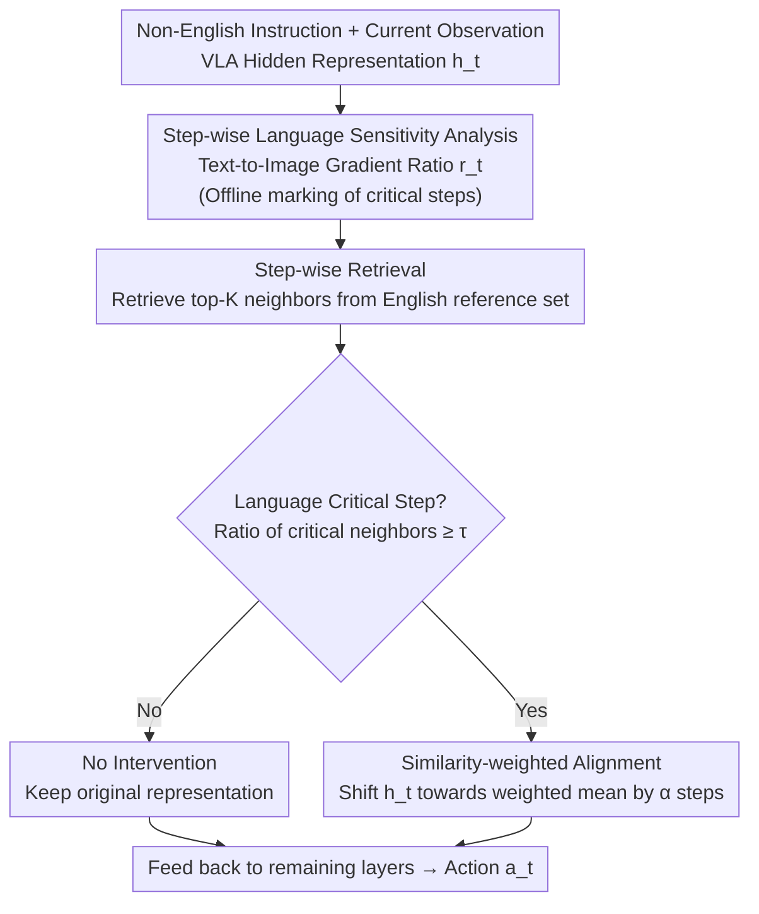

# When Does Language Matter? Multilingual Instructions Reveal Step-wise Language Sensitivity in Vision-Language-Action Models

**Conference**: ACL2026  
**arXiv**: [2606.11906](https://arxiv.org/abs/2606.11906)  
**Code**: To be confirmed  
**Area**: Robotics / Embodied AI / VLA Multilingual Robustness  
**Keywords**: VLA, Multilingual Instructions, Step-wise Language Sensitivity, Inference-time Alignment, LIBERO

## TL;DR
By translating the LIBERO robotic manipulation benchmark into ten languages, this paper systematically reveals for the first time that VLA models suffer a 30–50% drop in success rates under non-English instructions. It identifies that "linguistic influence is highly non-uniform across execution steps"—where only a few critical steps are sensitive to language but dominate failure cases. Based on this, a method for inference-time representation alignment specifically on these steps is proposed, significantly recovering multilingual performance.

## Background & Motivation
**Background**: Vision-Language-Action (VLA) models map visual observations and language instructions directly to continuous control actions through large-scale pre-training and task fine-tuning, demonstrating strong performance on standard manipulation benchmarks (e.g., OpenVLA, $\pi_0$). However, these works almost exclusively assume instructions are in English.

**Limitations of Prior Work**: While multilingual robustness has been extensively studied in LLMs/VLMs, it remains nearly blank for VLA. VLA differs fundamentally from pure language models: it outputs a continuous action stream that directly changes the environment. Errors induced by language accumulate over long-horizon execution and are irreversible, meaning the consequences of "stating instructions in another language" differ significantly from text-based tasks.

**Key Challenge**: A readily available mitigation is "unified alignment"—such as CLAIM, which estimates the average shift between English and non-English representations and applies this global correction throughout inference. However, the authors find that the shift of non-English relative to English varies greatly across execution steps rather than Being uniformly distributed. Global averaging weakens the correction at "steps with the largest language difference." Worse, alignment is not free: forcing alignment on steps primarily driven by vision/proprioception injects noise, which propagates through closed-loop actions and alters future observations.

**Goal**: ① Systematically quantify the severity of multilingual degradation in VLA; ② Understand how language influence is distributed across execution steps; ③ Design a training-free intervention that "aligns only on steps that should be aligned."

**Key Insight**: Reframe multilingual robustness from a "static, global alignment problem" to a "temporal, step-wise control problem"—respecting the temporal structure of VLA execution.

**Core Idea**: Use a "text-to-image gradient ratio" to locate language-critical steps, retrieve English reference representations only at these steps, and perform similarity-weighted alignment while leaving other steps untouched.

## Method

### Overall Architecture
The method is divided into offline and online phases. At each step $t$, the VLA receives an observation $\boldsymbol{o}_t$ (image + optional proprioception) and a language instruction $l$, outputting a continuous action $\boldsymbol{a}_t=\pi_\theta(\boldsymbol{o}_t,l)$. The offline phase performs "step-wise language sensitivity analysis" to mark language-critical steps and extracts a reference representation set $\mathcal{R}$ with sensitivity annotations from English training trajectories. During online inference, for each step of a non-English execution: the top-$K$ nearest neighbors are retrieved from the English reference set; a gate determines whether to align based on the proportion of "language-critical steps" among the neighbors; if alignment is triggered, the current hidden representation is shifted slightly towards the weighted average of the neighbors before being fed back into the remaining layers to generate the action. This operation requires zero additional training or optimization.

### Key Designs

**1. Locating Language-Critical Steps via Text-to-Image Gradient Ratio: Making "which step to manage language" a computable signal**

The pain point is: although representation shift can tell you "which step differs most from English," it requires non-English pairs to calculate and only diagnoses "where the error is" without explaining "why the step is sensitive" or allowing online step selection without English references. The authors use gradients as an intrinsic measure of language dependency: on English executions, they calculate the gradient magnitudes of the predicted action $\boldsymbol{a}_t$ with respect to language tokens and visual tokens. Averaged across tokens and dimensions, these are $g_t^{\text{lang}}=\frac{1}{|L|}\sum_{x\in L}\lVert\partial a_t/\partial x\rVert$ and $g_t^{\text{vis}}=\frac{1}{|V|}\sum_{x\in V}\lVert\partial a_t/\partial x\rVert$, yielding the ratio:

$$r_t=\frac{g_t^{\text{lang}}}{g_t^{\text{vis}}+\epsilon}.$$

A large $r_t$ indicates that action prediction relies more on language than vision. The authors found that steps with high $r_t$ overlap with steps showing large non-English representation shifts (Figure 4). Thus, this **language-independent index calculated only using English** serves as a proxy for language-critical steps and generalizes well across languages. High $r_t$ is classified as language-sensitive, while low $r_t$ is language-independent.

**2. Step-wise Gated Retrieval-based Alignment: Aligning only when necessary to avoid polluting irrelevant steps**

This directly addresses the two flaws of "unified alignment" (diluted corrections at critical steps and noise injection at irrelevant steps). Reference set $\mathcal{R}=\{\tilde{\boldsymbol{h}}_t^{(i)}\}$ is extracted offline from English training trajectories, with each reference representation carrying a step index and a pre-calculated language sensitivity score. Online, the current representation $\boldsymbol{h}_t$ retrieves top-$K$ neighbors $\mathcal{N}_t$ via cosine similarity. Let $\mathcal{C}\subset\mathcal{R}$ be the subset of reference steps ranked in the top $p\%$ of sensitivity. The gating indicator is:

$$\mathbb{I}_t=\mathbb{1}\!\left(\frac{|\mathcal{N}_t\cap\mathcal{C}|}{|\mathcal{N}_t|}\ge\tau\right)$$

Intervention is only triggered if the proportion of "language-critical steps" in the neighborhood exceeds threshold $\tau$; otherwise $\mathbb{I}_t=0$. This delegates the judgment to a vote by the retrieved neighborhood, requiring no English counterpart during inference.

**3. Similarity-weighted Small-step Representation Update: Aligning without erasing**

When alignment is triggered, neighbors are aggregated into a reference representation $\bar{\boldsymbol{h}}_t=\sum_i w_i\tilde{\boldsymbol{h}}^{(i)}$ using softmax weights based on similarity (with temperature $\beta$ controlling sharpness). The update follows:

$$\boldsymbol{h}_t^{\text{aligned}}=\boldsymbol{h}_t+\alpha\,\mathbb{I}_t\,(\bar{\boldsymbol{h}}_t-\boldsymbol{h}_t)$$

This shifts the current representation slightly toward the reference (strength controlled by $\alpha$). Note that the update is performed only at a fixed intermediate layer and only for the current step before feeding back. It is a "nudge" rather than a "replacement"—aligning toward English behavior while preserving valid information from current observations, thus avoiding over-alignment that might erase visual/proprioceptive signals. The paper additionally measures inference latency, finding the intervention’s overhead to be negligible.

## Key Experimental Results

### Multilingual Degradation (No Intervention, Table 1, Average Success Rate % across suites)
Evaluated on OpenVLA-OFT and $\pi_{0.5}$ by translating LIBERO into nine non-English languages (CN, FR, JP, KO, ES, PT, AR, TH, VI) plus English.

| Model | EN | Non-English Avg. Range | Worst Task Suite | Degradation |
|------|----|-----------|-----------|--------|
| OpenVLA-OFT | 97.1 | 50.8 (AR) – 65.3 (FR) | Goal: Drops to 6–16 across languages | Approx. −31 to −46 |
| $\pi_{0.5}$ | 96.9 | 55.4 (KO) – 61.2 (FR) | Goal: Drops to 11–17 across languages | Approx. −36 to −42 |

The Goal suite is the most fragile (e.g., Spanish and Arabic drop to only 6.4 on OpenVLA-OFT, a ~91 point decrease relative to English), indicating that language degradation is particularly lethal for "goal understanding" tasks.

### Intervention Comparison (Table 2, Average Success Rate % across 10 languages)

| Model | Method | Non-English Average | Description |
|------|------|------------|------|
| OpenVLA-OFT | Baseline (No intervention) | ≈58 (50.8–65.3) | Default behavior |
| OpenVLA-OFT | EN-CoT | Comparable or slightly lower | English CoT prompting is ineffective |
| OpenVLA-OFT | Average shift (Global alignment) | 53.8–65.5, limited gain | Mean shift dilutes critical steps |
| OpenVLA-OFT | **Step-wise (Ours)** | **62.6–70.9** | Consistent improvement across languages |
| $\pi_{0.5}$ | Baseline | 55.4–61.2 | — |
| $\pi_{0.5}$ | Average shift | Drops to 52–57 | IR noise harms closed-loop control |
| $\pi_{0.5}$ | **Step-wise (Ours)** | **79.8–82.1** | Massive jump of ~+25 points over baseline |

### Key Findings
- **Language impact is highly non-uniform and shares hotspots across languages**: Figure 3 shows representation shifts are concentrated in few execution steps ("temporal hotspots"), which are consistent across different languages for the same task—validating the premise of step-wise intervention.
- **Gradient ratio is an effective proxy**: High $r_t$ steps correlate strongly with high representation shift steps (Figure 4), proving that "gradient ratios calculated using English only" can locate language-critical steps.
- **Global alignment can backfire**: On $\pi_{0.5}$, Average shift even dragged success rates below the baseline, confirming that "enforced alignment on language-irrelevant steps → noise injection → closed-loop propagation" is a real risk. Ours' gated intervention provides stable gains across models and languages.
- **EN-CoT prompt strategies are largely ineffective for VLA**—because VLA emphasizes mapping language+perception to low-level control rather than high-level linguistic reasoning.

## Highlights & Insights
- **Reframing "multilingual robustness" as a temporal control problem** rather than a static alignment problem is the core conceptual shift. This reframing explains why global methods like CLAIM fail in VLA.
- **Text-to-image gradient ratio $r_t$ is a lightweight and transferable diagnostic**: It requires only English execution, is language-agnostic, and generalizes across languages. It can be reused to analyze any multimodal temporal model to determine which modality a step relies on.
- **The Retrieval + Gating + Nudge trio is entirely training-free** with negligible latency, making it easy to integrate into existing VLA inference stacks for deployment.

## Limitations & Future Work
- **Ours**: Validated only in LIBERO simulation with two VLA models; performance on real robots and more architectures remains to be tested; translations used Google Translate (verified by sampling), so translation noise might be confounded with language degradation.
- **Independent Observation**: The method involves several hyperparameters ($r_t$, $p\%$, $\tau$, $\alpha$, $\beta$, $K$). While the paper claims they are "fixed," their stability and sensitivity across more diverse models are not fully explored in the main text (see appendix). The Goal suite remains a bottleneck even after intervention.
- **Future Directions**: Using step-wise sensitivity signals for "data-efficient targeted training," extending to real hardware and more language families, and studying the correspondence between hotspot steps and task semantic phases (e.g., "identifying target object").

## Related Work & Insights
- **vs CLAIM / Average shift (Global alignment)**: These estimate a mean shift and apply it throughout; Ours shows this dilutes critical steps and pollutes irrelevant ones in VLA loops. Ours' gated alignment outperforms them consistently, notably by ~25 points on $\pi_{0.5}$.
- **vs EN-CoT and Prompting**: Strategies successful in LLM/VLMs provide almost no gain for VLA, highlighting VLA’s emphasis on low-level control over linguistic reasoning.
- **vs Mainstream VLA (RT-2, OpenVLA, $\pi_0$)**: While they focus on scaling models/data/cross-task generalization with English instructions, Ours fills the neglected dimension of "language modality robustness" and identifies it as a step-wise control issue.

## Rating
- Novelty: ⭐⭐⭐⭐⭐ First systematic VLA multilingual evaluation + new "step-wise sensitivity" perspective, reframing alignment as a temporal problem.
- Experimental Thoroughness: ⭐⭐⭐⭐ Solid analysis of 10 languages, 2 models, and 4 suites with representation/gradient analysis, though limited to LIBERO simulation.
- Writing Quality: ⭐⭐⭐⭐ Clear motivation; step-by-step derivation of why global alignment fails; good alignment between figures and text.
- Value: ⭐⭐⭐⭐⭐ Vital for multilingual embodied AI deployment, revealing severe language fragility and providing a practical training-free solution.

<!-- RELATED:START -->

## Related Papers

- [\[CVPR 2026\] MAPS: Preserving Vision-Language Representations via Module-Wise Proximity Scheduling for Better Vision-Language-Action Generalization](../../CVPR2026/robotics/maps_preserving_vision-language_representations_via_module-wise_proximity_schedu.md)
- [\[ACL 2026\] VLN-NF: Feasibility-Aware Vision-and-Language Navigation with False-Premise Instructions](vln-nf_feasibility-aware_vision-and-language_navigation_with_false-premise_instr.md)
- [\[CVPR 2026\] MoEActok: A MoE-based Action Tokenizer for Vision-Language-Action Models](../../CVPR2026/robotics/moeactok_a_moe-based_action_tokenizer_for_vision-language-action_models.md)
- [\[ICML 2026\] Contrastive Representation Regularization for Vision-Language-Action Models](../../ICML2026/robotics/contrastive_representation_regularization_for_vision-language-action_models.md)
- [\[ICML 2026\] Scaling by Diversified Experience for Vision-Language-Action Models](../../ICML2026/robotics/scaling_by_diversified_experience_for_vision-language-action_models.md)

<!-- RELATED:END -->
